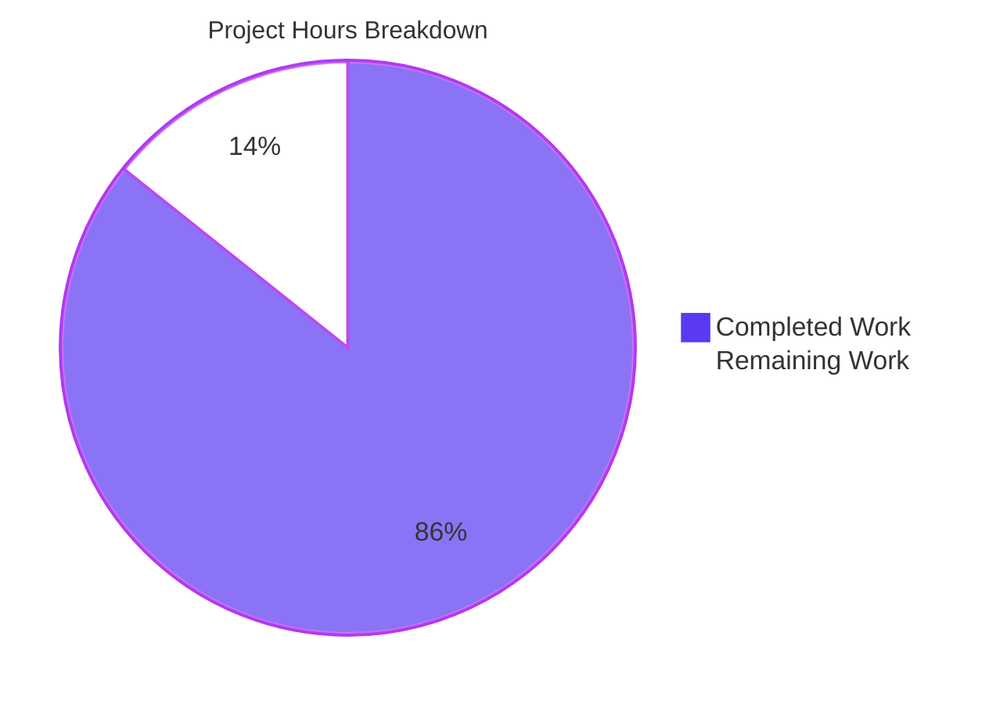
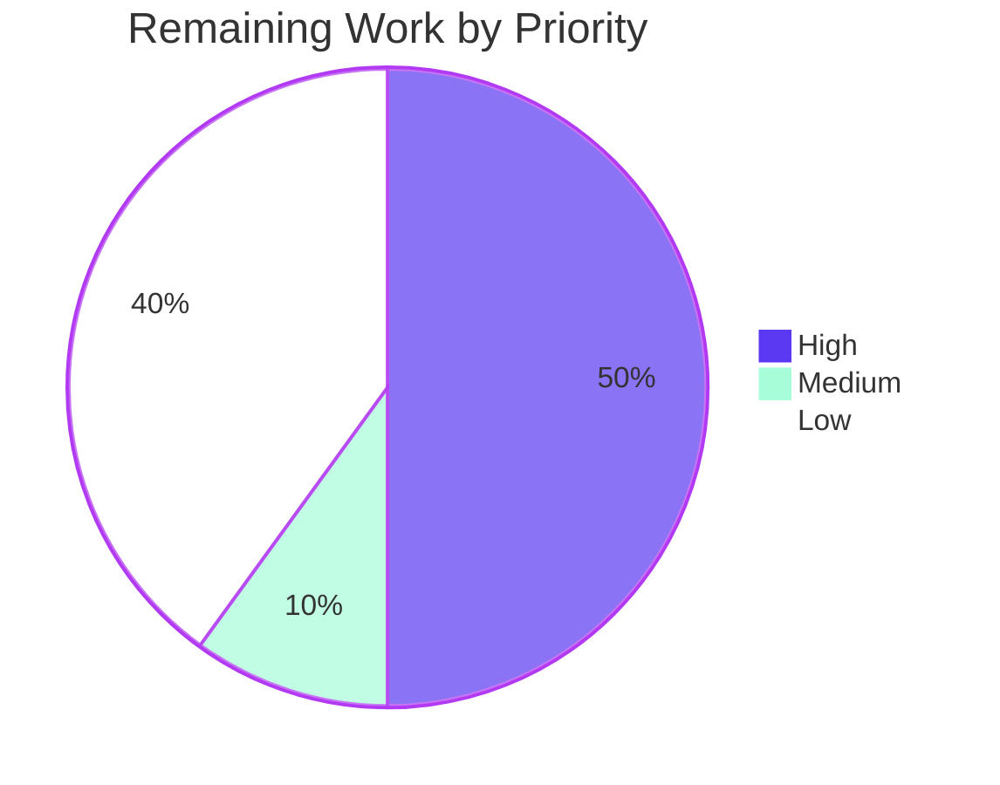
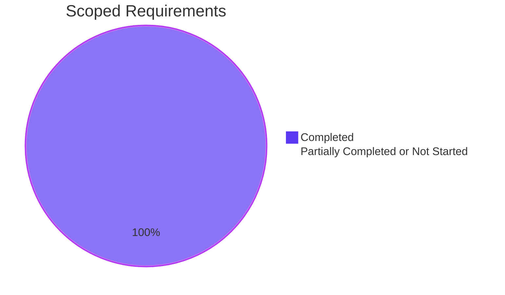

# 1. Executive Summary

## 1.1 Project Overview

`BlitzyRepo3_Python` is a flat-root CPython learning repository. This change adds a greeting capability: a new module, `welcome.py`, publishing two separately callable methods that each print `Welcome to Blitzy` five times — `greet_with_for_loop` over `range(REPEAT_COUNT)` and `greet_with_while_loop` under a counter bound. Both are callable after `import welcome`, and the module doubles as a script running both in turn. A seven-assertion standard-library test suite, a `## Usage` section in `README.md` and a bytecode-cache ignore rule accompany it. The audience is a developer reading or running the repository; its zero-dependency, zero-manifest, flat-root shape is unchanged.

## 1.2 Completion Status


Legend — Completed: Dark Blue `#5B39F3` · Remaining: White `#FFFFFF`.

| Metric | Value |
|---|---|
| Total Hours | 35.0 |
| Completed Hours (AI + Manual) | 30.0 (AI 30.0 + Manual 0.0) |
| Remaining Hours | 5.0 |
| Percent Complete | 85.7% (30.0 ÷ 35.0) |

## 1.3 Key Accomplishments

- ✅ `greet_with_for_loop` prints the greeting five times — 5 lines / 90 bytes, exit 0 (`welcome.py:14-23`).
- ✅ `greet_with_while_loop` prints byte-identical output and always terminates (`welcome.py:26-37`).
- ✅ Each method's loop *form* is asserted structurally, not just its output (`test_welcome.py:132-138`).
- ✅ `import welcome` is silent and publishes exactly four names.
- ✅ The script and module forms each emit 10 lines / 180 bytes with exit 0.
- ✅ Seven contract tests pass on both entry points, individually, and with warnings fatal.
- ✅ `README.md` documents both methods and all three commands; lines 1-2 preserved byte-for-byte.
- ✅ `hello.py` and `LICENSE` unchanged, `__pycache__/` ignored, working tree clean.

## 1.4 Critical Unresolved Issues

No unresolved issues identified. All 21 scoped requirements are implemented and verified, so **0 of the 21 is open**. Three delivered items carry an accepted caveat; none blocks release.

| Issue | Impact | Owner | ETA |
|---|---|---|---|
| The release checklist's isolated-import command (`python3 -I -S -E -c "import welcome"`) cannot pass for a flat-root, uninstalled module | Verification only. The zero-dependency property is proven instead by `python3 -I -S -E welcome.py` and `python3 -S -E -c "import welcome"`, both exit 0 | Release engineer | 1.0h |
| Five process-level behaviours (dispatch order, script output, `-m` form, isolated run, exit status) have no automated test | A future edit to the `__main__` block would not be caught by the suite; these paths are verified by direct command measurement today | Maintainer | 1.5h (optional) |
| `test_welcome.py:77` is 80 columns, the only line in the repository over 79 | Cosmetic. No linter or column rule exists in the project, so nothing gates on it | Maintainer | 0.5h |

## 1.5 Access Issues

No access issues identified. No service, port, database, credential or third-party API exists anywhere in this project, the branch is already published to `origin`, and nothing in the build, run or test path needs a permission the repository does not grant.

| System/Resource | Type of Access | Issue Description | Resolution Status | Owner |
|---|---|---|---|---|
| — | — | No access issues identified | N/A | — |

## 1.6 Recommended Next Steps

1. **[High]** Review and land the pull request — 5 commits, +214 / -0, no conflict expected.
2. **[High]** Correct the release checklist: the two working isolated-import commands, and the three rows that assume an uncommitted tree.
3. **[Medium]** Sign off: `python3 -m unittest discover`, `python3 welcome.py`, `python3 hello.py`, then confirm `git status --porcelain` is empty.
4. **[Low]** Decide on a 79-column convention, and on process-level tests for the five command paths.

# 2. Project Hours Breakdown

## 2.1 Completed Work Detail

| Component | Hours | Description |
|---|---|---|
| Greeting module `welcome.py` | 3.0 | Two zero-argument module-level callables, the `GREETING` / `REPEAT_COUNT` constants, the `__main__` dispatch block, and the module/callable documentation set (44 lines, zero imports, zero classes) |
| Contract test suite `test_welcome.py` | 5.0 | `WelcomeGreetingContract` with seven single-behaviour tests, three helpers, an independent in-test oracle, a capture that begins before the suite's first import, and an AST helper that proves each method's loop form (144 lines, standard library only) |
| Working-tree hygiene `.gitignore` | 0.5 | The `__pycache__/` rule with its explanatory comment (3 lines / 142 bytes) |
| Usage documentation `README.md` | 1.5 | Appended `## Usage` section covering both methods, the import form, the script form and the test command, with lines 1-2 preserved byte-for-byte (+23 lines, no deletions) |
| Helper documentation contract | 1.5 | The `loop_nodes` helper documented at its boundary as a contract — one-line summary, `Args:` and `Returns:` — so the structural loop-form check is self-describing (`test_welcome.py:77-86`) |
| Runtime acceptance verification of the greeting feature | 5.0 | Per-method byte measurements, all three command forms, silent import, module-load closure, public surface, constant values, and the bytecode-cache matrix across seven invocation styles |
| Suite detection-power validation | 3.0 | Deliberate mutations exercised on copies outside the repository, establishing that the oracle is independent of the module, that the loop form is genuinely asserted, that the import capture starts early enough, and that a missing increment surfaces as a hung run rather than a silent pass |
| Security and dependency-posture assessment | 3.0 | Input-channel isolation under hostile argv, environment and stdin; disclosure checks on every triggerable error path; audit-hook side-effect sweep; permission and concealment checks; zero-third-party-dependency confirmation |
| Pre-existing continuity verification | 2.0 | `hello.py` and `LICENSE` byte identity and behaviour, `README.md` line preservation, and convention parity (mode, shebang, line endings, flat root, invocation forms) |
| Code review and pre-release acceptance | 4.0 | Review of the four changed files and the two reference files for logic, test strength, documentation accuracy, completeness, commenting, rule compliance and security, closed by a pass over all 21 requirements before publication |
| Commit and branch hygiene | 1.5 | Five focused commits with the correct author identity, an additions-only change set, a clean working tree, and a re-run of the compile and suite gates against the published tree |
| **Total** | **30.0** | Matches Completed Hours in Section 1.2 |

## 2.2 Remaining Work Detail

| Category | Hours | Priority |
|---|---|---|
| Pull request review and merge into the default branch (5 commits, +214 / -0) | 1.5 | High |
| Release-checklist correction: the isolated-import command, the three acceptance rows that assume an uncommitted tree, and the `README.md` "no further content" criterion | 1.0 | High |
| Release sign-off pass: suite, both script surfaces, clean-tree confirmation, runtime version recorded | 0.5 | Medium |
| Line-length convention decision, and re-wording `test_welcome.py:77` if a 79-column ceiling is adopted | 0.5 | Low |
| Optional process-level tests for the five command paths the seven-test suite leaves to direct measurement | 1.5 | Low |
| **Total** | **5.0** | Matches Remaining Hours in Section 1.2 and the Section 7 pie chart |

## 2.3 Hours Calculation

Every hour below traces to a requirement in the plan of record or to a path-to-production activity for it. No work outside that scope is counted.

```
Completed hours  = 30.0   (Section 2.1: 3.0 + 5.0 + 0.5 + 1.5 + 5.0 + 3.0 + 3.0 + 2.0 + 4.0 + 1.5 + 1.5)
Remaining hours  =  5.0   (Section 2.2: 1.5 + 1.0 + 0.5 + 0.5 + 1.5)
Total hours      = 35.0   (30.0 + 5.0)
Percent complete = 30.0 / 35.0 x 100 = 85.7%
```

All 21 scoped requirements are classified **Completed**; none is partially completed and none is unstarted, so the remaining 5.0 hours are entirely path-to-production and optional-hardening work. Confidence is **high**: the scope is small, fully enumerated, and every requirement has a command or test behind it.

# 3. Test Results

Every figure below was observed by running the suite in this checkout on CPython 3.13.7 from the repository root. The project deliberately carries no coverage tool (and none is installed on the host), so no coverage percentage exists to report; the Coverage column records that rather than estimating a number.

| Area / Category | Framework | Tests | Passed | Failed | Coverage | What This Proves |
|---|---|---|---|---|---|---|
| Greeting output — `for` loop | `unittest` (stdlib) | 1 | 1 | 0 | Not measured — no coverage tooling | `greet_with_for_loop` prints exactly the five expected lines, compared against an oracle written independently of the module |
| Greeting output — `while` loop | `unittest` (stdlib) | 1 | 1 | 0 | Not measured — no coverage tooling | `greet_with_while_loop` prints the same five lines and returns, so the counter bound terminates |
| Output equality of the two methods | `unittest` (stdlib) | 1 | 1 | 0 | Not measured — no coverage tooling | The two methods are interchangeable in output, so a caller can pick either |
| Return-value contract | `unittest` (stdlib) | 2 | 2 | 0 | Not measured — no coverage tooling | Both methods return `None`, so neither leaks a value a caller might branch on |
| Loop-form contract | `unittest` (stdlib) | 1 | 1 | 0 | Not measured — no coverage tooling | Each method really uses its named construct — the callables are distinct and their loop nodes are exactly `{For}` and `{While}` |
| Import silence | `unittest` (stdlib) | 1 | 1 | 0 | Not measured — no coverage tooling | `import welcome` emits nothing, on first import and on reload, so the module is safe to embed |
| **Total** | `unittest` (stdlib) | **7** | **7** | **0** | Not measured — no coverage tooling | The full contract holds: `Ran 7 tests in 0.001s`, `OK`, exit 0 |

The same seven tests were exercised four ways, all green: `python3 -m unittest -v test_welcome`, zero-configuration discovery via `python3 -m unittest discover`, `python3 -W error -m unittest discover` with every warning class promoted to an error, and each test run alone (7 of 7, exit 0 each). No test emitted a stray greeting line into the log and none raised a `ResourceWarning`. The compile gates are green alongside them: `python3 -m py_compile welcome.py test_welcome.py hello.py` and `python3 -m compileall -q .` both exit 0 with no output.

**Not Covered**

The suite is fixed at seven tests by the plan of record, so five process-level behaviours have no automated test behind them. Each was verified by direct command measurement instead, and each is what a human should re-run before release:

- **`__main__` dispatch order** — the guard's two call lines are never executed by the suite. Measured directly: `python3 welcome.py` yields 10 lines whose first five match the `for`-loop output and last five the `while`-loop output.
- **Script output contract** — the exact 10-line / 180-byte stdout, exit 0 and empty stderr of `python3 welcome.py`.
- **`python3 -m welcome`** — the module-execution form; no test spawns a process.
- **`python3 -I -S -E welcome.py`** — the isolated, site-packages-disabled run that demonstrates the zero-dependency posture.
- **Process exit-status and stderr contracts** — including `./welcome.py` exiting 126 (mode 644, no shebang) and `import welcome` from another directory exiting 1 with `ModuleNotFoundError`.

Nothing else delivered by this change is untested: the two callables, their outputs, their return values, their loop forms and the module's import silence each have a dedicated test, and `hello.py`'s behaviour is covered by the direct measurements recorded in Section 4.

# 4. Runtime Validation &amp; UI Verification

Every line below was driven from the repository root on CPython 3.13.7 and reflects what was observed, not what was expected.

- ✅ **Library surface** — `python3 -c "import welcome"` exits 0 with 0 bytes on stdout and 0 on stderr; the public surface is exactly `GREETING`, `REPEAT_COUNT`, `greet_with_for_loop`, `greet_with_while_loop`.
- ✅ **`greet_with_for_loop`** — 5 lines / 90 bytes of `Welcome to Blitzy`, exit 0, empty stderr.
- ✅ **`greet_with_while_loop`** — the same 5 lines / 90 bytes, byte-identical under `cmp`, exit 0, and it always returns (no invocation ever timed out).
- ✅ **Script form** — `python3 welcome.py` emits 10 lines / 180 bytes, exit 0, empty stderr, in for-loop-then-while-loop order.
- ✅ **Module form** — `python3 -m welcome` emits the same 10 lines / 180 bytes, exit 0.
- ✅ **Isolated run** — `python3 -I -S -E welcome.py` emits the same 10 lines / 180 bytes with empty stderr, and the module's load closure is `[]`: it pulls in nothing, not even a standard-library module.
- ✅ **Test entry point** — `python3 -m unittest discover` collects and passes seven tests with no configuration file present; before this change the same command exited 5 with `NO TESTS RAN`.
- ✅ **Documented usage** — the `README.md` sample (lines 9-12) executed verbatim exits 0 with 10 lines / 180 bytes, so both inline annotations are factually true.
- ✅ **Pre-existing module** — `python3 hello.py` still writes `Hello from Python!` in exactly 19 bytes with exit 0 and empty stderr; `hello.py` and `LICENSE` are byte-for-byte unchanged.
- ✅ **Working-tree hygiene** — after the full verification path, three `.pyc` objects sit in `__pycache__/` on disk while `git status --porcelain` reports 0 entries; `git check-ignore -q __pycache__` exits 0.

**Not exercised at runtime.** Nothing in this change is unexercised. There are no external integrations to drive: the project makes no network call, opens no socket, reads no configuration or environment value, and touches no database — the only file read anywhere is the module's own source, by the test helper that checks loop form.

**UI verification — not applicable.** This project has no rendered surface. A sweep of the tree for HTML, CSS, JavaScript, TypeScript, Vue, Svelte and template assets returns zero files, the project binds no port and starts no service, so there is no screen, no page and no visual state to capture. Its entire user surface is text on standard output, which the lines above verify byte for byte.

# 5. Compliance &amp; Quality Review

## 5.1 Compliance Matrix

Each row states where the deliverable stands now, with evidence a reader can open.

| # | Deliverable / Benchmark | Status | Progress | Evidence |
|---|---|---|---|---|
| 1 | Two module-level callables with the required loop forms | ✅ PASS | 100% | `welcome.py:14-23` (`for _ in range(REPEAT_COUNT)`), `welcome.py:26-37` (counter, strict `<`, unconditional increment); loop-node map `{'greet_with_for_loop': ['For'], 'greet_with_while_loop': ['While']}` |
| 2 | Output identity, repetition count and return contract | ✅ PASS | 100% | 5 lines / 90 bytes each, `cmp`-identical; both return `None`; `GREETING` is 17 ASCII characters at `welcome.py:10`, `REPEAT_COUNT = 5` at `welcome.py:11` |
| 3 | Guarded command surface and silent import | ✅ PASS | 100% | `welcome.py:42-44`; script, `-m` and isolated forms each 10 lines / 180 bytes; `import welcome` emits 0 bytes; public surface exactly four names |
| 4 | Contract test suite, standard library only | ✅ PASS | 100% | `test_welcome.py:100-144` — seven tests, `Ran 7 tests` / `OK`; six imports (`ast`, `contextlib`, `importlib`, `io`, `unittest`, `welcome`), all used |
| 5 | Compilation and warning gates | ✅ PASS | 100% | `py_compile` on all three modules and `compileall -q .` exit 0; suite green under `-W error` |
| 6 | Usage documentation | ✅ PASS | 100% | `README.md:4-25`; lines 1-2 byte-identical to the original 49-byte file; both method annotations verified against measurement |
| 7 | Working-tree hygiene | ✅ PASS | 100% | `.gitignore:3` (`__pycache__/`); 3 lines / 142 bytes; porcelain reports 0 cache entries with caches on disk |
| 8 | Pre-existing system continuity | ✅ PASS | 100% | `hello.py` and `LICENSE` byte-for-byte unchanged (blobs `d665483`, `d0a1fa1`); `hello.py` still writes 19 bytes and exits 0 |
| 9 | Zero-dependency, zero-manifest posture | ✅ PASS | 100% | Module-load closure `[]`; no manifest, lockfile, package directory or `__init__.py` anywhere; 21-filename probe returns nothing |
| 10 | Clean code with documented functionality (`JR_Rule1`) | ✅ PASS | 100% | Docstrings on the module, both callables, all three test helpers and the test class; named constants in place of inline literals; comments reserved for intent (`welcome.py:8-9,40-41`) |
| 11 | Security posture | ✅ PASS | 100% | No input surface (`argparse`, `sys.argv`, `os.environ`, `getenv` absent), no secret material, no injection sink, no subprocess or network construct; the only file read is the module's own source at `test_welcome.py:87` |
| 12 | Static analysis and coverage gates | ⚪ N/A by design | — | No linter, formatter, type checker, coverage tool or CI definition exists, and adding one is out of scope; the compile and suite gates above are the project's gates |

## 5.2 AAP &amp; Rule Divergences and Gaps

Seven divergences were identified. None blocks release; four are sanctioned by the plan of record or by the environment, and three carry a small human action.

| # | What the AAP/Rule Required | What Was Delivered Instead | Why It Diverged | Impact | Remediation |
|---|---|---|---|---|---|
| 1 | AAP §0.7: the acceptance row `test "$(git status --porcelain \| wc -l)" -eq 4` | A committed tree, so porcelain reports 0 entries rather than 4 | Publishing the work before completion is mandatory, and the AAP scopes that row to the uncommitted state | None on the code; the change set is unchanged | Use `git diff --name-status 56fb250..HEAD` when verifying a committed tree (1.0h, with row 2) |
| 2 | AAP §0.7: `python3 -I -S -E -c "import welcome"` exits 0 | The command exits 1 with `ModuleNotFoundError`; two working equivalents are used in its place | Isolated mode removes the working directory from `sys.path` and `-E` ignores `PYTHONPATH`, so no repository content can reach it | None on the code; a verification command in the release checklist is wrong | Substitute `python3 -S -E -c "import welcome"` or `python3 -I -S -E welcome.py` (1.0h, covers rows 1 and 3) |
| 3 | The prior criterion that `README.md` holds nothing beyond its two lines | A `## Usage` section appended below line 2 | **Sanctioned** — AAP §0.4.1 takes this decision explicitly and requires the test command to be documented | Positive: the project is now runnable from its own README | Restate that criterion as a line-content assertion on lines 1-2 |
| 4 | AAP §0.3.1 records CPython 3.12.3 as the interpreter target | Built and verified on CPython 3.13.7 | **Sanctioned** — 3.13.7 is the only interpreter available, and the AAP labels 3.12.3 a measurement rather than a requirement | None; no version-gated syntax is used | Record 3.13.7 as the verified runtime; no code change |
| 5 | `JR_Rule1` clean code, against the repository's otherwise-79-column maximum | `test_welcome.py:77` is 80 columns — the only line in the tree over 79 | The wording of that contract summary line was settled deliberately and left intact rather than re-wrapped | Cosmetic; nothing in the project measures line length | Adopt or decline a 79-column convention; re-word the line if adopted (0.5h) |
| 6 | `JR_Rule1` read literally would require a comment on every functionality in the repository | `hello.py` still carries no docstring or comment | **Sanctioned** — AAP §0.9 scopes the rule to code this change writes and §0.8.2 places `hello.py` out of scope | None; `hello.py` is unchanged and its behaviour is preserved | None required |
| 7 | `JR_Rule1` read literally would require a docstring on each test method | The seven test methods carry no docstrings; documentation sits at the module, helper and class boundaries | **Sanctioned** — AAP §0.6.2 settles this reading, with self-describing test names in place of per-test prose | None; failures remain diagnosable from the failing test's name | None required |

**1 — The four-entry working-tree check.** AAP §0.7 predicts four `git status --porcelain` entries while the change is uncommitted. The delivered branch is committed, so porcelain is empty and that row cannot read 4. The AAP scopes it to the uncommitted state, so nothing was violated, but anyone re-running the checklist against a published tree will see a mismatch. The commitment-invariant equivalent is exact: `git diff --name-status 56fb250..HEAD` yields `A .gitignore`, `M README.md`, `A test_welcome.py`, `A welcome.py`, with +3, +23, +144, +44 and zero deletions. Two neighbouring rows degrade the same way — the `head -2 README.md` comparison against `HEAD` now compares the file with itself, and `git diff -- README.md` is empty — so substitute the baseline-commit forms.

**2 — The isolated-import command.** The checklist requires `python3 -I -S -E -c "import welcome"` to exit 0 as proof of the zero-dependency posture. It exits 1 with `ModuleNotFoundError`: `-I` implies safe-path behaviour from CPython 3.11 onward, so `sys.path` holds only the three standard-library locations — no repository entry, no site-packages entry — and `-E` rules out `PYTHONPATH`. No repository content can influence a command that never locates the module, and the routes that would (packaging metadata, a package directory, an `__init__.py`, a `sys.path` insertion, relocation) are forbidden by AAP §0.2.3 and §0.8.2. The posture is proven anyway: `python3 -I -S -E welcome.py` exits 0 with 10 lines / 180 bytes and the load closure is `[]`.

**3 — The `README.md` content criterion.** An earlier criterion asserted the file held line 1 `# BlitzyRepo3_Python`, line 2 `A simple hello world python`, and nothing more. The delivered file is 25 lines: the original two, then a `## Usage` section documenting both methods, both invocation forms and `python3 -m unittest discover`. AAP §0.4.1 takes this supersession explicitly and §0.7 requires those command lines to be present, so the divergence is sanctioned and beneficial — before it, nothing documented how to run or verify the project. The two original lines remain byte-identical and the file's first 49 bytes match the original exactly. Restate the criterion as a line-content assertion rather than a whole-file one.

**4 — The interpreter version.** AAP §0.3.1 and §0.7 quote CPython 3.12.3, measured elsewhere. This branch was built, exercised and verified on CPython 3.13.7, the only interpreter available here. Nothing delivered is version-gated — `for`, `while`, `range` and `print` are core constructs and the suite uses only long-stable standard-library modules — and every value the AAP predicts was reproduced exactly: 17 characters, 5 lines and 90 bytes per method, 10 lines and 180 bytes for the script, 19 bytes for `hello.py`, `Ran 7 tests`. The one visible consequence is cosmetic: cache objects are named `welcome.cpython-313.pyc` rather than the `cpython-312` form the AAP's examples show. Treat 3.12 as untested rather than unsupported.

**5 — The single 80-column line.** Every other file holds inside 79 columns — `hello.py` peaks at 32, `welcome.py` at 79, `README.md` at 77, `.gitignore` at 79 — and `test_welcome.py:77`, the summary line of the `loop_nodes` docstring, is 80. Its wording was settled deliberately as the helper's contract statement and left intact rather than trimmed, because the project has no linter, formatter or column rule of any kind and AAP §0.8.2 forbids adding one, so nothing gates on it. The impact is confined to one line of documentation; the helper's behaviour is unaffected and its test passes. The decision is whether a 79-column ceiling is worth adopting; if it is, end that summary at `…top-level function.`

**6 — `hello.py` remains uncommented.** `JR_Rule1` asks for clean code with a comment on each functionality written. Read as a property of the whole repository it would require documentation in `hello.py`, which has none across its four lines. AAP §0.9 settles the reading: the rule governs code this change writes, and §0.8.2 places any edit to `hello.py` out of scope precisely so its contract — the `greet` function, the `Hello from Python!` literal, the unguarded module-level call and the import-time emission that follows — stays byte-identical. Editing it to satisfy a rule about new code would have changed a file the plan of record requires untouched. No action is needed unless the reader now wants that file documented.

**7 — Test methods without docstrings.** The same rule, read literally, would place a docstring on each of the seven test methods. The delivered suite documents at boundaries instead: the module (`test_welcome.py:1-13`), each of the three helpers (`:45-53`, `:61-71`, `:77-86`) and the test class (`:101-108`), with the intent that code cannot convey carried in three inline comment blocks. The test names do the per-test work — `test_methods_use_their_required_loop_constructs` and `test_importing_module_prints_nothing` state their subject in full, so a failing run names the broken behaviour without prose. AAP §0.6.2 settles this reading explicitly, noting that exhaustive commenting is not clean code.

# 6. Risk Assessment

These are forward-looking: what could still go wrong once this change is in the default branch.

| Risk | Category | Severity | Probability | Mitigation | Status |
|---|---|---|---|---|---|
| A future edit to the `__main__` block or the script surface passes the suite unnoticed, because no test spawns a process | Technical | Low | Medium | The seven tests still guard both callables, their outputs and their loop forms; run `python3 welcome.py` and compare 10 lines / 180 bytes before release, or add the process-level tests costed in Section 2.2 | Accepted |
| A `while`-loop edit that drops the increment hangs instead of failing, producing no verdict at all | Technical | Medium | Low | Always run the suite under a timeout in any automation — a non-terminating loop shows up as a killed run rather than a failure, and the current loop is bounded at `welcome.py:35-37` | Mitigated |
| `import welcome` resolves only from the repository root; a consumer importing it from elsewhere gets `ModuleNotFoundError` | Technical | Low | Medium | Documented usage runs from the root; installing the module would need packaging metadata that is out of scope, so treat the module as repository-local | Accepted by design |
| Style, typing and coverage drift is invisible to automation — the project has no linter, formatter, type checker or coverage tool | Technical | Low | Medium | `python3 -m py_compile` and the seven-test suite are the available gates and both are green; adopting tooling is a deliberate scope decision | Accepted by design |
| Nothing runs the suite automatically on a future change, because no CI definition exists | Operational | Medium | Medium | `python3 -m unittest discover` is the documented manual gate and is named in `README.md:24`; a workflow would be a scope change | Open |
| A contributor on another platform renormalises `hello.py`'s CRLF endings, changing a file that must stay byte-identical | Operational | Low | Medium | No `.gitattributes` exists by design; `hello.py` is reference-only, and its blob (`d665483`) is the check to run if endings are ever in doubt | Accepted |
| The first third-party dependency added later would create a supply-chain surface this project does not have today | Security | Low | Low | The module's load closure is `[]` and no site-packages module is reachable; keep the zero-dependency posture, and if one is ever added, introduce a manifest and an audit step with it | Monitored |
| The release checklist's isolated-import command fails every acceptance run until it is corrected | Integration | Low | High | Substitute `python3 -S -E -c "import welcome"` or `python3 -I -S -E welcome.py`, both measured exit 0 — see Section 5.2, row 2 | Open |

# 7. Visual Project Status

**Project hours — 85.7% complete** (Completed `#5B39F3` · Remaining `#FFFFFF`)



**Remaining 5.0 hours by priority**



**Remaining hours by category**

| Category | Hours | Share of remaining |
|---|---|---|
| Pull request review and merge | 1.5 | 30% |
| Release-checklist correction | 1.0 | 20% |
| Optional process-level tests | 1.5 | 30% |
| Release sign-off pass | 0.5 | 10% |
| Line-length convention decision | 0.5 | 10% |
| **Total** | **5.0** | **100%** |

**Requirement status — 21 of 21 complete**



# 8. Summary &amp; Recommendations

**What was delivered.** The repository now publishes a greeting capability in a new root-level module, `welcome.py`: `greet_with_for_loop` and `greet_with_while_loop`, each printing `Welcome to Blitzy` five times, each independently callable after `import welcome`, and each using the loop construct its name promises. The module also runs as a script, calling both in turn for ten lines of output, while importing it emits nothing at all — the caller decides when output happens. Alongside it sit a seven-assertion `unittest` suite, a `## Usage` section in `README.md` covering both methods and all three commands, and a `__pycache__/` ignore rule that keeps the working tree readable. Four files changed across five commits, 214 insertions and zero deletions; `hello.py` and `LICENSE` are byte-for-byte untouched, and the project's flat root, zero-dependency and zero-manifest shape is intact.

**What was verified.** All seven tests pass on both `unittest` entry points, individually, and with every warning class promoted to an error, with no coverage tooling in the project and none needed to read the result: `Ran 7 tests`, `OK`, exit 0. Beyond the suite, the capability was driven directly — each method emits 5 lines / 90 bytes of byte-identical output and returns `None`; the script, module and isolated-interpreter forms each emit 10 lines / 180 bytes with exit 0 and empty stderr; `import welcome` emits zero bytes and pulls in nothing; the loop forms are `{For}` and `{While}` exactly; `hello.py` still writes its 19 bytes and exits 0; and the bytecode cache stays out of `git status`. The `README.md` sample was executed verbatim and behaves as documented.

**What remains.** The project stands at **85.7% complete — 30.0 of 35.0 hours** — with all 21 scoped requirements implemented and verified. The outstanding 5.0 hours are path-to-production and optional hardening, not feature work: landing the pull request (1.5h), correcting a release checklist whose isolated-import command cannot pass for a flat-root uninstalled module and whose three working-tree rows assume an unpublished tree (1.0h), a sign-off pass (0.5h), a line-length convention decision covering the single 80-column line (0.5h), and optional process-level tests for the five command paths the seven-test boundary leaves to direct measurement (1.5h).

**Critical path to production.** Merge, then correct the checklist, then sign off. Nothing in that sequence touches the delivered code, and the two items that carry real value beyond the merge are the checklist correction — without it, every future acceptance run fails on a command that cannot succeed — and a decision about whether the script surface deserves automated tests. Success metrics for the merged state are unambiguous and cheap to re-check: `python3 -m unittest discover` reports seven passing tests; `python3 welcome.py` writes 10 lines / 180 bytes; `python3 hello.py` writes 19 bytes; `git status --porcelain` is empty after all of it.

**Production readiness: READY, with the caveats above.** For a program whose entire contract is text on standard output, the delivered code is complete, deterministic across repeated and parallel invocations, free of external input, free of third-party dependencies, and free of any placeholder, stub or TODO marker. The residual risks are all about the project's deliberate minimalism rather than its correctness — no CI to re-run the suite, no linter or coverage gate, and a module that resolves only from the repository root. Each is recorded in Section 6 with the check that substitutes for it, and none should hold up release.

# 9. Development Guide

Every command below was run in this checkout and produced the output shown. All of them assume the current directory is the repository root.

## 9.1 System Prerequisites

| Requirement | Version | Notes |
|---|---|---|
| CPython | 3.13.7 (verified) | The interpreter is the only runtime requirement. Nothing in the code is version-gated, but 3.13.7 is what was exercised |
| Git | 2.51.0 | Needed only for the repository-state checks below |
| Disk / memory | Negligible | Six tracked files totalling 24,843 bytes |

Nothing else is required. There is no service, port, database, message broker, container or credential anywhere in this project, and no package manager step.

```bash
python3 --version
# Python 3.13.7

git --version
# git version 2.51.0
```

## 9.2 Environment Setup

There is no install step: the project declares no dependencies and carries no manifest, lockfile or configuration file.

```bash
# 1. Get the code and enter the repository root
git clone <repository-url> BlitzyRepo3_Python
cd BlitzyRepo3_Python

# 2. Confirm you are at the root — every command below depends on it
git rev-parse --show-toplevel
# must print the directory you are standing in
```

`import welcome` and `import hello` resolve from the source directory only. Run everything from the root; from anywhere else the imports raise `ModuleNotFoundError`.

A virtual environment is optional and buys nothing here, since no package is installed. If your workflow wants one, create it **outside** the checkout so it cannot add an entry to `git status`:

```bash
python3 -m venv ../blitzyrepo3-venv
source ../blitzyrepo3-venv/bin/activate
python --version        # Python 3.13.7
pip freeze | wc -l      # 0 — no packages needed
deactivate
```

Note that the system Python is PEP 668 externally-managed: a bare `pip install <pkg>` fails with `error: externally-managed-environment`. Use a virtual environment, or `pip install --break-system-packages <pkg>`, if you ever genuinely need a tool — none is needed to build, run or test this project.

## 9.3 Dependency Installation

None. For completeness, here is the proof rather than an instruction:

```bash
python3 -c "import sys;b=set(sys.modules);import welcome;print(sorted(set(sys.modules)-b-{'welcome'}))"
# []      <- the module loads nothing else, not even a standard-library module
```

## 9.4 Running the Application

```bash
# Both methods in turn — 10 lines / 180 bytes
python3 welcome.py

# Same output through the module form
python3 -m welcome

# One method at a time — 5 lines / 90 bytes each
python3 -c "import welcome; welcome.greet_with_for_loop()"
python3 -c "import welcome; welcome.greet_with_while_loop()"

# The pre-existing module, unchanged — "Hello from Python!" (19 bytes)
python3 hello.py
```

Expected output of a single method call:

```text
Welcome to Blitzy
Welcome to Blitzy
Welcome to Blitzy
Welcome to Blitzy
Welcome to Blitzy
```

`python3 welcome.py` prints that block twice — the `for`-loop method first, then the `while`-loop method.

## 9.5 Verification Steps

```bash
# 1. Compile gate — exit 0, no output
python3 -m py_compile welcome.py test_welcome.py hello.py
python3 -m compileall -q .

# 2. Test suite — "Ran 7 tests ... OK", exit 0
python3 -m unittest -v test_welcome
python3 -m unittest discover

# 3. Strict run — every warning class fatal; still "Ran 7 tests ... OK"
python3 -W error -m unittest discover

# 4. Zero-dependency proof — 10 lines / 180 bytes on a bare interpreter
python3 -I -S -E welcome.py

# 5. Silent-import contract — no output at all
python3 -c "import welcome"

# 6. Loop forms actually used
python3 -c "import ast,welcome;t=ast.parse(open(welcome.__file__).read());print({f.name:sorted({type(n).__name__ for n in ast.walk(f) if isinstance(n,(ast.For,ast.While))}) for f in t.body if isinstance(f,ast.FunctionDef)})"
# {'greet_with_for_loop': ['For'], 'greet_with_while_loop': ['While']}

# 7. Working tree still clean after all of the above
git status --porcelain
# (no output)
git check-ignore -q __pycache__ && echo "bytecode cache ignored"
```

Byte-level checks, if you want them:

```bash
python3 welcome.py | wc -lc                                     # 10  180
python3 -c "import welcome; welcome.greet_with_for_loop()" | wc -lc   #  5   90
python3 hello.py | wc -c                                        # 19
```

## 9.6 Example Usage

```python
import welcome

welcome.greet_with_for_loop()     # 5 x "Welcome to Blitzy", via a for loop
welcome.greet_with_while_loop()   # the same 5 lines, via a while loop

welcome.GREETING                  # 'Welcome to Blitzy'
welcome.REPEAT_COUNT              # 5
```

Both calls return `None` and print to standard output. Importing the module prints nothing, so it is safe to import inside a larger program and call the methods when you want the output.

## 9.7 Troubleshooting

| Symptom | Cause | Resolution |
|---|---|---|
| `ModuleNotFoundError: No module named 'welcome'` (exit 1) | The command ran outside the repository root; the module is not installed, so it resolves from the source directory only | `cd` to the repository root and re-run |
| `./welcome.py: Permission denied` (exit 126) | The files are mode 644 with no shebang, matching the repository's existing convention | Invoke the interpreter explicitly: `python3 welcome.py` |
| `NO TESTS RAN` (exit 5) from `python3 -m unittest discover` | Discovery ran in a directory that holds no `test*.py` module | Run it from the repository root, where `test_welcome.py` lives |
| `__pycache__/` appears on disk after a run | An import, a `-m` run, `py_compile` or a suite run writes a bytecode cache; a direct script run does not | Expected. `.gitignore:3` keeps it out of `git status`; `python3 -B` suppresses the write entirely |
| `python3 -I -S -E -c "import welcome"` exits 1 | Isolated mode removes the working directory from `sys.path`, and `-E` ignores `PYTHONPATH`, so the module is never located | Use `python3 -S -E -c "import welcome"`, or `python3 -I -S -E welcome.py` for the isolated-execution check |
| The test run never finishes | Only possible if a loop bound has been edited — a `while` loop with no increment never terminates | Run the suite under a timeout (`timeout 60 python3 -m unittest discover`) and check `welcome.py:34-37` for the counter initialisation, strict `<` bound and unconditional increment |
| `error: externally-managed-environment` from `pip install` | The system Python is PEP 668 managed | Nothing needs installing for this project; if a tool is genuinely required, use a virtual environment outside the checkout |

# 10. Appendices

## A. Command Reference

| Purpose | Command | Expected result |
|---|---|---|
| Run both methods | `python3 welcome.py` | 10 lines / 180 bytes, exit 0 |
| Run both methods (module form) | `python3 -m welcome` | Identical output, exit 0 |
| Run one method | `python3 -c "import welcome; welcome.greet_with_for_loop()"` | 5 lines / 90 bytes, exit 0 |
| Run the pre-existing module | `python3 hello.py` | `Hello from Python!` (19 bytes), exit 0 |
| Compile everything | `python3 -m py_compile welcome.py test_welcome.py hello.py` | Exit 0, no output |
| Compile the tree | `python3 -m compileall -q .` | Exit 0 |
| Run the suite (verbose) | `python3 -m unittest -v test_welcome` | `Ran 7 tests`, `OK`, exit 0 |
| Run the suite (discovery) | `python3 -m unittest discover` | `Ran 7 tests`, `OK`, exit 0 |
| Run the suite, warnings fatal | `python3 -W error -m unittest discover` | `Ran 7 tests`, `OK`, exit 0 |
| Prove zero dependencies | `python3 -I -S -E welcome.py` | 10 lines / 180 bytes, empty stderr, exit 0 |
| Prove a silent import | `python3 -c "import welcome"` | No output, exit 0 |
| Inspect the public surface | `python3 -c "import welcome;print(sorted(n for n in vars(welcome) if not n.startswith('_')))"` | `['GREETING', 'REPEAT_COUNT', 'greet_with_for_loop', 'greet_with_while_loop']` |
| Confirm the change set | `git diff --numstat 56fb250..HEAD` | `3 0 .gitignore`, `23 0 README.md`, `144 0 test_welcome.py`, `44 0 welcome.py` |
| Confirm cache hygiene | `git status --porcelain \| grep -c '__pycache__'` | `0` |

## B. Port Reference

Not applicable. This project binds no TCP port, starts no service and exposes no network listener; its only output channel is standard output.

| Service | Port | Notes |
|---|---|---|
| — | — | None. No listening socket exists |

## C. Key File Locations

| Path | Lines | Role |
|---|---|---|
| `welcome.py` | 44 | The greeting module. Constants at `:10-11`, `greet_with_for_loop` at `:14-23`, `greet_with_while_loop` at `:26-37`, `__main__` dispatch at `:42-44` |
| `test_welcome.py` | 144 | Contract suite. Captured first import at `:29-33`, independent oracle at `:41`, helpers at `:44`, `:60`, `:76`, `WelcomeGreetingContract` at `:100`, the seven tests at `:110-144` |
| `README.md` | 25 | Original two lines preserved; `## Usage` at `:4-25` |
| `.gitignore` | 3 | Comment at `:1-2`, the `__pycache__/` rule at `:3` |
| `hello.py` | 4 | Pre-existing module — reference only, unchanged (CRLF endings preserved) |
| `LICENSE` | 373 | Mozilla Public License 2.0 — unchanged |

## D. Technology Versions

| Component | Version | How it was established |
|---|---|---|
| CPython | 3.13.7 (the system `python3`) | `python3 --version` in this checkout |
| `unittest` | Standard library (3.13.7) | The only test framework used; no third-party runner is a project dependency |
| Git | 2.51.0 | `git --version` |
| Third-party packages | None | Module-load closure is `[]`; no manifest or lockfile exists |
| Linter / formatter / type checker / coverage tool | None | Configured nowhere in the project by design, and not available on the host either |

## E. Environment Variable Reference

No environment variable is read anywhere in this project: `os.environ`, `getenv`, `argparse`, `sys.argv` and standard-input reads are all absent, and the greeting text and repetition count are fixed in code at `welcome.py:10-11`. Output was confirmed byte-identical under a stripped environment, so nothing external can alter behaviour.

| Variable | Required | Purpose |
|---|---|---|
| — | No | None read. `PYTHONDONTWRITEBYTECODE` / `python3 -B` only suppress the bytecode cache; they do not affect output |

## F. Developer Tools Guide

- **Editing** — any editor. New files use LF endings and mode 644 with no shebang; `hello.py` keeps its original CRLF endings and must not be renormalised.
- **Running a single test** — `python3 -m unittest test_welcome.WelcomeGreetingContract.test_methods_use_their_required_loop_constructs`; all seven pass in isolation.
- **Debugging output capture** — the suite captures stdout with `contextlib.redirect_stdout(io.StringIO())`, the only seam available because the module calls the built-in `print` directly.
- **Keeping the tree clean** — `find . -name '__pycache__' -type d -prune -exec rm -rf {} +` removes cache directories; they are ignored anyway.
- **Timeouts** — wrap suite and script runs in `timeout` when scripting them, so a loop-bound regression surfaces as a killed run rather than a hang.
- **Not project dependencies** — `pytest`, `coverage`, `flake8`, `pylint`, `mypy` and `tox`. The project configures none of them and needs none; the suite runs on the standard-library runner alone. Adding any of them is a scope decision, not a setup step.

## G. Glossary

| Term | Meaning |
|---|---|
| Greeting literal | `Welcome to Blitzy` — 17 ASCII characters, 18 bytes per printed line including the line feed |
| Repetition count | `REPEAT_COUNT = 5`; each method emits 5 lines / 90 bytes, and the script form emits 10 lines / 180 bytes |
| Loop form | Which construct a method uses. Asserted structurally, so `greet_with_while_loop` cannot quietly be implemented with a `for` loop |
| Independent oracle | The expected output written as an explicit literal in the test module rather than derived from the module under test, so a change to the greeting or the count fails the suite |
| Silent import | `import welcome` produces no output, because both calls sit behind `if __name__ == "__main__":` |
| Flat root | Every file lives at the repository root; there is no package, no `__init__.py` and no subdirectory |
| Load closure | The set of modules an import pulls in beyond the module itself — `[]` here, which is what "zero dependency" means in practice |
