# Technical Specification

# 1. Introduction

## 1.1 Executive Summary

This Technical Specification documents **BlitzyRepo3_Python**, a repository whose entire tracked content consists of three files at a single, flat root level: `hello.py`, `README.md`, and `LICENSE`. The repository is, in its own words, "A simple hello world python" (`README.md`, line 2) — a minimal, dependency-free Python demonstration artifact rather than an operational business application.

An accurate specification must begin with this fact, because it constrains every statement that follows. The repository contains six lines of tracked non-license source text: four lines in `hello.py` and two lines in `README.md`. It declares no dependencies, exposes no service interface, persists no data, and ships no build, test, or deployment automation. Accordingly, this document reports only what the code demonstrably does; it does not attribute business objectives, service levels, or operational commitments to a project that states none.

### 1.1.1 Project Overview

| Attribute | Evidenced Value | Source of Evidence |
|---|---|---|
| Project name | BlitzyRepo3_Python | `README.md` line 1 (`# BlitzyRepo3_Python`) |
| Stated purpose | "A simple hello world python" | `README.md` line 2 |
| Implementation language | Python (standard library only, zero imports) | `hello.py` |
| Tracked artifacts | 3 files, 0 subdirectories | Repository root listing |
| Executable surface | One function, `greet()` | `hello.py` line 1 |
| Observable behavior | Prints `Hello from Python!`, exits 0 | Verified execution under Python 3.12.3 |
| Declared version | None — no package manifest exists | Absence of `pyproject.toml`/`setup.py`/`requirements.txt` |
| License | Mozilla Public License Version 2.0 (full text) | `LICENSE` |
| Revision history | 2 commits, both authored by `rjhonsi` | Git history (`0fa4c0c`, `56fb250`) |

The complete program logic is a parameterless function that writes a fixed string literal to standard output, followed by an unguarded module-level invocation of that function:

```python
def greet():
    print("Hello from Python!")
```

### 1.1.2 Core Problem Addressed

The repository does not document a business problem, and none can be inferred from the code without invention. What the artifact does address, as evidenced by its content and structure, is the canonical *bootstrap* concern: establishing that a Python source file in this repository can be authored, committed, distributed under an explicit open-source license, and executed to produce a deterministic, verifiable result.

| Concern Addressed | How the Repository Addresses It | Evidence |
|---|---|---|
| Runnable Python entry point exists | Self-executing module with no arguments or setup | `hello.py` lines 1–4 |
| Execution outcome is verifiable | Deterministic single-line stdout, exit status 0 | Verified run under Python 3.12.3 |
| Zero-friction environment setup | No dependencies, manifest, or configuration to resolve | Zero imports in `hello.py`; no manifest files |
| Distribution terms are unambiguous | Complete MPL 2.0 text committed at root | `LICENSE` (Sections 1–10, Exhibits A and B) |
| Project identity is discoverable | Title and one-line description at root | `README.md` lines 1–2 |

Problems that a production system would normally address — authentication, persistence, configuration management, error recovery, observability, multi-user access — are **not** addressed here, and no code exists that attempts to address them.

### 1.1.3 Key Stakeholders and Users

No role model, authentication mechanism, tenancy concept, or user-facing interface exists in the repository, so no differentiated end-user population can be evidenced. The actors below are the only ones the repository itself demonstrates.

| Stakeholder | Relationship to the System | Evidence |
|---|---|---|
| Repository author (`rjhonsi`) | Sole commit author of all tracked content | Both commits in git history |
| Script executor / developer | Runs `python3 hello.py` or imports the module | `hello.py` line 4; verified both invocation paths |
| Downstream recipient / redistributor | Bound by MPL 2.0 obligations when reusing the code | `LICENSE`, Sections 2–3 |
| Specification reader | Consumes this document as the system-of-record description | This Technical Specification |

### 1.1.4 Value Proposition and Expected Impact

The value the repository delivers is scoped to what its content supports: a verifiable, zero-configuration proof that Python source in this repository executes correctly, plus an explicit licensing baseline for any code added later. Business impact figures, adoption targets, cost savings, and efficiency gains are deliberately omitted — the repository provides no data, instrumentation, or documented objective from which such figures could be derived, and inventing them would misrepresent the system.

| Value Delivered | Basis in the Repository |
|---|---|
| Executable baseline for Python work | `hello.py` runs to completion with exit status 0 under Python 3.12.3 |
| Zero onboarding and dependency cost | No dependencies, virtual environment, credentials, or configuration required |
| Deterministic, testable output | Single fixed literal `Hello from Python!` with no branching or external input |
| Pre-established open-source licensing | MPL 2.0 committed before any substantive code was added (commit `0fa4c0c`) |
| Reusable greeting entry point | `greet()` is importable and callable independently of script execution |
| Minimal maintenance surface | Six lines of tracked non-license source; no third-party upgrade exposure |


## 1.2 System Overview

### 1.2.1 Project Context

#### 1.2.1.1 Business Context and Positioning

The repository carries no business-context material: there is no `docs/` directory, no `CONTRIBUTING.md`, no `CHANGELOG.md`, no issue or pull-request templates, and no prose beyond the two lines of `README.md`. The single positioning statement available is the description "A simple hello world python" (`README.md`, line 2).

On that evidence, BlitzyRepo3_Python occupies the position of a **starter or demonstration repository**: the smallest complete unit that proves a language toolchain works end to end. It does not compete in, or target, any product market, and it carries no market, customer, or revenue framing in any tracked file. The repository name pattern and the commit sequence — an initial commit establishing `LICENSE` and `README.md`, followed by a separate upload adding `hello.py` — are consistent with a repository created to be populated rather than one extracted from a running product.

| Context Dimension | Evidenced Position |
|---|---|
| Domain | None declared; language-level demonstration only |
| Market positioning | Not stated in any tracked file |
| Commercial model | None; distributed under MPL 2.0 (`LICENSE`) |
| Documented users | None enumerated; no roles or personas exist |
| Maturity signal | 2 commits, 6 lines of non-license source, no release metadata |

#### 1.2.1.2 Current System Limitations

This repository does not replace or upgrade a predecessor system — no migration notes, legacy adapters, compatibility shims, or deprecation markers exist in the tracked content. The limitations recorded below are therefore properties of the current repository itself, each verified directly, and they define the starting point that any subsequent engineering effort must address.

| Limitation | Verified Evidence | Practical Consequence |
|---|---|---|
| Import triggers side effect | Unguarded `greet()` at `hello.py` line 4; `import hello` emits output immediately | Module cannot be imported quietly; no `if __name__ == "__main__":` guard |
| Output is not parameterizable | `greet()` takes no arguments; literal is hard-coded at line 2 | Greeting text and destination cannot be varied without code change |
| No packaging or distribution metadata | No `pyproject.toml`, `setup.py`, `setup.cfg`, or `requirements.txt` | Cannot be installed, versioned, or published as a package |
| No automated verification | No tests, `tox.ini`, `pytest.ini`, or `.github/` workflows | Correctness is confirmed only by manual execution |
| No interpreter contract | No shebang, no `.python-version`, no `runtime.txt`; file mode is `0644` | Execution requires an explicit interpreter; no supported-version floor is declared |
| Inconsistent line endings | `hello.py` uses CRLF; `README.md` and `LICENSE` use LF; no `.gitattributes` | Git `text`/`eol` attributes are unspecified for `hello.py` |
| No per-file license notice | `hello.py` carries no MPL Exhibit A header | Relies on the root `LICENSE`, which Exhibit A permits as an alternative location |
| No operational safeguards | No logging, error handling, configuration, or telemetry anywhere in tracked code | No diagnosability beyond the printed line and process exit status |

#### 1.2.1.3 Integration with the Existing Enterprise Landscape

The repository has **no integration points**. Because `hello.py` contains zero import statements, this assessment is exhaustive rather than sampled: there is no code path capable of reaching a filesystem, network socket, database, message broker, subprocess, environment variable, or dynamically evaluated code. A semantic search for folders containing application source modules, configuration, or external service integrations returned no results, consistent with the repository having no subdirectories at all.

| Integration Category | Status | Basis |
|---|---|---|
| External APIs / HTTP services | Absent | No imports; no client or server code |
| Databases / persistence | Absent | No drivers, schemas, models, or queries |
| Message queues / event streams | Absent | No broker clients or event definitions |
| Identity / authentication providers | Absent | No auth, credential, or token handling |
| Configuration / secret stores | Absent | No `.env`, config files, or environment reads |
| Third-party Python packages | Absent | Zero imports; no dependency manifest |
| CI/CD and registries | Absent | No `.github/` directory or pipeline definitions |
| Container / orchestration platforms | Absent | No `Dockerfile`, compose file, or deployment manifests |

The only external contract the system observes is the host **Python interpreter** and its standard output stream, and the only external document it references is the Mozilla Public License at `https://mozilla.org/MPL/2.0/` (cited in `LICENSE`, Exhibit A).

### 1.2.2 High-Level Description

#### 1.2.2.1 Primary System Capabilities

The system's capability set is complete and exhaustively enumerable. Every capability was verified by direct inspection and execution.

| Capability | Implementation | Verified Result |
|---|---|---|
| Emit a fixed greeting to stdout | `print("Hello from Python!")` — `hello.py` line 2 | Exactly `Hello from Python!` on one line |
| Expose a reusable callable | `def greet():` — `hello.py` line 1, no parameters | `hello.greet()` re-emits the greeting; returns `None` |
| Execute without invocation ceremony | Module-level `greet()` — `hello.py` line 4 | Runs on both script execution and import |
| Terminate cleanly | Implicit end of module | Process exit status `0` |
| Declare project identity | `README.md` lines 1–2 | Name and one-line description |
| Declare redistribution terms | `LICENSE` — MPL 2.0, Sections 1–10, Exhibits A and B | Full license text available at root |

#### 1.2.2.2 Major System Components

The architecture is a single flat module with no package structure — there is no `__init__.py`, no subpackage, and no subdirectory of any kind. The "components" are therefore the three root files and their distinct roles.

| Component | Type | Role | Size |
|---|---|---|---|
| `hello.py` | Python module | Sole executable unit; defines and invokes `greet()` | 58 bytes / 4 lines |
| `README.md` | Markdown document | Project identity and description | 49 bytes / 2 lines |
| `LICENSE` | Legal text | MPL 2.0 redistribution terms | 16,726 bytes |

Within `hello.py`, an abstract-syntax-tree inventory confirms the entire symbol table: module body of two nodes (one `FunctionDef`, one expression statement), zero imports, zero classes, one function (`greet`, no parameters, line 1), and two call sites (`print` at line 2, `greet` at line 4).

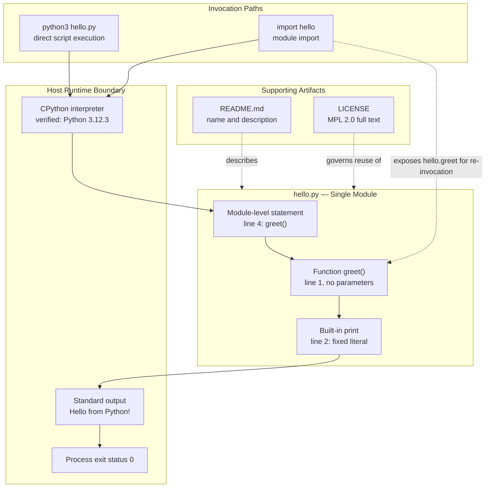
```mermaid
flowchart TD
    subgraph Invocation["Invocation Paths"]
        ScriptRun["python3 hello.py<br/>direct script execution"]
        ModuleImport["import hello<br/>module import"]
    end

    subgraph Module["hello.py — Single Module"]
        TopLevel["Module-level statement<br/>line 4: greet()"]
        GreetFn["Function greet()<br/>line 1, no parameters"]
        PrintCall["Built-in print<br/>line 2: fixed literal"]
    end

    subgraph Runtime["Host Runtime Boundary"]
        Interpreter["CPython interpreter<br/>verified: Python 3.12.3"]
        Stdout["Standard output<br/>Hello from Python!"]
        ExitCode["Process exit status 0"]
    end

    subgraph Governance["Supporting Artifacts"]
        Readme["README.md<br/>name and description"]
        License["LICENSE<br/>MPL 2.0 full text"]
    end

    ScriptRun --> Interpreter
    ModuleImport --> Interpreter
    Interpreter --> TopLevel
    TopLevel --> GreetFn
    GreetFn --> PrintCall
    PrintCall --> Stdout
    Stdout --> ExitCode
    ModuleImport -.->|"exposes hello.greet for re-invocation"| GreetFn
    Readme -.->|"describes"| Module
    License -.->|"governs reuse of"| Module
```

#### 1.2.2.3 Core Technical Approach

The technical approach is deliberate minimalism: the shortest correct Python program that produces observable output, with no layer of indirection between invocation and effect.

| Principle | Evidenced Implementation |
|---|---|
| Standard library only | Zero import statements; the only library call is the built-in `print` |
| Zero dependencies | No dependency manifest or lock file of any kind exists |
| Flat single-module structure | One `.py` file at root; no packages, no subdirectories |
| Synchronous, single-threaded | No concurrency, async syntax, or threading constructs |
| Deterministic, input-free | No parameters, arguments, configuration, or environment reads |
| Function-encapsulated logic | Output logic lives in `greet()` rather than inline at module level |
| Side effect at import time | Module-level call executes unconditionally, without a `__main__` guard |
| Stateless execution | No variables, state, persistence, or accumulated context |

The verified execution profile is: invoke interpreter → parse module → define `greet` → execute module-level `greet()` → write one line to stdout → return `None` → terminate with status `0`. Total repository footprint is 7 git objects packed into 8.24 KiB.

### 1.2.3 Success Criteria

#### 1.2.3.1 Measurable Objectives

The repository declares no objectives, targets, or acceptance criteria — there is no specification document, test suite, or CI configuration that would encode them. The criteria below are therefore derived strictly from behavior that is observable and verifiable in the current codebase, and each has been confirmed.

| Objective | Verification Method | Observed State |
|---|---|---|
| Module parses without error | Parse `hello.py` with the Python AST parser | Parses cleanly; 2 top-level nodes |
| Script produces the expected output | Run `python3 hello.py` | Emits exactly `Hello from Python!` |
| Script terminates successfully | Inspect process exit status | Exit status `0` |
| Function is independently callable | `import hello; hello.greet()` | Re-emits the greeting; returns `None` |
| No dependency resolution required | Inspect imports and manifests | Zero imports; no manifest present |
| License text is complete | Inspect `LICENSE` structure | MPL 2.0 Sections 1–10 plus Exhibits A and B |
| Branch content is consistent | Compare `main` and `jr_python1` trees | Identical; empty diff |

#### 1.2.3.2 Critical Success Factors

| Factor | Why It Is Critical Here | Current Status |
|---|---|---|
| Availability of a Python 3 interpreter | The only external prerequisite; no shebang or version file declares one | Verified working on Python 3.12.3 |
| Preservation of the exact output literal | The literal at `hello.py` line 2 is the sole functional contract | Intact |
| Presence of the module-level call | Removing `hello.py` line 4 would make script execution silent | Present |
| Retention of the root `LICENSE` | No per-file MPL notice exists, so the root file carries the whole notice | Present and complete |
| Restraint of the dependency surface | Zero dependencies is the property that keeps setup cost at nil | Maintained |

#### 1.2.3.3 Key Performance Indicators

**No KPIs are instrumented in this repository.** There is no logging, metrics emission, tracing, benchmarking harness, coverage configuration, or telemetry of any kind, and a semantic search for test, CI, and build configuration returned no files. Any performance or adoption indicator presented as an attribute of this system would be unfounded.

The measurements below are the only quantitative facts the repository supports, and they are static properties rather than operational indicators:

| Measurable Property | Value | Source |
|---|---|---|
| Tracked files | 3 | `git ls-files` |
| Subdirectories | 0 | Repository tree |
| Tracked non-license source lines | 6 (4 in `hello.py`, 2 in `README.md`) | Line counts |
| Third-party dependencies | 0 | Zero imports; no manifest |
| Public functions | 1 (`greet`) | `hello.py` line 1 |
| Automated tests | 0 | No test files or runners |
| CI/CD pipelines | 0 | No `.github/` directory |
| Packed repository size | 8.24 KiB across 7 objects | `git count-objects -vH` |
| Commits to date | 2 (both `2026-09-16`) | Git history |


## 1.3 Scope

Scope here describes the boundary of the system **as it exists in the repository**, not an aspiration for a future release. Because the tracked content is three files with no subdirectories, the in-scope list below is exhaustive rather than representative, and every out-of-scope item rests on a verified absence rather than a stated exclusion.

### 1.3.1 In-Scope

#### 1.3.1.1 Core Features and Functionalities

**Must-have capabilities.** The following four capabilities constitute the entire delivered functionality. Each maps to specific tracked content.

| Capability | Location | Status |
|---|---|---|
| Fixed greeting written to standard output | `hello.py` line 2 | Implemented and verified |
| Reusable parameterless function `greet()` | `hello.py` line 1 | Implemented and verified |
| Automatic execution on run or import | `hello.py` line 4 | Implemented and verified |
| Project identification (name, description) | `README.md` lines 1–2 | Present |
| Open-source redistribution terms (MPL 2.0) | `LICENSE` | Present and complete |

**Primary user workflows.** Two invocation workflows exist, both confirmed by execution:

| Workflow | Steps | Observed Outcome |
|---|---|---|
| Direct script execution | Invoke the interpreter against `hello.py` | One line `Hello from Python!`; exit status `0` |
| Module import and reuse | `import hello`, then optionally call `hello.greet()` | Greeting emitted at import; each `greet()` call re-emits it and returns `None` |

```python
# Workflow 1: direct execution      # Workflow 2: import and reuse

#### $ python3 hello.py                # >>> import hello        -> prints greeting

####   Hello from Python!              # >>> hello.greet()       -> prints greeting again

```

**Essential integrations.** In scope is exactly one external contract: the host Python interpreter and its standard output stream. No other integration is in scope, because no code exists that could exercise one — `hello.py` has zero imports.

**Key technical requirements.** The requirements below are those the current implementation actually imposes or satisfies.

| Requirement | Evidenced Form |
|---|---|
| A Python 3 interpreter must be available on the host | Verified with Python 3.12.3; no version is declared in-repo |
| Explicit interpreter invocation is required | No shebang line; file mode is `0644` (non-executable) |
| No dependency installation step may be required | Zero imports; no manifest or lock file |
| Standard output must be writable by the process | `print` is the sole output mechanism |
| Output must remain the exact literal `Hello from Python!` | Hard-coded string at `hello.py` line 2 |
| Redistribution must carry MPL 2.0 terms | Root `LICENSE`, relied upon in place of a per-file Exhibit A header |

#### 1.3.1.2 Implementation Boundaries

**System boundaries.** The system begins at interpreter invocation and ends at process termination. Everything inside the boundary is the parsing and execution of a single 4-line module; everything outside it — interpreter installation, shell, terminal, and operating system — is assumed, not managed.

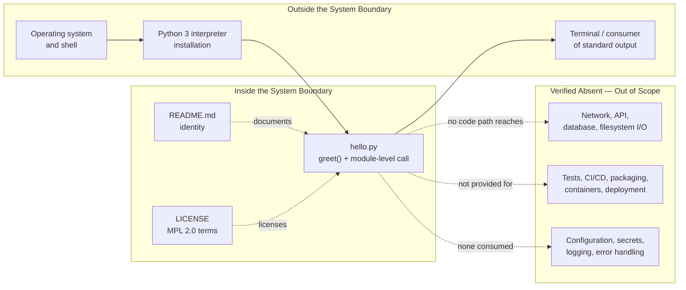
```mermaid
flowchart LR
    subgraph Outside["Outside the System Boundary"]
        OS["Operating system<br/>and shell"]
        PyInstall["Python 3 interpreter<br/>installation"]
        Terminal["Terminal / consumer<br/>of standard output"]
    end

    subgraph Inside["Inside the System Boundary"]
        HelloModule["hello.py<br/>greet() + module-level call"]
        ReadmeDoc["README.md<br/>identity"]
        LicenseDoc["LICENSE<br/>MPL 2.0 terms"]
    end

    subgraph Excluded["Verified Absent — Out of Scope"]
        NoNet["Network, API,<br/>database, filesystem I/O"]
        NoOps["Tests, CI/CD, packaging,<br/>containers, deployment"]
        NoRuntimeCfg["Configuration, secrets,<br/>logging, error handling"]
    end

    PyInstall --> HelloModule
    OS --> PyInstall
    HelloModule --> Terminal
    ReadmeDoc -.->|"documents"| HelloModule
    LicenseDoc -.->|"licenses"| HelloModule
    HelloModule -.->|"no code path reaches"| NoNet
    HelloModule -.->|"not provided for"| NoOps
    HelloModule -.->|"none consumed"| NoRuntimeCfg
```

**User groups covered.** No authentication, authorization, role model, or tenancy concept exists, so the system does not distinguish user groups. The covered population is "any local process able to invoke the interpreter against the module" — in practice a developer at a shell or another module importing `hello`.

**Geographic and market coverage.** None is implemented or declared. The greeting is a single hard-coded English literal with no internationalization, localization, locale detection, encoding negotiation, or region-specific behavior. Coverage is therefore neutral by omission rather than by design, and no market or region is targeted in any tracked file.

**Data domains included.** The only data in the system is one immutable string literal held in code. There is no schema, model, serialization format, input parsing, or storage of any kind.

| Data Aspect | In-Scope Reality |
|---|---|
| Data entities | One hard-coded string literal (`hello.py` line 2) |
| Inputs consumed | None — no arguments, stdin, files, or environment variables |
| Outputs produced | One line on standard output |
| Persistence | None — no files, databases, caches, or state |
| Personal or sensitive data | None — no user data is collected or processed |

### 1.3.2 Out-of-Scope

#### 1.3.2.1 Excluded Features and Capabilities

Every item below was confirmed absent from the tracked content. Because `hello.py` contains no imports, these exclusions are conclusive for the current codebase rather than probable.

| Excluded Area | Confirmation of Absence |
|---|---|
| Configurable or parameterized output | `greet()` declares no parameters; the literal is hard-coded |
| Command-line interface and argument parsing | No `argparse`/`sys.argv` usage; no imports at all |
| Input handling (stdin, files, environment) | No read operations of any kind |
| Networking, HTTP clients, or API endpoints | No socket, client, or server code |
| Databases, ORMs, migrations, or caching | No drivers, models, schemas, or queries |
| Authentication, authorization, or secret handling | No credential, token, or permission logic |
| Logging, metrics, tracing, or health checks | No logging or instrumentation anywhere |
| Error handling and input validation | No `try`/`except` blocks or validation code |
| Concurrency, scheduling, or background work | Single synchronous statement sequence |
| Internationalization and localization | Single English literal; no locale handling |
| Graphical or web user interface | No UI assets, templates, or front-end code |
| Automated testing and coverage reporting | No test files, runners, or coverage configuration |
| Packaging, versioning, and publication | No `pyproject.toml`, `setup.py`, `setup.cfg`, or release metadata |
| Containerization and deployment automation | No `Dockerfile`, compose file, or deployment manifests |
| CI/CD pipelines and code-quality gates | No `.github/` directory, `Makefile`, or pre-commit configuration |
| Dependency and environment management | No `requirements.txt`, `Pipfile`, `poetry.lock`, or `environment.yml` |

#### 1.3.2.2 Future Phase Considerations

The repository states **no roadmap**. A search of tracked content for `TODO`, `FIXME`, `XXX`, roadmap, deprecation, and "not implemented" markers returned nothing, and there is no `CHANGELOG.md`, `CONTRIBUTING.md`, or design note. Nothing in the repository commits to future work, and this specification does not manufacture such a commitment.

What can be stated factually is which of the verified limitations from section 1.2.1.2 would have to be resolved *if* the repository were extended — presented strictly as consequences of the current code, not as planned deliverables:

| Open Gap (Current Code) | Consequence if the Repository Is Extended |
|---|---|
| No `if __name__ == "__main__":` guard (`hello.py` line 4) | Importing the module cannot be made side-effect-free without editing it |
| No dependency manifest | Any third-party use would require introducing dependency management |
| No test suite or CI | Any behavior change is verifiable only by manual execution |
| No declared interpreter version | The supported Python range remains undefined |
| Mixed line endings, no `.gitattributes` | CRLF in `hello.py` versus LF elsewhere remains unnormalized |
| No per-file MPL Exhibit A header | Added source files would inherit the same notice gap |

#### 1.3.2.3 Integration Points Not Covered

No integration of any kind is in scope. The categories below are explicitly not covered, and no partial or stubbed implementation of any of them exists.

| Integration Point | Coverage |
|---|---|
| External REST/GraphQL/gRPC services | Not covered — no client code or endpoint definitions |
| Relational or NoSQL data stores | Not covered — no connection or query layer |
| Message brokers and event streams | Not covered — no producers or consumers |
| Identity providers and SSO | Not covered — no authentication surface |
| Configuration and secret managers | Not covered — no configuration is read |
| Monitoring, alerting, and log aggregation | Not covered — nothing is emitted to observe |
| Package registries and artifact repositories | Not covered — the project is not packaged |
| Container registries and orchestrators | Not covered — no image or manifest definitions |
| Other repository branches or services | Not applicable — `main` and `jr_python1` hold identical content |

#### 1.3.2.4 Unsupported Use Cases

| Use Case | Why It Is Unsupported |
|---|---|
| Installing the project as a Python package | No packaging metadata exists |
| Importing the module without producing output | The module-level call at `hello.py` line 4 is unguarded |
| Customizing the greeting text or recipient | No parameters, configuration, or input channels |
| Redirecting output anywhere other than stdout | `print` is used with default destination only |
| Running the file as a self-contained executable | No shebang; file mode `0644` is non-executable |
| Serving the greeting over a network or UI | No server, endpoint, or interface code |
| Concurrent, scheduled, or long-running operation | Process executes one statement sequence and exits |
| Operating on user, business, or persisted data | No data model, input, or storage exists |
| Relying on automated regression protection | No tests or CI pipelines exist |
| Production deployment with operational guarantees | No configuration, error handling, observability, or deployment tooling; no SLA is declared anywhere in the repository |


## 1.4 References

### 1.4.1 Repository Files Examined

- `hello.py` - The sole executable unit; established the complete functional surface: parameterless `greet()` at line 1, the hard-coded `print("Hello from Python!")` literal at line 2, and the unguarded module-level `greet()` call at line 4. Also established zero imports, absence of a shebang, `0644` file mode, 58-byte size, and CRLF line endings.
- `README.md` - Established project identity and the only stated purpose in the repository: `# BlitzyRepo3_Python` (line 1) and "A simple hello world python" (line 2); confirmed the absence of installation, usage, configuration, and dependency documentation.
- `LICENSE` - Established the distribution terms as the full Mozilla Public License Version 2.0 text (Sections 1–10, Exhibit A source-notice provision, Exhibit B incompatible-with-secondary-licenses notice) and the 16,726-byte footprint.

### 1.4.2 Repository Folders Examined

- Repository root (`""`) - Established the complete, flat file inventory of exactly three files with zero subdirectories, and confirmed the absence of source packages, configuration folders, documentation folders, and CI directories.

### 1.4.3 Verified Absences Used as Evidence

The following artifacts were each checked individually and confirmed **not present**; their absence substantiates the limitations in section 1.2.1.2 and the exclusions in section 1.3.2:

- Package and dependency manifests - `pyproject.toml`, `setup.py`, `setup.cfg`, `requirements.txt`, `Pipfile`, `poetry.lock`, `environment.yml`
- Test and quality configuration - `tox.ini`, `pytest.ini`, `.pre-commit-config.yaml`, and any test files or coverage configuration
- Build, container, and deployment files - `Makefile`, `Dockerfile`, `docker-compose.yml`
- Runtime and repository configuration - `.env`, `.python-version`, `runtime.txt`, `.gitignore`, `.gitattributes`
- Project documentation - `CHANGELOG.md`, `CONTRIBUTING.md`, and any `docs/` directory
- Automation - `.github/` directory and any CI/CD workflow definitions
- Exclusion rules - no `.blitzyignore` file exists in the repository, so no paths were excluded from this analysis on that basis

### 1.4.4 Repository Metadata and Verification Activities

- Git history - Established exactly two commits, both dated 2026-09-16 and authored by `rjhonsi`: `0fa4c0c` ("Initial commit", adding `LICENSE` and `README.md`) and `56fb250` ("Add files via upload", adding `hello.py`).
- Git branch and tree inspection - Established that `main`, `jr_python1`, `origin/main`, and `origin/jr_python1` each contain the identical three files, with an empty diff between `main` and `jr_python1`.
- Git object accounting - Established the packed repository footprint of 8.24 KiB across 7 objects.
- Tracked-content marker search - Established the absence of `TODO`, `FIXME`, `XXX`, roadmap, deprecation, and "not implemented" markers, supporting section 1.3.2.2.
- Abstract-syntax-tree inventory of `hello.py` - Established the complete symbol table: two top-level nodes, zero imports, zero classes, one function (`greet`, no parameters, line 1), and two call sites (`print` line 2, `greet` line 4).
- Direct execution under Python 3.12.3 - Established the observable behavior cited throughout: `python3 hello.py` emits exactly `Hello from Python!` and exits with status `0`; `import hello` emits the greeting at import time, and `hello.greet()` re-emits it and returns `None`.
- Semantic searches - A file search for automated tests, continuous-integration workflows, and build/packaging configuration returned zero results; a folder search for application source modules, configuration, or external service integrations returned zero results.

### 1.4.5 External References

- [web] Mozilla Public License Version 2.0, `https://mozilla.org/MPL/2.0/` - Cited within `LICENSE` Exhibit A as the canonical location of the license text; referenced here only as the URL the repository itself contains, and not otherwise relied upon.

No other external sources were consulted; every factual claim in this section derives from direct inspection of the repository content enumerated above.


# 2. Product Requirements

## 2.1 Feature Catalog

The feature catalog below is **exhaustive, not representative**. The repository tracks exactly three files at a flat root — `hello.py`, `README.md`, and `LICENSE` — and contains no subdirectories, no dependency manifest, and no configuration. Every discrete, testable capability the repository delivers is therefore enumerable, and all five are catalogued here.

Two modelling decisions are stated explicitly so that the catalog is not mistaken for a wish list:

- **No feature is proposed that the code does not implement.** Every feature below is traceable to specific lines of tracked content and was confirmed by execution.
- **Properties are not promoted to features.** The zero-dependency profile, the CRLF line endings in `hello.py`, the branch parity between `main` and `jr_python1`, and the untracked `__pycache__` byte-cache artifact are all verified facts, but none is a capability. They appear as requirements, constraints, or implementation considerations in sections 2.2, 2.4, and 2.5 rather than as catalog entries.

### 2.1.1 Catalog Summary

| Feature ID | Feature Name | Category | Priority |
|---|---|---|---|
| F-001 | Fixed Greeting Emission to Standard Output | Core Runtime Behavior | Critical |
| F-002 | Reusable Greeting Function (`greet`) | Programmatic Interface | High |
| F-003 | Self-Executing Module Entry Point | Execution and Invocation | Critical |
| F-004 | Project Identification Documentation | Documentation | Medium |
| F-005 | Open-Source Licensing Declaration | Legal and Compliance | High |

| Feature ID | Status | Implementing Artifact | Verification |
|---|---|---|---|
| F-001 | Completed | `hello.py` line 2 | Executed; exact stdout compared |
| F-002 | Completed | `hello.py` line 1 | Imported; signature and return value inspected |
| F-003 | Completed | `hello.py` line 4 | Executed via script path and `-m` |
| F-004 | Completed | `README.md` lines 1–2 | File content read byte-for-byte |
| F-005 | Completed | `LICENSE` (373 lines) | Structure inspected, Sections 1–10 and Exhibits A/B |

Priority here reflects the dependency of the system's observable behavior on each feature, derived from the code itself: removing F-001 or F-003 eliminates all observable output, so both are Critical; F-002 is the callable surface that survives import, so it is High; F-005 is the sole legal instrument governing reuse, so it is High; F-004 carries the only stated purpose in the repository and is Medium because no behavior depends on it. All five are recorded as **Completed** because each is fully present in tracked content and was verified — no feature in this repository is partially implemented, stubbed, or gated behind a flag.

### 2.1.2 F-001 — Fixed Greeting Emission to Standard Output

#### 2.1.2.1 Feature Metadata

| Attribute | Value |
|---|---|
| Unique ID | F-001 |
| Feature Name | Fixed Greeting Emission to Standard Output |
| Feature Category | Core Runtime Behavior |
| Priority Level | Critical |
| Status | Completed |

#### 2.1.2.2 Description

**Overview.** F-001 is the single unit of observable work the system performs: it writes the fixed literal `Hello from Python!`, followed by one newline, to the process standard output stream. The implementation is one statement — the built-in `print` call at `hello.py` line 2 — and it accepts no input of any kind. Measured output is exactly 19 bytes, and the emission is byte-identical on every run.

**Business Value.** The repository states no business objective (`README.md` contains two lines and no goals), so the value F-001 delivers is confined to what it evidences: a deterministic, externally observable signal that Python source committed to this repository executes correctly on the host. It is the assertion that makes the repository verifiable at all.

**User Benefits.** The greeting requires no setup, no arguments, no credentials, and no configuration to obtain, and its result is unambiguous — a single known line on standard output with exit status 0. Because the output is a fixed literal with no branching, a reader can predict the result exactly before running the program.

**Technical Context.** The emission uses `print` with its default destination and default line terminator; no stream object, encoding argument, file handle, or flush control is specified. The literal is ASCII-only with no byte-order mark. Because the statement is the body of the function defined at `hello.py` line 1, F-001 is reachable only by invoking that function — there is no inline module-level output statement.

#### 2.1.2.3 Dependencies

| Dependency Type | Detail |
|---|---|
| Prerequisite Features | F-002 — the emission statement is the body of `greet()`; no other call path exists |
| System Dependencies | CPython built-in `print`; the process standard output stream |
| External Dependencies | None — `hello.py` contains zero import statements; no third-party package is referenced |
| Integration Requirements | Standard output must be attached and writable; no other interface is touched |

### 2.1.3 F-002 — Reusable Greeting Function (`greet`)

#### 2.1.3.1 Feature Metadata

| Attribute | Value |
|---|---|
| Unique ID | F-002 |
| Feature Name | Reusable Greeting Function (`greet`) |
| Feature Category | Programmatic Interface |
| Priority Level | High |
| Status | Completed |

#### 2.1.3.2 Description

**Overview.** F-002 is the repository's entire programmatic interface: a single module-level function `greet`, defined at `hello.py` line 1, that takes no parameters and returns `None`. After `import hello`, the module namespace exposes exactly one public attribute — `greet` — and calling it re-emits the greeting. The function has no docstring.

**Business Value.** F-002 converts a one-off script effect into a named, addressable unit. It is the only element of the codebase that another module can reference by name, and therefore the only surface against which future code or tests could be written without modifying `hello.py`.

**User Benefits.** A consumer can trigger the greeting on demand rather than only at process start, can call it repeatedly with identical effect, and needs to learn a single zero-argument signature. The function encapsulates the output logic so a caller does not restate the literal.

**Technical Context.** The abstract-syntax-tree inventory of `hello.py` confirms the complete symbol table: one `FunctionDef` named `greet` at line 1 with zero arguments, zero classes, and zero imports. The runtime signature is `()`. The function is stateless — it declares no variables, reads no globals, and holds nothing between calls — so 1,000 sequential invocations each produce the same single line.

#### 2.1.3.3 Dependencies

| Dependency Type | Detail |
|---|---|
| Prerequisite Features | None — the definition stands alone; F-001 is contained within its body |
| System Dependencies | A Python 3 interpreter capable of defining and binding a module-level function |
| External Dependencies | None — no decorators, base classes, type imports, or third-party packages |
| Integration Requirements | Module must be importable from the interpreter's path for programmatic reuse; no packaging metadata exists, so reuse relies on filesystem location |

### 2.1.4 F-003 — Self-Executing Module Entry Point

#### 2.1.4.1 Feature Metadata

| Attribute | Value |
|---|---|
| Unique ID | F-003 |
| Feature Name | Self-Executing Module Entry Point |
| Feature Category | Execution and Invocation |
| Priority Level | Critical |
| Status | Completed |

#### 2.1.4.2 Description

**Overview.** F-003 is the unguarded module-level call `greet()` at `hello.py` line 4. It makes the module self-executing: running the file, running it as a module with `-m`, or importing it all cause the greeting to be emitted, with no `if __name__ == "__main__":` guard and no argument parsing. Three invocation paths were confirmed to produce the greeting and exit status 0: `python3 hello.py`, `python3 -m hello`, and `import hello`.

**Business Value.** F-003 removes every step between obtaining the repository and observing a result. There is no install, build, dependency-resolution, or configuration phase, because none exists to perform — no manifest, lock file, or environment file is present in the repository.

**User Benefits.** One command produces the result, and the process terminates cleanly with status 0, which makes the run trivially checkable by a shell or a script. Output is redirectable with ordinary shell operators, and standard error remains empty on success.

**Technical Context.** The module-level expression is the second and final top-level AST node. Invocation requires an explicit interpreter: `hello.py` has no shebang line — its first bytes are `def` — and its file mode is `0644`, so direct execution of the path is rejected by the operating system with exit code 126. Because the call is unguarded, import-time emission is an inherent property rather than an option, and it is the mechanism by which F-003 also applies to F-002 consumers.

```python
# hello.py line 4 — module-level, unguarded: runs on execution AND on import

greet()
```

#### 2.1.4.3 Dependencies

| Dependency Type | Detail |
|---|---|
| Prerequisite Features | F-002 — the line 4 call site resolves the definition at line 1; transitively triggers F-001 |
| System Dependencies | A Python 3 interpreter on the host (verified against Python 3.12.3); writable standard output |
| External Dependencies | None — zero imports and no dependency manifest, so no resolution step is possible or required |
| Integration Requirements | Interpreter must be invoked explicitly against the file or module name; no shebang, launcher, console-script entry point, or container image is provided |

### 2.1.5 F-004 — Project Identification Documentation

#### 2.1.5.1 Feature Metadata

| Attribute | Value |
|---|---|
| Unique ID | F-004 |
| Feature Name | Project Identification Documentation |
| Feature Category | Documentation |
| Priority Level | Medium |
| Status | Completed |

#### 2.1.5.2 Description

**Overview.** F-004 is the two-line `README.md` at the repository root: a level-one heading naming the project `BlitzyRepo3_Python` on line 1, and the description `A simple hello world python` on line 2. The file is 49 bytes and contains nothing else — no installation, usage, configuration, or dependency section.

**Business Value.** This is the only declaration of intent anywhere in the repository. There is no `docs/` directory, `CONTRIBUTING.md`, or `CHANGELOG.md`, so `README.md` line 2 is the sole authority on what the project is for, and it is the statement this specification treats as the project's declared purpose.

**User Benefits.** A reader arriving at the repository learns the project name and its scope in one line, and is given no misleading promise of capability beyond a hello-world demonstration.

**Technical Context.** The file is ASCII with LF line endings and no byte-order mark. It is rendered documentation only: it is not parsed, imported, or read by any code path, since `hello.py` performs no file I/O. Consequently F-004 carries no runtime dependency in either direction.

#### 2.1.5.3 Dependencies

| Dependency Type | Detail |
|---|---|
| Prerequisite Features | None |
| System Dependencies | None at runtime — no code reads this file |
| External Dependencies | A Markdown renderer for formatted display; the raw text is fully legible without one |
| Integration Requirements | Must remain at the repository root to be surfaced as the project landing description |

### 2.1.6 F-005 — Open-Source Licensing Declaration

#### 2.1.6.1 Feature Metadata

| Attribute | Value |
|---|---|
| Unique ID | F-005 |
| Feature Name | Open-Source Licensing Declaration (MPL 2.0) |
| Feature Category | Legal and Compliance |
| Priority Level | High |
| Status | Completed |

#### 2.1.6.2 Description

**Overview.** F-005 is the complete text of the Mozilla Public License Version 2.0 committed as `LICENSE` at the repository root — 373 lines and 16,726 bytes, comprising Sections 1 through 10, Exhibit A (source-code-form license notice, at line 355) and Exhibit B (the "Incompatible With Secondary Licenses" notice, at line 369).

**Business Value.** F-005 establishes unambiguous redistribution terms for all tracked content, and it did so from the first commit — `LICENSE` was added in commit `0fa4c0c`, before any source file existed. Downstream recipients therefore have a defined legal basis for use, modification, and distribution without negotiation.

**User Benefits.** Anyone copying, forking, or embedding this code can determine their obligations from a single root file. Exhibit A explicitly contemplates placing the notice in a `LICENSE` file where a recipient would look for it, which is exactly the arrangement used here.

**Technical Context.** `LICENSE` is inert legal text: it declares no dependencies, contains no executable statements, and is not read by any code. It is worth noting one verified gap — `hello.py` carries **no** Exhibit A notice header; a search of the file for copyright, license, or Mozilla references returns nothing. The root `LICENSE` therefore bears the entire notice function, which is the alternative Exhibit A permits.

#### 2.1.6.3 Dependencies

| Dependency Type | Detail |
|---|---|
| Prerequisite Features | None |
| System Dependencies | None at runtime |
| External Dependencies | The canonical MPL 2.0 text published at `https://mozilla.org/MPL/2.0/`, cited at `LICENSE` line 360 |
| Integration Requirements | Must accompany any redistribution of the covered source; must remain discoverable at the root given the absence of per-file notice headers |


## 2.2 Functional Requirements

The requirements below are reverse-engineered from tracked content and then confirmed by execution, so every acceptance criterion states an **observed** result rather than a target. Seventeen requirements are defined across the five features. Where a category of the required template has no basis in the repository — most notably input validation and error handling, of which the codebase contains none — that fact is stated as the finding, because an unimplemented safeguard is a material property of this system.

Priorities use the Must-Have / Should-Have / Could-Have scale. A requirement is Must-Have when the currently observable behavior of the system depends on it; no Could-Have requirement is recorded, because the repository contains no optional or partially built behavior.

### 2.2.1 F-001 — Fixed Greeting Emission to Standard Output

#### 2.2.1.1 Requirement Details

| Requirement ID | Description | Priority | Complexity |
|---|---|---|---|
| F-001-RQ-001 | Write the literal `Hello from Python!` followed by a single newline to standard output | Must-Have | Low |
| F-001-RQ-002 | Emit through the built-in `print` default destination so output is capturable by ordinary shell redirection, leaving standard error empty | Must-Have | Low |
| F-001-RQ-003 | Produce output deterministically, independent of arguments, standard input, environment, configuration, and prior state | Must-Have | Low |
| F-001-RQ-004 | Emit ASCII-representable text with no byte-order mark and exactly one trailing newline | Should-Have | Low |

| Requirement ID | Acceptance Criteria (verified) |
|---|---|
| F-001-RQ-001 | `python3 hello.py` writes exactly 19 bytes; a byte dump shows `Hello from Python!` terminated by one `\n` |
| F-001-RQ-002 | Redirecting stdout to a file captures the single line, exit status is 0, and standard error measures 0 bytes |
| F-001-RQ-003 | Three consecutive runs are byte-identical; passing `--foo bar` changes nothing; piping text to stdin changes nothing |
| F-001-RQ-004 | Source and emitted bytes are ASCII with no BOM; output ends with a single newline and no trailing whitespace |

#### 2.2.1.2 Technical Specifications

| Specification | Observed Detail |
|---|---|
| Input Parameters | None. No positional or keyword arguments, no `argv` read (impossible without imports), no stdin read, no environment variable, no configuration file |
| Output / Response | 19 bytes on file descriptor 1: `Hello from Python!\n`. `print` returns `None`; the enclosing process exits with status 0 |
| Performance Criteria | No performance requirement is declared anywhere in the repository. Measured: ~0.27 µs per in-process emission (1,000 calls in 0.272 ms) |
| Data Requirements | One immutable ASCII string literal held in code at `hello.py` line 2. No schema, serialization, persistence, cache, or state |

#### 2.2.1.3 Validation Rules

| Rule Category | Observed Rule |
|---|---|
| Business Rules | The literal is the system's only functional contract and must remain exactly `Hello from Python!`. No alternative text, localization, template, or formatting path exists |
| Data Validation | **None implemented.** There is no input to validate and no `try`/`except` or `raise` statement in the module. A write failure is unhandled: directing stdout to `/dev/full` yields exit status 120 and an interpreter-level `Exception ignored … OSError: [Errno 28] No space left on device` on standard error |
| Security Requirements | No input parsing, no format-string interpolation, no secret, credential, or personal data in the literal, and no filesystem, network, subprocess, or dynamic-evaluation path from the emission statement |
| Compliance Requirements | The emitted literal is part of Covered Software under the root MPL 2.0 `LICENSE` (F-005). No data-protection obligation arises, because no personal data is read, stored, or transmitted |

### 2.2.2 F-002 — Reusable Greeting Function (`greet`)

#### 2.2.2.1 Requirement Details

| Requirement ID | Description | Priority | Complexity |
|---|---|---|---|
| F-002-RQ-001 | Define a module-level function named `greet` that accepts no parameters | Must-Have | Low |
| F-002-RQ-002 | Expose `greet` as the module's callable interface, importable and invocable through the module namespace | Must-Have | Low |
| F-002-RQ-003 | Return `None` — the function's value is its side effect, not a return value | Must-Have | Low |
| F-002-RQ-004 | Remain stateless and repeatably invocable, producing an identical effect on every call | Must-Have | Low |

| Requirement ID | Acceptance Criteria (verified) |
|---|---|
| F-002-RQ-001 | The AST of `hello.py` contains exactly one `FunctionDef` — `greet` at line 1 with zero arguments; the runtime signature is `()` |
| F-002-RQ-002 | After `import hello`, the module's public attributes are exactly `['greet']`, and `hello.greet()` emits the greeting |
| F-002-RQ-003 | The call evaluates to `None`; the function body contains no `return` statement |
| F-002-RQ-004 | 1,000 sequential calls each emit one identical line; the module declares no variables and no module-level state |

#### 2.2.2.2 Technical Specifications

| Specification | Observed Detail |
|---|---|
| Input Parameters | None — signature is `()`. Supplying any argument is rejected by the interpreter: `hello.greet("x")` raises `TypeError: greet() takes 0 positional arguments but 1 was given` |
| Output / Response | Side effect only: one line on standard output per call. Return value is `None`. No exception is raised on the success path |
| Performance Criteria | No declared target. Measured ~0.27 µs per call (1,000 calls in 0.272 ms) with output redirected in-process |
| Data Requirements | None — no parameters, attributes, closures, globals, or persisted state. The function has no docstring |

#### 2.2.2.3 Validation Rules

| Rule Category | Observed Rule |
|---|---|
| Business Rules | `greet` is the single public callable and its name is the interface contract; no alias, overload, or alternative entry function exists |
| Data Validation | **None implemented in code.** Arity enforcement comes from the Python calling convention alone (`TypeError` on any argument); the function performs no validation of its own |
| Security Requirements | No argument surface means no injection or deserialization risk. The function reads no credentials, touches no filesystem or network, and executes no dynamically constructed code |
| Compliance Requirements | Covered Software under the root MPL 2.0 `LICENSE`; the source file carries no Exhibit A notice header, so the root file bears the notice (see F-005-RQ-002) |

### 2.2.3 F-003 — Self-Executing Module Entry Point

#### 2.2.3.1 Requirement Details

| Requirement ID | Description | Priority | Complexity |
|---|---|---|---|
| F-003-RQ-001 | Invoke `greet()` at module scope so that executing the file emits the greeting with no additional ceremony | Must-Have | Low |
| F-003-RQ-002 | Terminate successful execution with exit status 0 and an empty standard error stream | Must-Have | Low |
| F-003-RQ-003 | Require no dependency installation, virtual environment, configuration file, or command-line argument to run | Must-Have | Low |
| F-003-RQ-004 | Support invocation through an explicit interpreter, both by script path and by module name (`-m`) | Must-Have | Low |
| F-003-RQ-005 | Emit the greeting at import time, since the module-level call is unguarded | Must-Have | Low |

| Requirement ID | Acceptance Criteria (verified) |
|---|---|
| F-003-RQ-001 | `python3 hello.py` prints exactly one line, `Hello from Python!` |
| F-003-RQ-002 | Exit status is 0 and standard error measures 0 bytes on every successful run |
| F-003-RQ-003 | The module has zero imports; 26 candidate manifest, test, container, and configuration files were each checked and are absent; the run succeeds with no preparatory step |
| F-003-RQ-004 | `python3 hello.py` and `python3 -m hello` both emit the greeting and exit 0; `./hello.py` is rejected with exit code 126 because the file mode is `0644` and no shebang line exists |
| F-003-RQ-005 | `import hello` with stdout captured yields `Hello from Python!\n`; the token `__name__` appears nowhere in the source, confirming the absence of a `__main__` guard |

F-003-RQ-005 is classified Must-Have because it is not optional: it is an inherent consequence of the unguarded call at `hello.py` line 4 and cannot be disabled without editing the module. It is recorded as a requirement so the behavior is documented rather than encountered by surprise.

#### 2.2.3.2 Technical Specifications

| Specification | Observed Detail |
|---|---|
| Input Parameters | None consumed. Extra command-line arguments are accepted by the shell and silently ignored (`python3 hello.py --foo bar` still exits 0 with the same output); piped standard input is ignored |
| Output / Response | One line on standard output per invocation path, then process exit status 0. No log, metric, trace, or file output |
| Performance Criteria | No declared target. Measured ~11 ms per process invocation (20 sequential runs in 0.219 s real), dominated by interpreter startup rather than by the emission itself |
| Data Requirements | No application data. The interpreter writes one side artifact on import — `__pycache__/hello.cpython-312.pyc` (324 bytes) — which is untracked and, because no `.gitignore` exists, is reported by `git status` as an untracked path |

#### 2.2.3.3 Validation Rules

| Rule Category | Observed Rule |
|---|---|
| Business Rules | The module-level call must remain present or script execution becomes silent; conversely, while it remains unguarded, import cannot be made side-effect-free |
| Data Validation | **None implemented.** There is no argument parsing, no argument rejection, and no environment validation; unexpected arguments are neither read nor reported |
| Security Requirements | No argument, environment, or stdin attack surface exists. The `0644` mode prevents accidental direct execution as a program. Importing the module causes the interpreter to write a `.pyc` into the source directory, which requires that directory to be writable or the cache write to be silently skipped |
| Compliance Requirements | Execution is governed by the root MPL 2.0 `LICENSE`; no runtime licence check, telemetry, or usage reporting exists |

### 2.2.4 F-004 — Project Identification Documentation

#### 2.2.4.1 Requirement Details

| Requirement ID | Description | Priority | Complexity |
|---|---|---|---|
| F-004-RQ-001 | Provide a root `README.md` declaring the project name as a level-one Markdown heading | Must-Have | Low |
| F-004-RQ-002 | State the project's purpose in a single descriptive line | Must-Have | Low |

| Requirement ID | Acceptance Criteria (verified) |
|---|---|
| F-004-RQ-001 | `README.md` line 1 is exactly `# BlitzyRepo3_Python` |
| F-004-RQ-002 | `README.md` line 2 is exactly `A simple hello world python`, and the file contains no further content |

#### 2.2.4.2 Technical Specifications

| Specification | Observed Detail |
|---|---|
| Input Parameters | None — the file is static content and is not read by any code path |
| Output / Response | Rendered Markdown for human readers: one heading and one description line |
| Performance Criteria | Not applicable; the file participates in no runtime path |
| Data Requirements | 49 bytes, 2 lines, ASCII, LF line endings, no byte-order mark |

#### 2.2.4.3 Validation Rules

| Rule Category | Observed Rule |
|---|---|
| Business Rules | `README.md` is the repository's only statement of purpose — there is no `docs/` directory, `CONTRIBUTING.md`, or `CHANGELOG.md` — so the description must remain consistent with the behavior actually implemented |
| Data Validation | None — no parser, schema, front-matter, or link check is applied to the file anywhere in the repository |
| Security Requirements | The file contains no credentials, tokens, endpoints, or host names; it is safe to publish verbatim |
| Compliance Requirements | Distributed as part of the repository under the root MPL 2.0 `LICENSE`; no attribution or notice requirement is imposed on the document itself |

### 2.2.5 F-005 — Open-Source Licensing Declaration

#### 2.2.5.1 Requirement Details

| Requirement ID | Description | Priority | Complexity |
|---|---|---|---|
| F-005-RQ-001 | Include the complete Mozilla Public License Version 2.0 text as `LICENSE` at the repository root | Must-Have | Low |
| F-005-RQ-002 | Make the licence notice discoverable at the root in place of per-file Exhibit A headers | Must-Have | Low |
| F-005-RQ-003 | Cite the canonical published location of the licence text | Should-Have | Low |

| Requirement ID | Acceptance Criteria (verified) |
|---|---|
| F-005-RQ-001 | `LICENSE` spans 373 lines / 16,726 bytes and contains Sections 1–10 plus Exhibit A (line 355) and Exhibit B (line 369) |
| F-005-RQ-002 | `hello.py` contains no copyright, licence, or Mozilla reference, and Exhibit A expressly permits placing the notice in a `LICENSE` file where a recipient would look for it |
| F-005-RQ-003 | `LICENSE` line 360 cites `https://mozilla.org/MPL/2.0/` |

#### 2.2.5.2 Technical Specifications

| Specification | Observed Detail |
|---|---|
| Input Parameters | None — inert legal text with no executable statements, imports, or dependency declarations |
| Output / Response | No runtime output; the artifact is consumed by human readers and licence-scanning tooling |
| Performance Criteria | Not applicable; the file participates in no runtime path |
| Data Requirements | 16,726 bytes, 373 lines, ASCII, LF line endings; committed in the repository's first commit (`0fa4c0c`) |

#### 2.2.5.3 Validation Rules

| Rule Category | Observed Rule |
|---|---|
| Business Rules | All tracked content is Covered Software under MPL 2.0; the licence text must remain unmodified and must accompany redistribution. `LICENSE` Section 10 reserves version control to the licence steward, so local edits would break the declaration |
| Data Validation | None automated — there is no licence-scanning configuration, SPDX identifier file, or CI check in the repository to verify the text or per-file headers |
| Security Requirements | Contains no secrets or endpoints beyond the published licence URL; requires no access control |
| Compliance Requirements | `LICENSE` Section 3 sets the obligations for distributing source and executable forms, including source availability, recipient notices, preservation of legal notices, and constraints on additional warranty or liability terms. Exhibit B supplies the "Incompatible With Secondary Licenses" notice, which no file in this repository currently declares |


## 2.3 Feature Relationships

Only three relationships between features exist in the codebase, and all three are visible in the four lines of `hello.py`. Because the module contains zero import statements, this analysis is exhaustive rather than sampled: there is no indirect coupling through a framework, dependency-injection container, event bus, or configuration layer, since none of those exists.

### 2.3.1 Feature Dependency Map

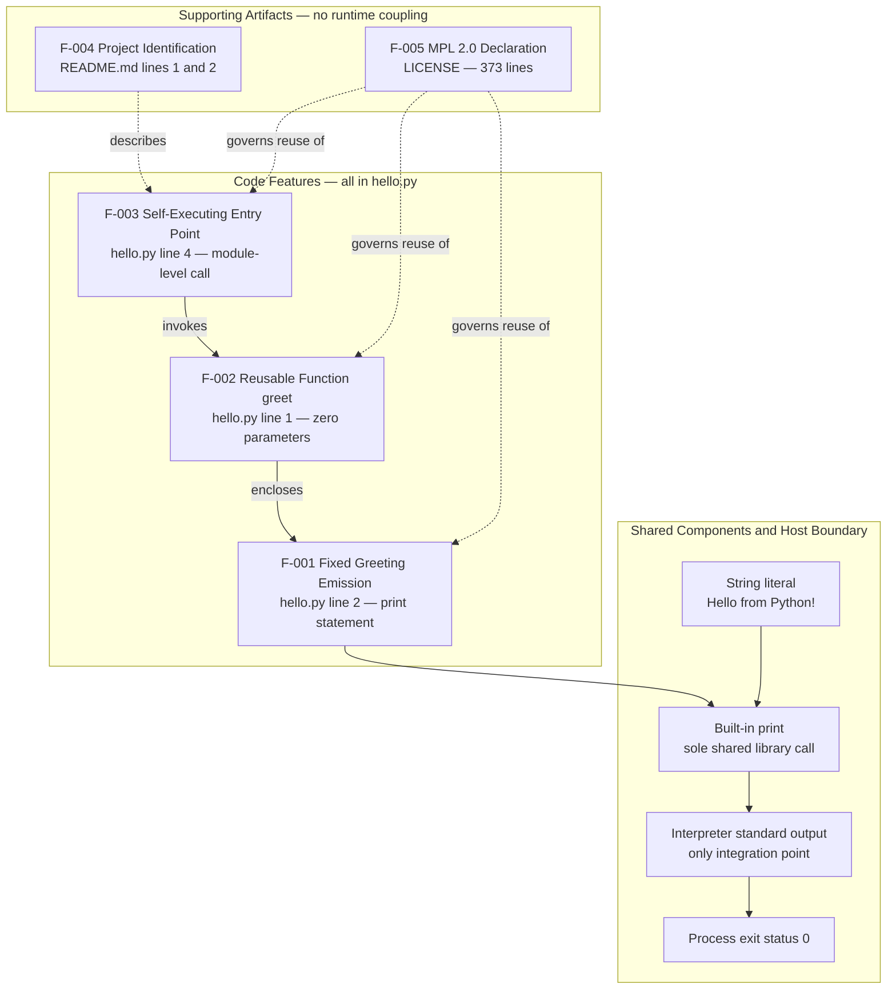
```mermaid
flowchart TD
    subgraph CodeFeatures["Code Features — all in hello.py"]
        F003["F-003 Self-Executing Entry Point<br/>hello.py line 4 — module-level call"]
        F002["F-002 Reusable Function greet<br/>hello.py line 1 — zero parameters"]
        F001["F-001 Fixed Greeting Emission<br/>hello.py line 2 — print statement"]
    end

    subgraph SupportArtifacts["Supporting Artifacts — no runtime coupling"]
        F004["F-004 Project Identification<br/>README.md lines 1 and 2"]
        F005["F-005 MPL 2.0 Declaration<br/>LICENSE — 373 lines"]
    end

    subgraph SharedRuntime["Shared Components and Host Boundary"]
        Literal["String literal<br/>Hello from Python!"]
        PrintBuiltin["Built-in print<br/>sole shared library call"]
        Stdout["Interpreter standard output<br/>only integration point"]
        ExitStatus["Process exit status 0"]
    end

    F003 -->|"invokes"| F002
    F002 -->|"encloses"| F001
    F001 --> PrintBuiltin
    Literal --> PrintBuiltin
    PrintBuiltin --> Stdout
    Stdout --> ExitStatus
    F004 -.->|"describes"| F003
    F005 -.->|"governs reuse of"| F001
    F005 -.->|"governs reuse of"| F002
    F005 -.->|"governs reuse of"| F003
```

| Relationship | Type | Evidence |
|---|---|---|
| F-003 → F-002 | Runtime invocation | The call expression at `hello.py` line 4 resolves the definition at line 1; the AST records `greet` as a call site at line 4 |
| F-002 → F-001 | Structural containment | The `print` statement at line 2 is the sole statement of the function body opened at line 1 |
| F-003 → F-001 | Transitive | Line 4 reaches the emission only through `greet`; no direct module-level output statement exists |
| F-005 → F-001, F-002, F-003 | Legal, non-runtime | `LICENSE` covers all tracked source; no code reads the file |
| F-004 → F-003 | Documentary, non-runtime | `README.md` describes the artifact as "A simple hello world python"; no code reads the file |

Two consequences follow directly from this map and are worth stating because they define how the features can be exercised:

- **F-001 has no independent entry point.** The emission cannot be triggered without F-002, because the `print` statement lives inside the function body. Any consumer wanting output must call `greet` or import the module.
- **F-003 is the only automatic trigger.** Removing the line 4 call would leave F-001 and F-002 intact but make every invocation path silent unless the caller explicitly calls `greet`.

### 2.3.2 Integration Points

The system has exactly **one** integration point. This is not a summary of the most significant integrations — it is the complete list, and its completeness is guaranteed by the absence of imports, which removes any code path capable of reaching a socket, file, database, broker, or subprocess.

| Integration Point | Participating Features | Direction and Contract |
|---|---|---|
| Interpreter standard output stream | F-001 (writer), F-003 (triggers the write) | Outbound, write-only; one line of ASCII text per invocation via `print` with its default destination |
| CPython interpreter and module loader | F-002 (definition binding), F-003 (module execution and import) | Inbound control; the interpreter parses `hello.py`, binds `greet`, then executes the module-level call |

Related process flowcharts already established in this specification depict these same boundaries and should be read alongside this map: the invocation-path and runtime-boundary flowchart in **1.2.2.2 Major System Components**, and the system-boundary flowchart in **1.3.1.2 Implementation Boundaries**.

### 2.3.3 Shared Components

| Shared Component | Shared By | Nature of Sharing |
|---|---|---|
| Built-in `print` | F-001, and transitively F-002 and F-003 | The only library call in the repository; provides both formatting and stream selection |
| String literal `Hello from Python!` | F-001 | Single immutable literal at `hello.py` line 2; not referenced by name and not shared through a constant |
| Module namespace `hello` | F-002, F-003 | The import namespace that publishes `greet`; public attributes are exactly `['greet']` |
| `hello.py` file itself | F-001, F-002, F-003 | All three code features are implemented in one 58-byte, 4-line file; there is no package structure and no `__init__.py` |
| Root `LICENSE` notice | F-001, F-002, F-003 | One root-level notice serves all source, since no file carries an Exhibit A header |

### 2.3.4 Common Services

**No common service layer exists in this repository.** This is a finding, not an omission from the documentation: a service layer would require code, and the only code is the four lines of `hello.py`. Each row below was confirmed absent by direct inspection of the module's AST and of the repository root.

| Candidate Common Service | Status | Basis |
|---|---|---|
| Configuration or settings service | Absent | No configuration file, `.env`, or environment read; no imports |
| Logging, metrics, or tracing service | Absent | No logging calls or instrumentation anywhere; nothing is emitted to observe |
| Error-handling or retry framework | Absent | The AST contains no `Try` or `Raise` node; failures surface as interpreter-level exceptions |
| Authentication, authorization, or session service | Absent | No credential, token, role, or permission logic; no user concept exists |
| Data-access or persistence layer | Absent | No drivers, models, schemas, queries, or file writes by application code |
| Shared utility or helper module | Absent | The repository contains one module and no subdirectories |
| Test fixtures or shared test harness | Absent | No test file, runner configuration, or CI workflow exists |

The only facility every code feature relies on is the host interpreter's standard output stream, which is an external resource rather than a service implemented here.

### 2.3.5 Relationships Verified Not to Exist

Recording these explicitly prevents a reader from assuming conventional couplings that the code does not contain.

| Assumed Relationship | Verified Reality |
|---|---|
| Feature-to-feature calls beyond the line 4 → line 1 → line 2 chain | None; the AST records exactly two call sites in the whole repository |
| Documentation or licence files consumed at runtime | None; `hello.py` performs no file I/O, so `README.md` and `LICENSE` are never read by the program |
| Configuration-driven feature toggling | None; no feature flag, conditional, or branch exists in the module |
| Cross-branch feature divergence | None; `main`, `jr_python1`, `origin/main`, and `origin/jr_python1` hold identical trees and the diff between branches is empty |
| Inter-process or network interaction between features | None; execution is a single synchronous process with no concurrency or IPC constructs |


## 2.4 Implementation Considerations

The considerations recorded here are properties of the code as it stands. Performance figures are measurements taken during this investigation, not commitments: the repository declares no performance target, contains no benchmark harness, and has no instrumentation of any kind, as established in **1.2.3.3 Key Performance Indicators**.

### 2.4.1 Cross-Cutting Constraints

These constraints apply to every feature because they are properties of the repository rather than of any one file.

| Constraint | Observed Basis | Effect on All Features |
|---|---|---|
| No declared interpreter version | No `pyproject.toml`, `.python-version`, or `runtime.txt`; no shebang | The supported Python range is undefined; behavior is verified only on Python 3.12.3 |
| No automated verification | No test file, `pytest.ini`, `tox.ini`, or `.github/` workflow; semantic search for tests and CI returned nothing | Every change to any feature is verifiable only by manual execution |
| No packaging or version metadata | No manifest of any kind at the root | Features cannot be installed, pinned, or released as a versioned artifact |
| No error handling | The AST contains no `Try` or `Raise` node | Any failure surfaces as an interpreter-level diagnostic; observed exit status 120 when stdout could not be written |
| Mixed line endings, unspecified in Git | `hello.py` uses CRLF; `README.md` and `LICENSE` use LF; no `.gitattributes` exists | Line-ending normalization is left to whatever each client does by default |
| Untracked build artifact is not ignored | Importing the module creates `__pycache__/hello.cpython-312.pyc`; no `.gitignore` exists | `git status` reports the cache directory as an untracked path after any import |
| Single-author, two-commit history | Commits `0fa4c0c` and `56fb250`, both by `rjhonsi` on 2026-09-16; no `.github/` templates | No review, issue, or change-management trail is tracked in the repository |

### 2.4.2 F-001 — Fixed Greeting Emission

| Consideration | Observed Detail |
|---|---|
| Technical Constraints | The literal is hard-coded at `hello.py` line 2 and cannot be varied without editing the source. No stream argument is passed to `print`, so the destination cannot be changed in code; redirection is only possible from outside the process. The verified stdout wrapper uses UTF-8 encoding, which the ASCII-only literal does not exercise |
| Performance Requirements | None declared. Measured ~0.27 µs per emission (1,000 calls in 0.272 ms). The code requests no explicit flush and exercises no buffering control, so write behavior is entirely that of the interpreter's text stream |
| Scalability Considerations | Cost is constant per call and linear in call count. There is no batching, queueing, or backpressure logic; throughput is a property of the stdout consumer rather than of this code |
| Security Implications | No input is read, so there is no injection, format-string, or deserialization surface. The literal holds no credential or personal data. One minor exposure exists: when the write fails, the interpreter prints its own diagnostic — including the stream's repr — to standard error |
| Maintenance Requirements | The literal is the system's only functional contract, and no automated test protects it; an accidental edit would silently invalidate acceptance criterion F-001-RQ-001 and could only be caught by manual comparison |

### 2.4.3 F-002 — Reusable Greeting Function

| Consideration | Observed Detail |
|---|---|
| Technical Constraints | The signature is `()`, so callers cannot supply a name, message, or destination. The function has no docstring and no type annotations, so introspection yields no description. Because the project is not packaged, reuse depends on the module being reachable on the interpreter's path by filesystem location |
| Performance Requirements | None declared. Measured ~0.27 µs per call; the function allocates no objects beyond the call itself and holds no state, so repeated invocation needs no caching |
| Scalability Considerations | The function is stateless and therefore safe to call from many call sites in sequence. It provides no synchronization of its own, so any concurrent use would inherit whatever interleaving the interpreter's stdout stream provides |
| Security Implications | A zero-argument surface means nothing can be passed in to influence behavior. Arity errors are rejected by the interpreter — `greet("x")` raises `TypeError` — rather than by validation code, which is sufficient here only because no argument is meaningful |
| Maintenance Requirements | The name `greet` is load-bearing: it is referenced by the call site at `hello.py` line 4 and is the module's only public attribute, so renaming it breaks both script execution and any importer. Adding a parameter would require a default value to keep the line 4 call valid |

### 2.4.4 F-003 — Self-Executing Module Entry Point

| Consideration | Observed Detail |
|---|---|
| Technical Constraints | The absence of an `if __name__ == "__main__":` guard means the module cannot be imported quietly. Invocation requires an explicit interpreter: there is no shebang and the file mode is `0644`, so executing the path directly fails with exit code 126. No console-script entry point, launcher, or container image is provided. Because the file uses CRLF endings and no `.gitattributes` normalizes them, a shebang added later would carry a trailing carriage return |
| Performance Requirements | None declared. Measured ~11 ms per process invocation (20 runs in 0.219 s real), which is interpreter-startup cost rather than work performed by the module; the code cannot reduce it |
| Scalability Considerations | The execution model is one process per greeting, with no daemon, server, scheduler, worker pool, or concurrency construct. Scaling out means launching more processes, each paying full startup cost; there is no shared state to coordinate and no limit enforced by the code |
| Security Implications | No command-line argument, environment variable, or standard-input value is read, so there is no external input surface. Extra arguments are silently ignored rather than rejected, so a caller's mistake goes unreported. Importing the module causes the interpreter to write a `.pyc` into the source directory, which requires that directory to be writable |
| Maintenance Requirements | The module-level call at line 4 is required for script execution to produce output, and nothing in the repository tests for its presence. The resulting `__pycache__` directory is untracked and unignored, so routine imports leave the working tree dirty in `git status` |

### 2.4.5 F-004 — Project Identification Documentation

| Consideration | Observed Detail |
|---|---|
| Technical Constraints | The file is two lines totalling 49 bytes. It documents the name and purpose only — there is no usage command, interpreter requirement, installation step, or example — so an operator has no in-repository run instructions |
| Performance Requirements | Not applicable; no code path reads the file |
| Scalability Considerations | Documentation coverage does not grow with the codebase automatically; any capability added beyond F-001 through F-003 would be undocumented until `README.md` is extended, and no other document exists to absorb it |
| Security Implications | The content is free of credentials, tokens, endpoints, and host names, so it is safe to publish verbatim |
| Maintenance Requirements | As the repository's only statement of purpose, the description must be updated in step with behavior. No link checker, Markdown linter, or documentation build validates it |

### 2.4.6 F-005 — Open-Source Licensing Declaration

| Consideration | Observed Detail |
|---|---|
| Technical Constraints | The MPL 2.0 text must remain unmodified to function as a licence declaration, and `LICENSE` Section 10 reserves version control to the licence steward. No SPDX identifier, per-file header, or `NOTICE` file exists to carry the terms alongside individual source files |
| Performance Requirements | Not applicable; no code path reads the file |
| Scalability Considerations | A single root notice automatically covers source files added later, which scales well for coverage but leaves per-file provenance and copyright attribution unstated as the codebase grows |
| Security Implications | The file contains no secrets and requires no access control. The licence choice imposes obligations on distributors rather than on this repository: `LICENSE` Section 3 requires source availability and recipient notices when executable forms are distributed |
| Maintenance Requirements | No automated licence scanning, header-insertion hook, or CI compliance check exists, so Exhibit A header coverage for future files would have to be maintained by hand |


## 2.5 Traceability and Requirement Governance

### 2.5.1 Requirements Traceability Matrix

Every requirement traces to a specific artifact and, where the artifact is code, to a specific line. Because the repository contains no test suite, the verification column records the manual procedure actually executed during this investigation rather than a reference to an automated test case.

| Requirement ID | Feature | Implementing Artifact | Verification Performed |
|---|---|---|---|
| F-001-RQ-001 | F-001 | `hello.py` line 2 | Ran the script and compared stdout byte-for-byte (19 bytes) |
| F-001-RQ-002 | F-001 | `hello.py` line 2 | Redirected stdout to a file; measured empty stderr and exit status 0 |
| F-001-RQ-003 | F-001 | `hello.py` line 2 | Compared three consecutive runs; repeated with extra CLI arguments and piped stdin |
| F-001-RQ-004 | F-001 | `hello.py` line 2 | Byte-dumped source and output; checked ASCII range, BOM, and trailing newline |
| F-002-RQ-001 | F-002 | `hello.py` line 1 | Parsed the AST and inspected the runtime signature |
| F-002-RQ-002 | F-002 | `hello.py` line 1 | Imported the module and enumerated public attributes |
| F-002-RQ-003 | F-002 | `hello.py` line 1 | Captured the call's return value |
| F-002-RQ-004 | F-002 | `hello.py` line 1 | Executed 1,000 sequential calls with stdout captured |
| F-003-RQ-001 | F-003 | `hello.py` line 4 | Executed `python3 hello.py` |
| F-003-RQ-002 | F-003 | `hello.py` line 4 | Inspected exit status and measured stderr length |
| F-003-RQ-003 | F-003 | `hello.py` (whole file) | Confirmed zero imports; checked 26 manifest, test, container, and configuration paths individually |
| F-003-RQ-004 | F-003 | `hello.py` file mode and first bytes | Ran the script path and `-m` form; attempted direct execution (exit 126) |
| F-003-RQ-005 | F-003 | `hello.py` line 4 | Imported the module with stdout captured; searched the source for `__name__` |
| F-004-RQ-001 | F-004 | `README.md` line 1 | Read the file and byte-dumped the heading |
| F-004-RQ-002 | F-004 | `README.md` line 2 | Read the file and confirmed no further content |
| F-005-RQ-001 | F-005 | `LICENSE` lines 1–373 | Inspected section and exhibit structure; measured size |
| F-005-RQ-002 | F-005 | `LICENSE` line 355; `hello.py` | Searched the source for copyright, licence, and Mozilla references (none found) |
| F-005-RQ-003 | F-005 | `LICENSE` line 360 | Located the canonical licence URL |

#### 2.5.1.1 Alignment with Declared Scope

Each feature maps one-to-one onto a capability already declared in scope, which confirms that this catalog neither exceeds nor under-reports the documented system boundary.

| Feature | Scope Capability (1.3.1.1) | Related Specification Content |
|---|---|---|
| F-001 | Fixed greeting written to standard output | 1.2.2.1 capability table; 1.3.1.1 must-have capabilities |
| F-002 | Reusable parameterless function `greet()` | 1.2.2.2 component inventory and invocation flowchart |
| F-003 | Automatic execution on run or import | 1.3.1.1 primary user workflows; 1.2.1.2 import side-effect limitation |
| F-004 | Project identification (name, description) | 1.1.1 project overview; 1.2.1.1 business context |
| F-005 | Open-source redistribution terms (MPL 2.0) | 1.1.2 concerns addressed; 1.2.3.2 critical success factors |

#### 2.5.1.2 Reusable Verification Procedures

The four procedures below re-verify all seventeen requirements and are the entire regression capability available, since no test runner exists in the repository.

| Procedure | Requirements Covered |
|---|---|
| Execute the script and compare stdout bytes, stderr length, and exit status | F-001-RQ-001, F-001-RQ-002, F-001-RQ-004, F-003-RQ-001, F-003-RQ-002 |
| Import the module with stdout captured, then call `greet` and inspect signature, attributes, and return value | F-002-RQ-001 through F-002-RQ-004, F-003-RQ-005 |
| Repeat execution with extra arguments, piped stdin, the `-m` form, and a direct path invocation | F-001-RQ-003, F-003-RQ-003, F-003-RQ-004 |
| Read `README.md` and inspect `LICENSE` structure, then search source files for notice headers | F-004-RQ-001, F-004-RQ-002, F-005-RQ-001 through F-005-RQ-003 |

### 2.5.2 Requirement Version History

The repository declares no version number: there is no package manifest, and `git tag` returns nothing, so no release identifier exists. Requirement versions are therefore tracked against the two commits that introduced the underlying artifacts.

| Requirement Set | Introduced By | Date and Author | Current Revision State |
|---|---|---|---|
| F-004-RQ-001, F-004-RQ-002 | `0fa4c0c` "Initial commit" (added `README.md`) | 2026-09-16, `rjhonsi` | Original — never modified |
| F-005-RQ-001 through F-005-RQ-003 | `0fa4c0c` "Initial commit" (added `LICENSE`) | 2026-09-16, `rjhonsi` | Original — never modified |
| F-001-RQ-001 through F-001-RQ-004 | `56fb250` "Add files via upload" (added `hello.py`) | 2026-09-16, `rjhonsi` | Original — never modified |
| F-002-RQ-001 through F-002-RQ-004 | `56fb250` "Add files via upload" | 2026-09-16, `rjhonsi` | Original — never modified |
| F-003-RQ-001 through F-003-RQ-005 | `56fb250` "Add files via upload" | 2026-09-16, `rjhonsi` | Original — never modified |

Two further governance facts bear on versioning: the history contains no modification commits, so every requirement remains at its initial revision; and `main`, `jr_python1`, `origin/main`, and `origin/jr_python1` hold identical trees, so the requirement baseline does not vary by branch. The working tree carries no modified tracked files — only the untracked `__pycache__` directory.

### 2.5.3 Assumptions

| Assumption | Basis in the Repository | Consequence if Invalid |
|---|---|---|
| A Python 3 interpreter is available on the host | No shebang, `.python-version`, or manifest declares one; behavior confirmed on Python 3.12.3 | No feature can execute; the supported version range is undefined, so other interpreters are unverified rather than unsupported |
| Standard output is attached and writable | `print` is the only output mechanism and no fallback exists | The write fails unhandled — observed exit status 120 with an interpreter `OSError` diagnostic |
| `Hello from Python!` is the intended output | The literal is the only expected-output statement anywhere; `README.md` describes the project as a hello world | No test or specification in the repository would detect an unintended change to the literal |
| The module is reachable on the interpreter's path for programmatic reuse | No packaging metadata exists, so F-002 reuse depends on filesystem location | `import hello` fails outside the source directory unless the path is configured externally |
| The source directory is writable when the module is imported | Importing produces `__pycache__/hello.cpython-312.pyc` | Byte-code caching is skipped; functional behavior is unaffected |
| The tracked content is complete and requires no build step | 3 tracked files, no submodules (`.gitmodules` absent), no generated or compiled artifacts tracked | None — verified; no assembly, code generation, or vendoring step is missing |

### 2.5.4 Constraints

| Constraint | Type | Evidenced Source |
|---|---|---|
| Output text is fixed and non-parameterizable | Functional | Hard-coded literal at `hello.py` line 2; `greet` takes no parameters |
| Import cannot be made side-effect-free | Architectural | Unguarded module-level call at `hello.py` line 4 |
| Execution requires an explicit interpreter | Environmental | No shebang; file mode `0644`; direct execution returns exit code 126 |
| No dependency may be introduced without adding dependency management | Technical | Zero imports and no manifest exist today |
| Correctness can only be confirmed manually | Process | No test suite, runner configuration, or CI workflow exists |
| No release or version identifier is available | Process | No package manifest and no Git tags |
| Redistribution must carry MPL 2.0 terms | Legal | Root `LICENSE`; Section 3 distribution duties; no per-file Exhibit A header |
| Contribution and security processes are undefined in-repo | Process | No `CONTRIBUTING.md`, `CODEOWNERS`, `SECURITY.md`, or issue templates |
| No requirement exists for any capability beyond F-001 through F-005 | Scope | No `TODO`, `FIXME`, roadmap, or `CHANGELOG.md` content anywhere in tracked files |


## 2.6 References

### 2.6.1 Repository Files Examined

- `hello.py` - Source of features F-001, F-002, and F-003 and of all thirteen code requirements. Established the exact four-line content (`def greet():` line 1, `print("Hello from Python!")` line 2, blank line 3, module-level `greet()` line 4), zero imports, zero classes, the single zero-parameter `FunctionDef`, the two call sites, the absence of any `Try`/`Raise` node, the absence of a `__main__` guard, the absence of a shebang and of any licence notice header, the `0644` file mode, the 58-byte size, and the CRLF line endings.
- `README.md` - Source of feature F-004 and its two requirements. Established the project name heading `# BlitzyRepo3_Python` (line 1), the sole purpose statement `A simple hello world python` (line 2), the 49-byte / 2-line size, LF endings, and the absence of usage, installation, and dependency guidance.
- `LICENSE` - Source of feature F-005 and its three requirements. Established the complete Mozilla Public License 2.0 text across 373 lines / 16,726 bytes, the Section 1–10 structure, the Section 3 distribution obligations, the Section 10 licence-steward and versioning provisions, Exhibit A at line 355 with its alternative `LICENSE`-file notice placement, the canonical licence URL at line 360, and Exhibit B at line 369.

### 2.6.2 Repository Folders Examined

- Repository root (`""`) - Established the complete flat inventory of exactly three tracked files with zero tracked subdirectories, confirming that the five-feature catalog is exhaustive. Also established the untracked `__pycache__/hello.cpython-312.pyc` byte-cache artifact that the interpreter creates on import.

### 2.6.3 Verified Absences Underpinning Requirements and Constraints

Each artifact below was checked individually and confirmed **not present**. These absences substantiate requirement F-003-RQ-003, the cross-cutting constraints in 2.4.1, the "Common Services" findings in 2.3.4, and the constraint table in 2.5.4.

- Package and dependency manifests - `pyproject.toml`, `setup.py`, `setup.cfg`, `requirements.txt`, `Pipfile`, `poetry.lock`, `environment.yml`, `MANIFEST.in`
- Test, quality, and automation configuration - `tox.ini`, `pytest.ini`, `.pre-commit-config.yaml`, `Makefile`, `.github/`, `tests/`, `test/`
- Container and deployment files - `Dockerfile`, `docker-compose.yml`
- Runtime and repository configuration - `.env`, `.python-version`, `runtime.txt`, `.gitignore`, `.gitattributes`, `.editorconfig`
- Project and governance documentation - `docs/`, `CHANGELOG.md`, `CONTRIBUTING.md`, `CODEOWNERS`, `SECURITY.md`, `NOTICE`, `AUTHORS`, `.mailmap`
- Version-control extensions - `.gitmodules` (and an empty `git submodule status`), and no Git tags
- Exclusion rules - no `.blitzyignore` file exists anywhere in the checkout, so no path was excluded from this analysis

### 2.6.4 Verification Activities Supporting Acceptance Criteria

- Direct script execution under Python 3.12.3 - Established the 19-byte stdout `Hello from Python!\n`, exit status 0, and 0-byte stderr for F-001-RQ-001, F-001-RQ-002, F-003-RQ-001, and F-003-RQ-002.
- Repeat and perturbed execution - Established determinism across three consecutive runs and confirmed that extra command-line arguments and piped standard input are silently ignored (F-001-RQ-003).
- Alternate invocation paths - Established that `python3 -m hello` succeeds and that direct path execution is rejected with exit code 126 owing to the `0644` mode and missing shebang (F-003-RQ-004).
- Module import with captured output - Established import-time emission, the public attribute set `['greet']`, the `None` return value, and re-invocation behavior (F-002-RQ-002, F-002-RQ-003, F-003-RQ-005).
- Abstract-syntax-tree and signature inspection - Established the complete symbol table, the `()` signature, the absent docstring, and the absence of error-handling nodes (F-002-RQ-001, and the validation-rule findings in 2.2).
- Argument-arity probe - Established that `greet("x")` raises `TypeError: greet() takes 0 positional arguments but 1 was given`, confirming that arity enforcement comes from the interpreter rather than from validation code.
- Performance measurement - Established ~11 ms per process invocation (20 sequential runs in 0.219 s real) and ~0.27 µs per in-process call (1,000 calls in 0.272 ms); these are the measurements cited in 2.2 and 2.4, and the repository declares no performance target.
- Failure-mode probe - Directing stdout to `/dev/full` established exit status 120 with an interpreter-level `OSError: [Errno 28] No space left on device`, evidencing the absence of error handling.
- Byte-level and encoding inspection - Established ASCII content with no byte-order mark in all three files, CRLF endings in `hello.py` versus LF elsewhere, and the exact emitted byte sequence (F-001-RQ-004).
- Byte-code cache observation - Established that importing the module recreates `__pycache__/hello.cpython-312.pyc` (324 bytes) and that `git status` reports it as untracked because no `.gitignore` exists.
- Git history, branch, and status inspection - Established the two commits `0fa4c0c` (`LICENSE`, `README.md`) and `56fb250` (`hello.py`), both dated 2026-09-16 and authored by `rjhonsi`, the identical trees across `main`, `jr_python1`, `origin/main`, and `origin/jr_python1`, the absence of tags, and a working tree with no modified tracked files — all used for the requirement version history in 2.5.2.
- Semantic file search - A search for automated tests, continuous-integration workflows, and packaging or build configuration returned zero results, corroborating the absence of any verification or release capability.

### 2.6.5 Related Specification Sections

- **1.1.1 Project Overview** and **1.1.2 Core Problem Addressed** - Corroborated the project identity and stated purpose underlying F-004.
- **1.2.1.2 Current System Limitations** - Corroborated the import side-effect, non-parameterizable output, missing interpreter contract, and mixed line-ending constraints recorded in 2.4.
- **1.2.2.1 Primary System Capabilities** and **1.2.2.2 Major System Components** - Provided the capability inventory and the invocation-path process flowchart referenced from 2.3.2.
- **1.2.3.3 Key Performance Indicators** - Confirmed that no KPI is instrumented, which is why all performance figures in 2.2 and 2.4 are presented as measurements rather than requirements.
- **1.3.1.1 Core Features and Functionalities** and **1.3.1.2 Implementation Boundaries** - Provided the declared scope capabilities mapped one-to-one to F-001 through F-005 in 2.5.1.1, and the system-boundary process flowchart referenced from 2.3.2.
- **1.3.2 Out-of-Scope** - Confirmed that no capability beyond F-001 through F-005 is requirement-bearing, supporting the final constraint in 2.5.4.

### 2.6.6 External References

- [web] Mozilla Public License Version 2.0, `https://mozilla.org/MPL/2.0/` - Cited at `LICENSE` line 360 and referenced in acceptance criterion F-005-RQ-003; recorded here only as the URL the repository itself contains.

No other external source was consulted. Every feature, requirement, acceptance criterion, measurement, and constraint in this section derives from direct inspection or execution of the repository content enumerated above.


# 3. Technology Stack

## 3.1 Programming Languages

The technology stack recorded in this section is the stack the repository actually contains. BlitzyRepo3_Python tracks exactly three files at a flat root — `hello.py`, `README.md`, and `LICENSE` — with zero subdirectories, so the stack surface is small enough to enumerate exhaustively rather than sample. Where a conventional stack layer has no counterpart in the repository, this section records that absence explicitly and states the check that established it, because an unfounded claim of a framework, service, or datastore would be more damaging here than the observation that none exists.

### 3.1.1 Language Inventory by Component

There is exactly **one programming language** in the repository. The remaining two tracked files are documentation and legal text, expressed in markup and plain prose respectively.

| Component | Language / Format | Version Basis | Evidence |
|---|---|---|---|
| `hello.py` (sole executable unit) | Python 3 | No version declared anywhere in-repo | 4 lines / 58 bytes; one function, one module-level call |
| `README.md` (project identity) | Markdown (ATX heading + prose) | Not declared; no Markdown toolchain present | 2 lines / 49 bytes |
| `LICENSE` (redistribution terms) | Unstructured plain text (MPL 2.0 wording) | Mozilla Public License **2.0** | 373 lines / 16,726 bytes |

No other language or platform is represented. The following were each probed by name and are absent: TypeScript or JavaScript (no `package.json`, `tsconfig.json`, `.ts`, or `.js` file), SQL (no schema, migration, or query text), shell scripting (no `.sh` file and no shebang in any tracked file), HCL/Terraform (no `.tf` file), YAML pipeline or manifest languages (no YAML file of any kind), Go, Rust, Java, Kotlin, Swift, Objective-C, Ruby, and PHP (no `go.mod`, `Cargo.toml`, `pom.xml`, `build.gradle`, `Gemfile`, or `composer.json`). Consequently there is no frontend, mobile, native, or infrastructure language tier to document — the whole system is one Python module.

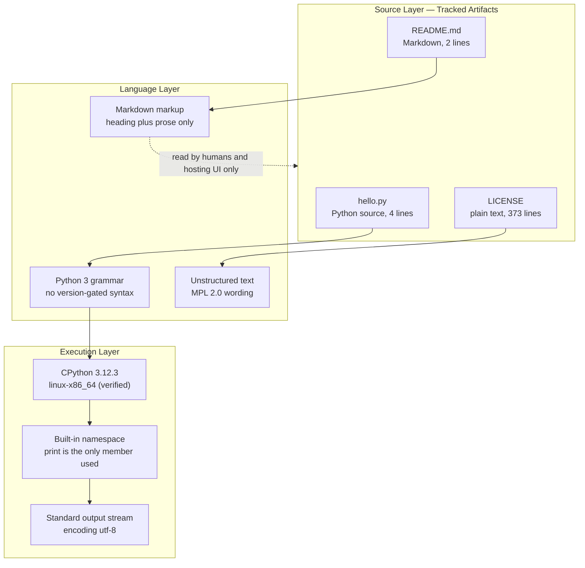
```mermaid
flowchart TD
    subgraph SourceLayer["Source Layer — Tracked Artifacts"]
        PySrc["hello.py<br/>Python source, 4 lines"]
        MdSrc["README.md<br/>Markdown, 2 lines"]
        TxtSrc["LICENSE<br/>plain text, 373 lines"]
    end

    subgraph LanguageLayer["Language Layer"]
        PyLang["Python 3 grammar<br/>no version-gated syntax"]
        MdLang["Markdown markup<br/>heading plus prose only"]
        PlainText["Unstructured text<br/>MPL 2.0 wording"]
    end

    subgraph ExecutionLayer["Execution Layer"]
        CPythonRT["CPython 3.12.3<br/>linux-x86_64 (verified)"]
        Builtins["Built-in namespace<br/>print is the only member used"]
        StdoutStream["Standard output stream<br/>encoding utf-8"]
    end

    PySrc --> PyLang
    PyLang --> CPythonRT
    CPythonRT --> Builtins
    Builtins --> StdoutStream
    MdSrc --> MdLang
    TxtSrc --> PlainText
    MdLang -.->|"read by humans and hosting UI only"| SourceLayer
```

### 3.1.2 Python Runtime and Version Posture

#### 3.1.2.1 Verified Interpreter

No interpreter version is declared by the repository, so the only authoritative version facts are those measured while executing the code:

| Runtime Property | Verified Value |
|---|---|
| Implementation and version | CPython 3.12.3 (build stamp `main, Aug 31 2026, 10:18:26`, GCC 13.3.0) |
| Target platform | `linux-x86_64` |
| Bytecode cache tag | `cpython-312` (produces `__pycache__/hello.cpython-312.pyc`, 324 bytes) |
| Bytecode magic number | `0xcb0d0d0a` |
| C API version | `1013` |
| Standard-output encoding | `utf-8`, line buffering disabled |
| Command aliases resolving to it | `python3`, `python`, and `python3.12` all report 3.12.3 |

#### 3.1.2.2 Absence of a Declared Version Contract

Every mechanism that could pin a Python version was checked individually and none exists: no `pyproject.toml` (`project.requires-python`), no `setup.py`/`setup.cfg`, no `.python-version` (pyenv), no `runtime.txt` (platform-as-a-service), no `Pipfile` or `environment.yml`, no `tox.ini` environment list, and no shebang line in `hello.py` — its first three bytes are `d`, `e`, `f`. This matches the "No declared interpreter version" constraint already recorded in **2.4.1 Cross-Cutting Constraints**.

#### 3.1.2.3 Effective Compatibility Range

Although no floor is declared, the source uses no version-gated syntax, which makes the effective range unusually wide. An abstract-syntax-tree probe accepts the file at grammar feature levels 3.4, 3.6, 3.8, and 3.12 without error, and the inventory of syntax nodes is only `Module`, `FunctionDef`, `Expr`, `Call`, `Name`, `Constant`, `Load`, and `arguments` — no f-string, no annotation, no walrus operator, no `async`/`await`, no `match` statement, no decorator, and no class. The single statement is additionally valid Python 2 syntax, because a `print` call with one parenthesized argument parses identically as a print statement:

```python
def greet():
    print("Hello from Python!")
```

Externally, the Python release calendar places this runtime in a maintained but conservative position: per PEP 693, the 3.12 line is in its security-fixes-only phase with source-only security releases expected until approximately October 2028, and 3.14 is the current feature-release series. Because the code exercises no version-specific behavior, it runs unchanged on any maintained 3.x line (3.10 through 3.14 at the time of writing), so an interpreter upgrade is a zero-code-change operation for this repository.

### 3.1.3 Selection Criteria and Justification

The repository states no rationale for its language choice — `README.md` contains only a name and the description "A simple hello world python". The justification below is therefore an assessment of fitness against what the code demonstrably requires, not a reconstruction of an undocumented decision.

| Criterion | How Python 3 Satisfies It Here |
|---|---|
| Minimum ceremony for observable output | Two lines of source produce a verified stdout write; no compilation, build descriptor, or project scaffold is needed |
| Zero installation cost | The program runs with `python3 -I -S -E hello.py` (isolated mode, site-packages disabled, environment ignored) and still exits `0`, so no package installation, virtual environment, or dependency resolution precedes execution |
| Ubiquitous runtime availability | A Python 3 interpreter is the single external prerequisite, and it is pre-present on the mainstream Linux, macOS, and CI images this kind of starter repository targets |
| Dual invocation modes from one file | The same module serves as a script (`python3 hello.py`) and as an importable unit exposing `hello.greet()`, satisfying requirements F-003-RQ-001 and F-003-RQ-005 without extra tooling |
| Alignment with the organizational default | Python is the designated default primary backend language for this organization, so no exception or justification for a deviating language is required |

**Reconciliation with the organizational default stack.** The default stack nominates Python as the primary backend language, and the repository is consistent with that nomination. Its remaining elements — Flask, MongoDB, Auth0, LangChain, React with TypeScript, TailwindCSS, React Native, Swift, Kotlin, Objective-C, Electron — have **no counterpart anywhere in the tracked content**, and each was verified absent rather than assumed. They are recorded here as *not adopted* so that this section cannot be misread as describing a stack the repository does not have; the corresponding absences are detailed in **3.2**, **3.4**, and **3.5**.

### 3.1.4 Language-Level Constraints and Dependencies

| Constraint | Verified Basis | Consequence for the Stack |
|---|---|---|
| Exactly one external prerequisite | Zero import statements; only the built-in `print` is referenced | The dependency chain terminates at the interpreter; there is nothing else to provision |
| Interpreter must be invoked explicitly | No shebang and file mode `0644`; `./hello.py` fails with exit status 126, while `python3 hello.py` and `python3 -m hello` both exit `0` | Callers, schedulers, or images must name the interpreter; the file is not self-executing |
| No typing or interface metadata | `greet` has no annotations and no docstring; module exposes the single public attribute `greet` | Static type checking would add no signal; there is no typed contract to enforce |
| Source is ASCII with no encoding declaration | All 58 bytes are below 0x80; no PEP 263 cookie, so the default UTF-8 source encoding applies | Encoding is portable across interpreters; the ASCII-only literal never exercises the UTF-8 stdout path |
| CRLF line endings, unnormalized | `od -c` shows `\r\n` on all four lines of `hello.py`, while `README.md` and `LICENSE` use LF; no `.gitattributes` exists | Line-ending handling is left to each client, and any shebang added later would carry a trailing carriage return |
| No language-level error handling | The AST contains no `Try` or `Raise` node | Failures propagate as interpreter diagnostics — a write failure to a full device was observed to yield exit status 120 |


## 3.2 Frameworks &amp; Libraries

### 3.2.1 Framework Inventory

**No application framework is present at any layer.** This is not an inference from a file-name survey alone: `hello.py` contains **zero import statements**, which makes the finding exhaustive rather than sampled, because a Python module cannot use a framework it never imports. The finding was then confirmed dynamically — importing the module adds exactly one entry to the interpreter's module table:

```python
# measured: sorted(set(sys.modules) - baseline) after "import hello"

['hello']
```

Not a single additional module — third-party *or* standard library — is loaded beyond interpreter bootstrap.

| Framework Category | Status | Verification |
|---|---|---|
| Web / API framework (Flask, Django, FastAPI) | Not present | Zero imports; no manifest declaring one; name grep over tracked content returns no hit |
| AI / LLM orchestration (LangChain, OpenAI SDK) | Not present | Zero imports; no manifest; no API key, endpoint, or prompt text anywhere |
| ORM / data-access layer (SQLAlchemy, ODM drivers) | Not present | Zero imports; no model, schema, or connection string |
| CLI framework (Click, Typer) or `argparse` usage | Not present | Zero imports; command-line arguments are accepted and silently ignored |
| Test framework (pytest, unittest) | Not present | No test file, no `pytest.ini`/`tox.ini`; `unittest` is never imported |
| Asynchronous / concurrency framework | Not present | AST contains no `AsyncFunctionDef`, `Await`, or threading construct |
| Frontend framework (React, React Native) and CSS framework (TailwindCSS) | Not present | No `package.json`, `tsconfig.json`, JSX/TSX file, or stylesheet in the repository |

### 3.2.2 Library Surface Actually in Use

The system's entire library surface is one member of the interpreter's built-in namespace.

| Component | Version | Origin | Role |
|---|---|---|---|
| `print` (built-in function) | Ships with CPython 3.12.3 | Interpreter built-in namespace — no import required | Writes the fixed literal to the default output stream (`hello.py` line 2) |

Two consequences of that narrowness are worth recording. First, `print` is called with a single positional argument and no `file`, `sep`, `end`, or `flush` keyword, so the destination, separator, terminator, and flush policy are all interpreter defaults — the code cannot redirect its own output, and redirection is only possible from outside the process. Second, because the built-in namespace is part of the interpreter rather than an installable distribution, the library layer has no independent version to pin, upgrade, or audit: its version *is* the runtime version recorded in **3.1.2.1**.

### 3.2.3 Compatibility Requirements

| Requirement | Status | Basis |
|---|---|---|
| Framework-to-runtime compatibility matrix | Not applicable | No framework exists whose supported-Python range could constrain the interpreter |
| Inter-library version compatibility | Not applicable | A single built-in is in use; there is no second component to be compatible with |
| Runtime-to-source compatibility | Satisfied across a wide range | Source parses at grammar feature levels 3.4 through 3.12 and uses no version-gated construct (see **3.1.2.3**) |
| Operating-system compatibility | No OS-specific requirement | No path handling, subprocess call, or platform check exists; behavior verified on `linux-x86_64` |
| Terminal / encoding compatibility | Satisfied trivially | Output is 19 ASCII bytes; the stdout wrapper's UTF-8 encoding is never stressed |
| Backward compatibility of the public surface | Single symbol | The module's only public attribute is `greet`, with signature `()`; renaming it would break both the line 4 call site and any importer |

### 3.2.4 Justification for the Zero-Framework Posture

A framework earns its place by removing work that the application would otherwise perform — routing, serialization, persistence mapping, dependency injection, or lifecycle management. None of those obligations exists here: the system's complete functional contract is one deterministic write of a fixed literal to standard output, verified as requirement F-001-RQ-001. Adding a framework would introduce an installation step, a dependency manifest, a lock file, a version-compatibility surface, and a vulnerability-tracking obligation, in exchange for capability the code does not use.

The posture also buys three properties that are directly measurable in the repository, and that any future framework adoption would forfeit:

- **Nil provisioning cost.** The program runs correctly under `python3 -I -S -E hello.py` — isolated mode, with `site` disabled and environment variables ignored — proving that nothing outside the interpreter is required.
- **Nil third-party attack surface.** With no imported code, there is no transitive dependency tree to audit, no supply-chain compromise vector, and no CVE feed to track other than CPython's own.
- **Fast, predictable startup.** Measured cost is approximately 11 ms per process invocation (20 sequential runs in 0.219 s real) and approximately 0.27 µs per in-process `greet()` call (1,000 calls in 0.272 ms); virtually all of the former is interpreter startup that no framework could reduce.

The trade-off is equally concrete and is recorded rather than glossed: with no test framework there is no automated verification of the output literal, and with no packaging framework the module cannot be installed, pinned, or released as a versioned artifact. Both limitations are already catalogued in **2.4.1 Cross-Cutting Constraints**, and both would need to be addressed by adding tooling (**3.6**) rather than by adding an application framework.


## 3.3 Open Source Dependencies

### 3.3.1 Dependency Inventory

The repository has **no open-source dependencies**. The inventory is empty in every dimension that a software bill of materials would normally populate:

| Dependency Dimension | Count | Establishing Evidence |
|---|---|---|
| Declared runtime dependencies | 0 | No manifest of any kind exists to declare one |
| Declared development / test dependencies | 0 | No dev-requirements file, extras group, or test environment definition |
| Resolved transitive dependencies | 0 | No lock file exists, and none is needed |
| Imported third-party modules | 0 | `hello.py` contains zero `import`/`from` statements (AST-verified) |
| Modules loaded at import time beyond the module itself | 0 | Measured `sys.modules` delta after `import hello` is exactly `['hello']` |
| Vendored or bundled third-party source | 0 | The repository has no subdirectories at all, so no `vendor/` or `third_party/` tree can exist |
| Git submodules | 0 | `git submodule status` returns no output |

The absence was also probed from the opposite direction. A case-insensitive search of all tracked content for the names of common libraries and services — Flask, Django, FastAPI, `requests`, boto3, AWS, Azure, GCP, MongoDB, PostgreSQL, MySQL, SQLite, Redis, SQLAlchemy, LangChain, OpenAI, Auth0, OAuth, JWT, Prometheus, Datadog, and Sentry — returned only two matches, both inside the license text and both false positives: line 308 of `LICENSE`, where the word "laws" contains the substring "aws", and line 360, which cites the canonical license URL. Neither `hello.py` nor `README.md` produced a single match.

### 3.3.2 Package Registries and Manifests

No package registry participates in this system's build or runtime. Because no manifest declares a dependency, no index URL, private mirror, or authentication token for a registry appears anywhere in the tracked content.

| Ecosystem / Registry | Manifest or Lock Files Probed | Result |
|---|---|---|
| PyPI — PEP 517/518 packaging | `pyproject.toml`, `setup.py`, `setup.cfg`, `MANIFEST.in` | All absent |
| PyPI — requirements style | `requirements.txt`, `requirements-dev.txt`, `dev-requirements.txt`, `constraints.txt` | All absent |
| PyPI — lock-file managers | `Pipfile`, `Pipfile.lock`, `poetry.lock`, `pdm.lock`, `uv.lock` | All absent |
| Conda / Anaconda | `environment.yml`, `environment.yaml`, `conda.yaml` | All absent |
| Task and test environments | `tox.ini`, `noxfile.py` | All absent |
| Runtime pinning for hosted platforms | `.python-version`, `runtime.txt`, `Procfile` | All absent |
| npm / Node ecosystem | `package.json`, `package-lock.json`, `yarn.lock`, `tsconfig.json` | All absent |
| Other language registries | `go.mod`, `Cargo.toml`, `pom.xml`, `build.gradle`, `Gemfile`, `composer.json` | All absent |

`git ls-files` returns exactly `LICENSE`, `README.md`, and `hello.py`, which makes the table above a complete account rather than a spot check. A semantic search for files declaring third-party package dependencies, external service credentials, or database connection configuration likewise returned no results.

The only component the system consumes from outside its own source is the **CPython interpreter itself** (verified as 3.12.3), and it is supplied by the host environment rather than fetched, pinned, or vendored by the repository. There is therefore no inbound open-source artifact under this repository's control.

### 3.3.3 Licensing and Supply-Chain Posture

| Aspect | Observed State | Implication |
|---|---|---|
| Outbound license | Mozilla Public License 2.0, full text at `LICENSE` (Sections 1–10 plus Exhibits A and B) | Redistribution obligations fall on distributors; `LICENSE` Section 3 requires source availability and recipient notices for executable forms |
| Per-file license notice | Absent — `hello.py` carries no Exhibit A header, and no SPDX identifier or `NOTICE` file exists | The root `LICENSE` carries the entire notice, which Exhibit A expressly permits as an alternative location |
| Inbound license compatibility | No inbound dependency exists, so no compatibility question arises | No copyleft, attribution, or notice obligation is inherited from a dependency |
| Software bill of materials | None generated; none needed while the dependency count is zero | An SBOM produced today would list only the interpreter, which is not part of the repository |
| Automated dependency scanning | Not configured — there is no `.github/` directory, so no Dependabot or equivalent policy file exists | If dependencies are ever introduced, scanning must be established at the same time, as no mechanism is in place to inherit |
| Third-party vulnerability exposure | Nil from dependencies; limited to the host interpreter's own CVE stream | Patch management is an interpreter-provisioning concern, not a dependency-update concern |

The practical security value of this posture is that the repository's entire trust boundary is the interpreter it is run with. The corresponding risk is the mirror image: because there is no manifest, lock file, or scanning configuration, the first dependency added would arrive with no pinning discipline and no vulnerability monitoring already in place.


## 3.4 Third-Party Services

### 3.4.1 Service Integration Summary

The system integrates with **no third-party service**. As with the dependency inventory, this is an exhaustive result rather than a survey: with zero import statements in `hello.py`, the module has no code path capable of opening a socket, issuing an HTTP request, loading a credential, reading an environment variable, or spawning a subprocess. The finding is consistent with the integration assessment already recorded in **1.2.1.3 Integration with the Existing Enterprise Landscape**.

| Service Category | Status | Verification Performed |
|---|---|---|
| External APIs / HTTP services | Absent | No client or server code; no URL, host name, or endpoint in `hello.py` or `README.md` |
| Authentication / identity providers | Absent | No credential, token, key, session, or authorization logic; no Auth0/OAuth/JWT reference |
| Monitoring / observability platforms | Absent | No logging call, metric emission, trace span, or error-reporting hook |
| Cloud platform SDKs | Absent | No AWS/Azure/GCP SDK import, region setting, or resource identifier |
| Message brokers / event streams | Absent | No broker client or event schema |
| Configuration / secret stores | Absent | No `.env`, `.env.example`, `config.ini`, `config.yaml`, `config.yml`, `settings.py`, `secrets.json`, or `credentials` file |
| Email / notification services | Absent | No transport client or template |
| Payment / billing services | Absent | No merchant SDK or transaction code |

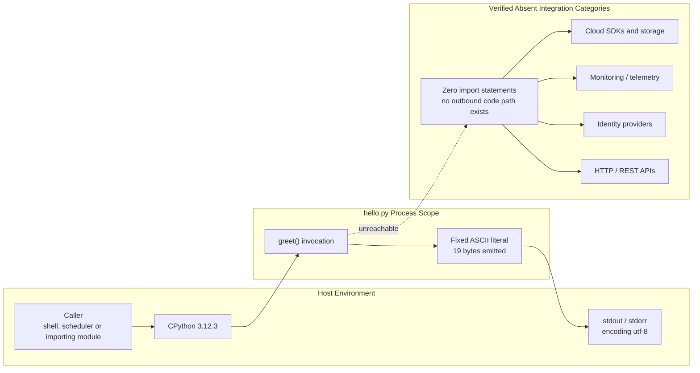
```mermaid
flowchart LR
    subgraph HostEnvironment["Host Environment"]
        Caller["Caller<br/>shell, scheduler or importing module"]
        Interpreter["CPython 3.12.3"]
        StdStreams["stdout / stderr<br/>encoding utf-8"]
    end

    subgraph ProcessScope["hello.py Process Scope"]
        GreetCall["greet() invocation"]
        Literal["Fixed ASCII literal<br/>19 bytes emitted"]
    end

    subgraph AbsentIntegrations["Verified Absent Integration Categories"]
        NoPath["Zero import statements<br/>no outbound code path exists"]
        NoHTTP["HTTP / REST APIs"]
        NoAuth["Identity providers"]
        NoObservability["Monitoring / telemetry"]
        NoCloud["Cloud SDKs and storage"]
        NoPath --> NoHTTP
        NoPath --> NoAuth
        NoPath --> NoObservability
        NoPath --> NoCloud
    end

    Caller --> Interpreter
    Interpreter --> GreetCall
    GreetCall --> Literal
    Literal --> StdStreams
    GreetCall -.->|"unreachable"| NoPath
```

### 3.4.2 The Single External Boundary

Exactly one external boundary exists, and it is local to the host rather than remote:

| Boundary | Direction | Mechanism | Verified Behavior |
|---|---|---|---|
| Interpreter standard output | Outbound, one-way | Built-in `print` with interpreter defaults | Writes `Hello from Python!` plus newline — 19 bytes, confirmed byte-for-byte; process exits `0`; stderr is empty (0 bytes) |

No inbound channel exists. Command-line arguments are accepted and silently discarded (`python3 hello.py --foo bar` still prints the greeting and exits `0`), and piped standard input is ignored entirely, because the module never reads `sys.argv` or `sys.stdin` — it cannot, having imported nothing.

### 3.4.3 Code Hosting and Collaboration Services

One external service is evidenced by repository metadata rather than by code: the Git origin remote points to a **GitHub**-hosted repository at `https://github.com/rjhonsi/BlitzyRepo3_Python.git` (fetch and push), with the local `main` branch configured to track `origin/main`. This is a source-hosting and collaboration surface, not a runtime integration — nothing in `hello.py` contacts it, and the program runs identically with no network access at all.

No GitHub platform feature is configured in-repository: there is no `.github/` directory, and therefore no Actions workflow, issue template, pull-request template, `CODEOWNERS`, `SECURITY.md`, or Dependabot policy. No other hosted service — package registry, artifact repository, container registry, or secret manager — is referenced anywhere in the tracked content.

### 3.4.4 Security and Integration Implications

- **No credential surface.** No secret, key, token, or connection string exists in any tracked file, and no file could be mistaken for a credential store. `README.md` is safe to publish verbatim; `LICENSE` contains only license text.
- **No third-party trust delegation.** Because no identity provider, API, or SDK is involved, there is no external party whose availability, correctness, or compromise could affect the system's single function.
- **No network exposure in either direction.** The program neither listens nor dials. Its only observable effect is a local stream write, so network-layer controls (TLS configuration, certificate pinning, egress filtering) have nothing to govern here.
- **No observability, by the same token.** The absence of monitoring integrations is also the absence of diagnosability: as recorded in **1.2.3.3**, no KPI is instrumented, and the only signals a caller receives are the printed line and the process exit status.
- **Integration requirements for any future service.** Every prerequisite is missing today and would have to be introduced together: a dependency manifest to declare a client library (**3.3.2**), a configuration or secret-loading mechanism, error handling — the AST currently contains no `Try` or `Raise` node — and a monitoring path for failures. None of these can be inherited from existing repository infrastructure, because none exists.


## 3.5 Databases &amp; Storage

### 3.5.1 Database Inventory

**No database of any kind is used.** There is no primary store, no secondary or read-replica store, no embedded database, and no analytical store.

| Storage Tier | Status | Verification |
|---|---|---|
| Primary relational database | Absent | No driver import, DSN, schema, migration, or query text |
| Document / NoSQL database (e.g. MongoDB) | Absent | No client import and no connection URI; no ODM model definitions |
| Embedded database (e.g. SQLite) | Absent | `sqlite3` is never imported; no `.db`, `.sqlite`, or `.sqlite3` file exists |
| Key-value / cache store (e.g. Redis) | Absent | No client import, host setting, or cache-key construction |
| Object storage / blob service | Absent | No cloud storage SDK, bucket name, or upload path |
| Search / vector index | Absent | No index client, embedding call, or query pipeline |
| Message / queue durable store | Absent | No broker client or queue declaration |

The evidence is exhaustive for the same structural reason given in **3.3.1** and **3.4.1**: `hello.py` declares zero imports, so no persistence client can be reachable, and the repository has no configuration file, environment file, or subdirectory in which a connection string could hide.

### 3.5.2 Data Persistence Strategy

The persistence strategy is the deliberate absence of persistence. The system is **stateless and input-free**: `greet()` takes no parameters, allocates no variables, holds no module-level state, and returns `None`. Its single side effect is a transient write to an output stream, which the process does not own and cannot retain.

| Data Concern | Observed Handling |
|---|---|
| Application state | None exists — no variables, no module-level mutable objects, no accumulated context |
| Durable records | None written — no file, database, or remote store receives data |
| Data model / schema | None defined — no class, dataclass, `TypedDict`, or serialization format |
| Serialization formats | None used — `json`, `pickle`, `csv`, and `sqlite3` are all unimported |
| Data retention / lifecycle | Not applicable — nothing outlives the process |
| Personal or regulated data | None present — the only datum is the hard-coded ASCII literal at `hello.py` line 2 |
| Backup and recovery | Not applicable — there is no state to back up; the repository itself is the only durable asset (8.24 KiB packed, 7 git objects) |
| Idempotency / repeatability | Guaranteed by statelessness — 1,000 consecutive `greet()` calls produce identical output with no divergence |

The design consequence is that scaling, recovery, and migration concerns collapse to nothing: any number of processes can run concurrently without coordination, because no two of them contend for shared state.

### 3.5.3 Caching

No application-level caching exists — there is no memoization decorator, in-process cache structure, or cache client. One caching mechanism is nonetheless observable, and it belongs to the interpreter rather than to the application:

| Cache | Location | Size / Identity | Behavior |
|---|---|---|---|
| CPython bytecode cache | `__pycache__/hello.cpython-312.pyc` (repository root) | 324 bytes; cache tag `cpython-312`, magic `0xcb0d0d0a` | Written automatically when the module is imported; regenerated after deletion on the next import |

Two operational facts follow. First, importing the module requires the source directory to be **writable**, or the interpreter silently skips cache creation. Second, the artifact is **untracked and unignored** — no `.gitignore` exists — so `git status` reports `?? __pycache__/` after any import, exactly as recorded in **2.4.1 Cross-Cutting Constraints**. The cache is a build by-product of the runtime, not a storage technology chosen by this system, and it holds no application data.

### 3.5.4 Filesystem and Storage Interaction

| Interaction | Status | Detail |
|---|---|---|
| File reads by application code | None | `open`, `pathlib`, `os`, and `io` are never referenced |
| File writes by application code | None | The only write is to the standard output stream, via `print` |
| Output redirection to a file | Supported externally | `python3 hello.py > file` succeeds with exit status `0` and empty stderr; the redirection is performed by the caller's shell, not by the program |
| Temporary storage | None | No temp file, directory, or scratch space is created by the code |
| Volume / mount requirements | None for execution; write access needed only for the bytecode cache on import | Direct script execution does not require a writable working directory |
| Unhandled storage failure | Observed | With stdout directed to a full device, the process exits with status 120 and the interpreter emits an ignored `OSError` (`[Errno 28] No space left on device`), because the code contains no `Try`/`Raise` handling |

### 3.5.5 Assessment

For the system as it stands, the zero-storage posture is the correct one: the functional contract (F-001-RQ-001 through F-001-RQ-004) is fully satisfied by a single deterministic stream write, and introducing any datastore would add provisioning, credential management, schema ownership, and backup obligations with no data to justify them. The corresponding gap is that no persistence foundation exists to build on — a future feature requiring durability would need a driver dependency (**3.3**), a configuration and secret-loading path (**3.4.4**), and error handling around I/O, none of which is present today.


## 3.6 Development &amp; Deployment

### 3.6.1 Development Tooling

The tooling actually evidenced by the repository is limited to version control and the interpreter. No editor configuration, formatter, linter, type checker, test runner, or hook is configured in-repository.

| Tool | Version | Evidence | Role |
|---|---|---|---|
| Git | 2.43.0 (as used in this environment) | `.git/` directory; 2 commits; `core.repositoryformatversion=0`, `core.filemode=true`, `core.bare=false` | Sole version-control system; `main` tracks `origin/main` |
| GitHub (hosted origin) | n/a | `origin` → `https://github.com/rjhonsi/BlitzyRepo3_Python.git` (fetch and push) | Remote hosting and collaboration surface |
| CPython | 3.12.3 (verified locally) | Execution of `hello.py`; `__pycache__` cache tag `cpython-312` | The only runtime required to develop or run the code |
| `pip` / `venv` | pip 25.3; `venv` present in the 3.12 standard library | Available in the environment, **never used by the repository** | No packages to install and no environment to create — the program runs under `python3 -I -S -E` |

| Quality-Gate Tool | Configured? | Probe Result |
|---|---|---|
| Pre-commit hooks | No | No `.pre-commit-config.yaml`; `.git/hooks/` contains only `*.sample` files (0 active hooks) |
| Linters (flake8, pylint, ruff) | No | No `.flake8`, `.pylintrc`, or `ruff.toml` |
| Type checker (mypy) | No | No `mypy.ini` or `.mypy.ini`; the source carries no annotations to check |
| Test runner (pytest, tox, nox) | No | No `pytest.ini`, `tox.ini`, `noxfile.py`, or any test file |
| Coverage | No | No `.coveragerc` |
| Editor / workspace settings | No | No `.editorconfig`, `.vscode/`, or `.idea/` |
| Ignore and attribute files | No | No `.gitignore` and no `.gitattributes` |

A recursive search for hidden files anywhere outside `.git/` returns nothing at all, so the table above is a complete account of the repository's configuration surface — which is empty.

### 3.6.2 Build System

**There is no build system, and the code requires no build step.** Python source is interpreted directly, so the path from source to execution has no compile, bundle, transpile, or asset-pipeline stage.

| Build Concern | Observed State |
|---|---|
| Build tool | None — no `Makefile`, `makefile`, `build.sh`, `CMakeLists.txt`, or task runner |
| Packaging backend | None — no `pyproject.toml` `[build-system]` table, `setup.py`, or `setup.cfg`, so setuptools, hatch, poetry-core, and flit are all uninvolved |
| Distributable artifact | None produced — no wheel, sdist, zipapp, console-script entry point, or executable |
| Version identifier | None — no manifest version field and `git tag` returns nothing (0 tags, 0 releases) |
| Implicit compilation | The interpreter compiles the module to `__pycache__/hello.cpython-312.pyc` (324 bytes) on import; this is a runtime by-product, not a build output under repository control |
| Dependency installation step | Not required — verified by successful execution in isolated mode with site-packages disabled |

### 3.6.3 Containerization and Infrastructure

No containerization or infrastructure-as-code exists in the repository. Every artifact below was probed by name and found absent:

| Category | Files Probed | Result |
|---|---|---|
| Container images | `Dockerfile`, `Containerfile`, `.dockerignore` | Absent |
| Container orchestration (local) | `docker-compose.yml`, `docker-compose.yaml` | Absent |
| Development containers | `devcontainer.json`, `.devcontainer/` | Absent |
| Kubernetes / Helm | `k8s/`, `kubernetes/`, `helm/`, `chart.yaml` | Absent |
| Infrastructure as code | `main.tf`, `variables.tf`, `terraform.tfvars`, `.terraform/` | Absent |
| Serverless / cloud templates | `serverless.yml`, `template.yaml`, `cloudformation.yaml` | Absent |

A semantic search for folders containing build scripts, container definitions, infrastructure-as-code, or pipeline configuration returned no results — consistent with the repository having no subdirectories whatsoever. The organizational default stack nominates Docker for containerization, Terraform for infrastructure, and AWS as the cloud platform; **none of the three is adopted here**, and no partial or in-progress adoption exists to document.

### 3.6.4 CI/CD

**No continuous integration or delivery pipeline is defined.** The probe covered every mainstream provider's configuration location:

| Provider | Expected Location | Result |
|---|---|---|
| GitHub Actions | `.github/workflows/` | Absent (no `.github/` directory at all) |
| GitLab CI | `.gitlab-ci.yml` | Absent |
| CircleCI | `.circleci/` | Absent |
| Travis CI | `.travis.yml` | Absent |
| Jenkins | `Jenkinsfile` | Absent |
| Azure Pipelines | `azure-pipelines.yml` | Absent |
| Bitbucket Pipelines | `bitbucket-pipelines.yml` | Absent |

Repository history corroborates the absence of any automated gate: two commits (`0fa4c0c` "Initial commit" adding `LICENSE` and `README.md`, and `56fb250` "Add files via upload" adding `hello.py`), both authored by `rjhonsi` on 2026-09-16, with no merge commits, no tags, and no release artifacts. The local `main` and `jr_python1` branches are byte-identical (`git diff --stat main jr_python1` is empty), and both are mirrored by `origin/main` and `origin/jr_python1`. Correctness is therefore confirmed only by manual execution, as stated in **2.4.1 Cross-Cutting Constraints**.

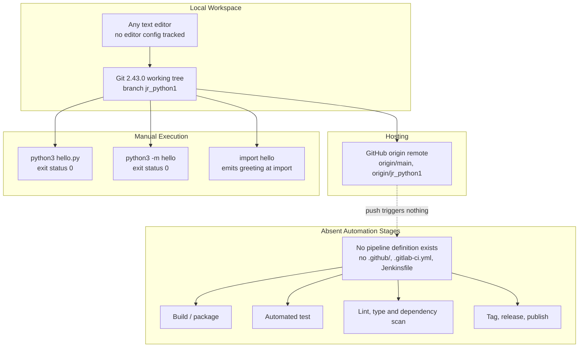
```mermaid
flowchart TD
    subgraph LocalWorkspace["Local Workspace"]
        Editor["Any text editor<br/>no editor config tracked"]
        GitTree["Git 2.43.0 working tree<br/>branch jr_python1"]
    end

    subgraph HostingTier["Hosting"]
        OriginRemote["GitHub origin remote<br/>origin/main, origin/jr_python1"]
    end

    subgraph AbsentAutomation["Absent Automation Stages"]
        NoStage["No pipeline definition exists<br/>no .github/, .gitlab-ci.yml, Jenkinsfile"]
        NoBuild["Build / package"]
        NoTest["Automated test"]
        NoScan["Lint, type and dependency scan"]
        NoRelease["Tag, release, publish"]
        NoStage --> NoBuild
        NoStage --> NoTest
        NoStage --> NoScan
        NoStage --> NoRelease
    end

    subgraph ExecutionTier["Manual Execution"]
        RunScript["python3 hello.py<br/>exit status 0"]
        RunModule["python3 -m hello<br/>exit status 0"]
        ImportUse["import hello<br/>emits greeting at import"]
    end

    Editor --> GitTree
    GitTree --> OriginRemote
    GitTree --> RunScript
    GitTree --> RunModule
    GitTree --> ImportUse
    OriginRemote -.->|"push triggers nothing"| NoStage
```

### 3.6.5 Execution and Deployment Model

There is no deployment target, packaging artifact, or runtime host defined anywhere in the repository. "Deployment" reduces to placing `hello.py` where an interpreter can reach it and invoking that interpreter explicitly. The three viable invocations and the one that fails were each measured:

| Invocation | Result | Notes |
|---|---|---|
| `python3 hello.py` | Exit status `0`, prints the greeting | The canonical path; 19 bytes to stdout, empty stderr |
| `python3 -m hello` | Exit status `0`, prints the greeting | Requires the module to be importable from the working directory |
| `import hello` | Prints the greeting at import time | No `__main__` guard exists, so the side effect is unavoidable; `hello.greet()` re-emits it |
| `./hello.py` | Exit status `126` | No shebang (first bytes are `def`) and mode `0644` on all three tracked files |

Measured invocation cost is approximately 11 ms per process (20 sequential runs in 0.219 s real), dominated by interpreter startup, against approximately 0.27 µs for an in-process call — a ratio worth noting for any caller that would otherwise launch one process per greeting.

### 3.6.6 CI/CD Requirements Implied by the Current State

Because no pipeline exists, the following are the concrete requirements any future automation would have to satisfy for *this* repository, each derived from an observed property rather than from general practice:

| Requirement | Why It Follows From the Observed State |
|---|---|
| No dependency-installation stage is needed | Verified zero dependencies; a pipeline can execute the program immediately after checkout |
| Verification must be an output assertion | The functional contract is a 19-byte stdout write (F-001-RQ-001); with no test suite present, a pipeline's first gate would be a byte comparison of the printed line and an exit-status check |
| A multi-version interpreter matrix is feasible today | The source uses no version-gated syntax and parses from grammar level 3.4 upward, so a matrix across maintained 3.x lines requires no code change |
| An interpreter version must be pinned in the pipeline | Nothing in the repository declares one, so the pipeline configuration would become the de facto version contract |
| Line-ending normalization should precede any linting gate | `hello.py` is CRLF while the other tracked files are LF, and no `.gitattributes` governs normalization |
| A `.gitignore` entry for `__pycache__/` is a prerequisite for a clean-tree check | Any import during a pipeline run creates the untracked, unignored cache directory |
| Release automation would need a version source | There is no manifest version and no git tag, so a tagging or versioning scheme must be introduced before any publish step could exist |
| Security scanning has nothing to scan yet | With no dependency manifest, dependency scanning is a no-op; it becomes mandatory the moment a manifest is added (**3.3.3**) |


## 3.7 References

### 3.7.1 Repository Files Examined

- `hello.py` - The repository's only executable source file (4 lines, 58 bytes, CRLF, mode `0644`, ASCII with no encoding cookie). Established the sole programming language, the zero-import dependency profile, the single built-in `print` call, the absence of annotations/error handling/`__main__` guard, and the absence of any shebang.
- `README.md` - Two-line project identity document (49 bytes, LF). Established that Markdown is the only markup format in use and that no build, run, dependency, or configuration instructions are documented in-repository.
- `LICENSE` - Mozilla Public License 2.0 full text (373 lines, 16,726 bytes, Sections 1–10 plus Exhibits A and B). Established the outbound licensing posture, the root-notice-in-lieu-of-per-file-header arrangement, and the only external URL referenced by the repository; also the source of the two false-positive matches in the library-name grep (lines 308 and 360).

### 3.7.2 Repository Locations and Metadata Inspected

- Repository root (path `""`) - Confirmed exactly three file children and zero subdirectories, bounding the entire technology surface.
- `__pycache__/hello.cpython-312.pyc` - Untracked, unignored 324-byte bytecode artifact generated on import. Established the interpreter's cache tag (`cpython-312`) and the only caching mechanism observable in the system.
- `.git/` metadata (configuration, remote, refs, log, tags, hooks) - Established Git as the sole version-control tool, the GitHub-hosted `origin` remote, `main` tracking `origin/main`, the two-commit single-author history (`0fa4c0c`, `56fb250`), zero tags/releases, identical `main` and `jr_python1` trees, the 8.24 KiB / 7-object pack size, and that `.git/hooks/` holds only `*.sample` files (no active hooks).

### 3.7.3 Verified-Absent Artifacts

Each of the following was probed by exact name or location and found absent; these negative results underpin the "not present" findings throughout **3.2** through **3.6**:

- Python packaging and dependency manifests - `pyproject.toml`, `setup.py`, `setup.cfg`, `MANIFEST.in`, `requirements.txt`, `requirements-dev.txt`, `dev-requirements.txt`, `constraints.txt`, `Pipfile`, `Pipfile.lock`, `poetry.lock`, `pdm.lock`, `uv.lock`, `environment.yml`, `environment.yaml`, `conda.yaml`.
- Runtime and environment pins - `.python-version`, `runtime.txt`, `Procfile`, `tox.ini`, `noxfile.py`.
- Other-ecosystem manifests - `package.json`, `package-lock.json`, `yarn.lock`, `tsconfig.json`, `go.mod`, `Cargo.toml`, `pom.xml`, `build.gradle`, `Gemfile`, `composer.json`.
- Configuration and secrets - `.env`, `.env.example`, `.env.local`, `config.ini`, `config.yaml`, `config.yml`, `settings.py`, `secrets.json`, `credentials`.
- Build, container and infrastructure definitions - `Makefile`, `makefile`, `build.sh`, `CMakeLists.txt`, `Dockerfile`, `Containerfile`, `docker-compose.yml`, `docker-compose.yaml`, `.dockerignore`, `devcontainer.json`, `.devcontainer/`, `main.tf`, `variables.tf`, `terraform.tfvars`, `.terraform/`, `k8s/`, `kubernetes/`, `helm/`, `chart.yaml`, `serverless.yml`, `template.yaml`, `cloudformation.yaml`.
- CI/CD definitions - `.github/` (and therefore `.github/workflows/`), `.gitlab-ci.yml`, `.circleci/`, `.travis.yml`, `Jenkinsfile`, `azure-pipelines.yml`, `bitbucket-pipelines.yml`.
- Quality gates and workspace settings - `.pre-commit-config.yaml`, `.flake8`, `.pylintrc`, `ruff.toml`, `mypy.ini`, `.mypy.ini`, `pytest.ini`, `.coveragerc`, `.editorconfig`, `.gitignore`, `.gitattributes`, `.vscode/`, `.idea/`, `tests/`, `test/`, `docs/`, `CONTRIBUTING.md`, `CHANGELOG.md`, `CODEOWNERS`, `SECURITY.md`.
- Repository-wide checks - no `.blitzyignore` file exists anywhere; a recursive search for hidden files outside `.git/` returned none; `git submodule status` returned no output; semantic searches for dependency/credential/database-configuration files and for build/container/IaC/pipeline folders each returned zero results.

### 3.7.4 Technical Specification Sections Cross-Referenced

- **1.2.1.3 Integration with the Existing Enterprise Landscape** - Corroborated the per-category integration absences reflected in **3.4.1**.
- **1.2.2.2 Major System Components** and **1.2.2.3 Core Technical Approach** - Supplied the component sizes and the standard-library-only, zero-dependency, stateless technical principles that **3.1** and **3.2** describe in stack terms.
- **1.2.3.3 Key Performance Indicators** - Confirmed that no instrumentation exists, which bounds the observability discussion in **3.4.4**.
- **2.4.1 Cross-Cutting Constraints** - Source of the no-declared-interpreter-version, no-packaging, no-verification, mixed-line-ending, and unignored-`__pycache__` constraints referenced in **3.1.2.2**, **3.5.3**, and **3.6.4**.
- **2.2 Functional Requirements** - Origin of the requirement identifiers cited for traceability (F-001-RQ-001 through F-001-RQ-004, F-003-RQ-001, F-003-RQ-005).

### 3.7.5 External Sources

- [web] Python.org release notes for Python 3.12.12 - Confirmed that, per PEP 693, the 3.12 line is in its security-fixes-only stage with source-only releases until October 2028 and no further binary installers, and that 3.14 is the current feature-release series.
- [web] PEP 693 — Python 3.12 Release Schedule (peps.python.org) - Confirmed the approximate October 2028 end of security updates for the 3.12 branch.
- [web] Status of Python versions (devguide.python.org) - Confirmed the general release-phase policy: bugfix support, then security-only fixes, then end of support five years after a release.
- [web] IsItPatched Python end-of-life summary (September 2026) - Confirmed which release lines were still receiving security updates at the time of writing (3.10 through 3.14), supporting the statement in **3.1.2.3** that the code runs unchanged on any maintained 3.x line.


# 4. Process Flowchart

## 4.1 System Workflows

This section documents the process flows that exist in `BlitzyRepo3_Python`. The repository tracks three files — `hello.py` (4 lines), `README.md` (2 lines) and `LICENSE` (373 lines) — and the whole of its executable behavior is the binding and calling of one parameterless function that writes a fixed 19-byte line to standard output. There is therefore no multi-actor business process, no request/response cycle and no long-running transaction to chart. What does exist, and what is charted here, is a precisely observable **execution lifecycle**: interpreter startup, source compilation, module execution, the single buffered write, the flush at shutdown, and the exit status. Every step, decision and failure path below was measured directly against the checked-out code rather than inferred from convention.

Because the module contains zero `import` statements, the enumeration of workflows and integration points in this section is exhaustive rather than representative: no code path exists that could reach a socket, file, database, broker or subprocess.

### 4.1.1 Core Business Processes

#### 4.1.1.1 End-to-End Journeys

Five end-to-end journeys are supported. The first four are runtime journeys through `hello.py`; the fifth is the non-runtime journey by which a reader acquires and evaluates the repository. All four runtime journeys were executed and their exit statuses recorded.

| ID | Workflow | Trigger | Terminal State (verified) |
|---|---|---|---|
| W-1 | Direct script execution | `python3 hello.py` | One line on stdout, exit status 0, stderr 0 bytes |
| W-2 | Module-name execution | `python3 -m hello` | One line on stdout, exit status 0, bytecode cache written |
| W-3 | Import-time emission | `import hello` from any caller | Greeting emitted during import; `greet` bound in caller namespace |
| W-4 | Programmatic re-invocation | `hello.greet()` after W-3 | One additional line per call; call evaluates to `None` |
| W-5 | Acquisition and evaluation | `git clone` of the GitHub origin | Reader has `README.md` purpose statement and MPL 2.0 terms |

W-1 satisfies requirements F-003-RQ-001 through F-003-RQ-004; W-3 is the documented consequence of F-003-RQ-005, since the module-level call at `hello.py` line 4 is unguarded and the token `__name__` appears nowhere in the source. W-4 exercises F-002-RQ-002 and F-002-RQ-004. Two further invocation forms were verified to work and are treated as variants rather than distinct journeys: `python3 - < hello.py` (source supplied on standard input, exit 0) and `python3 -I -S -E hello.py` (isolated mode with site packages and environment disabled, exit 0 — direct evidence that no external dependency participates in the flow).

#### 4.1.1.2 High-Level System Workflow

The following diagram lays the shared runtime path of W-1 and W-2 across four swim lanes: the human actor, the shell and operating system, the CPython runtime, and the single external boundary. Timings shown are measured means over 30 process invocations on the verification host running CPython 3.12.3.

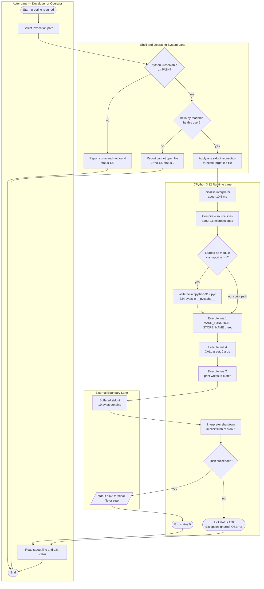
```mermaid
flowchart TD
    subgraph ActorLane["Actor Lane — Developer or Operator"]
        Begin(["Start: greeting required"])
        Choose["Select invocation path"]
        Observe["Read stdout line and exit status"]
        Finish(["End"])
    end

    subgraph ShellLane["Shell and Operating System Lane"]
        ResolveInterp{"python3 resolvable<br/>on PATH?"}
        ReadCheck{"hello.py readable<br/>by this user?"}
        NotFound["Report command not found<br/>status 127"]
        NoRead["Report cannot open file<br/>Errno 13, status 2"]
        Redirect["Apply any stdout redirection<br/>truncate target if a file"]
    end

    subgraph RuntimeLane["CPython 3.12 Runtime Lane"]
        Startup["Initialise interpreter<br/>about 10.5 ms"]
        Compile["Compile 4 source lines<br/>about 16 microseconds"]
        CacheGate{"Loaded as module<br/>via import or -m?"}
        CacheWrite["Write hello.cpython-312.pyc<br/>324 bytes in __pycache__"]
        BindFn["Execute line 1<br/>MAKE_FUNCTION, STORE_NAME greet"]
        CallFn["Execute line 4<br/>CALL greet, 0 args"]
        Emit["Execute line 2<br/>print writes to buffer"]
        Shutdown["Interpreter shutdown<br/>implicit flush of stdout"]
        FlushGate{"Flush succeeded?"}
        Ok(["Exit status 0"])
        Fail(["Exit status 120<br/>Exception ignored, OSError"])
    end

    subgraph BoundaryLane["External Boundary Lane"]
        Buffer["Buffered stdout<br/>19 bytes pending"]
        Sink[/"stdout sink: terminal,<br/>file or pipe"/]
    end

    Begin --> Choose --> ResolveInterp
    ResolveInterp -->|"no"| NotFound --> Finish
    ResolveInterp -->|"yes"| ReadCheck
    ReadCheck -->|"no"| NoRead --> Finish
    ReadCheck -->|"yes"| Redirect --> Startup
    Startup --> Compile --> CacheGate
    CacheGate -->|"yes"| CacheWrite --> BindFn
    CacheGate -->|"no, script path"| BindFn
    BindFn --> CallFn --> Emit --> Buffer --> Shutdown
    Shutdown --> FlushGate
    FlushGate -->|"yes"| Sink --> Ok --> Observe --> Finish
    FlushGate -->|"no"| Fail --> Observe
```

#### 4.1.1.3 System Interactions

Only two systems participate, and the interaction between them is one-directional after startup.

| Interaction | Participants | Contract (observed) |
|---|---|---|
| Inbound control | Shell process → CPython interpreter | Interpreter path plus either a script path, `-m hello`, or source on stdin; extra arguments are accepted and never read |
| Source acquisition | CPython interpreter → filesystem | Read-only open of `hello.py`; 58 bytes; failure yields status 2 |
| Cache write | CPython interpreter → filesystem | Write of `__pycache__/hello.cpython-312.pyc` on the import and `-m` paths only; skipped silently if the directory is not writable |
| Outbound emission | `hello` module → stdout stream | Exactly 19 ASCII bytes per invocation via built-in `print`; stderr remains empty on success |

#### 4.1.1.4 Decision Points

Every decision point in the flow is evaluated by the operating system or the interpreter. The application code contains no branch at all: an AST walk of `hello.py` yields 12 nodes total with `If = 0`, `While = 0`, `For = 0`, and the disassembled bytecode contains no jump instruction.

| Decision Point | Evaluated By | Outcomes (verified) |
|---|---|---|
| Is `python3` on PATH? | Shell | Proceed, or status 127 `command not found` |
| Is the script path openable and readable? | Operating system | Proceed, or status 2 with Errno 2 (missing) or Errno 13 (permission) |
| Is the file directly executable? | Shell, on the `./hello.py` path | Always rejected here: status 126, because mode is `0644` and no shebang exists |
| Loaded as `__main__` or as a module? | Interpreter | `__main__` is never cached; import and `-m` write a `.pyc` |
| Is an existing `.pyc` still valid? | `importlib` | Reuse if magic, source mtime and source size match; otherwise recompile and rewrite |
| Is the module already in `sys.modules`? | Interpreter | Return the cached module object with no second emission |
| Did the shutdown flush succeed? | Interpreter | Status 0, or status 120 with an ignored `OSError` or `BrokenPipeError` |

#### 4.1.1.5 Error Handling Paths

No error handling exists inside the application. The AST census of `hello.py` records `Try = 0`, `ExceptHandler = 0`, `Raise = 0`, `Assert = 0`, `With = 0`, and a targeted search of `hello.py` and `README.md` for `retry`, `backoff`, `timeout`, `logging`, `atexit`, `signal`, `fallback` and `notify` returns zero matches. Consequently every error path leaves the application flow immediately and is handled — or merely reported — by the shell, the operating system or the interpreter. The measured taxonomy, with exit statuses and recovery ownership, is in **4.6 Error Handling and Recovery**; the three paths that terminate the high-level workflow above are status 127 (no interpreter), status 2 (source unreadable) and status 120 (stdout flush failure).

### 4.1.2 Integration Workflows

#### 4.1.2.1 Data Flow Between Systems

The system has exactly one outbound data flow and one supporting artifact flow. Both were confirmed by directory-delta measurement: running `python3 hello.py` in a clean directory leaves that directory byte-for-byte unchanged, while `python3 -c "import hello"` adds exactly one entry, `__pycache__/`.

| Data Flow | Direction | Payload and Volume |
|---|---|---|
| Greeting emission | `hello` module → host stdout | `Hello from Python!` plus one newline; 19 bytes per invocation; ASCII, UTF-8 stream encoding, no BOM |
| Bytecode cache | Interpreter → source directory | `hello.cpython-312.pyc`, 324 bytes in this checkout; written on import and `-m` only |
| Source ingest | Filesystem → interpreter | `hello.py`, 58 bytes, read once per process |
| Repository transfer | GitHub origin ↔ local checkout | Whole repository, 7 objects, 8.24 KiB packed; W-5 only |

No inbound application data flow exists. Command-line arguments are ignored (`python3 hello.py --flag value` still exits 0 with identical output), piped standard input is ignored (`echo piped | python3 hello.py` behaves identically), and no environment variable, configuration file or secret store is read — a claim that is exhaustive because the module has no imports and therefore no access to `sys.argv`, `os.environ` or `open`.

#### 4.1.2.2 API Interactions

There is no network-facing or inter-process API: no HTTP server or client, no RPC stub, no message schema and no serialization format appear anywhere in tracked content. The only interface contract in the repository is a language-level one.

| Interface | Surface | Contract |
|---|---|---|
| Python module namespace | `import hello` | Public attributes are exactly `['greet']`; importing triggers emission |
| Function signature | `hello.greet()` | Zero parameters; returns `None`; arity enforced by the interpreter, raising `TypeError` if any argument is supplied |
| Process interface | `python3 hello.py` | No input contract; output contract is one line on stdout plus exit status 0 |

#### 4.1.2.3 Event Processing Flows

No application-level event processing exists — there is no event loop, callback registry, subscriber, broker or webhook, and a search of tracked content for `asyncio`, `queue`, `kafka`, `rabbit`, `sqs`, `sns`, `celery` and related terms returns nothing. The only events in the flow are interpreter lifecycle events, which the application observes passively rather than handling:

| Lifecycle Event | Raised By | Application Response |
|---|---|---|
| Module execution begins | Interpreter or `importlib` | Line 1 binds `greet`; line 4 calls it — traced as `call <module>` → `line 1` → `line 4` |
| Function call and return | Interpreter | Body executes line 2, returns `None`, which line 4 discards via `POP_TOP` |
| Interpreter shutdown | Interpreter | No handler registered; stdout is flushed implicitly and any failure becomes status 120 |

#### 4.1.2.4 Batch Processing Sequences

The repository implements no batch job, scheduler, cron entry or worker pool. Because the program is stateless and idempotent — no variable is ever assigned, `greet.__closure__` is `None`, and the only global it touches is `print` — repeated invocation is the natural batch pattern, but it must be driven entirely from outside the repository. The measured cost model for an externally driven sequence of N invocations is N × ~10.7 ms, which is dominated by interpreter startup: a bare `python3 -c pass` costs ~10.58 ms against ~10.73 ms for the full script, so the program itself contributes roughly 0.15 ms. Driving the same work in a single process instead costs ~0.206 µs per call, roughly five orders of magnitude cheaper, which is the only meaningful batching optimization the observed design permits.

#### 4.1.2.5 Integration Workflows Verified Absent

Recorded explicitly so that a reader does not assume conventional integrations that the code does not contain. Each row was confirmed by inspection of the module AST, a targeted grep over tracked content, and enumeration of the repository root.

| Candidate Integration Workflow | Status | Basis |
|---|---|---|
| Synchronous API request/response | Absent | No HTTP, socket or RPC code; zero imports |
| Asynchronous messaging or event bus | Absent | No broker client, no `asyncio`, no queue construct |
| Database or cache read/write | Absent | No driver, connection string, model or query anywhere |
| Scheduled or batch job | Absent | No scheduler config, cron entry, `Makefile` or CI workflow |
| File or object-storage exchange | Absent | Application performs no file I/O; only the interpreter writes the `.pyc` |
| Identity provider or token exchange | Absent | No credential, token, role or session concept exists |
| Outbound notification or alerting | Absent | No logging, email, webhook or alert call; stderr and exit status are the only channels |


## 4.2 Detailed Process Flows by Feature

Each flow below is charted at the granularity the implementation actually supports: because the program is four lines long, the meaningful process steps are the interpreter operations that carry it out, and these were read directly from the compiled bytecode and from a line-level execution trace. Every diagram carries explicit start and end points, decision diamonds, the system boundary crossings, the human touchpoints, and the error states with their measured exit statuses.

### 4.2.1 W-1 — Direct Script Execution (F-003 → F-002 → F-001)

This is the primary flow and the one `README.md` implicitly describes. Its step sequence was captured with `sys.settrace`, which recorded the order `call <module>` → `line 1` → `line 4` → `call greet` → `line 2` → `return greet` → `return <module>`, confirming that the greeting is emitted inside the module's own execution rather than afterwards.

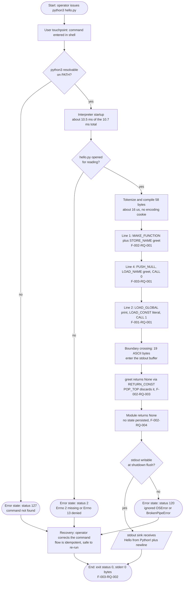
```mermaid
flowchart TD
    Begin(["Start: operator issues python3 hello.py"])
    Begin --> Touch["User touchpoint: command entered in shell"]
    Touch --> DInterp{"python3 resolvable<br/>on PATH?"}
    DInterp -->|"no"| Err127(["Error state: status 127<br/>command not found"])
    DInterp -->|"yes"| Boot["Interpreter startup<br/>about 10.5 ms of the 10.7 ms total"]
    Boot --> DOpen{"hello.py opened<br/>for reading?"}
    DOpen -->|"no"| Err2(["Error state: status 2<br/>Errno 2 missing or Errno 13 denied"])
    DOpen -->|"yes"| Comp["Tokenize and compile 58 bytes<br/>about 16 us, no encoding cookie"]
    Comp --> Bind["Line 1: MAKE_FUNCTION plus STORE_NAME greet<br/>F-002-RQ-001"]
    Bind --> Call["Line 4: PUSH_NULL, LOAD_NAME greet, CALL 0<br/>F-003-RQ-001"]
    Call --> Print["Line 2: LOAD_GLOBAL print, LOAD_CONST literal, CALL 1<br/>F-001-RQ-001"]
    Print --> Buf["Boundary crossing: 19 ASCII bytes<br/>enter the stdout buffer"]
    Buf --> Ret["greet returns None via RETURN_CONST<br/>POP_TOP discards it, F-002-RQ-003"]
    Ret --> ModEnd["Module returns None<br/>no state persisted, F-002-RQ-004"]
    ModEnd --> DFlush{"stdout writable<br/>at shutdown flush?"}
    DFlush -->|"yes"| Sink[/"stdout sink receives<br/>Hello from Python! plus newline"/]
    DFlush -->|"no"| Err120(["Error state: status 120<br/>ignored OSError or BrokenPipeError"])
    Sink --> Done(["End: exit status 0, stderr 0 bytes<br/>F-003-RQ-002"])
    Err127 --> Recover["Recovery: operator corrects the command<br/>flow is idempotent, safe to re-run"]
    Err2 --> Recover
    Err120 --> Recover
    Recover --> Done
```

| Step | Evidence | Traced Requirement |
|---|---|---|
| Interpreter startup and script-path resolution | `sys.path[0]` is the script's own directory, so the flow is independent of the working directory | F-003-RQ-004 |
| Compile source to bytecode | `compile()` of the 4-line source measured at 16.1 µs; no `.pyc` is written on this path | F-003-RQ-003 |
| Bind `greet` | Module bytecode `LOAD_CONST <code greet>` → `MAKE_FUNCTION 0` → `STORE_NAME greet` | F-002-RQ-001 |
| Call `greet` | Module bytecode `PUSH_NULL` → `LOAD_NAME greet` → `CALL 0` → `POP_TOP` | F-003-RQ-001 |
| Emit the literal | Function bytecode `LOAD_GLOBAL print` → `LOAD_CONST 'Hello from Python!'` → `CALL 1` | F-001-RQ-001, F-001-RQ-002 |
| Flush and exit | 19 bytes appear at the sink only after the shutdown flush; exit status 0, stderr 0 bytes | F-003-RQ-002 |

**Timing.** Measured over 30 invocations: 10.73 ms per run end-to-end, against 10.58 ms for a bare `python3 -c pass`. The program's own contribution is therefore ≈0.15 ms, and no step in this flow has a declared timeout, deadline or SLA anywhere in the repository.

### 4.2.2 W-2 — Module-Name Execution and the Bytecode Cache Path

`python3 -m hello` reaches the same three application steps but routes through module resolution and the bytecode cache, which introduces two additional decision points and one additional persistence point. Measured cost is 15.09 ms per run — roughly 4.4 ms more than the script path — because module lookup machinery is initialized.

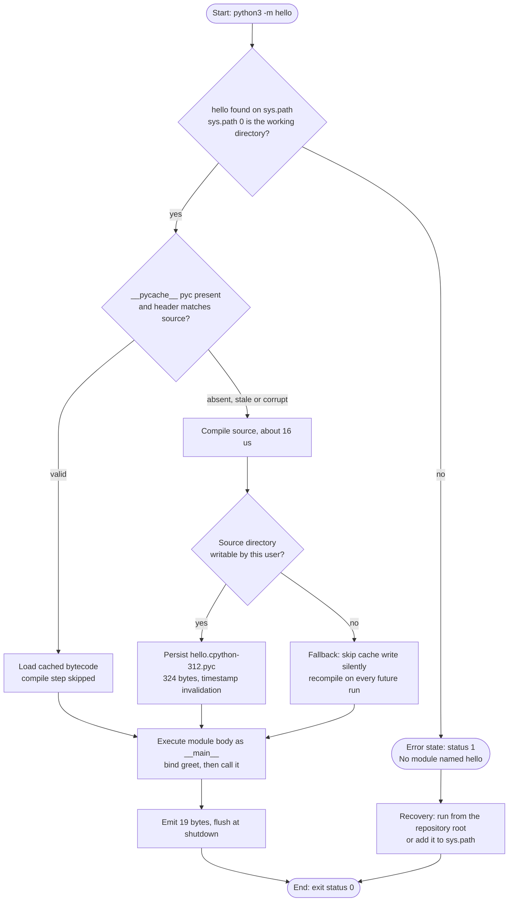
```mermaid
flowchart TD
    MStart(["Start: python3 -m hello"])
    MStart --> MPath{"hello found on sys.path<br/>sys.path 0 is the working directory?"}
    MPath -->|"no"| MErr(["Error state: status 1<br/>No module named hello"])
    MPath -->|"yes"| MCache{"__pycache__ pyc present<br/>and header matches source?"}
    MCache -->|"valid"| MLoad["Load cached bytecode<br/>compile step skipped"]
    MCache -->|"absent, stale or corrupt"| MComp["Compile source, about 16 us"]
    MComp --> MWritable{"Source directory<br/>writable by this user?"}
    MWritable -->|"yes"| MWrite["Persist hello.cpython-312.pyc<br/>324 bytes, timestamp invalidation"]
    MWritable -->|"no"| MSkip["Fallback: skip cache write silently<br/>recompile on every future run"]
    MLoad --> MExec["Execute module body as __main__<br/>bind greet, then call it"]
    MWrite --> MExec
    MSkip --> MExec
    MExec --> MEmit["Emit 19 bytes, flush at shutdown"]
    MEmit --> MEnd(["End: exit status 0"])
    MErr --> MFix["Recovery: run from the repository root<br/>or add it to sys.path"]
    MFix --> MEnd
```

| Aspect | W-1 Script Path | W-2 Module Path |
|---|---|---|
| Working-directory sensitivity | None — `sys.path[0]` is the script directory | Sensitive — `sys.path[0]` is `''`, the working directory |
| Bytecode cache | Never written; `__main__` is not cached | Written to `__pycache__/hello.cpython-312.pyc` |
| Measured cost per invocation | 10.73 ms | 15.09 ms |
| Failure when the module cannot be located | Status 2, cannot open file | Status 1, `No module named hello` |

### 4.2.3 W-3 and W-4 — Import-Time Emission and Programmatic Re-Invocation

The unguarded call at `hello.py` line 4 makes emission a side effect of import (F-003-RQ-005). A consumer therefore receives one line simply for importing the module, and each explicit `greet()` call adds one more. The second import in the same process produces no further output because the interpreter returns the memoized module object from `sys.modules` — verified by asserting the second binding is the same object as `sys.modules['hello']`.

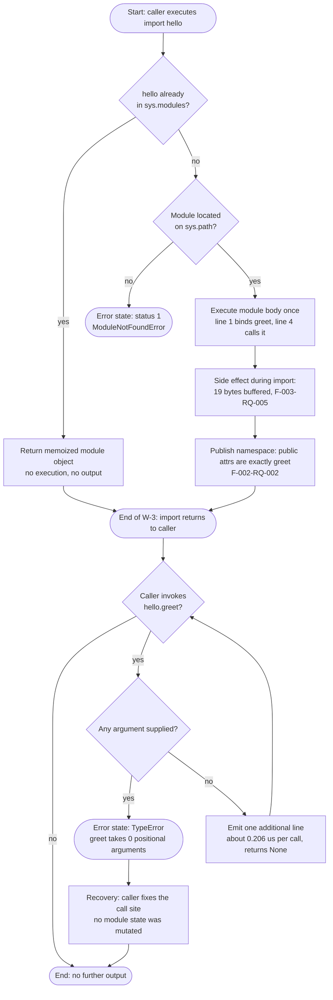
```mermaid
flowchart TD
    IStart(["Start: caller executes import hello"])
    IStart --> ISys{"hello already<br/>in sys.modules?"}
    ISys -->|"yes"| ICached["Return memoized module object<br/>no execution, no output"]
    ISys -->|"no"| IFind{"Module located<br/>on sys.path?"}
    IFind -->|"no"| IErr(["Error state: status 1<br/>ModuleNotFoundError"])
    IFind -->|"yes"| IExec["Execute module body once<br/>line 1 binds greet, line 4 calls it"]
    IExec --> IEmit["Side effect during import:<br/>19 bytes buffered, F-003-RQ-005"]
    IEmit --> IBind["Publish namespace: public attrs are exactly greet<br/>F-002-RQ-002"]
    IBind --> IReady(["End of W-3: import returns to caller"])
    ICached --> IReady
    IReady --> ICall{"Caller invokes<br/>hello.greet?"}
    ICall -->|"no"| IDone(["End: no further output"])
    ICall -->|"yes"| IArity{"Any argument supplied?"}
    IArity -->|"yes"| ITypeErr(["Error state: TypeError<br/>greet takes 0 positional arguments"])
    IArity -->|"no"| IAgain["Emit one additional line<br/>about 0.206 us per call, returns None"]
    IAgain --> ICall
    ITypeErr --> IHandle["Recovery: caller fixes the call site<br/>no module state was mutated"]
    IHandle --> IDone
```

| Property of W-3 and W-4 | Observed Behavior |
|---|---|
| Import-time output | Unavoidable while line 4 remains unguarded; the token `__name__` appears nowhere in the source |
| Module surface published | `['greet']` and nothing else |
| Repeat-import behavior | `sys.modules` memoization; the module body runs exactly once per process |
| Per-call cost when batched in-process | 0.206 µs per call measured over 20,000 calls |
| Arity enforcement | Interpreter raises `TypeError` for any argument; the function performs no validation itself |
| State left behind | None in memory — no assignment exists in the module; on disk only the `.pyc` |

### 4.2.4 W-5 — Acquisition, Documentation and Licensing Flow (F-004, F-005)

This flow has no runtime component: neither `README.md` nor `LICENSE` is ever read by the program, because `hello.py` performs no file I/O. It is charted because it is the process by which the repository's only compliance obligations are discharged, and because it is the path every new reader takes. The repository is hosted on a GitHub origin and its history consists of two commits — `0fa4c0c Initial commit`, which added `LICENSE` and `README.md`, and `56fb250 Add files via upload`, which added `hello.py` — with `main` and `jr_python1` holding identical trees and no tags, so there is no release-selection decision to make.

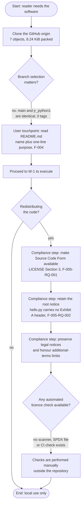
```mermaid
flowchart TD
    AStart(["Start: reader needs the software"]) --> AClone["Clone the GitHub origin<br/>7 objects, 8.24 KiB packed"]
    AClone --> ABranch{"Branch selection<br/>matters?"}
    ABranch -->|"no: main and jr_python1<br/>are identical, 0 tags"| ARead["User touchpoint: read README.md<br/>name plus one-line purpose, F-004"]
    ARead --> ARun["Proceed to W-1 to execute"]
    ARun --> ADist{"Redistributing<br/>the code?"}
    ADist -->|"no"| AEnd(["End: local use only"])
    ADist -->|"yes"| ASrc["Compliance step: make Source Code Form available<br/>LICENSE Section 3, F-005-RQ-001"]
    ASrc --> ANotice["Compliance step: retain the root notice<br/>hello.py carries no Exhibit A header, F-005-RQ-002"]
    ANotice --> ALegal["Compliance step: preserve legal notices<br/>and honour additional-terms limits"]
    ALegal --> AManual{"Any automated<br/>licence check available?"}
    AManual -->|"no scanner, SPDX file<br/>or CI check exists"| AHuman["Checks are performed manually<br/>outside the repository"]
    AHuman --> AEnd
```

| Step | Owner | Evidence |
|---|---|---|
| Acquire repository | Reader | GitHub origin; two commits, both dated 2026-09-16, single author |
| Understand purpose | Reader | `README.md` line 1 `# BlitzyRepo3_Python`, line 2 `A simple hello world python` |
| Execute | Operator | W-1 or W-2; no install, virtual environment or configuration step exists |
| Discharge licence obligations on redistribution | Distributor | `LICENSE` Sections 3 and 10, Exhibit A at line 355, Exhibit B at line 369, canonical URL at line 360 |
| Verify compliance | Distributor, manually | No licence-scanning configuration, SPDX identifier file or CI check exists in the repository |


## 4.3 Integration Sequence Flows

The sequence diagrams below express the same three journeys as message exchanges between the participating systems, which makes the boundary crossings and their ordering explicit. Each participant shown is a real system observed in the flow — there are no inferred middleware, gateway or broker participants, because none exists.

### 4.3.1 Sequence — Direct Script Invocation (W-1)

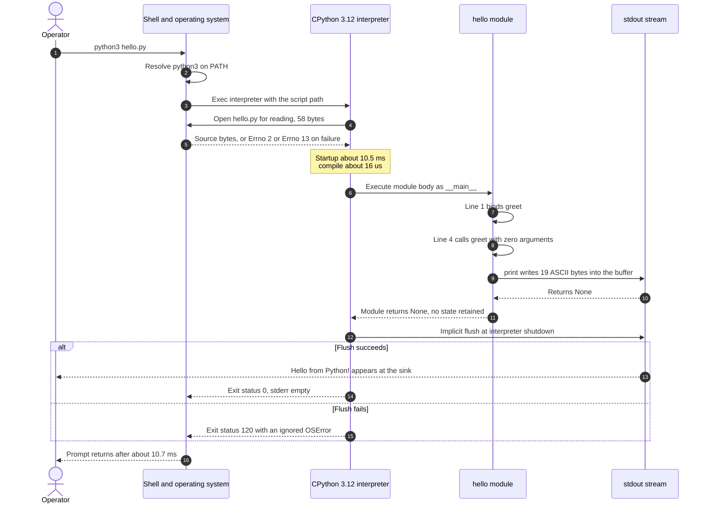
```mermaid
sequenceDiagram
    autonumber
    actor Operator
    participant Shell as Shell and operating system
    participant CPython as CPython 3.12 interpreter
    participant Hello as hello module
    participant Stdout as stdout stream

    Operator->>Shell: python3 hello.py
    Shell->>Shell: Resolve python3 on PATH
    Shell->>CPython: Exec interpreter with the script path
    CPython->>Shell: Open hello.py for reading, 58 bytes
    Shell-->>CPython: Source bytes, or Errno 2 or Errno 13 on failure
    Note over CPython: Startup about 10.5 ms<br/>compile about 16 us
    CPython->>Hello: Execute module body as __main__
    Hello->>Hello: Line 1 binds greet
    Hello->>Hello: Line 4 calls greet with zero arguments
    Hello->>Stdout: print writes 19 ASCII bytes into the buffer
    Stdout-->>Hello: Returns None
    Hello-->>CPython: Module returns None, no state retained
    CPython->>Stdout: Implicit flush at interpreter shutdown
    alt Flush succeeds
        Stdout-->>Operator: Hello from Python! appears at the sink
        CPython-->>Shell: Exit status 0, stderr empty
    else Flush fails
        CPython-->>Shell: Exit status 120 with an ignored OSError
    end
    Shell-->>Operator: Prompt returns after about 10.7 ms
```

Two properties of this exchange are worth stating because they are easy to assume wrongly. First, the write at step 10 is not durable: it enters a `BufferedWriter` and only reaches the sink at step 14 — with stdout redirected, zero bytes exist at the target immediately after `print` returns and all 19 appear after the flush. Second, the interpreter never consults the module about the failure at step 16; the exception is reported as ignored during shutdown and the process status becomes 120, with no opportunity for the application to react.

### 4.3.2 Sequence — Import-Time Emission and Re-Invocation (W-3, W-4)

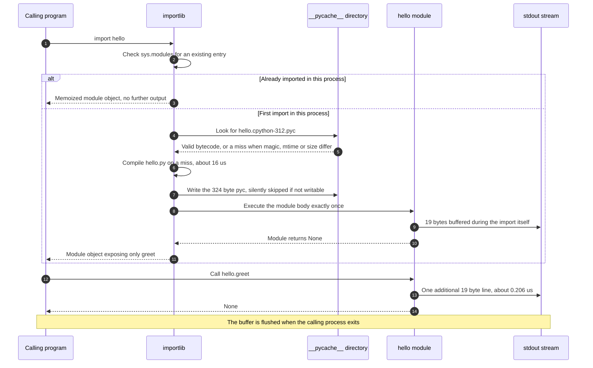
```mermaid
sequenceDiagram
    autonumber
    participant Caller as Calling program
    participant Import as importlib
    participant Cache as __pycache__ directory
    participant Hello as hello module
    participant Stdout as stdout stream

    Caller->>Import: import hello
    Import->>Import: Check sys.modules for an existing entry
    alt Already imported in this process
        Import-->>Caller: Memoized module object, no further output
    else First import in this process
        Import->>Cache: Look for hello.cpython-312.pyc
        Cache-->>Import: Valid bytecode, or a miss when magic, mtime or size differ
        Import->>Import: Compile hello.py on a miss, about 16 us
        Import->>Cache: Write the 324 byte pyc, silently skipped if not writable
        Import->>Hello: Execute the module body exactly once
        Hello->>Stdout: 19 bytes buffered during the import itself
        Hello-->>Import: Module returns None
        Import-->>Caller: Module object exposing only greet
    end
    Caller->>Hello: Call hello.greet
    Hello->>Stdout: One additional 19 byte line, about 0.206 us
    Hello-->>Caller: None
    Note over Caller,Stdout: The buffer is flushed when the calling process exits
```

The import journey is the only flow that mutates the filesystem. In a clean directory, `python3 hello.py` leaves no trace at all, whereas `python3 -c "import hello"` creates `__pycache__/`. Because the repository has no `.gitignore`, that artifact is reported by `git status` as the untracked path `?? __pycache__/`.

### 4.3.3 Sequence — Repository Acquisition and Redistribution (W-5)

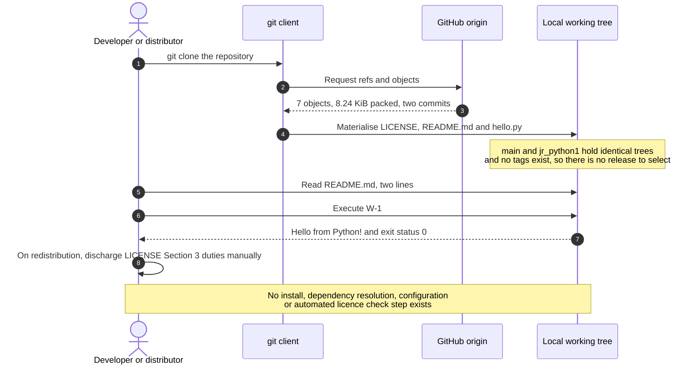
```mermaid
sequenceDiagram
    autonumber
    actor Dev as Developer or distributor
    participant Git as git client
    participant Origin as GitHub origin
    participant Tree as Local working tree

    Dev->>Git: git clone the repository
    Git->>Origin: Request refs and objects
    Origin-->>Git: 7 objects, 8.24 KiB packed, two commits
    Git->>Tree: Materialise LICENSE, README.md and hello.py
    Note over Tree: main and jr_python1 hold identical trees<br/>and no tags exist, so there is no release to select
    Dev->>Tree: Read README.md, two lines
    Dev->>Tree: Execute W-1
    Tree-->>Dev: Hello from Python! and exit status 0
    Dev->>Dev: On redistribution, discharge LICENSE Section 3 duties manually
    Note over Dev,Tree: No install, dependency resolution, configuration<br/>or automated licence check step exists
```

### 4.3.4 Interaction Patterns Verified Not to Occur

| Pattern a Reader Might Expect | Observed Reality |
|---|---|
| Concurrent or parallel participants | None; execution is a single synchronous process with no thread, task or IPC construct |
| Request/response with a remote service | None; no socket, HTTP client or RPC stub exists, and the module has zero imports |
| Asynchronous callback or event acknowledgement | None; no event loop, callback registry or subscriber exists |
| Message redelivery, acknowledgement or dead-lettering | None; the only delivery mechanism is a buffered write to a local stream |
| Health check, heartbeat or readiness probe | None; the process lives for roughly 11 ms and exposes no endpoint |


## 4.4 Validation Rules and Authorization Checkpoints

The distinction that governs this whole sub-section is between rules the **application** enforces and rules the **environment** enforces. `hello.py` enforces nothing: an AST walk finds no `If`, no `Try`, no `Raise` and no `Assert` node, and the compiled bytecode contains no conditional jump. Every gate that exists in the flow therefore belongs to the shell, the operating system or the interpreter. Documenting them as such is material, because it means a deployment cannot rely on the program to reject bad conditions — it can only observe the exit status afterwards.

### 4.4.1 Business Rules at Each Step

| Workflow Step | Rule That Must Hold | Consequence If Violated |
|---|---|---|
| Invocation (W-1, W-2) | An explicit interpreter must be named; the file cannot self-select one | `./hello.py` is rejected with status 126; `sh hello.py` fails with a shell syntax error and status 2 |
| Module resolution (W-2, W-3) | The repository root must be on `sys.path`, which for `-m` and `-c` means the working directory | Status 1 with `No module named hello` or `ModuleNotFoundError` |
| Function binding (line 1) | The public name must remain `greet`; it is the entire interface contract | Any rename silently breaks every consumer; no alias or alternative entry point exists |
| Module-level call (line 4) | The unguarded call must remain for execution to produce output | Removing it leaves the script silent; retaining it makes import-time emission unavoidable |
| Emission (line 2) | The literal must remain exactly `Hello from Python!`; there is no template, locale or formatting path | Any change alters the system's only functional output contract |
| Termination | Success is exit status 0 with an empty stderr | Any non-zero status is the only signal a caller receives; no log or metric is produced |
| Redistribution (W-5) | The MPL 2.0 text must accompany the code unmodified, and the root notice must be retained | `LICENSE` Section 10 reserves versioning to the licence steward, so local edits invalidate the declaration |

### 4.4.2 Data Validation Requirements

**No data validation is implemented.** This is a finding rather than an omission: there is no input to validate, because the module cannot read `sys.argv`, `os.environ`, stdin or any file — it has zero imports. The table records what each candidate validation point actually does.

| Candidate Validation Point | Implemented? | Observed Behavior |
|---|---|---|
| Command-line arguments | No | `python3 hello.py --flag value` exits 0 with identical output; extra arguments are neither read nor reported |
| Standard input | No | `echo piped \| python3 hello.py` exits 0 with identical output; stdin is never read |
| Environment and configuration | No | No environment read, no configuration file, no `.env`; verified by isolated-mode run `python3 -I -S -E hello.py`, which still exits 0 |
| Function arity | By the interpreter only | `hello.greet('x')` raises `TypeError: greet() takes 0 positional arguments but 1 was given`; the function itself checks nothing |
| Output encoding | Implicitly | Source and payload are pure ASCII with no BOM; the stream reports `utf-8` encoding, so no encoding error path is reachable |
| Write-result checking | No | `print` returns `None` and the return value is discarded by `POP_TOP`; a failed write is discovered only at shutdown |
| Source integrity | No | No checksum, signature or SPDX header check exists; the only integrity mechanism is git object hashing |

### 4.4.3 Authorization Checkpoints

There is no application-level authentication or authorization: no credential, token, role, session or user concept appears anywhere in tracked content. The five gates that do exist are POSIX discretionary access controls plus the shell's execution check, and each was exercised directly. Because the verification shell ran as `uid 0`, the permission gates were re-tested as the unprivileged user `nobody`, since root bypasses them.

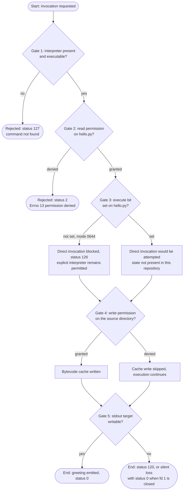
```mermaid
flowchart TD
    AZStart(["Start: invocation requested"]) --> G1{"Gate 1: interpreter present<br/>and executable?"}
    G1 -->|"no"| R127(["Rejected: status 127<br/>command not found"])
    G1 -->|"yes"| G2{"Gate 2: read permission<br/>on hello.py?"}
    G2 -->|"denied"| R2(["Rejected: status 2<br/>Errno 13 permission denied"])
    G2 -->|"granted"| G3{"Gate 3: execute bit<br/>set on hello.py?"}
    G3 -->|"not set, mode 0644"| Blocked["Direct invocation blocked, status 126<br/>explicit interpreter remains permitted"]
    G3 -->|"set"| Unused["Direct invocation would be attempted<br/>state not present in this repository"]
    Blocked --> G4{"Gate 4: write permission<br/>on the source directory?"}
    Unused --> G4
    G4 -->|"granted"| CacheOk["Bytecode cache written"]
    G4 -->|"denied"| CacheSkip["Cache write skipped, execution continues"]
    CacheOk --> G5{"Gate 5: stdout target<br/>writable?"}
    CacheSkip --> G5
    G5 -->|"yes"| Pass(["End: greeting emitted, status 0"])
    G5 -->|"no"| Fail(["End: status 120, or silent loss<br/>with status 0 when fd 1 is closed"])
```

| Checkpoint | Enforced By | Measured Result |
|---|---|---|
| Interpreter availability | Shell PATH lookup | `python4 hello.py` returns status 127 `command not found` |
| Source readability | Filesystem DAC | As `nobody` against mode `0600`: status 2, `can't open file … Errno 13 Permission denied`. As root the check is bypassed and the run succeeds |
| Direct executability | Shell plus execute bit | `./hello.py` returns status 126; mode is `0644` and the first bytes are `def`, so no shebang exists |
| Cache writability | Filesystem DAC | As `nobody` in a mode `0555` directory: greeting emitted, status 0, and `__pycache__` is never created |
| Output-sink writability | Filesystem and OS | `>/dev/full` yields status 120; a closed descriptor yields status 0 with no output at all |

### 4.4.4 Regulatory and Compliance Checks

No compliance check is automated anywhere in the repository — there is no CI workflow, licence scanner, SPDX identifier file, `SECURITY.md`, `CODEOWNERS` or pre-commit configuration, each of which was individually confirmed absent. Compliance is therefore a manual step in W-5, and the obligations are entirely licence-derived.

| Compliance Obligation | Where It Applies | Observed Basis |
|---|---|---|
| MPL 2.0 source-availability duty | Redistribution of source or executable form | `LICENSE` Section 3, applying to all tracked content as Covered Software (F-005-RQ-001) |
| Licence-notice placement | Every distributed copy | `hello.py` contains no copyright or Mozilla reference; the root `LICENSE` bears the notice as Exhibit A permits (F-005-RQ-002) |
| Canonical licence reference | Documentation and notices | `LICENSE` line 360 cites the published licence URL (F-005-RQ-003) |
| Secondary-licence compatibility statement | Combination with other licences | Exhibit B at `LICENSE` line 369 is available but no file in the repository declares it |
| Data-protection obligations | Runtime data handling | None arise: no personal data is read, stored or transmitted, because no input, persistence or network path exists |
| Telemetry consent or usage reporting | Runtime | Not applicable: no logging, metric, trace or usage report is emitted, so there is nothing to disclose or gate |
| Export or cryptographic controls | Runtime | Not applicable: no cryptographic primitive, key material or protocol implementation appears in tracked content |


## 4.5 State Management

The application holds no state. An AST census of `hello.py` records `Assign = 0`, `AugAssign = 0` and `AnnAssign = 0` — no variable is ever assigned anywhere in the repository — and introspection of the compiled function confirms it: `greet.__closure__` is `None`, `greet.__defaults__` is `None`, `co_varnames` is empty, and the only global name the body touches is `print`. What does have state is the **process** that runs it and the **bytecode cache** the interpreter maintains around it, and both are charted below.

### 4.5.1 Process State Transitions

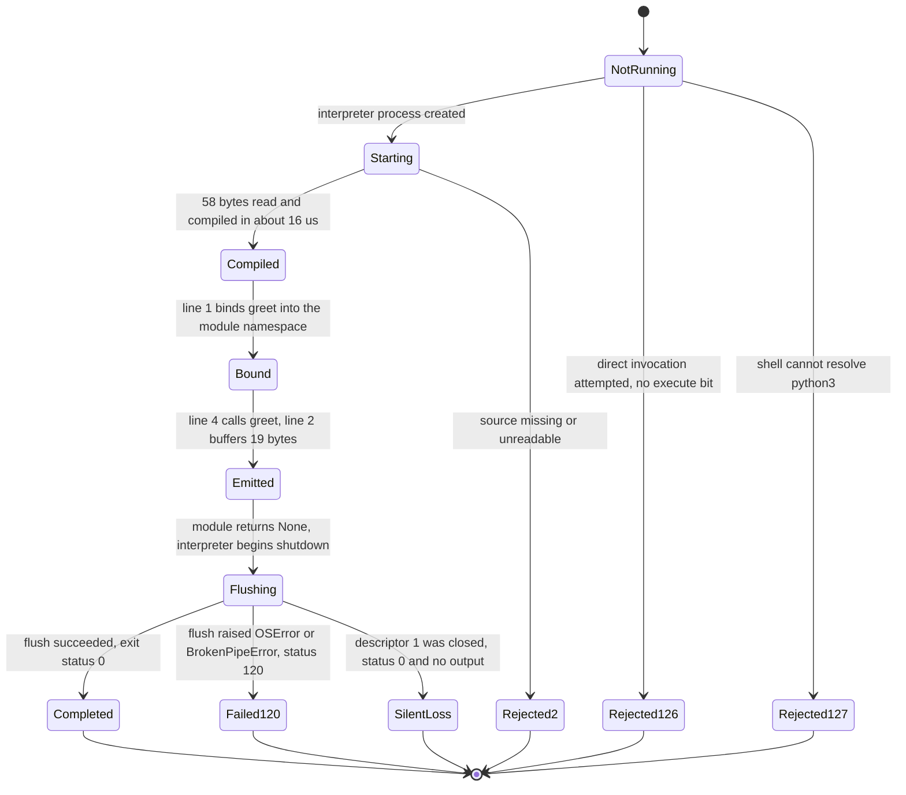
```mermaid
stateDiagram-v2
    [*] --> NotRunning
    NotRunning --> Rejected127: shell cannot resolve python3
    NotRunning --> Rejected126: direct invocation attempted, no execute bit
    NotRunning --> Starting: interpreter process created
    Starting --> Rejected2: source missing or unreadable
    Starting --> Compiled: 58 bytes read and compiled in about 16 us
    Compiled --> Bound: line 1 binds greet into the module namespace
    Bound --> Emitted: line 4 calls greet, line 2 buffers 19 bytes
    Emitted --> Flushing: module returns None, interpreter begins shutdown
    Flushing --> Completed: flush succeeded, exit status 0
    Flushing --> Failed120: flush raised OSError or BrokenPipeError, status 120
    Flushing --> SilentLoss: descriptor 1 was closed, status 0 and no output
    Completed --> [*]
    Failed120 --> [*]
    SilentLoss --> [*]
    Rejected2 --> [*]
    Rejected126 --> [*]
    Rejected127 --> [*]
```

| State | Entry Condition | Duration or Observable |
|---|---|---|
| `Starting` | Interpreter exec succeeded | ~10.5 ms of the ~10.7 ms total for W-1 |
| `Compiled` | Source tokenized and compiled | ~16.1 µs; on the import and `-m` paths this state may be skipped via a valid cache |
| `Bound` | `MAKE_FUNCTION` and `STORE_NAME greet` executed | Module public attributes become exactly `['greet']` |
| `Emitted` | `print` returned | 19 bytes buffered but not yet visible at the sink |
| `Flushing` | Interpreter shutdown reached | The only point at which the output becomes durable |
| `Completed` | Flush succeeded | Exit status 0, stderr 0 bytes |
| `Failed120` / `SilentLoss` / `Rejected*` | See 4.6 | Terminal; no retry or compensation is attempted |

Because no state survives the process, every state above is re-entered from scratch on the next invocation. This is what makes the workflow trivially idempotent and safe to re-run, and it is also why no recovery logic is needed inside the program.

### 4.5.2 Data Persistence Points

| Persistence Point | Written By | Lifecycle (verified) |
|---|---|---|
| stdout sink | The `print` call, made durable by the shutdown flush | Ephemeral on a terminal; 19 bytes on disk when redirected to a file |
| `__pycache__/hello.cpython-312.pyc` | The interpreter, on the import and `-m` paths only | 324 bytes in this checkout; survives until the source changes or the file is removed; untracked and unignored, so `git status` reports `?? __pycache__/` |
| Git object store | A developer committing, never the runtime | 7 objects, 8.24 KiB packed; two commits, no tags |
| Application data store | Nobody — none exists | A direct `python3 hello.py` in a clean directory leaves the directory byte-for-byte unchanged |

### 4.5.3 Caching

Two caches participate in the flow, neither of them written by the application. There is also no application-level cache to document: the greeting is a compile-time constant held in `co_consts` as `(None, 'Hello from Python!')`, so there is nothing to memoize.

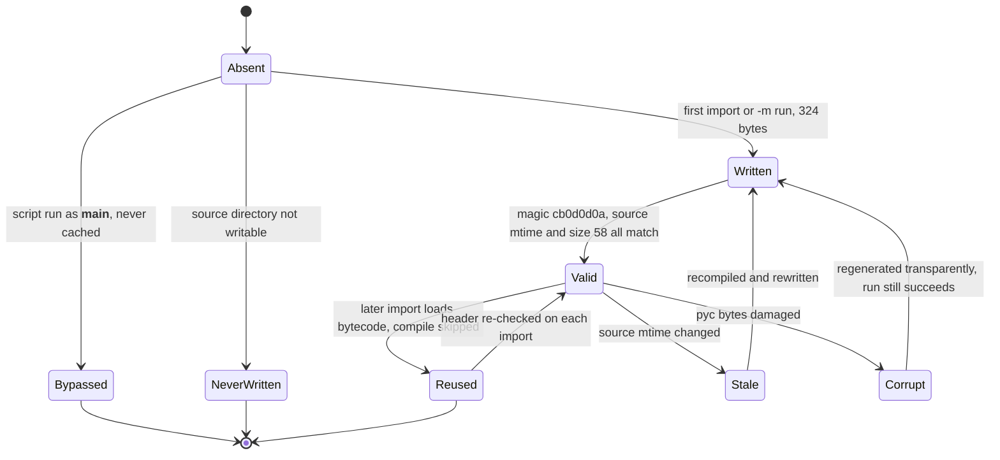
```mermaid
stateDiagram-v2
    [*] --> Absent
    Absent --> Bypassed: script run as __main__, never cached
    Absent --> NeverWritten: source directory not writable
    Absent --> Written: first import or -m run, 324 bytes
    Written --> Valid: magic cb0d0d0a, source mtime and size 58 all match
    Valid --> Reused: later import loads bytecode, compile skipped
    Reused --> Valid: header re-checked on each import
    Valid --> Stale: source mtime changed
    Stale --> Written: recompiled and rewritten
    Valid --> Corrupt: pyc bytes damaged
    Corrupt --> Written: regenerated transparently, run still succeeds
    Bypassed --> [*]
    NeverWritten --> [*]
    Reused --> [*]
```

| Cache | Key and Scope | Invalidation and Observed Effect |
|---|---|---|
| Bytecode file cache | `(magic number, source mtime, source size)` with `flags = 0`, i.e. timestamp invalidation; scoped to the source directory | Touching the source changes the embedded mtime and the `.pyc` is rewritten; overwriting the `.pyc` with garbage still yields a successful run because `importlib` regenerates it; an unwritable directory silently skips the write and the ~16 µs compile is paid on every run |
| `sys.modules` memoization | Module name `hello`, scoped to one process | A second `import hello` in the same process returns the identical module object and produces no second emission; the module body executes exactly once per process |
| Application cache | None | No memoization, no cached computation, no TTL — nothing in the repository holds a cacheable value |

### 4.5.4 Transaction Boundaries

The system has no transactional machinery: no commit, rollback, savepoint, idempotency key or compensating action appears in tracked content. The boundaries that do exist are stream-level and shell-level, and all four were measured.

| Boundary | Scope | Atomicity and Rollback Behavior |
|---|---|---|
| The single buffered write | One `print` call, 19 bytes | Enters a `BufferedWriter` with `line_buffering = False` when stdout is not a terminal; zero bytes are visible at the sink until the flush |
| Flush at interpreter shutdown | Whole process | The commit point. Success yields status 0; failure yields status 120 and the bytes are lost with no retry |
| Shell redirection with `>` | The target file, before the process starts | The shell truncates the target at open: a 20-byte file became 0 bytes after a failed run, so a failure destroys prior contents with no rollback. `>>` preserves prior content |
| Repeat invocation | Across processes | Non-cumulative under `>` — two successive runs leave 19 bytes, not 38 — and fully idempotent, since no state is carried between processes |


## 4.6 Error Handling and Recovery

`hello.py` contains no error handling of any kind. The AST contains zero `Try`, `TryStar`, `ExceptHandler`, `Raise`, `Assert` and `With` nodes, and a targeted search of tracked content for `retry`, `retries`, `backoff`, `timeout`, `sleep`, `logging`, `logger`, `except`, `finally`, `atexit`, `signal`, `circuit`, `fallback`, `alert`, `notify` and `webhook` returns zero matches. Every path below was therefore produced by deliberately inducing the failure and recording what the surrounding system did.

### 4.6.1 Error Taxonomy

| ID | Condition | Exit Status | Reported By |
|---|---|---|---|
| EP-01 | stdout target full or unwritable, e.g. `>/dev/full` | 120 | Interpreter — `Exception ignored in: <_io.TextIOWrapper …>` then `OSError: Errno 28 No space left on device` |
| EP-02 | Reader closed the pipe, e.g. `\| true` | 120 | Interpreter — same wrapper line then `BrokenPipeError: Errno 32 Broken pipe` |
| EP-03 | Descriptor 1 closed at launch, e.g. `>&-` | 0 | Nobody — `sys.stdout` is `None`, `print` returns normally, stderr is empty: silent data loss |
| EP-04 | Script path does not exist | 2 | Interpreter — `can't open file …: Errno 2 No such file or directory` |
| EP-05 | Source not readable by the invoking user | 2 | Interpreter — `can't open file …: Errno 13 Permission denied`, reproduced as `nobody` against mode `0600` |
| EP-06 | Launched via the wrong interpreter, e.g. `sh hello.py` | 2 | Shell — `Syntax error: "(" unexpected`, because no shebang exists |
| EP-07 | Interpreter not on PATH | 127 | Shell — `command not found` |
| EP-08 | Direct execution attempted, `./hello.py` | 126 | Shell — `Permission denied`; mode is `0644` |
| EP-09 | Module not resolvable, `-m hello` or `import hello` from elsewhere | 1 | Interpreter — `No module named hello` or `ModuleNotFoundError` |
| EP-10 | Argument passed to `greet` | n/a, raised in-process | Interpreter — `TypeError: greet() takes 0 positional arguments but 1 was given` |
| EP-11 | Bytecode cache corrupted | 0 | Nobody — `importlib` regenerates the `.pyc` and the run succeeds |
| EP-12 | Cache directory not writable | 0 | Nobody — the write is skipped silently and execution continues |

EP-03 is the most consequential finding in this taxonomy: the system's sole output can be lost completely while the process still reports success, and nothing in the repository would detect it.

### 4.6.2 Error-Handling Flow

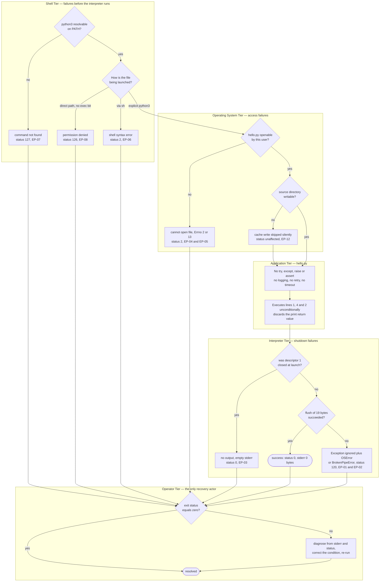
```mermaid
flowchart TD
    subgraph ShellTier["Shell Tier — failures before the interpreter runs"]
        SHResolve{"python3 resolvable<br/>on PATH?"}
        SHLaunch{"How is the file<br/>being launched?"}
        SH127["command not found<br/>status 127, EP-07"]
        SH126["permission denied<br/>status 126, EP-08"]
        SHSyn["shell syntax error<br/>status 2, EP-06"]
    end

    subgraph OsTier["Operating System Tier — access failures"]
        OSOpen{"hello.py openable<br/>by this user?"}
        OSDeny["cannot open file, Errno 2 or 13<br/>status 2, EP-04 and EP-05"]
        OSWrite{"source directory<br/>writable?"}
        OSSkip["cache write skipped silently<br/>status unaffected, EP-12"]
    end

    subgraph AppTier["Application Tier — hello.py"]
        AppNone["No try, except, raise or assert<br/>no logging, no retry, no timeout"]
        AppRun["Executes lines 1, 4 and 2 unconditionally<br/>discards the print return value"]
    end

    subgraph RuntimeTier["Interpreter Tier — shutdown failures"]
        RTClosed{"was descriptor 1<br/>closed at launch?"}
        RTSilent["no output, empty stderr<br/>status 0, EP-03"]
        RTFlush{"flush of 19 bytes<br/>succeeded?"}
        RTFail["Exception ignored plus OSError<br/>or BrokenPipeError, status 120, EP-01 and EP-02"]
        RTOk(["success: status 0, stderr 0 bytes"])
    end

    subgraph OperatorTier["Operator Tier — the only recovery actor"]
        OpCheck{"exit status<br/>equals zero?"}
        OpFix["diagnose from stderr and status,<br/>correct the condition, re-run"]
        OpDone(["resolved"])
    end

    SHResolve -->|"no"| SH127 --> OpCheck
    SHResolve -->|"yes"| SHLaunch
    SHLaunch -->|"direct path, no exec bit"| SH126 --> OpCheck
    SHLaunch -->|"via sh"| SHSyn --> OpCheck
    SHLaunch -->|"explicit python3"| OSOpen
    OSOpen -->|"no"| OSDeny --> OpCheck
    OSOpen -->|"yes"| OSWrite
    OSWrite -->|"no"| OSSkip --> AppNone
    OSWrite -->|"yes"| AppNone
    AppNone --> AppRun --> RTClosed
    RTClosed -->|"yes"| RTSilent --> OpCheck
    RTClosed -->|"no"| RTFlush
    RTFlush -->|"yes"| RTOk --> OpCheck
    RTFlush -->|"no"| RTFail --> OpCheck
    OpCheck -->|"yes"| OpDone
    OpCheck -->|"no"| OpFix --> OpDone
```

### 4.6.3 Retry Mechanisms

No retry mechanism is implemented. There is no attempt counter, no backoff schedule, no timeout, no deadline and no circuit breaker anywhere in tracked content. Two retry-like behaviors exist outside the application and are worth naming precisely:

| Mechanism | Owner | Observed Behavior |
|---|---|---|
| Bytecode recompilation | `importlib` | A missing, stale or corrupted `.pyc` is recompiled and rewritten transparently on the next import; the run still exits 0 |
| Whole-invocation re-run | Operator or calling script | Unconditionally safe: the program assigns no variable, persists nothing on the script path, and two successive redirected runs leave 19 bytes rather than 38 |

The absence of in-process retry is a consequence of the design rather than an oversight: the single failure mode that could benefit from one — a failed stdout flush — is detected only after the module has returned, at interpreter shutdown, where no application code is running.

### 4.6.4 Fallback Processes

| Failure | Fallback | Owner |
|---|---|---|
| Cache directory unwritable | Compile from source on every run, paying ~16 µs each time | `importlib` |
| Stale or corrupted `.pyc` | Recompile from source and rewrite the cache | `importlib` |
| Module not found on `sys.path` | None automatic; the invocation must be repeated from the repository root | Operator |
| stdout unwritable or closed | **None.** There is no secondary sink, no spool file and no use of stderr as an alternative channel | Nobody |
| Interpreter absent or wrong | **None.** No shebang, wrapper script, `Makefile` or container image exists to pin or supply an interpreter | Nobody |

### 4.6.5 Error Notification Flows

Only two notification channels exist, both synchronous and both consumed by whoever launched the process.

| Channel | Content | Consumer and Retention |
|---|---|---|
| Standard error | Interpreter or shell diagnostic text; 0 bytes on every successful run | The launching shell or parent process; not persisted unless the caller redirects it |
| Process exit status | 0, 1, 2, 120, 126 or 127 as tabulated in 4.6.1 | The launching shell or parent process; lost once the shell moves on |

The notification gaps follow directly from the absences already established: there is no log file, no structured event, no metric, no trace, no email, webhook or alert integration, and therefore no post-mortem artifact of any kind. Combined with EP-03, this means a monitoring system watching only exit statuses would classify a total loss of output as a success.

### 4.6.6 Recovery Procedures

Every recovery action is manual and external. Because the workflow is stateless and idempotent, recovery is always "correct the environment, then re-run" — there is never any partial state to clean up beyond a truncated redirect target.

| Condition | Recovery Action | Verification |
|---|---|---|
| EP-01, EP-02 | Free space or supply a consuming reader, then re-run | Exit status returns to 0 and stderr measures 0 bytes |
| EP-03 | Re-run with descriptor 1 open and bound to a real sink | The 19 bytes appear at the sink |
| EP-04, EP-09 | Re-run from the repository root, or give the correct script path | `Hello from Python!` is printed and status is 0 |
| EP-05 | Grant read permission on `hello.py` to the invoking user | The run proceeds past the open call |
| EP-06, EP-07, EP-08 | Invoke through an explicit `python3` interpreter rather than the shell or the file itself | Both `python3 hello.py` and `python3 -m hello` exit 0 |
| EP-10 | Correct the call site to pass no argument; no module state was mutated | `hello.greet()` returns `None` and emits one line |
| EP-11, EP-12 | No action required; optionally delete `__pycache__` to force a clean rebuild | The run continues to exit 0 either way |
| Truncated redirect target | Re-run, or use `>>` to append instead of `>` | `>>` preserves prior content while adding the greeting |


## 4.7 Timing and Service-Level Considerations

**No service-level objective, timeout, deadline, retry window or performance budget is declared anywhere in this repository.** There is no manifest, configuration file, CI workflow or documentation in which one could be expressed — `README.md` is two lines and no other prose exists. Every figure below is therefore a direct measurement taken against the checked-out code on the verification host, running CPython 3.12.3 on Linux x86-64, and should be read as observed behavior on that host rather than as a commitment.

### 4.7.1 Measured Latencies

| Measurement | Result | Method |
|---|---|---|
| Bare interpreter startup and exit | 10.58 ms per run | `python3 -c pass`, mean of 30 subprocess invocations |
| W-1 direct script execution, end to end | 10.73 ms per run | `python3 hello.py`, mean of 30 subprocess invocations |
| W-2 module-name execution, end to end | 15.09 ms per run | `python3 -m hello`, mean of 30 subprocess invocations |
| Compilation of the 4-line source | 16.1 µs | `compile()` of the source, mean of 2,000 iterations |
| W-4 in-process `greet()` call | 0.206 µs per call | 20,000 calls with stdout redirected in-process |

### 4.7.2 Where the Time Goes in W-1

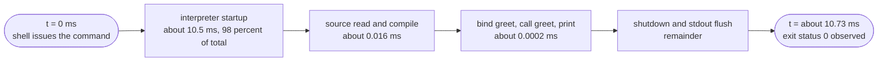
```mermaid
flowchart LR
    T0(["t = 0 ms<br/>shell issues the command"])
    T0 --> T1["interpreter startup<br/>about 10.5 ms, 98 percent of total"]
    T1 --> T2["source read and compile<br/>about 0.016 ms"]
    T2 --> T3["bind greet, call greet, print<br/>about 0.0002 ms"]
    T3 --> T4["shutdown and stdout flush<br/>remainder"]
    T4 --> T5(["t = about 10.73 ms<br/>exit status 0 observed"])
```

The distribution has a practical consequence: the program's own work — compiling four lines and executing three bytecode steps — accounts for roughly 0.15 ms of the 10.73 ms, so essentially all observable latency is interpreter startup. Optimizing the code could not move the figure; only avoiding process creation could, which is what the in-process path in 4.7.3 does.

### 4.7.3 Throughput and Batch Cost Model

| Execution Strategy | Cost for N Emissions | Basis |
|---|---|---|
| One process per emission, script path | N × ~10.73 ms | Externally driven loop; measured over 30 runs |
| One process per emission, `-m` path | N × ~15.09 ms | Adds module-resolution machinery per process |
| One process, repeated `greet()` calls | ~10.7 ms + N × ~0.206 µs | W-3 followed by N − 1 invocations of W-4 |

The in-process strategy is roughly five orders of magnitude cheaper per emission, and it is available only because the function is stateless and repeatably invocable (F-002-RQ-004). Neither strategy is implemented in the repository: there is no driver script, scheduler, `Makefile` or CI job, so any batching is the caller's responsibility.

### 4.7.4 Timing Constraints Verified Not to Exist

| Candidate Constraint | Status |
|---|---|
| Request or operation timeout | None; no timeout value appears in tracked content |
| Flush or write deadline | None; the shutdown flush blocks for as long as the sink requires |
| Retry interval or backoff window | None; no retry exists to schedule |
| Watchdog, liveness or readiness deadline | None; the process exposes no probe and lives roughly 11 ms |
| Scheduled execution window | None; no cron entry, timer unit or scheduler configuration exists |
| Rate limit or concurrency cap | None; the program is single-threaded and imposes no limit of its own |


## 4.8 References

### 4.8.1 Repository Files and Folders Examined

- `hello.py` — the sole source file; supplied every process step in 4.1 and 4.2. Line 1 `def greet():`, line 2 the `print` of the literal, line 4 the unguarded module-level call. Its compiled bytecode (`MAKE_FUNCTION`/`STORE_NAME` for line 1, `PUSH_NULL`/`LOAD_NAME`/`CALL`/`POP_TOP` for line 4, `LOAD_GLOBAL print`/`LOAD_CONST`/`CALL` for line 2) established the step granularity, and its AST census (`If`, `Try`, `ExceptHandler`, `Raise`, `Assert`, `With`, `Assign` all zero, 12 nodes total) established the absence of application branching, error handling and state.
- `README.md` — two lines, establishing the project name and one-line purpose used in the W-5 acquisition flow (F-004); confirmed to contain no build, run or operational instructions.
- `LICENSE` — 373-line MPL 2.0 text; supplied the redistribution compliance steps in 4.2.4 and 4.4.4, including Section 3 duties, Section 10 stewardship, Exhibit A at line 355, the canonical URL at line 360 and Exhibit B at line 369.
- Repository root (path `""`) — enumerated as exactly three files and zero subdirectories, which bounded the workflow inventory and confirmed there is no service, job, configuration or infrastructure surface to chart.
- `__pycache__/hello.cpython-312.pyc` — untracked interpreter artifact (324 bytes in this checkout); supplied the cache lifecycle, cache-key header fields (`magic cb0d0d0a`, `flags = 0`, source mtime, source size 58) and the untracked-path finding in 4.5.
- `.git` repository metadata — commits `0fa4c0c` (added `LICENSE` and `README.md`) and `56fb250` (added `hello.py`), identical `main` and `jr_python1` trees, zero tags, 7 objects at 8.24 KiB, and the GitHub origin; supplied the W-5 acquisition sequence in 4.3.3.

### 4.8.2 Cross-Referenced Specification Sections

- **2.2 Functional Requirements** — supplied the requirement identifiers traced throughout 4.2 and 4.4 (F-001-RQ-001 to F-001-RQ-004, F-002-RQ-001 to F-002-RQ-004, F-003-RQ-001 to F-003-RQ-005, F-004-RQ-001 to F-004-RQ-002, F-005-RQ-001 to F-005-RQ-003) and confirmed that no performance requirement is declared anywhere in the repository.
- **2.3 Feature Relationships** — supplied the F-003 → F-002 → F-001 invocation chain used as the backbone of 4.2.1, the single-integration-point finding underpinning 4.1.2, and the verified absence of any common service layer.
- **1.2.2.2 Major System Components** and **1.3.1.2 Implementation Boundaries** — the invocation-path and system-boundary flowcharts already in this specification; the diagrams in Section 4 are deliberately lifecycle-oriented so as to complement rather than restate them.

### 4.8.3 Behavioral Verification Performed for This Section

All behavior documented above was measured directly rather than inferred. The exercises were: execution of every invocation form (`python3 hello.py`, `python3 -m hello`, `python3 -c "import hello"`, `python3 - < hello.py`, `python3 -I -S -E hello.py`, `./hello.py`); bytecode disassembly of the module and of `greet`; a line-level `sys.settrace` capture of the execution order; introspection of stdout stream properties and of the flush boundary; bytecode-cache creation, reuse, staleness, corruption and unwritable-directory tests; induced failures against `/dev/full`, a closed descriptor, a closed pipe, a missing file, an unreadable file (re-run as the unprivileged user `nobody`), the wrong interpreter and an absent interpreter; shell redirection truncation and append tests; and latency measurements over 30 process invocations and 20,000 in-process calls. No external or web source was required for this section.


# 5. System Architecture

## 5.1 High-Level Architecture

The architecture described in this section is **exhaustive rather than representative**. The repository tracks exactly three files at a flat root — `hello.py` (4 lines, 58 bytes), `README.md` (2 lines, 49 bytes) and `LICENSE` (373 lines, 16,726 bytes) — and contains zero subdirectories. `hello.py` contains **zero import statements**, and the only global name its function body resolves is the built-in `print` (`co_names == ('print',)`). Because no import exists, no code path in the system is capable of reaching a socket, file, database, broker, subprocess, environment variable or dynamically evaluated code. The component inventory, the data-flow description and the integration list below are therefore closed sets, verified by inspection and by execution, not samples of a larger whole.

### 5.1.1 System Overview

#### 5.1.1.1 Architecture Style and Rationale

The system implements a **single-module, single-process, synchronous script architecture** — a degenerate monolith in which the entire application is one source file, executed by an interpreter that the repository does not contain and does not configure. There is no client/server split, no service decomposition, no worker tier and no persistent runtime: each invocation creates a process, performs one write, and exits.

| Architectural Dimension | Observed Choice | Evidencing Artifact |
|---|---|---|
| Deployable units | One (`hello.py`) | Flat root; zero subdirectories; no `__init__.py` |
| Runtime tiers | One short-lived OS process | No server, daemon, scheduler or worker code exists |
| Process lifetime | ~10.73 ms per invocation, measured | `python3 hello.py`, mean of 30 runs (**4.7.1**) |
| Concurrency model | Single-threaded, fully synchronous | Zero imports, so no `asyncio`, `threading` or `multiprocessing` |
| State model | Stateless | AST census: `Assign`/`AugAssign`/`AnnAssign` = 0; `greet.__closure__` and `greet.__defaults__` are `None` |
| Dependency posture | Built-ins only | Zero imports; verified to run under `python3 -I -S -E` |
| Ingress surface | None | Runs with descriptor 0 closed, with extra CLI arguments, and under `env -i`, all exiting 0 |
| Egress surface | One write-only byte stream plus exit status | 19 bytes on stdout; 0 bytes on stderr on success |
| Configuration surface | None | No manifest, `.env`, config file or environment read anywhere |

The rationale for this style is recoverable from the repository itself rather than assumed:

- **The declared purpose is demonstration, not production service.** The only statement of intent anywhere in the repository is `README.md` line 2 — "A simple hello world python". A style that introduces layering, service boundaries or dependency injection would add structure that nothing in the declared purpose requires.
- **Minimalism is the mechanism that eliminates setup cost.** Because the system depends on no package, no manifest and no environment, "install" and "build" phases do not merely go unused — they have nothing to act upon. This was confirmed by executing the program in isolated mode with site-packages disabled (`python3 -I -S -E hello.py`, exit status 0) and with an empty environment (`env -i python3 hello.py`, exit status 0).
- **The absence of heavier styles is uniform, not partial.** No vestigial scaffolding, stub module, disabled framework configuration or commented-out abstraction exists in tracked content, and the repository has no subdirectories in which such material could hide. There is consequently no evidence of an in-progress migration toward a larger architectural style; the style observed is the style as committed.
- **The tradeoff accepted is coupling to the host.** All infrastructure concerns — compilation, bytecode caching, stream buffering, character encoding, output flushing and failure reporting — are delegated wholly to the CPython runtime and the operating system. The architecture owns four lines of logic and nothing else, which is the source of both its portability and the observability gaps documented in **5.4**.

#### 5.1.1.2 Architectural Principles and Patterns

Eight patterns are actually present in the code. Each is named with the specific construct that implements it, so that no principle is credited to the system on the strength of convention alone.

| Principle / Pattern | How It Manifests | Evidence |
|---|---|---|
| Flat single-module organization | All behavior in one root-level module; no package, no layering | `hello.py` is the only source file; 0 subdirectories |
| Behavior encapsulation in a named callable | The output statement is the body of `greet`, not an inline module-level statement | `hello.py` line 1 defines `greet`; line 2 is its sole statement |
| Self-executing module (implicit bootstrap) | An unguarded module-level call runs the behavior on every load path | `hello.py` line 4; no `if __name__ == "__main__":` guard |
| Stateless side-effecting procedure | Zero-argument, zero-assignment function whose only result is a stream write | `inspect.signature(greet)` is `()`; returns `None` |
| Total delegation of infrastructure to the host | Compilation, caching, buffering, encoding, flushing and exit reporting are the interpreter's | `co_names == ('print',)` — the only external facility invoked |
| Fail-fast by omission | No handler exists, so every fault propagates to the interpreter or the shell | AST has zero `Try`, `ExceptHandler`, `Raise`, `Assert` and `With` nodes |
| Idempotent, replayable invocation | Re-running is unconditionally safe; nothing accumulates between processes | Two successive runs redirected with `>` leave 19 bytes, not 38 (**4.5.4**) |
| Compile-time constant payload | The greeting is folded into the code object; nothing computes or formats it | `greet.__code__.co_consts == (None, 'Hello from Python!')` |

The following patterns are **verified absent**, recorded here so that readers do not supply them from habit. The basis is structural and therefore conclusive: one module, two top-level AST nodes, zero imports, and — as established in **2.3.4** — no common service layer of any kind.

- Layered, hexagonal or clean architecture; there is no boundary between domain, application and infrastructure code to layer.
- Model-View-Controller or MVVM; no view, template, router or controller construct exists.
- Dependency injection or inversion-of-control container; `greet` takes no parameters and resolves no collaborator.
- Event-driven, publish/subscribe or message-bus architecture; no broker client, event type or handler registry exists.
- Plugin, extension or strategy registry; no entry-point metadata and no dynamic dispatch.
- Repository, DAO or unit-of-work persistence patterns; no driver, model, schema or query.
- Service or microservice decomposition, API gateway, sidecar or ambassador topologies; the system exposes no network endpoint.
- CQRS or event sourcing; there is no command/query separation and no event store.

#### 5.1.1.3 System Boundaries and Major Interfaces

Three nested boundaries organize the system. Everything the repository controls sits inside B-1; everything that actually executes the program sits outside B-2.

| Boundary | What It Encloses | Crossing Mechanism |
|---|---|---|
| B-1 Repository / artifact boundary | The three tracked files and the git object store (7 objects, 8.24 KiB packed) | Git clone, fetch and push against the GitHub origin remote |
| B-2 Process boundary | One CPython process: compiled module, bound `greet`, buffered output | Explicit interpreter invocation; exit status on termination |
| B-3 Module namespace boundary | The importable `hello` namespace, whose public surface is exactly `['greet']` | The Python import protocol, memoized in `sys.modules` |

Five interfaces cross those boundaries. This is the complete interface inventory.

| Interface | Direction and Contract | Evidence |
|---|---|---|
| I-1 Command-line invocation | Inbound control. `python3 hello.py` or `python3 -m hello`; no argument is parsed or required | Both exit 0; `python3 hello.py --foo bar -x` also exits 0, arguments accepted and ignored |
| I-2 Python import | Inbound control and outbound API. `import hello` executes the module body once and publishes `greet()` | Public attributes are exactly `['greet']`; a second import in-process emits nothing and returns the identical object |
| I-3 Standard output | Outbound data, write-only. One line of ASCII text per emission via `print` with its default destination | 19 bytes measured (`python3 hello.py \| wc -c`) |
| I-4 Process exit status | Outbound control signal. `0` on success; `1`, `2`, `120`, `126` or `127` for the failure classes in **4.6.1** | Verified per class, including `./hello.py` → `126` (mode `0644`, no shebang) |
| I-5 Standard error | Outbound diagnostics. Interpreter or shell diagnostic text; empty on success | 0 bytes measured on a successful run |

Equally important are the interfaces the system does **not** expose, each confirmed by execution rather than inferred: standard input is never read (the program exits 0 with descriptor 0 closed); command-line arguments are never inspected (`sys.argv` is not referenced and unknown flags are ignored rather than rejected); environment variables are never read (`env -i` changes nothing); no file is opened by application code (a direct `python3 hello.py` in a clean directory leaves it byte-for-byte unchanged); no socket is created or listened on; and no signal handler, IPC channel or subprocess is established.

### 5.1.2 Core Components

Nine components constitute the system. Four are repository-owned (C-01 through C-03, plus the supporting artifacts C-07 and C-08), three are host-provided and therefore outside B-2 (C-04, C-05, C-06), and one is developer-time only (C-09). Component identifiers introduced here are used consistently in **5.2**.

| Component | Primary Responsibility | Key Dependencies |
|---|---|---|
| C-01 `greet()` function (`hello.py` lines 1–2) | Encapsulate and perform the single unit of observable work: write the fixed greeting | Built-in `print`; an attached, writable stdout |
| C-02 Module bootstrap statement (`hello.py` line 4) | Trigger C-01 unconditionally on every load path, with no guard or argument parsing | C-01 must be bound first, which line 1 guarantees |
| C-03 `hello` module / source unit (`hello.py`) | Hold all executable content and publish `greet` as the sole public attribute | C-04 to compile, bind and execute it |
| C-04 CPython interpreter host (verified 3.12.3) | Read and compile the source, bind names, execute the module body, flush and report exit status | Present on the host and explicitly invoked; no version is pinned in-repo |
| C-05 Standard output egress channel | Encode, buffer and ultimately deliver the 19-byte payload to the sink | C-04's `TextIOWrapper` over a `BufferedWriter`; descriptor 1 open |
| C-06 Bytecode cache (`__pycache__/hello.cpython-312.pyc`, 324 bytes) | Persist compiled bytecode so later imports skip the ~16 µs compile | A writable source directory; produced by `importlib`, not by application code |
| C-07 Project identification artifact (`README.md`) | Declare project name and purpose; the repository's only prose | None at runtime — no code reads it |
| C-08 License artifact (`LICENSE`, MPL 2.0) | Govern reuse and redistribution of all tracked source | None at runtime — no code reads it |
| C-09 Version-control distribution channel (`.git/` + GitHub origin) | Distribute source; the only "deployment" mechanism present | Git 2.43.0 and network access to the origin remote |

| Component | Integration Points | Critical Considerations |
|---|---|---|
| C-01 `greet()` | Calls built-in `print`; reachable via I-2 by any importer | Sole functional contract; the literal at line 2 must be preserved byte-for-byte. Discards `print`'s return value, so a write problem is invisible in-process |
| C-02 Bootstrap statement | Entry point for I-1 and side effect of I-2 | Unguarded: the greeting cannot be suppressed by importing quietly. Removing it would make every invocation path silent |
| C-03 `hello` module | Crosses B-3 via the import protocol; loaded by C-04 | No shebang and mode `0644`, so direct execution fails with status `126`. CRLF line endings with no `.gitattributes` to normalize them |
| C-04 Interpreter host | Owns I-1, I-4 and I-5; consumes C-03; writes C-06 | Unpinned and undeclared — no shebang, `.python-version` or `runtime.txt`. It contributes ~98% of end-to-end latency (~10.5 ms of ~10.73 ms) |
| C-05 stdout channel | Terminal, pipe or file supplied by the launching shell (I-3) | Block-buffered when not a terminal (`line_buffering` is `False`), so no byte reaches the sink before the shutdown flush — the flush is the commit point |
| C-06 Bytecode cache | Written by `importlib` on the import and `-m` paths only | Never written on the direct script path (verified: removing `__pycache__` and running `python3 hello.py` recreates nothing, while `python3 -m hello` does). Untracked and unignored, so `git status` reports `?? __pycache__/` |
| C-07 `README.md` | Rendered by the hosting surface; no runtime coupling | The sole authority on project purpose; there is no `docs/`, `CONTRIBUTING.md` or `CHANGELOG.md` |
| C-08 `LICENSE` | References the canonical MPL text at `https://mozilla.org/MPL/2.0/` (line 360) | `hello.py` carries no Exhibit A header, so the root file bears the entire notice function — the alternative Exhibit A explicitly permits |
| C-09 Git / GitHub origin | Push and fetch over HTTPS; `origin/main` and `origin/jr_python1` are identical | A push triggers nothing: no CI/CD definition exists. No tags and no releases, so there is no version identifier to reference |

### 5.1.3 Data Flow Description

**Primary data flow.** The system moves exactly one payload, and it moves in one direction. The greeting is not computed, read, received or configured: it is folded into the code object at compile time as the constant `'Hello from Python!'`. At run time, C-02 calls C-01, C-01 calls the built-in `print`, `print` appends the default line terminator and hands the resulting text to C-05, C-05 encodes it and buffers 19 bytes, and nothing is visible at the sink until the interpreter flushes during shutdown. That flush is the system's commit point: it is the only moment at which the output becomes durable, and it occurs *after* all application code has returned, which is why no application-level recovery is possible for a failed write. The process then reports outcome through I-4. There is no inbound flow at any stage — the ingress surface is empty, as established in **5.1.1.3**.

**Integration patterns and protocols.** Four patterns carry all traffic in the system, and all four are local:

- **Direct in-process function call** between C-02 and C-01. No marshalling, serialization, proxying or address resolution occurs; the AST records exactly two call sites in the entire repository (`greet` at line 4, `print` at line 2).
- **Language-level import protocol** between an external consumer and C-03, memoized by `sys.modules` for the life of the process. The module body executes exactly once per process: a second `import hello` returns the identical module object and emits nothing.
- **Unframed POSIX byte stream** from C-05 to the sink on descriptor 1. There is no message framing, no length prefix, no schema and no acknowledgement — delivery is fire-and-forget from the application's perspective, because `print`'s return value is discarded.
- **Process exit status as an out-of-band control signal** from C-04 to the launching shell, the system's only structured outcome report.

No wire protocol of any kind participates: HTTP, gRPC, GraphQL, AMQP, MQTT and SQL are all absent, and no serialization format — JSON, XML, YAML or protobuf — appears anywhere in tracked content. The single non-local channel in the picture, Git over HTTPS to the GitHub origin, is developer-time only and has no runtime role whatsoever.

**Data transformation points.** Four transformations occur, none of them business logic:

| ID | Transformation | Stage and Owner | Observable |
|---|---|---|---|
| T-1 | 58 bytes of source text → CPython bytecode | Load time; C-04 | ~16.1 µs, measured over 2,000 `compile()` iterations |
| T-2 | Constant `str` → `str` plus line terminator | `print` call; C-04 built-in | Default `end='\n'`; no formatting, interpolation or padding |
| T-3 | `str` → encoded bytes | `TextIOWrapper`; C-05 | 19 ASCII bytes; no BOM, no explicit encoding argument |
| T-4 | Buffered bytes → `write` syscall on descriptor 1 | Interpreter shutdown flush; C-04/C-05 | The commit point; success → status 0, failure → status 120 |

No validation, parsing, mapping, enrichment, filtering or aggregation step exists — there is no input to validate and no structure to map.

**Key data stores and caches.** The system has **no application data store**. It writes no file, opens no database and holds no in-memory collection; a direct `python3 hello.py` in a clean directory leaves that directory byte-for-byte unchanged. Three stores and two caches nevertheless participate in the flow, and none of the five is written by application code:

| Store or Cache | Owner and Scope | Lifecycle and Invalidation |
|---|---|---|
| stdout sink (C-05 destination) | The launching shell; per invocation | Ephemeral on a terminal; 19 bytes on disk when redirected. Non-cumulative under `>`, which truncates the target before the process even starts |
| Bytecode file cache (C-06) | `importlib`; scoped to the source directory | Keyed on magic number, source mtime and source size (timestamp invalidation, `flags = 0`). Touching the source rewrites it; corrupting it causes transparent regeneration; an unwritable directory silently skips the write and the ~16 µs compile is paid every run |
| `sys.modules` memoization | C-04; scoped to one process | Keyed on the module name `hello`; guarantees the module body — and therefore the greeting — executes exactly once per process |
| Git object store (C-09) | A committing developer, never the runtime | 7 objects, 8.24 KiB packed; two commits, zero tags |
| Application cache | Nobody — none exists | The payload is a compile-time constant in `co_consts`, so there is nothing to memoize |

### 5.1.4 External Integration Points

Six external systems touch this repository. Two of them (C-04 and C-05) are mandatory at run time, one reports outcome, one carries diagnostics, one is developer-time only, and one is a documentary citation that no code dereferences.

| System Name | Integration Type | Data Exchange Pattern |
|---|---|---|
| CPython interpreter runtime | Host runtime; inbound control | Synchronous in-process hosting: the interpreter loads, compiles and executes the module, then terminates |
| Standard output sink (terminal, pipe or file) | Outbound data egress | Fire-and-forget single buffered write, committed once at interpreter shutdown; no acknowledgement path |
| Launching shell or parent process | Outbound control signalling | One exit status per invocation, consumed synchronously by the caller |
| Standard error sink | Outbound diagnostics | Interpreter- or shell-generated text on failure only; silent on success |
| GitHub origin remote | Source distribution (developer-time) | Request/response clone, fetch and push; no runtime participation |
| `mozilla.org` MPL 2.0 reference | Documentary citation | None — the URL at `LICENSE` line 360 is read by humans, never fetched by code |

| System Name | Protocol / Format | Declared SLA and Observed Behavior |
|---|---|---|
| CPython interpreter runtime | Python 3 language and module-loader protocol; source parses from grammar level 3.4 upward | **No SLA or version floor declared** (no shebang, `.python-version` or `runtime.txt`). Observed: 10.58 ms bare startup, contributing ~98% of the 10.73 ms end-to-end time |
| Standard output sink | Unframed POSIX byte stream on descriptor 1; ASCII text plus LF; 19 bytes | **No SLA declared.** The shutdown flush blocks for as long as the sink requires — no timeout, deadline or retry exists. Failure yields status 120; a closed descriptor 1 yields status 0 with no output at all |
| Launching shell or parent process | Process exit status; integer in `{0, 1, 2, 120, 126, 127}` | **No SLA declared.** Status is lost once the caller moves on; nothing persists it |
| Standard error sink | Unstructured diagnostic text on descriptor 2 | **No SLA declared.** Measured at 0 bytes on every successful run; not persisted unless the caller redirects it |
| GitHub origin remote | Git smart protocol over HTTPS | **No SLA declared.** A push triggers no automation — no pipeline definition exists in the repository |
| `mozilla.org` MPL 2.0 reference | HTTPS URL cited in text | **Not applicable** — no availability requirement, because no runtime path depends on it |

Every other category of external integration is **verified absent** rather than merely undocumented, and the verification is exhaustive because zero imports leave no code path to any of them: external APIs and HTTP services, databases and persistence engines, message queues and event streams, identity and authentication providers, configuration and secret stores, third-party Python packages, CI/CD systems and artifact registries, and container or orchestration platforms. This finding is consistent with **1.2.1.3** and **2.3.2**, which reach the same conclusion from the feature and enterprise-landscape perspectives.


## 5.2 Component Details

This section details each component identified in **5.1.2**, using the identifiers introduced there. Three of the nine components (C-04, C-05, C-06) are host-provided and lie outside the repository boundary, but they are documented here because the architecture delegates every infrastructure concern to them — omitting them would leave the system's actual behavior unexplained. The diagrams in **5.2.8** through **5.2.10** are component-oriented and deliberately complement, rather than restate, the invocation-path flowchart in **1.2.2.2**, the feature dependency map in **2.3.1** and the lifecycle flows in section **4**.

### 5.2.1 C-01 — `greet()` Function

| Aspect | Specification |
|---|---|
| Purpose and responsibilities | Encapsulate and perform the single unit of observable work in the system: write the fixed literal `Hello from Python!` to standard output. It is the only behavior-bearing component the repository owns |
| Technologies and frameworks | Pure Python 3, built-ins only. No framework, decorator, base class, annotation or third-party call participates; `co_names == ('print',)` records the built-in `print` as the sole external facility it invokes |
| Key interfaces and APIs | `greet()` — module-level, zero parameters (`inspect.signature` returns `()`), no keyword arguments, no docstring, returns `None` implicitly. Reachable through I-2 after `import hello` |
| Data persistence requirements | **None.** The function opens no file and writes no store; `co_varnames` is empty, `__closure__` and `__defaults__` are both `None`, and the AST records zero assignments of any kind |
| Scaling considerations | Measured at 0.206 µs per in-process call over 20,000 invocations. Because it holds no state, repeated invocation cannot corrupt anything, and amortizing one interpreter startup across many calls is roughly five orders of magnitude cheaper per emission than one process per emission |

The architecturally significant property of C-01 is what it does *not* do with the result of its only call: the bytecode discards `print`'s return value with `POP_TOP`. The function therefore has no in-process means of learning whether the write will ultimately reach the sink, which is the root cause of the detection gap analysed in **5.4.3**. Its second significant property is arity enforcement: passing an argument raises `TypeError: greet() takes 0 positional arguments but 1 was given`, and that check is performed by the interpreter, not by validation code the repository contains.

### 5.2.2 C-02 — Module Bootstrap Statement

| Aspect | Specification |
|---|---|
| Purpose and responsibilities | Trigger C-01 unconditionally whenever the module is loaded, making the module self-executing. It is the system's entry point and its only automatic trigger |
| Technologies and frameworks | A single module-level expression statement at `hello.py` line 4, compiled to `PUSH_NULL`, `LOAD_NAME greet`, `CALL 0`, `POP_TOP` |
| Key interfaces and APIs | Not directly addressable. It is reached by I-1 (script or `-m` invocation) and as an unavoidable side effect of I-2 (import) |
| Data persistence requirements | **None** — it persists nothing and reads nothing |
| Scaling considerations | Executes exactly once per process, enforced by `sys.modules` memoization; a second `import hello` in the same process produces no second emission. Its cost is constant and negligible relative to interpreter startup |

C-02 carries the single most consequential design decision in the architecture: it is **unguarded**. There is no `if __name__ == "__main__":` wrapper, so the emission is a property of loading the module rather than of running it as a program. A consumer that wants only the callable `greet` cannot obtain it quietly — the greeting is emitted before the importer regains control, as confirmed by line-level tracing of the import (module line 1, then module line 4, then into `greet` line 2 where the output is produced, then back out). The tradeoff is recorded as ADR-004 in **5.3.7**.

### 5.2.3 C-03 — `hello` Module and Source Unit

| Aspect | Specification |
|---|---|
| Purpose and responsibilities | Hold all executable content of the system and publish `greet` as the module namespace's only public attribute. It is simultaneously the source unit, the deployable artifact and the import namespace |
| Technologies and frameworks | One 4-line, 58-byte Python source file at the repository root. Pure ASCII with no PEP 263 encoding cookie, so the interpreter applies the default UTF-8. No package structure: no `__init__.py`, no subdirectory |
| Key interfaces and APIs | Crosses B-3 through the Python import protocol. Public attribute surface is exactly `['greet']`. Importing it pulls in no other module — the measured `sys.modules` delta for `import hello` is exactly `['hello']` |
| Data persistence requirements | The file must exist on a filesystem path reachable from `sys.path` (for I-2 and the `-m` form) or be named explicitly on the command line. Nothing else is required |
| Scaling considerations | Scaling means copying a 58-byte file; compile cost is 16.1 µs. There is no packaging metadata, wheel, sdist or console-script entry point, so distribution scales only through C-09 rather than through a package index |

Two mechanical properties of C-03 have operational weight. It carries **no shebang** (its first bytes are `def`) and its file mode is `0644`, so the operating system rejects `./hello.py` with status `126`; an explicit interpreter is mandatory. And it uses **CRLF line endings** while `README.md` and `LICENSE` use LF, with no `.gitattributes` to specify normalization — a divergence that any future linting or diff-hygiene gate would have to reconcile first.

### 5.2.4 C-04 — CPython Interpreter Host

| Aspect | Specification |
|---|---|
| Purpose and responsibilities | Provide every infrastructure service the architecture delegates: read and compile the source, bind names, execute the module body, supply the `print` built-in, manage the bytecode cache, flush output at shutdown, and report the exit status |
| Technologies and frameworks | CPython, verified at 3.12.3 on Linux x86-64 (`cache_tag` `cpython-312`, `importlib` magic `0xcb0d0d0a`). **No version is pinned or declared in the repository** — there is no shebang, `.python-version`, `runtime.txt` or manifest `python_requires` |
| Key interfaces and APIs | Owns I-1 (command-line invocation), I-4 (exit status) and I-5 (diagnostics), and implements the import protocol behind I-2. Verified accepted forms: `python3 hello.py`, `python3 -m hello`, `python3 -c "import hello"` and `python3 - < hello.py`, all exiting 0 |
| Data persistence requirements | The only thing C-04 persists on behalf of this system is C-06, and only on the import and `-m` paths. A direct script run leaves the working directory byte-for-byte unchanged |
| Scaling considerations | C-04 *is* the system's cost: 10.58 ms of bare startup against 10.73 ms end-to-end, so roughly 98% of latency is interpreter startup and the program's own work accounts for about 0.15 ms. The `-m` form costs 15.09 ms, adding roughly 4.4 ms of module-resolution machinery. The only available optimization is to avoid process creation altogether |

Because the interpreter is undeclared, the *effective* runtime contract is whatever interpreter the operator happens to invoke. Two mitigating facts are established by evidence: the source contains no version-gated syntax and parses successfully from grammar level 3.4 upward, so any maintained 3.x line runs it unchanged; and the program executes correctly under `python3 -I -S -E`, meaning it depends on neither site-packages nor environment configuration. The version risk is therefore one of unpinned reproducibility rather than of compatibility. For context on the verified line, CPython 3.12 is in its security-fix-only maintenance phase under PEP 693, with source-only security releases expected until around October 2028, and 3.14 is the current feature series.

### 5.2.5 C-05 — Standard Output Egress Channel

| Aspect | Specification |
|---|---|
| Purpose and responsibilities | Encode, buffer and ultimately deliver the 19-byte payload to whatever sink the launching shell has attached to descriptor 1. It is the system's only data egress path |
| Technologies and frameworks | CPython's `TextIOWrapper` (`encoding=utf-8`, `write_through=False`) layered over a `BufferedWriter`. Selected implicitly — `print` is called with its default destination, with no stream object, encoding argument or flush control specified |
| Key interfaces and APIs | I-3: an unframed POSIX byte stream on descriptor 1. Payload is 19 ASCII bytes with a single trailing LF and no BOM. Redirectable and pipeable with ordinary shell operators |
| Data persistence requirements | Persistence belongs entirely to the sink: ephemeral on a terminal, 19 bytes on disk when redirected. Non-cumulative under `>`, because the shell truncates the target at open — before the process starts — so a failed run destroys the prior contents with no rollback |
| Scaling considerations | One descriptor, no fan-out, no secondary sink and no buffering policy of the repository's choosing. Throughput is bound by the sink, and the shutdown flush blocks for as long as the sink requires because no timeout or deadline exists anywhere in the system |

The decisive detail is **when** the bytes become durable. When stdout is not a terminal, `line_buffering` is `False` and the underlying object is a `BufferedWriter`, so zero bytes reach the sink at the moment `print` returns; all 19 appear only at the interpreter's shutdown flush. That flush is the system's commit point, and it happens after all application code has returned — which is why a write failure can only ever be reported by the interpreter (status `120`) and never handled by C-01.

### 5.2.6 C-06 — Bytecode Cache

| Aspect | Specification |
|---|---|
| Purpose and responsibilities | Persist compiled bytecode for C-03 so that subsequent imports skip the compile step. Written by `importlib`, never by application code |
| Technologies and frameworks | A single `.pyc` file, `__pycache__/hello.cpython-312.pyc`, 324 bytes in this checkout, with header magic `0xcb0d0d0a` and `flags = 0` (timestamp invalidation) |
| Key interfaces and APIs | No API surface. It is consulted and written by the import machinery inside C-04; its cache key is the tuple of magic number, embedded source mtime and embedded source size (58) |
| Data persistence requirements | 324 bytes in the source directory. Derived and fully regenerable, so it requires no backup. **Untracked and unignored** — there is no `.gitignore`, so `git status` reports `?? __pycache__/` after any import |
| Scaling considerations | Saves the 16.1 µs compile per import, which is immaterial next to 10.5 ms of interpreter startup. Its benefit is therefore negligible at this scale; its operational significance is the untracked artifact it leaves behind |

C-06 exhibits a **path asymmetry** worth stating plainly, because it is easy to assume otherwise: the direct script path never writes it. Removing `__pycache__` and running `python3 hello.py` recreates nothing, because a module executed as `__main__` is not cached, whereas `python3 -m hello` and `import hello` both produce the file. The cache also degrades gracefully in both failure directions — a corrupted `.pyc` is transparently regenerated and the run still exits 0, and an unwritable directory silently skips the write while the run continues, paying the compile each time. Note also that the file's size is a function of the embedded source path length (324 bytes in this checkout versus 288 bytes when the same source is compiled under a shorter path), so the size is not a stable identifier.

### 5.2.7 C-07, C-08, C-09 — Supporting Artifacts

These three components have no runtime coupling to the executing system — `hello.py` performs no file I/O, so neither `README.md` nor `LICENSE` is ever read by the program — yet each carries an architecturally relevant responsibility.

| Component | Purpose, Interfaces and Persistence | Scaling and Critical Considerations |
|---|---|---|
| C-07 `README.md` | Declares project identity: a level-one heading `# BlitzyRepo3_Python` and the description `A simple hello world python`. 49 bytes, LF endings. Surfaced by the hosting platform's rendering, not by code | The sole authority on project purpose in the entire repository; there is no `docs/` directory, `CONTRIBUTING.md` or `CHANGELOG.md`. It documents no build or run instructions, so the invocation contract lives only in this specification |
| C-08 `LICENSE` | Declares redistribution terms: the full Mozilla Public License 2.0, 373 lines and 16,726 bytes, Sections 1–10 with Exhibit A at line 355 and Exhibit B at line 369; the canonical URL appears at line 360 | `hello.py` carries no Exhibit A header, so this root file bears the entire notice function — the alternative Exhibit A explicitly permits. It must accompany any redistribution and must remain discoverable at the root |
| C-09 Git and GitHub origin | The only distribution mechanism present. Git 2.43.0 working tree; `origin` is the GitHub repository `rjhonsi/BlitzyRepo3_Python`; the object store holds 7 objects in 8.24 KiB across two commits | `origin/main` and `origin/jr_python1` are identical, and a push triggers no automation because no pipeline definition exists. There are zero tags and zero releases, so no version identifier exists to deploy or reference |

### 5.2.8 Component Interaction Diagram

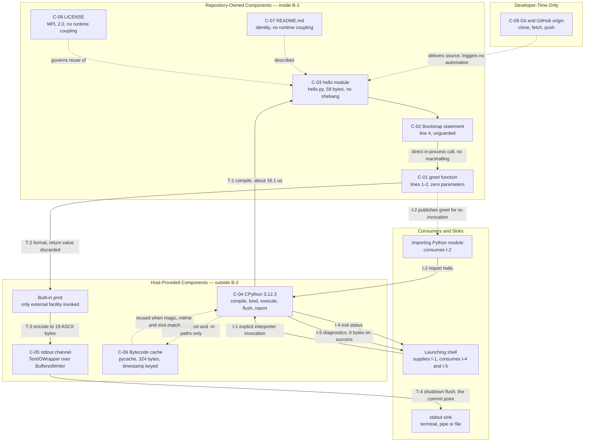
```mermaid
flowchart TB
    subgraph RepoZone["Repository-Owned Components — inside B-1"]
        C03["C-03 hello module<br/>hello.py, 58 bytes, no shebang"]
        C02["C-02 Bootstrap statement<br/>line 4, unguarded"]
        C01["C-01 greet function<br/>lines 1-2, zero parameters"]
        C07["C-07 README.md<br/>identity, no runtime coupling"]
        C08["C-08 LICENSE<br/>MPL 2.0, no runtime coupling"]
    end

    subgraph HostZone["Host-Provided Components — outside B-2"]
        C04["C-04 CPython 3.12.3<br/>compile, bind, execute, flush, report"]
        PrintB["Built-in print<br/>only external facility invoked"]
        C05["C-05 stdout channel<br/>TextIOWrapper over BufferedWriter"]
        C06["C-06 Bytecode cache<br/>pycache, 324 bytes, timestamp keyed"]
    end

    subgraph ConsumerZone["Consumers and Sinks"]
        Shell["Launching shell<br/>supplies I-1, consumes I-4 and I-5"]
        Importer["Importing Python module<br/>consumes I-2"]
        Sink["stdout sink<br/>terminal, pipe or file"]
    end

    subgraph DevZone["Developer-Time Only"]
        C09["C-09 Git and GitHub origin<br/>clone, fetch, push"]
    end

    Shell -->|"I-1 explicit interpreter invocation"| C04
    Importer -->|"I-2 import hello"| C04
    C04 -->|"T-1 compile, about 16.1 us"| C03
    C04 -.->|"writes on import and -m paths only"| C06
    C06 -.->|"reused when magic, mtime and size match"| C04
    C03 --> C02
    C02 -->|"direct in-process call, no marshalling"| C01
    C01 -->|"T-2 format, return value discarded"| PrintB
    PrintB -->|"T-3 encode to 19 ASCII bytes"| C05
    C05 -->|"T-4 shutdown flush, the commit point"| Sink
    C04 -->|"I-4 exit status"| Shell
    C04 -->|"I-5 diagnostics, 0 bytes on success"| Shell
    C01 -.->|"I-2 publishes greet for re-invocation"| Importer
    C09 -.->|"delivers source, triggers no automation"| C03
    C07 -.->|"describes"| C03
    C08 -.->|"governs reuse of"| C03
```

### 5.2.9 Payload State Transition Diagram

The system's only data element is the 19-byte greeting. Its state machine is distinct from the process state machine in **4.5.1** and the cache state machine in **4.5.3**: it tracks the payload itself from source literal to durable bytes, and it is the view in which the architecture's single point of irrecoverable loss becomes visible.

```mermaid
stateDiagram-v2
    [*] --> SourceLiteral
    SourceLiteral --> Interned: T-1 compile folds the literal into co_consts
    Interned --> Loaded: LOAD_CONST executes inside the greet frame
    Loaded --> Dropped: descriptor 1 closed at launch, sys.stdout is None
    Loaded --> Terminated: T-2 print appends the default line terminator
    Terminated --> Encoded: T-3 TextIOWrapper encodes 19 ASCII bytes
    Encoded --> Buffered: BufferedWriter holds the bytes, line_buffering False
    Buffered --> Committed: T-4 shutdown flush succeeds
    Buffered --> Discarded: flush raises OSError or BrokenPipeError
    Committed --> [*]
    Discarded --> [*]
    Dropped --> [*]
```

| Payload State | Where It Lives | Exit Status and Observable |
|---|---|---|
| `SourceLiteral` | `hello.py` line 2, inside the source bytes | Not yet executable |
| `Interned` | `greet.__code__.co_consts` as `(None, 'Hello from Python!')` | Immutable for the life of the process |
| `Loaded` / `Terminated` / `Encoded` | Interpreter stack and text layer | Nothing visible at the sink yet |
| `Buffered` | `BufferedWriter`, 19 bytes pending | Zero bytes on disk; a redirect target is already truncated |
| `Committed` | The sink | Status `0`, stderr 0 bytes — the only success outcome |
| `Discarded` | Lost | Status `120` with `OSError` or `BrokenPipeError` reported at shutdown; no retry |
| `Dropped` | Lost | Status `0` with empty stderr — success is reported although no output was produced |

`Dropped` is the architecture's most important failure state: `print` returns normally when `sys.stdout` is `None`, so the total loss of the system's only output is indistinguishable from success at every interface the system exposes.

### 5.2.10 Sequence Diagrams for Key Flows

**Direct script execution.** This is the canonical path and the one measured at 10.73 ms end to end. Note that the bytecode cache does not participate at all.

```mermaid
sequenceDiagram
    participant Shell as Launching shell
    participant Host as C-04 CPython 3.12.3
    participant Mod as C-03 hello module
    participant Fn as C-01 greet
    participant Out as C-05 stdout channel
    participant Sink as stdout sink

    Shell->>Host: I-1 python3 hello.py
    Note over Host: startup about 10.5 ms, roughly 98 percent of total
    Host->>Host: read 58 bytes, T-1 compile about 16.1 us
    Note over Host,Mod: run as __main__, so C-06 is never written
    Host->>Mod: execute module body
    Mod->>Mod: line 1 MAKE_FUNCTION then STORE_NAME greet
    Mod->>Fn: line 4 CALL 0, unguarded
    Fn->>Out: line 2 print, T-2 then T-3
    Out-->>Fn: returns None, discarded by POP_TOP
    Fn-->>Mod: RETURN_CONST None
    Mod-->>Host: module returns, 19 bytes still buffered
    Host->>Out: T-4 shutdown flush
    Out->>Sink: write 19 bytes on descriptor 1
    Host-->>Shell: I-4 status 0 and I-5 stderr 0 bytes
```

**Import and programmatic reuse.** This path exercises C-06, exposes the import-time side effect, and is the only way to reach the 0.206 µs per-emission cost.

```mermaid
sequenceDiagram
    participant App as Importing module
    participant Host as C-04 CPython and importlib
    participant Cache as C-06 bytecode cache
    participant Mod as C-03 hello module
    participant Fn as C-01 greet
    participant Out as C-05 stdout channel

    App->>Host: I-2 import hello
    Host->>Cache: check magic, source mtime and size 58
    alt cache valid
        Cache-->>Host: load 324 bytes of bytecode, T-1 skipped
    else absent, stale or corrupt
        Host->>Host: T-1 compile from source
        Host->>Cache: write hello.cpython-312.pyc
    end
    Host->>Mod: execute module body exactly once
    Mod->>Fn: line 4 unguarded call
    Fn->>Out: emit 19 bytes, buffered
    Note over App,Fn: the greeting is produced before the importer regains control
    Mod-->>Host: register module in sys.modules
    Host-->>App: bind module, public surface is exactly greet
    App->>Fn: call hello.greet, about 0.206 us
    Fn->>Out: emit a further 19 bytes
    App->>Host: import hello a second time
    Host-->>App: identical object from sys.modules, no emission
```


## 5.3 Technical Decisions

The repository contains **no design document, architecture decision record, or explanatory commit message** — its two commit subjects are "Initial commit" and "Add files via upload", and `README.md` is two lines. Every decision below is therefore *reconstructed from the committed artifact*: the decision is stated as what the code demonstrably does, the rationale is derived from properties that are verifiable in the repository, and the consequences are ones that were measured. Where a decision exists only as an omission, that is said explicitly rather than dressed up as a choice.

### 5.3.1 Architecture Style Decisions and Tradeoffs

The governing decision is to implement the system as a **single flat module executed by an external interpreter**, rather than as a package, a service, or a packaged distribution. Each constituent choice buys a specific benefit at a specific cost, and both sides of every trade are observable.

| Style Decision | Benefit Realized | Cost Accepted |
|---|---|---|
| One flat module, no package structure | Nothing to navigate, import, or wire; the whole system is 4 lines readable at a glance | No namespace for growth; a second module would require restructuring, since there is no `__init__.py` or package to extend |
| Zero dependencies, built-ins only | No install, resolution, or lock step is possible or needed; verified to run under `python3 -I -S -E` | No library assistance for anything — including the logging and error handling whose absence **5.4** documents |
| Synchronous single process per invocation | Trivially deterministic and idempotent; two runs redirected with `>` leave 19 bytes, not 38 | Roughly 98% of the 10.73 ms end-to-end time is interpreter startup, so per-emission cost is dominated by process creation |
| Stateless, input-free execution | No configuration drift, no state corruption, no migration path to maintain | Output cannot be varied without editing source; the literal is folded into `co_consts` at compile time |
| Infrastructure delegated wholly to the host | Four lines of code carry zero operational machinery | The host becomes the de facto contract, and it is undeclared — no shebang, `.python-version` or `runtime.txt` exists |
| No build, packaging, or CI/CD layer | Clone-and-run is the entire operational procedure | No version identifier, no automated verification gate, and no reproducible artifact; correctness rests on manual execution |

The trade is coherent for the system's declared purpose — `README.md` line 2, "A simple hello world python" — because every cost above is bounded by the program's size, and the single benefit that matters at this size is that nothing stands between obtaining the repository and observing a result. The trade would stop being coherent the moment a second module, a dependency, or a machine consumer of the output were introduced, and **5.4.5** records which measurements would change first.

### 5.3.2 Communication Pattern Choices

All communication in this system is local. The patterns actually in use were selected implicitly, by using language defaults rather than by configuring anything.

| Pattern Chosen | Why It Fits the Observed System | Alternative Not Adopted |
|---|---|---|
| Direct in-process function call (C-02 → C-01) | Caller and callee are 3 lines apart in one module; the AST records exactly two call sites in the whole repository | Any indirection — dispatcher, event bus, or injected collaborator — would add machinery with no second implementation to select between |
| Language-level import protocol (I-2) | The only consumer contract that survives process exit is a callable name; `sys.modules` memoization makes it idempotent per process | A packaged distribution with a console-script entry point; no packaging metadata exists to support one |
| Unframed byte stream on descriptor 1 (I-3) | The payload is one 19-byte ASCII line; framing, length prefixes, and schemas would exceed the payload | A structured format (JSON, protobuf) or a network protocol; no serialization library is imported and no socket is opened |
| Exit status as an out-of-band signal (I-4) | It is the only outcome channel a shell consumes without extra tooling | Logging, metrics, or a callback; none exists anywhere in tracked content |

Two consequences of these choices are worth naming because they shape **5.4**. First, the outbound data channel carries **no acknowledgement**: `print` returns `None` and the bytecode discards it with `POP_TOP`, so the application cannot learn the fate of its own write. Second, the only *structured* channel is a single integer exit status drawn from `{0, 1, 2, 120, 126, 127}`, which is expressive enough to distinguish the failure classes in **4.6.1** but — critically — reports `0` for the case in which all output is lost.

### 5.3.3 Data Storage Solution Rationale

The decision is to adopt **no storage solution at all**, and the justification is that the system has nothing to store. This is a positive finding rather than a deferred task: the payload is a compile-time constant, there is no input to retain, and no requirement anywhere in the repository implies durability.

| Storage Need | Resolution in This Architecture | Rationale Grounded in Evidence |
|---|---|---|
| Application data | None; no database, file store, or in-memory collection | Zero imports means no driver or file API is reachable; a direct run leaves a clean directory byte-for-byte unchanged |
| Output durability | Delegated to the sink the shell attaches to descriptor 1 | 19 bytes land on disk only when the caller redirects; the architecture takes no position on retention |
| Configuration | None; no `.env`, config file, or environment read | Verified with `env -i python3 hello.py`, which exits 0 — there is no setting whose value could need storing |
| Cross-invocation state | None; every process starts from scratch | AST census records zero assignments; `greet.__closure__` and `__defaults__` are `None` |
| Compiled artifact | Delegated to the interpreter's `__pycache__` | Derived and regenerable, so it needs no backup, no schema, and no lifecycle management by the repository |
| Source and history | Git object store: 7 objects, 8.24 KiB packed | The only durable store the repository owns; written by developers, never by the runtime |

The rationale for rejecting every storage technology is therefore not preference but absence of a requirement — and the organization's nominated default stack (which would suggest a managed database and cloud storage) is correspondingly **not adopted**, with no partial adoption to document.

### 5.3.4 Caching Strategy Justification

The repository implements **no application cache**, and the justification is structural: the greeting is already a constant in the code object (`co_consts == (None, 'Hello from Python!')`), so there is no computation whose result could be memoized and no value whose freshness could expire. Two caches nevertheless act on the system, both owned by the interpreter, and the architecture's decision with respect to each is to accept the default behavior unmodified.

| Cache | Strategy in Force | Justification and Measured Effect |
|---|---|---|
| Bytecode file cache (C-06) | Interpreter default: timestamp invalidation (`flags = 0`), keyed on magic number, source mtime, and source size 58 | Accepting the default costs nothing and is safe in both failure directions — a corrupt `.pyc` is regenerated transparently and the run still exits 0, and an unwritable directory silently skips the write. The benefit is immaterial here: it saves 16.1 µs against 10.5 ms of interpreter startup |
| `sys.modules` memoization | Interpreter default; scoped to one process, keyed on the module name | This is the mechanism that makes the unguarded bootstrap tolerable: it guarantees the module body — and therefore the greeting — executes exactly once per process no matter how many times `hello` is imported |
| Application-level cache | **Deliberately none** | Nothing is computed, fetched, or derived at run time; the only in-process cost is a 0.206 µs function call, which is already below any plausible cache-lookup overhead |

One caching consequence is easy to assume incorrectly and is therefore recorded as a decision outcome: **the canonical path is not cached at all.** A module run as `__main__` is never written to `__pycache__`, so `python3 hello.py` pays the 16.1 µs compile every time, while `python3 -m hello` and `import hello` both populate and then reuse the cache. No configuration in the repository influences this; it is the interpreter's behavior, accepted as-is.

### 5.3.5 Security Mechanism Selection

The architecture selects **no security mechanism of its own**. There is no credential, token, role, session, permission check, cryptographic primitive, or user concept anywhere in tracked content, and a targeted search of all three files for authentication, secret, key, and connection-string indicators matched only two false positives inside `LICENSE` — the word "laws" in the governing-law clause and the canonical licence URL. The security posture is consequently composed of the host's controls plus the attack surface the design eliminates.

| Security Concern | Mechanism Actually in Force | Basis and Owner |
|---|---|---|
| Access control on the source | POSIX discretionary access control; mode `0644` | Enforced by the filesystem. As `nobody` against mode `0600` the run is rejected with status 2 (`Errno 13`); root bypasses the check. This is the only authorization gate in the entire flow |
| Prevention of unintended direct execution | Absent execute bit and absent shebang | `./hello.py` is rejected with status `126`; an explicit interpreter is mandatory |
| Input attack surface | Eliminated by design | No `sys.argv`, stdin, environment, or file read exists; extra CLI arguments and piped stdin are accepted and ignored, both exiting 0 |
| Injection and deserialization surface | Eliminated by design | No `eval`, `exec`, `pickle`, template engine, subprocess, or dynamic import appears in tracked content |
| Network exposure | Eliminated by design | No socket is created, bound, or connected; zero imports makes this exhaustive |
| Supply-chain exposure | Eliminated by design | Zero third-party dependencies and no manifest, so dependency scanning is a no-op today — it becomes mandatory the moment a manifest is introduced |
| Secret management | Not required; none present | No `.env`, credential file, or secret reference in tracked content |
| Runtime patch level | Delegated entirely to the host interpreter | Nothing pins a version, so the host's CPython patch level *is* the security boundary. The verified line, 3.12, is in its security-fix-only phase under PEP 693, with source-only security releases expected until roughly October 2028 |
| Integrity of distributed source | Git object hashing only | No checksum, signature, or SPDX header check exists, and there is no `SECURITY.md` or `CODEOWNERS` to define a reporting or review path |
| Licence compliance | Manual, per MPL 2.0 | `LICENSE` Section 3 imposes the source-availability duty; the root notice substitutes for per-file Exhibit A headers; no licence scanner or CI gate automates the check |

One operational hygiene item belongs here because it is real and checkout-local rather than a property of the tracked code: this working copy's `.git/config` stores the `origin` URL with an embedded access token. That metadata is not tracked content and never ships with the repository, but the checkout directory should not be copied, archived, or shared as-is, and the token value must not be reproduced in documentation or logs.

### 5.3.6 Architecture Decision Tree

The tree below reconstructs the sequence of questions whose answers produce the observed architecture. Each branch actually taken is annotated with the evidence that settles it; each branch not taken names the machinery that would have been required and is explicitly marked as absent from the repository.

```mermaid
flowchart TD
    Q1{"Must the system serve<br/>concurrent external requests?"}
    Q1 -->|"No: no socket, no server code,<br/>single synchronous process"| Q2
    Q1 -->|"Yes"| AltService["Service or microservice topology,<br/>API gateway, request lifecycle<br/>NOT PRESENT"]
    Q2{"Does it consume input<br/>from any source?"}
    Q2 -->|"No: argv, stdin, env and files<br/>are all verified unread"| Q3
    Q2 -->|"Yes"| AltInput["Argument parsing, configuration<br/>loading, validation layer<br/>NOT PRESENT"]
    Q3{"Must data survive<br/>between invocations?"}
    Q3 -->|"No: zero assignments,<br/>clean directory unchanged"| Q4
    Q3 -->|"Yes"| AltStore["Database or file store plus a<br/>persistence layer and migrations<br/>NOT PRESENT"]
    Q4{"Does it need any package<br/>beyond the built-ins?"}
    Q4 -->|"No: zero imports, runs under<br/>python3 -I -S -E"| Q5
    Q4 -->|"Yes"| AltDeps["Dependency manifest, lock file,<br/>resolution and scanning steps<br/>NOT PRESENT"]
    Q5{"Must the outcome be inspected<br/>by a machine after the fact?"}
    Q5 -->|"No: exit status and stderr<br/>are the only reports"| Q6
    Q5 -->|"Yes"| AltObs["Logging, metrics, tracing and<br/>alert routing infrastructure<br/>NOT PRESENT"]
    Q6{"Must a reusable callable<br/>survive the process?"}
    Q6 -->|"Yes: greet is published<br/>as the sole public attribute"| Outcome["Resulting style: one flat module,<br/>logic in a named zero-argument function,<br/>one unguarded module-level call,<br/>stdout as the only egress"]
    Q6 -->|"No"| AltInline["Inline module-level print<br/>with no named function<br/>NOT the committed form"]
```

### 5.3.7 Architecture Decision Records

Nine records capture the decisions embodied in the committed code. Status values describe how each decision is evidenced, not a governance workflow the repository does not have: **Accepted as committed** means the code demonstrably implements it; **Implicit by omission** means no artifact declares it and the consequence follows from the absence.

| ADR | Decision | Status |
|---|---|---|
| ADR-001 | Single flat module rather than a package | Accepted as committed |
| ADR-002 | Built-ins only; no third-party dependency and no manifest | Accepted as committed |
| ADR-003 | Encapsulate the emission in a named zero-argument function | Accepted as committed |
| ADR-004 | Leave the module-level invocation unguarded | Accepted as committed |
| ADR-005 | Use standard output as the sole egress and discard the write result | Accepted as committed |
| ADR-006 | Delegate persistence and caching entirely to the host runtime | Accepted as committed |
| ADR-007 | Omit build, packaging, containerization, and CI/CD | Accepted as committed |
| ADR-008 | Licence under MPL 2.0 with a root-level notice only | Accepted as committed |
| ADR-009 | Leave the interpreter version unpinned | Implicit by omission |

#### 5.3.7.1 ADR-001 — Single Flat Module Rather Than a Package

**Context.** The system's entire behavior is one output statement, and the declared purpose is a hello-world demonstration. **Decision.** Place all executable content in one root-level `hello.py`; create no package, no `__init__.py`, and no subdirectory. **Consequences.** The repository has zero subdirectories and a total of 6 tracked non-licence source lines, making the system fully readable in one view; conversely there is no namespace into which a second module could be added without restructuring, and a semantic search for folders containing application source, configuration, or integrations returns nothing because no such folder exists. **Evidence.** Repository root listing; `hello.py` (4 lines, 58 bytes).

#### 5.3.7.2 ADR-002 — Built-ins Only; No Third-Party Dependency and No Manifest

**Context.** A single `print` call is the only library facility the behavior requires. **Decision.** Import nothing; declare no dependency manifest of any kind. **Consequences.** No install or resolution step is possible or needed, and the measured `sys.modules` delta for `import hello` is exactly `['hello']` — not even a standard-library module beyond interpreter bootstrap is pulled in. Dependency scanning has nothing to scan, and there is no transitive vulnerability surface. The cost is that no library support exists for logging, error handling, or argument parsing, which is why those capabilities are absent rather than minimal. **Evidence.** Zero imports in `hello.py`; `co_names == ('print',)`; successful execution under `python3 -I -S -E`; every probed manifest name absent.

#### 5.3.7.3 ADR-003 — Encapsulate the Emission in a Named Zero-Argument Function

**Context.** The shortest possible program would place `print(...)` at module level with no function at all. **Decision.** Define `greet()` at line 1 and make the `print` call its sole body statement. **Consequences.** The module gains a public attribute surface of exactly `['greet']`, which is the only element of the codebase another module can reference by name and therefore the only surface against which future code or tests could be written without editing `hello.py`. The emission gains no independent entry point — it is reachable only through `greet`. **Evidence.** `hello.py` lines 1–2; `inspect.signature(greet)` is `()`; module public attributes are exactly `['greet']`.

#### 5.3.7.4 ADR-004 — Leave the Module-Level Invocation Unguarded

**Context.** A conventional script wraps its entry point in `if __name__ == "__main__":`. **Decision.** Call `greet()` at module level, line 4, with no guard. **Consequences.** The module is self-executing on every load path — script, `-m`, and `import` all emit the greeting — which removes every step between obtaining the repository and observing a result. The accepted cost is that the module **cannot be imported quietly**: line-level tracing confirms the output is produced during module execution, before the importer regains control. `sys.modules` memoization bounds the blast radius to one emission per process. This is the decision most likely to require revisiting if `greet` is ever consumed as a library. **Evidence.** `hello.py` line 4; no `__main__` guard present; verified import-time emission and single-emission-per-process behavior.

#### 5.3.7.5 ADR-005 — Standard Output as Sole Egress, Write Result Discarded

**Context.** The system must produce an externally observable signal. **Decision.** Use `print` with its default destination; specify no stream, encoding, or flush control; do not inspect the result. **Consequences.** The output is redirectable and pipeable with ordinary shell operators, and the payload is a stable 19 ASCII bytes with no BOM. Because the bytecode discards `print`'s return value with `POP_TOP` and the bytes are committed only at the shutdown flush, the application has no in-process means of detecting a failed write — producing the `Discarded` (status 120) and `Dropped` (status 0, no output) outcomes in **5.2.9**. No secondary sink or spool exists as a fallback. **Evidence.** `hello.py` line 2; disassembly showing `POP_TOP`; measured 19-byte payload; `line_buffering` is `False` when stdout is not a terminal.

#### 5.3.7.6 ADR-006 — Delegate Persistence and Caching Entirely to the Host Runtime

**Context.** The system has no data to store and no value to memoize. **Decision.** Implement no storage and no cache; accept the interpreter's bytecode-cache and `sys.modules` defaults unmodified. **Consequences.** A direct script run leaves its working directory byte-for-byte unchanged, so the program is safe to run anywhere; the only artifact any path produces is `__pycache__/hello.cpython-312.pyc` on the import and `-m` paths. Because there is no `.gitignore`, that artifact is untracked *and* unignored, so `git status` reports `?? __pycache__/` — the one durable side effect of the delegation. **Evidence.** Clean-directory delta measurement; `__pycache__` path asymmetry between the script and `-m` paths; absence of `.gitignore`.

#### 5.3.7.7 ADR-007 — Omit Build, Packaging, Containerization, and CI/CD

**Context.** Interpreted Python requires no compile step, and the system has no dependency to resolve. **Decision.** Provide no build tool, packaging backend, container image, infrastructure definition, or pipeline configuration. **Consequences.** "Deployment" reduces to placing `hello.py` where an interpreter can reach it. Nothing is versioned — there are zero git tags and no manifest version — so no artifact can be referenced or rolled back by identity, and correctness is confirmed only by manual execution. A push to the origin remote triggers nothing. **Evidence.** Every probed build, container, IaC, and CI/CD path absent; `git tag` returns nothing; two-commit history with no merge commits or releases.

#### 5.3.7.8 ADR-008 — Licence Under MPL 2.0 With a Root-Level Notice Only

**Context.** Redistribution terms had to be established before any source existed; `LICENSE` was added in the very first commit, ahead of `hello.py`. **Decision.** Commit the full Mozilla Public License 2.0 at the repository root and add no per-file Exhibit A header. **Consequences.** Every recipient can determine their obligations from one file, and Exhibit A explicitly contemplates this arrangement; the cost is that the root file bears the entire notice function, so detaching `hello.py` from the repository detaches it from its licence notice. Exhibit B is present but declared by no file. **Evidence.** `LICENSE` (373 lines, Sections 1–10, Exhibit A at line 355, canonical URL at line 360, Exhibit B at line 369); `hello.py` contains no copyright or Mozilla reference; commit `0fa4c0c`.

#### 5.3.7.9 ADR-009 — Interpreter Version Left Unpinned

**Context.** The system's one external prerequisite is a Python 3 interpreter. **Decision.** *No decision is recorded anywhere.* No shebang, `.python-version`, `runtime.txt`, or manifest `python_requires` exists, so the effective runtime is whatever interpreter the operator invokes. **Consequences.** Reproducibility is unpinned: behavior is verified only against CPython 3.12.3, and any future pipeline configuration would become the de facto version contract. The compatibility risk is nonetheless low and measured — the source contains no version-gated syntax and parses from grammar level 3.4 upward, so any maintained 3.x line runs it unchanged. The security consequence is that the host's patch level is the entire runtime security boundary. **Evidence.** Absence of every version-declaring file; grammar-level parse probe; verified interpreter CPython 3.12.3.


## 5.4 Cross-Cutting Concerns

Cross-cutting concerns in this system are almost entirely **inherited rather than implemented**. `hello.py` contains no logging call, no exception handler, no metric, no authentication check, no timeout, and no configuration hook; its AST contains zero `Try`, `ExceptHandler`, `Raise`, `Assert`, and `With` nodes, and a targeted search of all tracked content for retry, backoff, timeout, logging, signal, circuit-breaker, fallback, alert, and webhook indicators returns zero matches. What follows therefore documents which mechanisms are genuinely in force — nearly all supplied by the interpreter, the operating system, and the launching shell — and states the gaps precisely, because at this scale the gaps are the architecture's most consequential property.

### 5.4.1 Monitoring and Observability Approach

**No instrumentation exists.** There is no metrics emission, no health endpoint, no readiness or liveness probe, no benchmarking harness, no coverage configuration, and no telemetry of any kind. The process lives roughly 11 ms and exposes nothing to scrape. Observability is consequently limited to what an external observer can see of a short-lived process.

| Observability Capability | Mechanism Actually Available | Limitation |
|---|---|---|
| Success or failure signal | Process exit status, one of `{0, 1, 2, 120, 126, 127}` | Lost as soon as the caller moves on; nothing persists it. Reports `0` for the total-output-loss case |
| Functional correctness | Byte comparison of stdout against the expected 19-byte payload | Requires the caller to capture and compare; no assertion exists in the repository |
| Failure diagnosis | Interpreter or shell diagnostic text on stderr | Measured at 0 bytes on every successful run; unstructured, and not persisted unless redirected |
| Latency | External wall-clock measurement of the process | No in-process timing, no histogram, no percentile; the figures in **5.4.5** were obtained by external measurement |
| Change and provenance | Git history: two commits, zero tags, 8.24 KiB across 7 objects | No version identifier exists to correlate an observation with a release |
| Deployment state | None | No artifact, image digest, or manifest version exists to observe |

The architectural implication is direct: the only viable first monitoring gate for this system is an **output assertion** — capture stdout, compare it byte-for-byte with the expected line, and check the exit status — because that is the sole functional contract the system publishes. An exit-status check alone is demonstrably insufficient, for the reason given in **5.4.3**.

### 5.4.2 Logging and Tracing Strategy

There is no logging strategy to describe and no tracing infrastructure: the `logging` module is never imported (the measured `sys.modules` delta for `import hello` is exactly `['hello']`), no log file is written, no structured event is emitted, and no correlation identifier, trace context, or span exists anywhere in tracked content.

| Concern | Observed State | Architectural Consequence |
|---|---|---|
| Application logging | None | The 19-byte greeting on stdout is the only line the program ever writes, and it is *data*, not a log record |
| Log destination and format | Not applicable | Were logging added to stdout, it would be indistinguishable from the system's only functional output; a future implementation would have to route records to stderr or a file to preserve the output contract |
| Log levels and filtering | None | No severity vocabulary exists; every outcome is conveyed by an integer exit status instead |
| Distributed tracing | Not applicable | Single synchronous process, one in-process call, no network hop to correlate |
| Audit trail | None at runtime | The only durable record of change is the git history, written by developers rather than by the running system |
| Diagnostic tooling | Host tooling applied from outside | Meaningful diagnosis of this program comes from `dis`, the `ast` module, and `sys.settrace` applied externally — capabilities of the interpreter, not instrumentation the repository contains |

### 5.4.3 Error Handling Patterns

Five patterns are in force, and only one of them belongs to the repository — the decision *not* to handle errors. The rest are the host's.

| Pattern | Where It Applies | Owner |
|---|---|---|
| Fail-fast by omission | Any in-frame fault propagates uncaught, because no handler exists | The repository, by design (ADR-005) |
| Detection delegated to the interpreter | Compile, load, write, and flush failures are detected and reported by CPython | C-04 |
| Environment pre-checks | Interpreter resolution, file readability, and execute-bit checks reject the invocation before any code runs | Shell and OS |
| Graceful degradation | A corrupt bytecode cache is regenerated and an unwritable cache directory is silently skipped; the run still exits 0 | `importlib` |
| Idempotent re-run as the sole recovery | Correct the environment and invoke again; nothing partial persists | Operator or calling script |

What matters architecturally is **when** each class of fault becomes detectable relative to application code, because that determines whether any handler could ever have helped:

| Detection Point | Representative Conditions | Could Application Code Intervene? |
|---|---|---|
| Before the interpreter runs | Interpreter not on PATH (`127`); direct execution without an execute bit (`126`); wrong interpreter (`2`) | No — `hello.py` is never loaded |
| Before the module executes | Source missing or unreadable (`2`); module not resolvable (`1`) | No — no code has been bound yet |
| While the module executes | Argument passed to `greet` (`TypeError`, interpreter-enforced arity) | Yes in principle, but no handler exists |
| After the module returns | Flush failure (`120` with `OSError` or `BrokenPipeError`) | **No** — the module has already returned; this is the structural reason a retry is impossible |
| Never detected | Descriptor 1 closed at launch: `sys.stdout` is `None`, `print` returns normally, stderr is empty, status is `0` | No — and nothing in the repository would notice |

That last row is the architecture's single blind spot and the most important cross-cutting finding in this section: **a monitoring system watching only exit statuses would classify a total loss of the system's only output as a success.** It is also unmitigated — there is no secondary sink, no spool file, and no use of stderr as an alternative channel.

```mermaid
flowchart TD
    Fault["Fault occurs during an invocation"] --> Q1{"Detected before any<br/>application code runs?"}
    Q1 -->|"Yes: shell or OS tier"| PreApp["hello.py never loaded or executed<br/>statuses 1, 2, 126, 127"]
    Q1 -->|"No"| Q2{"Detected while the module<br/>is still executing?"}
    Q2 -->|"Yes: in-frame fault"| InFrame["Propagates uncaught, no handler exists<br/>example: TypeError from a stray argument"]
    Q2 -->|"No"| Q3{"Detected after the module<br/>has returned?"}
    Q3 -->|"Yes: at the shutdown flush"| Flush{"Did the flush raise?"}
    Q3 -->|"No: degraded but succeeded"| Degraded["Cache write skipped or regenerated<br/>status 0, greeting still emitted"]
    Flush -->|"Raised"| Reported["Exception ignored notice plus OSError<br/>or BrokenPipeError, status 120"]
    Flush -->|"Not raised, but descriptor 1 was closed"| Silent["No output, stderr empty, status 0<br/>the architectural blind spot"]
    PreApp --> Signal["Only two signals exist:<br/>exit status and stderr text"]
    InFrame --> Signal
    Reported --> Signal
    Degraded --> Signal
    Silent --> Blind["No signal distinguishes<br/>this case from success"]
    Signal --> Inspect{"Does a human or calling script<br/>inspect status and stderr?"}
    Inspect -->|"Yes"| Recover["Correct the environment and re-run<br/>idempotent, no partial state to clean up"]
    Inspect -->|"No"| Undetected["Failure passes unnoticed<br/>no log, metric or alert is produced"]
    Blind --> Undetected
```

### 5.4.4 Authentication and Authorization Framework

**No authentication or authorization framework exists at the application level.** There is no credential, token, role, session, permission check, or user concept anywhere in tracked content, and no identity provider is integrated. The system has no notion of a caller to authenticate and no resource of its own to protect.

| Control Layer | Mechanism in Force | Scope and Basis |
|---|---|---|
| Application | None | No auth logic and no conditional of any kind; the compiled bytecode contains no conditional jump |
| Filesystem (runtime) | POSIX discretionary access control on the source, mode `0644` | The only authorization gate in the execution flow; denial yields status `2` with `Errno 13`. Full enumeration of the five environment-enforced gates is in **4.4.3** |
| Shell (runtime) | PATH resolution plus the execute-bit check | Rejects an absent interpreter (`127`) and direct execution of a non-executable file (`126`) |
| Repository (developer-time) | GitHub account and token-based access to the `origin` remote | Governs who may read or push; this is platform-level control, with nothing in tracked content configuring it |
| Legal (redistribution) | MPL 2.0 grants and conditions | Governs the *right* to use and redistribute rather than technical access; enforced by licence terms, not by code |

Two consequences follow. First, a deployment cannot rely on the program to reject an unauthorized or malformed condition — it can only observe the exit status afterwards. Second, because no input path exists at all, there is no privilege boundary inside the system to escalate across; the entire authorization surface is the host's decision about whether the invoking user may read one 58-byte file.

### 5.4.5 Performance Requirements and Service-Level Expectations

**No service-level objective, timeout, deadline, retry window, rate limit, or performance budget is declared anywhere in this repository**, and there is no manifest, configuration file, pipeline definition, or documentation in which one could be expressed. Every figure below is a direct measurement against the checked-out code on the verification host (CPython 3.12.3, Linux x86-64) and must be read as observed behavior on that host rather than as a commitment.

| Measurement | Observed Value | Architectural Reading |
|---|---|---|
| Bare interpreter startup and exit | 10.58 ms per run | The floor beneath which no per-process strategy can go |
| Direct script execution, end to end | 10.73 ms per run | Roughly 98% is startup; the program's own work is about 0.15 ms |
| Module-name execution (`-m`) | 15.09 ms per run | Adds roughly 4.4 ms of module-resolution machinery per process |
| Compilation of the 4-line source | 16.1 µs | Paid on every direct script run, since `__main__` is never cached |
| In-process `greet()` call | 0.206 µs per call | Roughly five orders of magnitude cheaper per emission than process creation |
| stderr volume on success | 0 bytes | The measured definition of a clean run, alongside status `0` |

The architecturally significant consequence is that **optimizing the application code cannot move the end-to-end figure** — only avoiding process creation can. A caller needing N emissions should import the module once and call `greet()` N times (≈10.7 ms + N × 0.206 µs) rather than launching N processes (N × 10.73 ms). Neither strategy is implemented in the repository: there is no driver script, scheduler, `Makefile`, or pipeline, so batching is entirely the caller's responsibility.

The following service-level constructs were each **verified not to exist**: request or operation timeouts; flush or write deadlines (the shutdown flush blocks for as long as the sink requires); retry intervals or backoff windows; watchdog, liveness, or readiness deadlines; scheduled execution windows (no cron entry, timer unit, or scheduler configuration); and rate limits or concurrency caps.

### 5.4.6 Disaster Recovery Procedures

No runbook, backup policy, or recovery documentation exists in the repository. Recovery nevertheless has an unusually simple shape, and the reason is structural rather than procedural: the system is **stateless and idempotent**, so there is never partial state to reconcile. Recovery is always "correct the condition, then re-run."

| Asset | Loss or Failure Scenario | Recovery Procedure and Objective |
|---|---|---|
| Source code | Local checkout lost or corrupted | Re-clone from the GitHub `origin` remote, which mirrors the working content — `origin/main` and `origin/jr_python1` hold identical trees. Recovery point is the last pushed commit; there are zero tags, so no named restore point exists |
| Derived bytecode (C-06) | `.pyc` deleted or corrupted | No action required. `importlib` regenerates it transparently and the run still exits `0`; worst case is paying the 16.1 µs compile per run |
| Emitted output | Flush failed (status `120`) or descriptor 1 was closed (status `0`, no output) | Re-run with a writable sink attached. Unconditionally safe: the program assigns no variable and persists nothing, and two successive runs redirected with `>` leave 19 bytes rather than 38 |
| Redirect target contents | A failed run destroyed the file's prior contents | **No rollback exists.** The shell truncates the target at open, before the process starts; a 20-byte file becomes 0 bytes after a failed run. Use `>>` to append rather than `>` where prior content matters |
| Runtime environment | Interpreter absent, wrong, or unreadable source | Supply an explicit `python3` interpreter and read permission, then re-invoke. No fallback exists in the repository: no shebang, wrapper script, `Makefile`, or container image pins or supplies an interpreter |
| Repository history | Origin remote unavailable | Any full clone reconstitutes the whole project — 7 objects, 8.24 KiB packed — so every clone is effectively a complete backup |

Two limits on this posture should be recorded. The output itself is never preserved by the system, so a lost emission is recoverable only by re-running, not by retrieval. And because there is no version identifier of any kind, a recovery cannot be expressed as "restore release X" — only as "restore commit `56fb250`" or "re-clone the branch tip".

### 5.4.7 Architectural Assumptions

The architecture makes nine assumptions. None is asserted or checked by the code; each is listed with how it was verified and what happens when it does not hold.

| Assumption | Verification Status | Consequence If Violated |
|---|---|---|
| A-1 A Python 3 interpreter is present and is invoked explicitly | Verified working on CPython 3.12.3; **declared nowhere** in the repository | Status `127` (absent), `126` (direct execution), or `2` (wrong interpreter) |
| A-2 Descriptor 1 is open and bound to a writable sink | **Never checked by the program**; `print`'s result is discarded | Status `120` with a reported exception, or status `0` with silent total output loss |
| A-3 The module is reachable on `sys.path` for the `-m` and import paths | Verified from the repository root | Status `1` with `No module named hello` or `ModuleNotFoundError` |
| A-4 The caller inspects the exit status and stderr | Unverifiable from inside the system | Failures pass unnoticed; no log, metric, or alert is produced |
| A-5 The output is consumed by a human or by exact byte comparison | Implicit in the fixed 19-byte payload | Any consumer expecting structure, versioning, or negotiation would break; no schema or format declaration exists |
| A-6 The source directory may or may not be writable | Verified in both states | Tolerated: the cache write is silently skipped and execution continues |
| A-7 Execution is single-threaded with no competing writer on the same descriptor | Verified single-threaded; nothing enforces write ordering | Interleaving on a shared descriptor is governed by the host stream, which the repository does not configure |
| A-8 The root `LICENSE` travels with the source | Verified present from the first commit; `hello.py` has no Exhibit A header | Detached source loses its licence notice, since no per-file notice exists |
| A-9 No personal, secret, or regulated data passes through the system | True by construction — no input path of any kind exists | Not reachable in the current design; it would become a live concern the moment any input were introduced |


## 5.5 References

Every factual claim in section 5 is grounded in one of the sources below. Tracked files were read in full — the repository is small enough that no sampling was necessary — and behavioral claims were confirmed by executing the code and by inspecting the interpreter's own representation of it.

### 5.5.1 Repository Files and Folders Examined

- `hello.py` — established the entire component inventory: the `greet` definition at line 1, the `print` call with its literal at line 2, and the unguarded module-level call at line 4; the 4-line / 58-byte size and CRLF line endings; the absence of imports, classes, parameters, assignments, conditionals, and exception handlers; the absence of a shebang; and the `0644` file mode that makes `./hello.py` fail with status `126`.
- `README.md` — established the project's declared purpose (`A simple hello world python`, line 2) and name (line 1), and confirmed that no build, run, configuration, or architecture documentation exists anywhere in the repository.
- `LICENSE` — established the MPL 2.0 governance decision (ADR-008): 373 lines and 16,726 bytes, Sections 1–10, Exhibit A at line 355, the canonical licence URL at line 360, and Exhibit B at line 369.
- Repository root (path `""`) — established that the tree is completely flat: exactly three tracked files, zero subdirectories, and therefore no package structure, no source folders, and no configuration surface.
- `__pycache__/hello.cpython-312.pyc` — established component C-06: a 324-byte derived artifact with magic number `0xcb0d0d0a` matching the local interpreter, untracked and unignored, written only on the import and `-m` paths.
- `.git/` metadata (`HEAD`, `config`, `packed-refs`, `hooks/`, history, tags, object counts) — established provenance and the distribution channel C-09: the checked-out branch `jr_python1`, the GitHub `origin` remote, the identical `origin/main` and `origin/jr_python1` tips, the two-commit history (`0fa4c0c` adding `LICENSE` and `README.md`; `56fb250` adding `hello.py`), zero tags, zero active hooks, and 7 objects in 8.24 KiB.
- Absence probes across the repository root — established the negative findings underpinning ADR-002, ADR-007, and ADR-009: no `pyproject.toml`, `setup.py`, `setup.cfg`, `requirements.txt`, `Pipfile`, `poetry.lock`, `environment.yml`, `tox.ini`, `pytest.ini`, `conftest.py`, `Makefile`, `Dockerfile`, `docker-compose.yml`, `.github/`, `.gitlab-ci.yml`, `Jenkinsfile`, `.pre-commit-config.yaml`, `.gitignore`, `.gitattributes`, `.editorconfig`, `.env`, `.python-version`, `runtime.txt`, `SECURITY.md`, or `CODEOWNERS`; and no hidden files anywhere outside `.git/`.

### 5.5.2 Direct Verification Performed

- Execution and exit-status checks — confirmed `python3 hello.py`, `python3 -m hello`, `python3 -c "import hello"`, and `python3 - < hello.py` all emit the greeting and exit `0`; `./hello.py` exits `126`; stderr measures 0 bytes on success and stdout measures exactly 19 bytes.
- Isolation and independence checks — `python3 -I -S -E hello.py`, `env -i python3 hello.py`, `python3 hello.py <&-`, and `python3 hello.py --foo bar -x` all exit `0`, establishing the empty ingress surface (A-2 through A-5 in **5.4.7**) and the zero-dependency claim behind ADR-002.
- Interpreter introspection — `inspect.signature(greet)` is `()`; `greet.__code__.co_consts` is `(None, 'Hello from Python!')`; `co_names` is `('print',)`; `__closure__` and `__defaults__` are both `None`; module public attributes are exactly `['greet']`; a second in-process `import hello` returns the identical object and emits nothing.
- Stream and cache behavior — with stdout piped, `line_buffering` is `False`, `isatty()` is `False`, and the underlying object is a `BufferedWriter`, establishing the shutdown flush as the commit point; removing `__pycache__` and re-running confirmed the script path writes no cache while the `-m` path does.
- Toolchain versions observed in the verification environment — CPython 3.12.3 and Git 2.43.0.

### 5.5.3 Technical Specification Sections Cross-Referenced

- **1.2 System Overview** — reused the invocation-path and runtime-boundary framing, the exhaustive "no integration points" finding, and the "no KPIs instrumented" finding; **5.1.4** and **5.4.1** are consistent with 1.2.1.3 and 1.2.3.3.
- **2.1 Feature Catalog** — supplied the feature identifiers F-001 through F-005 mapped onto components C-01 through C-03 and C-07/C-08, and the 19-byte output contract.
- **2.3 Feature Relationships** — supplied the F-003 → F-002 → F-001 dependency chain reflected in the C-02 → C-01 interaction, the single integration point, and the "no common services" finding.
- **3.6 Development & Deployment** — supplied the tooling inventory, the absence of build, container, IaC, and CI/CD layers behind ADR-007, and the deployment model summarized in **5.2.7**.
- **4.4 Validation Rules and Authorization Checkpoints** — supplied the five environment-enforced gates and the "no data validation implemented" finding used in **5.3.5** and **5.4.4**.
- **4.5 State Management** — supplied the persistence points, the two host caches, and the shutdown-flush commit point underpinning **5.1.3**, **5.2.9**, and ADR-006.
- **4.6 Error Handling and Recovery** — supplied the EP-01 through EP-12 failure taxonomy, exit-status mapping, and recovery ownership used throughout **5.4.3** and **5.4.6**.
- **4.7 Timing and Service-Level Considerations** — supplied every performance figure quoted in **5.2.4**, **5.3.1**, and **5.4.5**, and the list of timing constructs verified not to exist.

### 5.5.4 External Sources

- [web] python.org release notes for the CPython 3.12 series and PEP 693 — confirmed that the 3.12 line is in its security-fix-only maintenance phase with source-only security releases expected until approximately October 2028, used in **5.2.4** and **5.3.5** to frame the unpinned-interpreter consequence of ADR-009.
- [web] Python Developer's Guide, status of Python versions — confirmed the maintenance-phase model (security-only acceptance after the feature-fix window, support ending five years after release) referenced in **5.2.4**.


# 6. SYSTEM COMPONENTS DESIGN

## 6.1 Core Services Architecture

### 6.1.1 Applicability Assessment

**Core Services Architecture is not applicable for this system.**

The repository tracks exactly three files at a flat root — `hello.py` (4 lines, 58 bytes), `README.md` (2 lines, 49 bytes) and `LICENSE` (373 lines, 16,726 bytes) — and contains zero subdirectories. `hello.py` defines one zero-argument function, `greet`, whose entire body is a single `print` call, and invokes it once at module level. It contains **zero import statements**, so no code path in the system can reach a socket, a broker, a database, a subprocess or a configuration source. There is consequently no second runtime component with which a first component could communicate, no network endpoint to address, no registry in which to publish anything, and no replica across which to balance load. The system is a **single-module, single-process, synchronous script** — the degenerate-monolith style established in **5.1.1.1** — and every construct this section would otherwise document is absent rather than merely undocumented.

This finding is not an inference from scale. It is the exhaustive result of inspecting a closed set: one source file, two top-level AST nodes, zero imports, and zero subdirectories in which service code, manifests or infrastructure definitions could reside.

#### 6.1.1.1 Preconditions Tested and Their Results

Each precondition below is one that must hold before a core-services architecture can exist. All were tested directly against this checkout.

| Precondition for a Core Services Architecture | Verification Performed | Result |
|---|---|---|
| Two or more independently deployable units | `git ls-files` returns exactly `LICENSE`, `README.md`, `hello.py`; zero subdirectories exist | **Absent** — one deployable unit |
| A network-addressable service endpoint | Zero imports in `hello.py`, so no `socket`, server or client API is reachable; **5.1.1.3** records an empty ingress surface | **Absent** |
| An inter-service transport or wire protocol | Keyword scan of all tracked content for HTTP/gRPC/AMQP/queue/broker client indicators returns zero matches | **Absent** |
| A service registry or discovery client | Scan for `consul`, `eureka`, `zookeeper`, `etcd` and equivalent returns zero matches | **Absent** |
| A load balancer, reverse proxy or replica pool | No `nginx.conf`, `haproxy.cfg` or `envoy.yaml`; no process manager or worker definition exists | **Absent** |
| A resilience library or pattern implementation | Scan for `circuit`, `retry`, `backoff`, `tenacity`, `timeout` and `fallback` returns zero matches, consistent with **5.4** | **Absent** |
| Orchestration, scaling or capacity configuration | No `Dockerfile`, `docker-compose.yml`, `k8s/`, `helm/`, `charts/`, `Procfile` or `serverless.yml` exists | **Absent** |
| A deployment pipeline that could place services | No `.github/`, `.gitlab-ci.yml`, `Jenkinsfile`, `.circleci/` or `Makefile` exists; ADR-007 in **5.3.7.7** records the omission | **Absent** |
| A shared data store or cache tier between components | No driver, connection string, schema or cache client in tracked content; **5.3.3** records no storage solution at all | **Absent** |
| Concurrency capable of hosting more than one worker | `threading.active_count()` is `1` after `import hello`; zero imports precludes `asyncio`, `threading` and `multiprocessing` | **Absent** |

#### 6.1.1.2 Why a Service Architecture Is Not Required

Four properties of the committed system remove the need for service decomposition rather than defer it. Each is evidenced, not assumed.

- **There is no concurrent demand to distribute.** The system serves no external request: it exposes no endpoint, reads no input, and lives roughly 10.73 ms per invocation end to end (**4.7.1**). Service decomposition exists to isolate and scale concurrent workloads independently; there is no workload here to isolate.
- **There is no state to partition or replicate.** The AST census in **5.1.1.1** records zero assignments of any kind, and `greet.__closure__` and `greet.__defaults__` are both `None`. The payload is a compile-time constant folded into `co_consts`, so nothing exists that a stateful service tier could own.
- **There are no independent failure or release domains.** A single 4-line module cannot be deployed, versioned or rolled back in parts — and, per ADR-007, nothing in the repository versions or deploys it at all. There are zero git tags across the two-commit history, so no artifact identity exists to which a per-service release could be attached.
- **The declared purpose is a demonstration.** The only statement of intent in the repository is `README.md` line 2, "A simple hello world python". Nothing in the repository expresses a throughput, availability or latency requirement that a service topology would serve; **4.7.4** records the complete set of timing and capacity constraints verified not to exist.

#### 6.1.1.3 How the Remainder of This Section Is Organized

Because a reader of a section titled "Core Services Architecture" may reasonably supply the missing patterns from habit, sub-sections **6.1.2** through **6.1.4** do not stop at "not applicable". For each area the section prompt mandates, they state three things: the **local or host-supplied mechanism actually in force** (a direct function call in place of a remote call, `sys.path` resolution in place of service discovery, operating-system process scheduling in place of a load balancer), the **construct verified absent**, and the **architectural consequence** of that absence. Sub-section **6.1.5** then records the observable conditions under which this section would have to be rewritten.

#### 6.1.1.4 Diagram 6.1.1-A — Observed Execution Topology Against the Absent Service Topology

The upper region is the complete runtime topology of the system; every element in the lower region was tested for and found absent. Component, interface and boundary identifiers are those established in **5.1.2** and **5.1.1.3**.

```mermaid
flowchart TB
    subgraph ObservedZone["Observed Topology - the complete runtime picture"]
        ShellNode["Launching shell<br/>issues I-1 explicit interpreter invocation"]
        ProcNode["One CPython 3.12.3 process - boundary B-2<br/>single thread, about 10.73 ms lifetime"]
        ModNode["C-03 hello module<br/>C-02 line 4 calls C-01 lines 1 and 2"]
        OutNode["C-05 stdout channel - interface I-3<br/>19 ASCII bytes committed at the shutdown flush"]
        SinkNode["stdout sink<br/>terminal, pipe or file supplied by the shell"]
        ShellNode -->|"I-1"| ProcNode
        ProcNode -->|"T-1 compile then execute module body"| ModNode
        ModNode -->|"direct in-process call, no marshalling"| OutNode
        OutNode -->|"T-4 flush, the commit point"| SinkNode
        ProcNode -->|"I-4 exit status and I-5 diagnostics"| ShellNode
    end

    subgraph AbsentZone["Service Constructs Tested For and Verified Absent"]
        GatewayNode["API gateway or reverse proxy<br/>NOT PRESENT"]
        RegistryNode["Service registry and discovery<br/>NOT PRESENT"]
        BalancerNode["Load balancer and replica pool<br/>NOT PRESENT"]
        BrokerNode["Message broker or event bus<br/>NOT PRESENT"]
        StoreNode["Shared data store or cache tier<br/>NOT PRESENT"]
        OrchNode["Orchestrator and autoscaler<br/>NOT PRESENT"]
        BreakerNode["Circuit breaker and retry policy<br/>NOT PRESENT"]
        ProbeNode["Health, readiness and liveness probes<br/>NOT PRESENT"]
    end

    ProcNode -.->|"no code path reaches any of these<br/>zero imports makes this exhaustive"| AbsentZone
```


### 6.1.2 Service Components

No service component exists in this system. The six concerns the section prompt enumerates are addressed below by naming the mechanism that occupies each functional role — in every case a language construct or a host facility rather than a service pattern — and by recording the construct verified absent.

| Service-Architecture Concern | Mechanism Actually in Force | Owner |
|---|---|---|
| Service boundary | Module namespace boundary B-3 and process boundary B-2 | Interpreter |
| Inter-service call | Direct in-process function call, C-02 to C-01 | Repository |
| Service discovery | Shell `PATH` lookup and `sys.path` module resolution | Shell and interpreter |
| Load balancing | Operating-system process scheduling of independent invocations | Host |
| Circuit breaking | None; no remote dependency exists to protect | — |
| Retry and fallback | Operator-initiated idempotent re-invocation | Operator |

#### 6.1.2.1 Service Boundaries and Responsibilities

The system has **no service boundaries**. Three boundaries do exist, established in **5.1.1.3**, but none of them is crossed by a service call: each is crossed by cloning a repository, launching an interpreter or importing a module.

| Boundary | What Crossing It Means | Why It Is Not a Service Boundary |
|---|---|---|
| B-1 Repository / artifact | `git clone`, `fetch` or `push` against the GitHub origin | Developer-time only; it has no runtime participation whatsoever |
| B-2 Process | Explicit interpreter invocation; termination reports an exit status | One process performs all work and then exits; there is no peer process to call |
| B-3 Module namespace | The Python import protocol, memoized in `sys.modules` | In-process name binding, not a remote contract; no serialization or address resolution occurs |

Responsibility is nevertheless allocated across identifiable units, and the allocation is worth stating precisely because it shows how few of them the repository owns. Deployability is the property that matters for this assessment: only one unit can be deployed, and per ADR-007 nothing in the repository deploys it.

| Unit | Responsibility | Independently Deployable? |
|---|---|---|
| C-01 `greet()`, `hello.py` lines 1–2 | Perform the single unit of observable work: write the fixed 19-byte greeting | No — it is a function inside the only module |
| C-02 Bootstrap statement, `hello.py` line 4 | Trigger C-01 unconditionally on every load path, with no `__main__` guard | No — it is a statement inside the only module |
| C-03 `hello` module, `hello.py` | Hold all executable content; publish `greet` as the sole public attribute | **Yes — and it is the only such unit** |
| C-04 CPython interpreter host | Compile, bind, execute, supply `print`, flush output, report exit status | Host-provided; unpinned and undeclared per ADR-009 |
| C-05 stdout egress channel | Encode, buffer and deliver the payload to the sink on descriptor 1 | Host-provided; selected implicitly by `print`'s default destination |
| C-06 Bytecode cache | Persist compiled bytecode for reuse on the import and `-m` paths only | Host-provided; derived and fully regenerable |

The architecturally significant consequence is that **the repository owns no operational unit at all**. Every concern a service architecture would place inside a service — process supervision, output buffering, failure detection, lifecycle reporting — is delegated wholly to C-04 and C-05, which lie outside boundary B-2's control and are configured nowhere in tracked content.

#### 6.1.2.2 Inter-Service Communication Patterns

There is no inter-service communication because there is no second participant. Four communication patterns carry all traffic in the system, and **all four are local**, as established in **5.3.2**.

| Pattern in Use | Role It Occupies | Remote Pattern It Displaces |
|---|---|---|
| Direct in-process function call, C-02 to C-01 | The system's only control transfer between units of logic | Synchronous RPC, REST call or gRPC unary call |
| Language-level import protocol, interface I-2 | The only consumer contract that survives process exit | Client SDK, service stub or API binding |
| Unframed POSIX byte stream on descriptor 1, interface I-3 | The only data egress path; 19 ASCII bytes plus a trailing LF | Message publication to a broker or topic |
| Process exit status, interface I-4 | The only structured outcome report, drawn from `{0, 1, 2, 120, 126, 127}` | Response status code or acknowledgement frame |

Two properties of these patterns shape everything in **6.1.4**. First, the outbound data channel carries **no acknowledgement**: `print` returns `None` and the bytecode discards it with `POP_TOP`, so the application cannot learn the fate of its own write. Second, the entire AST records exactly two call sites in the repository — `greet` at line 4 and `print` at line 2 — so there is no indirection layer at which a client-side communication policy could be attached.

Verified absent across all tracked content: HTTP, gRPC, GraphQL, AMQP, MQTT and SQL; every serialization format (JSON, XML, YAML, protobuf); every broker, topic, queue and event-handler registry; and every form of asynchronous messaging. Zero imports makes this enumeration exhaustive rather than indicative.

#### 6.1.2.3 Service Discovery Mechanisms

No service discovery mechanism exists — there is no registry, no DNS-based lookup, no sidecar and no endpoint configuration. Three **name-resolution** steps occupy the functional role that discovery would occupy in a distributed system, and all three are host-supplied.

| Resolution Step | Mechanism | Failure Signal |
|---|---|---|
| Locate the interpreter | Shell `PATH` lookup of `python3` at invocation time | Exit status `127` when absent |
| Locate the module | `sys.path` resolution for the `-m` and import paths, from the repository root | Exit status `1` with `No module named hello` |
| Reuse an already-loaded module | `sys.modules` memoization, keyed on the module name `hello` | None — a second import returns the identical object silently |

The discovery problem is absent by construction: the callee's address is a name in the same module, resolved by `LOAD_NAME greet` at line 4, so there is nothing to look up at run time. Verified absent: registry or coordination clients (`consul`, `eureka`, `zookeeper`, `etcd`), service-mesh sidecars, endpoint lists in configuration, and environment-variable-supplied endpoints — the program runs correctly under `env -i`, which confirms no environment value participates in resolving anything.

The one discovery-adjacent risk the architecture does carry is that the interpreter itself is resolved by whatever `PATH` the operator happens to have: ADR-009 records that no shebang, `.python-version` or `runtime.txt` pins it, so the *effective* runtime is discovered at invocation time and is not declared anywhere in the repository.

#### 6.1.2.4 Load Balancing Strategy

No load balancing strategy exists, and no mechanism in the system could implement one.

| Distribution Concern | Observed Reality | Consequence |
|---|---|---|
| Ingress distribution | There is no ingress; the system accepts no request and reads no input | Nothing arrives that could be distributed |
| Egress fan-out | One descriptor, one sink, no secondary destination and no spool | Throughput is bound entirely by the sink the shell attaches |
| Worker pool | Single-threaded; `threading.active_count()` is `1` after import | No worker exists to balance across |
| Concurrency governance | No rate limit and no concurrency cap anywhere in tracked content, per **4.7.4** | Any parallelism, and all of its consequences, belong to the caller |

If a caller launches N invocations in parallel, the resulting distribution is performed by the **operating-system process scheduler**, not by anything this repository contains or configures. Assumption A-7 in **5.4.7** records the associated limitation directly: nothing in the system enforces write ordering, so if multiple invocations share one descriptor, interleaving is governed by the host stream, which the repository does not configure.

#### 6.1.2.5 Circuit Breaker Patterns

No circuit breaker exists. A targeted search of all tracked content for `circuit`, `breaker`, `fallback`, `timeout`, `backoff` and `tenacity` indicators returns zero matches, consistent with the finding in **5.4**. More importantly, the three prerequisites a breaker requires are each structurally absent.

| Circuit Breaker Prerequisite | Status in This System |
|---|---|
| A remote or failure-prone dependency to protect | Absent — the only egress is a local byte stream on descriptor 1; zero imports means no remote call exists |
| An observable success/failure signal per call | Absent in-process — `print`'s return value is discarded with `POP_TOP`, and the write is committed only at the shutdown flush, after all application code has returned |
| Durable state to hold `closed`/`open`/`half-open` across calls | Absent — the process lives roughly 10.73 ms, holds zero assignments, and persists nothing between invocations |

The second row is the decisive one: even if a breaker were added inside `greet`, it could not observe the outcome it would need to trip on, because the failure of the system's only outbound operation becomes detectable only after the frame that performed it has returned. Introducing a breaker would therefore require first changing the egress design recorded in ADR-005.

#### 6.1.2.6 Retry and Fallback Mechanisms

No retry policy, backoff schedule, retry budget or application-level fallback exists. **4.7.4** records that no retry interval or backoff window appears in tracked content, and **5.4** records zero `Try`, `ExceptHandler`, `Raise`, `Assert` and `With` nodes in the AST — there is no construct in which a retry could be expressed.

| Mechanism | Observed State | Owner |
|---|---|---|
| Application-level retry | None; and structurally impossible for the write, because the flush occurs after the module returns | — |
| Timeout or deadline before retry | None; the shutdown flush blocks for as long as the sink requires | — |
| Secondary sink or spool as fallback | None; ADR-005 records standard output as the sole egress with no alternative channel | — |
| Graceful degradation of a derived artifact | Present: a corrupt `.pyc` is transparently regenerated, and an unwritable source directory silently skips the cache write; the run still exits `0` | `importlib` |
| Idempotent re-invocation as the sole recovery | Present: correct the condition and invoke again; verified that two successive runs redirected with `>` leave 19 bytes rather than 38 | Operator or calling script |

Re-invocation is unconditionally safe, and the reason is structural rather than procedural: the program assigns nothing, persists nothing and holds no cross-invocation state, so there is never partial work to reconcile. The one caveat belongs to the caller's redirection choice rather than to the program — the shell truncates a `>` target at open, before the process starts, so a failed run destroys the target's prior contents with no rollback.

#### 6.1.2.7 Diagram 6.1.2-A — Service Interaction Diagram: The Single Local Interaction Path

Every hop below is in-process or host-local. The diagram is annotated with what each hop would have been in a service topology, so that the absence of remote participants is explicit rather than implied.

```mermaid
sequenceDiagram
    participant Shell as Launching shell
    participant Host as C-04 CPython 3.12.3
    participant Mod as C-03 hello module
    participant Fn as C-01 greet
    participant Out as C-05 stdout channel
    participant Sink as stdout sink

    Shell->>Host: I-1 python3 hello.py
    Note over Shell,Host: replaces an ingress request<br/>no gateway, no router, no auth hop
    Host->>Host: PATH and sys.path resolution
    Note over Host: this is the whole of discovery<br/>no registry is consulted
    Host->>Mod: T-1 compile then execute module body
    Mod->>Fn: line 4 unguarded call, CALL 0
    Note over Mod,Fn: replaces a remote procedure call<br/>no marshalling, no address, no retry policy
    Fn->>Out: line 2 print, T-2 then T-3
    Out-->>Fn: returns None, discarded by POP_TOP
    Note over Fn,Out: no acknowledgement exists<br/>so no breaker could observe an outcome
    Fn-->>Mod: RETURN_CONST None
    Mod-->>Host: module returns, 19 bytes still buffered
    Host->>Out: T-4 shutdown flush, the commit point
    Out->>Sink: write 19 bytes on descriptor 1
    Note over Host,Sink: single sink, no fan-out and no failover target
    Host-->>Shell: I-4 exit status, I-5 stderr 0 bytes on success
```


### 6.1.3 Scalability Design

**No scalability design is implemented in this repository.** There is no orchestrator, replica definition, worker pool, process manager, autoscaler, resource limit or capacity declaration in tracked content, and no manifest, pipeline or configuration file in which one could be expressed. What follows documents the scaling levers that the measured system actually exposes to a *caller*, and states plainly which of the prompt's areas have no counterpart at all.

| Scalability Area | Status in This System |
|---|---|
| Horizontal scaling | Not implemented; available to a caller only as independent process fan-out |
| Vertical scaling | No lever exists — single-threaded, no tunable, no configuration surface |
| Auto-scaling | Not applicable; no orchestrator, metric or probe exists to trigger on |
| Resource allocation | Not declared anywhere; allocation is entirely whatever the host grants the process |
| Performance optimization | One technique in force, host-owned and measurably immaterial |
| Capacity planning | No requirement declared; a measured cost model is the only available basis |

#### 6.1.3.1 Horizontal and Vertical Scaling Approach

The repository implements neither approach. Two strategies are nonetheless *available* to whoever invokes the system, and they differ by roughly five orders of magnitude in per-emission cost. Neither is implemented here: there is no driver script, scheduler, `Makefile` or pipeline, so the choice belongs entirely to the caller.

| Scaling Dimension | Lever Actually Available | Measured Cost or Hard Limit |
|---|---|---|
| Horizontal — process fan-out | Launch N independent invocations; each is stateless, so they cannot interfere through shared state | N × ~10.73 ms; bounded by host CPU and by the single shared sink |
| Horizontal — in-process amortization | Import the module once, then call `greet()` N times through interface I-2 | ~10.7 ms + N × ~0.206 µs |
| Vertical — more CPU or memory | **None exists.** Single-threaded with zero assignments; no thread pool, buffer size or batch parameter to raise | Cannot go below the 10.58 ms interpreter-startup floor |
| Vertical — interpreter tuning | **None declared.** No shebang, wrapper script or `Makefile` declares any interpreter flag | The `-m` path is measurably *slower*, at 15.09 ms |

Two consequences are worth naming because they are counter-intuitive at first reading. First, the system is trivially parallel but not *scalable* in the service sense: fan-out multiplies a fixed ~10.73 ms cost rather than amortizing it, because roughly 98% of that figure is interpreter startup paid afresh by every process. Second, the cheapest strategy is the one the repository actively discourages — the unguarded bootstrap of ADR-004 means the in-process path emits the greeting on import before the caller regains control, so amortization begins from an emission the caller did not request.

#### 6.1.3.2 Auto-Scaling Triggers and Rules

Auto-scaling is not applicable: every prerequisite it depends upon is absent, and the absences were each verified.

| Auto-Scaling Prerequisite | Status and Evidence |
|---|---|
| A long-lived process or replica set to scale | Absent — the process lives roughly 10.73 ms and then exits |
| An orchestration platform to act on a rule | Absent — no `Dockerfile`, `docker-compose.yml`, `k8s/`, `helm/`, `charts/`, `Procfile` or `serverless.yml` exists |
| A metric to trigger on | Absent — **5.4.1** records no metrics emission, no health endpoint and no telemetry of any kind |
| A probe to establish readiness before scaling in or out | Absent — **4.7.4** records no watchdog, liveness or readiness deadline |
| A queue depth or request-rate signal | Absent — there is no ingress surface and no queue |
| A scheduled or event-driven trigger to start work at all | Absent — no cron entry, timer unit or scheduler configuration; and per ADR-007 a push to the origin remote triggers nothing |

The final row deserves emphasis: the system has no automatic trigger of any kind. Every invocation originates from a human or a calling script, so there is no demand curve for an autoscaler to track even in principle.

#### 6.1.3.3 Resource Allocation Strategy

No resource allocation strategy is declared. There is no CPU or memory request, no limit, no `ulimit` or cgroup configuration, no process-manager definition and no container image in which any of these could be specified — a direct consequence of ADR-007. Allocation is therefore whatever the operating system grants an ordinary short-lived process, and the repository takes no position on it.

The measured footprint is small enough that allocation is not a design concern, and stating it removes the temptation to plan around unknowns.

| Resource | Observed Consumption | Who Governs It |
|---|---|---|
| Source and derived artifacts | 58 bytes of source; 324 bytes of bytecode cache when written | `importlib`, on the import and `-m` paths only |
| Distribution footprint | 7 git objects, 8.24 KiB packed, across two commits | Git and the GitHub origin |
| Threads | Exactly 1 — verified via `threading.active_count()` after import | The interpreter; nothing in the repository creates a thread |
| File descriptors | Descriptor 1 for egress; descriptor 0 is never read; no file is opened by application code | The launching shell |
| Output buffering | `TextIOWrapper` over a `BufferedWriter`, `line_buffering` `False` when not a terminal | Interpreter defaults, accepted unmodified per ADR-006 |
| Wall-clock CPU per invocation | ~10.73 ms end to end, of which ~0.15 ms is the program's own work | The host scheduler |

#### 6.1.3.4 Performance Optimization Techniques

Exactly one optimization technique acts on this system, it is owned by the host rather than the repository, and its measured benefit is immaterial at this scale.

| Technique | Status | Measured Effect |
|---|---|---|
| Bytecode caching (C-06) | In force on the import and `-m` paths only; **never on the direct script path**, because a module run as `__main__` is not cached | Saves the 16.1 µs compile against ~10.5 ms of startup |
| Compile-time constant folding of the payload | In force, implicitly — the greeting is folded into `co_consts` at compile time | No runtime computation, formatting or interpolation remains to optimize |
| In-process call amortization | **Available but not implemented**; requires the caller to import and re-invoke | 0.206 µs per emission versus 10.73 ms per process |
| Application-level caching | Deliberately none, per ADR-006 and **5.3.4** | Nothing is computed or fetched, so there is nothing to memoize |
| Interpreter flags, freezing or ahead-of-time tooling | None declared — no shebang, wrapper, `Makefile` or pipeline exists to declare one | Not measurable; nothing configures the interpreter |
| Concurrency or vectorization | Absent — zero imports precludes `asyncio`, `threading` and `multiprocessing` | Not applicable to a single 19-byte write |

The governing measurement is that the program's own work accounts for roughly 0.15 ms of the 10.73 ms end-to-end figure, so **optimizing application code cannot move the observable latency** — only avoiding process creation can. This is the single most useful performance fact about the system, and it points at the caller's invocation strategy rather than at the four lines of code.

#### 6.1.3.5 Capacity Planning Guidelines

No capacity requirement, throughput target, concurrency cap or rate limit is declared anywhere in the repository, and **4.7.4** records each of those as verified absent. Capacity planning therefore has no requirement to plan *against*; the only available basis is the measured cost model, which must be read as observed behavior on the verification host (CPython 3.12.3, Linux x86-64) rather than as a commitment.

| Planning Question | Basis in Measurement | Resulting Guideline |
|---|---|---|
| What does one emission cost? | 10.73 ms via the script path; 15.09 ms via `-m`; 0.206 µs in-process | Choose the in-process path for any N greater than a handful |
| What is the irreducible floor? | 10.58 ms of bare interpreter startup per process | No plan that creates one process per emission can beat it |
| Does cost grow with invocation count? | Zero assignments; two successive `>` runs leave 19 bytes, not 38 | Per-invocation cost is flat; there is no state accumulation to provision for |
| What is the shared resource under fan-out? | One sink on descriptor 1, with no fan-out and no write-ordering guarantee (assumption A-7) | Give each parallel invocation its own sink, or accept host-governed interleaving |
| How much storage must be provisioned? | 19 bytes per emission at the sink; 58 + 324 bytes of artifacts; 8.24 KiB of history | Storage planning is dominated by the caller's retention choice, not by the system |
| What availability target applies? | None declared; **5.4.5** records no SLO, timeout or deadline of any kind | Any target must be established by the operator, and today nothing would measure it |

#### 6.1.3.6 Diagram 6.1.3-A — Scalability Architecture: Caller-Side Strategies Against the Absent Scaling Tier

The two strategies on the left are available to a caller but implemented nowhere in the repository; every element on the right was tested for and found absent.

```mermaid
flowchart LR
    Caller["Caller - human or calling script<br/>the only source of demand"]

    subgraph StrategyOne["Strategy S-1 - Process Fan-Out, not implemented in repo"]
        FanNode["N independent invocations"]
        ProcPool["N short-lived CPython processes<br/>scheduled by the host OS"]
        CostOne["Cost: N times about 10.73 ms<br/>startup paid afresh each time"]
        FanNode --> ProcPool --> CostOne
    end

    subgraph StrategyTwo["Strategy S-2 - In-Process Amortization, not implemented in repo"]
        ImportNode["One import of hello via I-2<br/>emits once on import, ADR-004"]
        CallLoop["N calls to greet<br/>single thread, stateless"]
        CostTwo["Cost: about 10.7 ms plus N times 0.206 us<br/>about five orders of magnitude cheaper"]
        ImportNode --> CallLoop --> CostTwo
    end

    subgraph SharedResource["Shared Resource Under Either Strategy"]
        SinkNode["One stdout sink on descriptor 1<br/>no fan-out, no secondary destination"]
        OrderNode["No write-ordering guarantee<br/>assumption A-7, host-governed interleaving"]
        SinkNode --- OrderNode
    end

    subgraph AbsentTier["Scaling Tier Verified Absent"]
        MetricNode["Metrics and probes<br/>NOT PRESENT"]
        AutoNode["Autoscaler and scaling rules<br/>NOT PRESENT"]
        LimitNode["CPU and memory requests or limits<br/>NOT PRESENT"]
        SchedNode["Scheduler, cron or timer trigger<br/>NOT PRESENT"]
        QueueNode["Queue depth or request-rate signal<br/>NOT PRESENT"]
    end

    Caller -->|"chooses one strategy; the repository<br/>provides no driver, Makefile or pipeline"| StrategyOne
    Caller --> StrategyTwo
    CostOne --> SinkNode
    CostTwo --> SinkNode
    AbsentTier -.->|"nothing observes demand,<br/>so nothing can adjust capacity"| Caller
```


### 6.1.4 Resilience Patterns

Resilience in this system is **inherited, not implemented**. `hello.py` contains no exception handler, no timeout, no retry, no health check and no alternative code path — its AST holds zero `Try`, `ExceptHandler`, `Raise`, `Assert` and `With` nodes, and its compiled bytecode contains no conditional jump. Every mechanism documented below is supplied by the interpreter, the operating system, the launching shell or the operator. The one resilience decision the repository itself makes is the decision *not* to handle errors, recorded as fail-fast by omission in **5.4.3**.

| Resilience Area | Status in This System |
|---|---|
| Fault tolerance | Five mechanisms in force; only one belongs to the repository, and it is an omission |
| Disaster recovery | No runbook exists; recovery is structurally "re-clone, correct the condition, re-run" |
| Data redundancy | Not applicable to application data; source is redundant through every full clone |
| Failover | No failover target of any kind exists at any tier |
| Service degradation | No policy; the one degradation mode present is silent and total |

#### 6.1.4.1 Fault Tolerance Mechanisms

Five mechanisms actually protect an invocation. Naming the owner of each is the point of the table, because it shows that repository-owned fault tolerance amounts to a single design omission.

| Mechanism | Where It Applies | Owner |
|---|---|---|
| Environment pre-checks | Interpreter resolution, file readability and execute-bit checks reject the invocation before any code runs | Shell and OS |
| Detection delegated to the interpreter | Compile, load, write and flush failures are detected and reported by CPython | C-04 |
| Fail-fast by omission | Any in-frame fault propagates uncaught, because no handler exists | Repository, per ADR-005 |
| Graceful degradation of the bytecode cache | A corrupt `.pyc` is regenerated and an unwritable cache directory is silently skipped; the run still exits `0` | `importlib` |
| Idempotent re-invocation | The sole recovery action; nothing partial persists, so re-running is unconditionally safe | Operator or calling script |

What determines whether *any* handler could have helped is **when** each fault class becomes detectable relative to application code.

| Detection Point | Representative Condition | Could Application Code Intervene? |
|---|---|---|
| Before the interpreter runs | Interpreter absent (`127`); direct execution without an execute bit (`126`); wrong interpreter (`2`) | No — `hello.py` is never loaded |
| Before the module executes | Source missing or unreadable (`2`); module not resolvable (`1`) | No — no code has been bound yet |
| While the module executes | An argument passed to `greet` raises `TypeError` under interpreter-enforced arity | In principle yes, but no handler exists |
| After the module returns | Flush failure, status `120` with `OSError` or `BrokenPipeError` | **No — this is the structural reason a retry is impossible** |
| Never detected | Descriptor 1 closed at launch: `sys.stdout` is `None`, `print` returns normally, stderr is empty, status is `0` | No — and nothing in the repository would notice |

The last row is the system's one unmitigated resilience defect, and it is the most consequential finding in this sub-section: **a total loss of the system's only output is reported as success**. It is unmitigated because ADR-005 leaves standard output as the sole egress, with no secondary sink, no spool file and no use of stderr as an alternative channel. Any monitoring built on exit status alone would therefore be blind to complete functional failure; **5.4.1** identifies a byte-for-byte output assertion as the only sound first gate.

#### 6.1.4.2 Disaster Recovery Procedures

No runbook, backup policy or recovery documentation exists in the repository. Recovery nevertheless has an unusually simple shape, and the reason is structural: the system is stateless and idempotent, so there is never partial state to reconcile.

| Asset | Loss or Failure Scenario | Recovery Procedure |
|---|---|---|
| Source code | Local checkout lost or corrupted | Re-clone from the GitHub origin; `origin/main` and `origin/jr_python1` are identical and both resolve to the same commit as `HEAD` |
| Derived bytecode (C-06) | `.pyc` deleted or corrupted | No action required; `importlib` regenerates it transparently and the run still exits `0` |
| Emitted output | Flush failed (`120`), or descriptor 1 was closed (`0` with no output) | Attach a writable sink and re-run; the program persists nothing, so the re-run is safe |
| Redirect target contents | A failed run destroyed the file's prior contents | **No rollback exists** — the shell truncates a `>` target at open, before the process starts; use `>>` where prior content matters |
| Runtime environment | Interpreter absent, wrong, or source unreadable | Supply an explicit `python3` and read permission, then re-invoke; no shebang, wrapper or image supplies a fallback interpreter |
| Repository history | Origin remote unavailable | Any full clone reconstitutes the entire project — 7 objects, 8.24 KiB packed |

Two limits on this posture must be recorded rather than assumed away. The **recovery point** is the last pushed commit, and because there are zero git tags across the two-commit history, a recovery can only be expressed as "restore commit `56fb250`" or "re-clone the branch tip" — never as "restore release X", since no version identifier exists anywhere. And the **output itself is never preserved by the system**, so a lost emission is recoverable only by re-running, not by retrieval. No recovery time or recovery point objective is declared anywhere in the repository.

#### 6.1.4.3 Data Redundancy Approach

The system holds **no application data**, so there is no application-data redundancy requirement to satisfy: it opens no file, writes no store and holds no in-memory collection, and a direct run in a clean directory leaves that directory byte-for-byte unchanged. Redundancy exists only for the source artifact, and only as a property of distributed version control rather than as a configured policy.

| Asset | Redundancy in Place | Basis |
|---|---|---|
| Application data | None required — none exists | Zero imports means no storage API is reachable; **5.3.3** records no storage solution |
| Source code | Every full clone is a complete copy of the project | 7 objects, 8.24 KiB packed; a clone reconstitutes all history |
| Remote references | Two origin refs hold identical trees at the same commit | `origin/main`, `origin/jr_python1` and `HEAD` all resolve to `56fb250` |
| Derived bytecode | Not replicated, and not required to be — fully regenerable | Keyed on magic number, source mtime and size; regenerated on demand |
| Emitted output | **None** — single sink, no second copy, no spool, no replication | ADR-005: standard output is the sole egress |
| Configuration and secrets | Not applicable — none exists to replicate | The program runs correctly under `env -i`; no `.env` or config file exists |

The one redundancy gap that matters operationally is the last-but-one row: the system's only product, 19 bytes on descriptor 1, is written exactly once to exactly one destination with no acknowledgement, so redundancy for the output is entirely the caller's responsibility — for example by teeing the stream — and nothing in the repository provides or configures it.

#### 6.1.4.4 Failover Configurations

No failover configuration exists at any tier. Each candidate below was tested for specifically.

| Failover Candidate | Status and Evidence |
|---|---|
| Standby or replica instance | Absent — one process, one thread; no supervisor, restart policy, systemd unit, `Procfile` or container definition exists |
| Secondary egress channel | Absent — ADR-005 leaves stdout as the sole egress; stderr is never used as an alternative data path |
| Alternate interpreter | Absent — ADR-009 pins nothing and no wrapper retries with another interpreter name; an absent `python3` simply yields status `127` |
| Alternate module location | Absent — resolution succeeds from the repository root only; no vendored or packaged copy exists |
| Alternate source of the payload | Absent by construction — the greeting is a compile-time constant in `co_consts`, not a value that could be re-fetched |
| Alternate source remote | Partially available — the GitHub origin is the single configured remote, but any existing clone can substitute as a source of truth |

Because failover has no target, the system's availability is exactly the availability of the four prerequisites in assumptions A-1 through A-3 of **5.4.7**: an invokable interpreter, a readable source file, and a writable sink on descriptor 1. Nothing in the repository detects the loss of any of the three, and nothing substitutes for them.

#### 6.1.4.5 Service Degradation Policies

No degradation policy exists, and no mechanism through which one could be expressed exists either — there is no feature flag, kill switch, load-shedding rule, rate limit, reduced-functionality mode or configuration surface of any kind. Behavior under adverse conditions is therefore binary almost everywhere: the invocation either produces its complete 19-byte output or fails fast.

| Degradation Candidate | Observed Behavior | Reported Status |
|---|---|---|
| Bytecode cache unavailable or corrupt | True graceful degradation: the write is skipped or the file is regenerated; the 16.1 µs compile is paid per run | `0`, with complete output |
| Source directory not writable | Cache write silently skipped; execution continues unaffected (assumption A-6) | `0`, with complete output |
| Sink slow or blocking | No degradation path: the shutdown flush blocks for as long as the sink requires, because no timeout or deadline exists | `0` once the flush completes |
| Sink unwritable or pipe closed | No degradation path: the payload is discarded at the flush and the failure is reported by the interpreter | `120`, output lost |
| Descriptor 1 closed at launch | **Silent total degradation** — capability falls to zero while the outcome still reports success | `0`, no output at all |
| Partial output | Structurally impossible — all 19 bytes are buffered and committed by a single flush | `0` or `120`, never partial |

The fifth row inverts the usual meaning of graceful degradation and is the reason this sub-section exists even for a four-line program: the system's only degradation mode is one in which **function is lost completely and the loss is indistinguishable from success** at every interface the system exposes. A deployment that requires any degradation guarantee must therefore add verification outside the program — capture stdout and compare it against the expected 19 bytes — because no in-process signal will ever report the condition.

#### 6.1.4.6 Diagram 6.1.4-A — Resilience Pattern Implementation: Protective Tiers in Force

The three tiers on the left are the only protection an invocation receives; the dashed region records the patterns verified absent; the highlighted path on the right is the one fault class that passes through every tier undetected.

```mermaid
flowchart TB
    Invocation["Invocation begins<br/>interface I-1 or I-2"]

    subgraph TierOne["Tier 1 - Pre-Execution Gates, owned by shell and OS"]
        PathGate{"Interpreter resolvable<br/>on PATH?"}
        ReadGate{"Source readable<br/>under mode 0644?"}
        PathGate -->|"No"| Fail127["Status 127<br/>hello.py never loaded"]
        PathGate -->|"Yes"| ReadGate
        ReadGate -->|"No"| Fail2["Status 2, Errno 13<br/>no code bound"]
    end

    subgraph TierTwo["Tier 2 - Interpreter Detection, owned by C-04"]
        CompileStep["T-1 compile then execute module body<br/>fail-fast: no handler exists, ADR-005"]
        CacheStep{"Bytecode cache usable?"}
        FlushStep{"T-4 shutdown flush<br/>raises?"}
        CacheStep -->|"Corrupt or unwritable"| Degraded["Graceful degradation<br/>regenerate or skip, status 0"]
        CacheStep -->|"Usable"| FlushStep
        FlushStep -->|"Raises"| Fail120["Status 120<br/>19 bytes discarded, no retry possible"]
        FlushStep -->|"Does not raise"| Committed["Status 0<br/>19 bytes committed at the sink"]
        CompileStep --> CacheStep
    end

    subgraph TierThree["Tier 3 - Operator Recovery, owned by caller"]
        InspectStep{"Does the caller inspect<br/>status and stderr?"}
        Rerun["Correct the condition and re-invoke<br/>idempotent: two runs leave 19 bytes, not 38"]
        Unnoticed["Failure passes unnoticed<br/>no log, metric or alert exists"]
        InspectStep -->|"Yes, assumption A-4 holds"| Rerun
        InspectStep -->|"No"| Unnoticed
    end

    subgraph BlindPath["Unprotected Path - the architectural blind spot"]
        ClosedFd["Descriptor 1 closed at launch<br/>sys.stdout is None"]
        SilentLoss["print returns normally, stderr empty<br/>status 0 with zero output"]
        ClosedFd --> SilentLoss
    end

    subgraph AbsentPatterns["Resilience Patterns Verified Absent"]
        NoRetry["Retry, backoff and retry budget<br/>NOT PRESENT"]
        NoBreaker["Circuit breaker and bulkhead<br/>NOT PRESENT"]
        NoTimeout["Timeout, deadline and load shedding<br/>NOT PRESENT"]
        NoFailover["Standby instance and secondary sink<br/>NOT PRESENT"]
        NoProbe["Health probe and alerting<br/>NOT PRESENT"]
    end

    Invocation --> PathGate
    ReadGate -->|"Yes"| CompileStep
    Invocation -.->|"if the sink was never attached"| ClosedFd
    Fail127 --> InspectStep
    Fail2 --> InspectStep
    Fail120 --> InspectStep
    Degraded --> Committed
    SilentLoss -->|"no signal distinguishes<br/>this case from success"| Unnoticed
    Committed --> Done(["Successful invocation<br/>status 0, stderr 0 bytes"])
```


### 6.1.5 Applicability Triggers and Re-Evaluation Criteria

The verdict in **6.1.1** describes the repository as committed today, not a permanent property. This sub-section records the observable changes that would invalidate it, so that a future reader can re-run the same determination instead of re-deriving it. Nothing below is implemented, planned or referenced anywhere in tracked content — **5.1.1.1** records that no vestigial scaffolding, stub module or disabled framework configuration exists, and the repository has no subdirectory in which such material could hide, so there is no evidence of an in-progress migration toward a service architecture.

#### 6.1.5.1 Conditions That Would Make This Section Applicable

| Trigger Condition | First Artifact That Would Appear | Sub-Sections Becoming Applicable |
|---|---|---|
| A second runtime unit is introduced | A subdirectory with `__init__.py`, or a second module invoked by `hello.py` | 6.1.2.1, 6.1.2.2 |
| A network endpoint is exposed or consumed | An import of `socket`, `http.server` or a web framework | 6.1.2.1 through 6.1.2.4 |
| Third-party code enters the system | Any dependency manifest — `pyproject.toml`, `requirements.txt`, `Pipfile` | 6.1.2.5, 6.1.2.6 |
| The system gains a deployment target | A `Dockerfile`, `k8s/` manifest, `Procfile` or Helm chart | 6.1.3.1 through 6.1.3.3 |
| The system becomes observable | A metrics call, health endpoint or readiness probe | 6.1.3.2, 6.1.4.5 |
| State must survive an invocation | Any file write, database driver or cache client | 6.1.4.2, 6.1.4.3 |
| The process becomes long-lived | A loop, daemon, scheduler entry or timer unit | 6.1.3.1, 6.1.4.4 |
| Output acquires a machine consumer | A second sink, serialization format or schema declaration | 6.1.4.3, 6.1.4.4 |
| Releases acquire identity | The first git tag, or a version field in a manifest | 6.1.4.2 |

The first three rows are the ones that would change the verdict rather than merely extend it: a second unit creates a boundary to cross, a network endpoint creates a remote dependency to protect, and a manifest makes resilience libraries reachable — none of which is possible today, because `hello.py` has zero imports.

#### 6.1.5.2 Re-Evaluation Criteria

The determination in **6.1.1** rests on a small set of tests that can be repeated cheaply. Re-evaluation means re-running them; any result in the right-hand column that changes invalidates the "not applicable" verdict and requires this section to be rewritten.

| Criterion | Test Applied to This Checkout | Result That Sustains the Verdict |
|---|---|---|
| Deployable-unit count | Enumerate tracked files and subdirectories | Exactly one executable module, zero subdirectories |
| External-dependency count | Count import statements and probe for every manifest name | Zero imports, zero manifests |
| Ingress surface | Confirm no socket, argument, stdin, environment or file read participates | Empty ingress surface |
| Infrastructure surface | Probe for container, orchestration, proxy, IaC and pipeline artifacts | None present |
| Resilience-library surface | Scan tracked content for retry, breaker, timeout and fallback indicators | Zero matches |
| Concurrency surface | Observe active thread count after import | Exactly one thread |

Until at least one of these results changes, the applicable architecture documentation for this system remains the single-process description in **5.1** and **5.2**, the timing and capacity measurements in **4.7**, and the inherited cross-cutting mechanisms in **5.4** — not a core services architecture.


### 6.1.6 References

#### 6.1.6.1 Repository Files Examined

- `hello.py` - The system's only executable artifact; 4 lines, 58 bytes. Established the single-function structure (`greet` at line 1, `print` at line 2, unguarded module-level call at line 4), the zero-import property that makes the absence of service, network and resilience constructs exhaustive, and the single in-process call path documented in 6.1.2.
- `README.md` - 2 lines. Established the sole statement of project purpose ("A simple hello world python") and the absence of any build, run, deployment, scaling or operational instruction.
- `LICENSE` - Mozilla Public License 2.0, 373 lines. Examined to confirm it is legal text with no runtime, service or operational content; excluded from keyword scans as prose.
- `__pycache__/hello.cpython-312.pyc` - Untracked, regenerable CPython 3.12 bytecode artifact; the only file any execution path produces, and the basis for the regenerability statement in 6.1.4.3.

#### 6.1.6.2 Repository Folders Examined

- `` (repository root) - Contains exactly three tracked files and zero subdirectories; established the single-deployable-unit finding in 6.1.2.1 and the absence of any service, infrastructure or configuration folder.
- `.git/` - Inspected only for distribution and redundancy facts: 7 objects in 8.24 KiB packed, two commits, zero tags, and `origin/main`, `origin/jr_python1` and `HEAD` all at commit `56fb250`. Basis for 6.1.4.2 and 6.1.4.3.

#### 6.1.6.3 Verification Probes Performed

- Tracked-file enumeration and full recursive tree listing including hidden entries - Established the closed three-file inventory and zero subdirectories.
- Existence probes for 41 manifest, container, orchestration, proxy, CI/CD and configuration filenames - All absent; basis for the "Absent" results in 6.1.1.1 and 6.1.3.2.
- Keyword scan of all tracked content for web frameworks, HTTP and RPC clients, brokers, caches, databases, discovery clients, resilience libraries and concurrency primitives - Zero matches; basis for 6.1.2.2, 6.1.2.3 and 6.1.2.5.
- Execution and measurement probes - `python3 hello.py` yields a 19-byte stdout payload, 0 bytes of stderr and exit status 0; two successive runs redirected with `>` leave 19 bytes rather than 38 (idempotency, 6.1.2.6); `threading.active_count()` is 1 after `import hello` (single-threaded, 6.1.2.4 and 6.1.3.3); interpreter verified as CPython 3.12.3.
- Semantic repository searches for service deployment artifacts, resilience implementations and independently deployable service folders - All returned empty result sets, giving index-level corroboration of 6.1.1.1.

#### 6.1.6.4 Technical Specification Sections Cross-Referenced

- **4.7 Timing and Service-Level Considerations** - Supplied the measured latencies reused throughout 6.1.3 (10.58 ms bare startup, 10.73 ms script path, 15.09 ms `-m` path, 16.1 µs compile, 0.206 µs in-process call), the batch cost model in 6.1.3.5, and the enumeration of timing and capacity constraints verified not to exist.
- **5.1 High-Level Architecture** - Supplied the single-module, single-process style statement, the boundary inventory B-1 to B-3, the interface inventory I-1 to I-5, the transformation chain T-1 to T-4, and the explicit finding that service and microservice decomposition, API gateway and sidecar topologies are absent.
- **5.2 Component Details** - Supplied the component inventory C-01 to C-09 used in 6.1.2.1, the buffering and commit-point behavior of C-05, the path asymmetry of the C-06 bytecode cache used in 6.1.3.4, and the `Committed`/`Discarded`/`Dropped` payload outcomes underpinning 6.1.4.
- **5.3 Technical Decisions** - Supplied the communication-pattern choices restated in 6.1.2.2 and the decision records cited throughout: ADR-004 (unguarded bootstrap), ADR-005 (sole egress, discarded write result), ADR-006 (persistence and caching delegated to the host), ADR-007 (build, packaging, containerization and CI/CD omitted) and ADR-009 (interpreter version unpinned).
- **5.4 Cross-Cutting Concerns** - Supplied the five fault-tolerance mechanisms and their owners, the fault detection-point table, the zero-match resilience search, the disaster-recovery posture reused in 6.1.4.2, and assumptions A-1 through A-7 cited in 6.1.2.4, 6.1.4.4 and 6.1.4.5.

No external or web sources were required for this section; every statement derives from the repository or from the cross-referenced sections listed above.


## 6.2 Database Design

### 6.2.1 Applicability Assessment

**Database Design is not applicable to this system.**

The repository tracks exactly three files at a flat root — `hello.py` (4 lines, 58 bytes), `README.md` (2 lines, 49 bytes) and `LICENSE` (373 lines, 16,726 bytes) — and contains zero source subdirectories. `hello.py` defines one zero-argument function whose entire body is a single `print` call, and invokes it once at module level. It declares **zero import statements**, which makes the absence of persistence exhaustive rather than merely unobserved: no database driver, object-relational mapper, cache client, serialization module or filesystem API can be reachable from a module that imports nothing. There is consequently no entity to model, no record to store, no query to optimize, no connection to pool and no schema to migrate.

This is consistent with **3.5.1 Database Inventory**, which records that no database of any kind is used, and with **3.5.2 Data Persistence Strategy**, which characterizes the design as the deliberate absence of persistence. The purpose of this section is to make that verdict auditable — to show precisely which surfaces were tested, what the system does write bytes to, and what the absence implies for each area the section prompt enumerates.

#### 6.2.1.1 Persistence Surface Audit

Every candidate surface below was tested directly against this checkout. The audit is exhaustive over a closed set: one source file containing twelve AST nodes, three tracked files, and zero subdirectories in which a schema, migration, fixture or connection string could reside.

| Candidate Persistence Surface | Verification Performed | Result |
|---|---|---|
| Relational database engine | Keyword scan of tracked content for `sql`, `postgres`, `psycopg`, `mysql`, `mariadb`, `oracle`, `mssql`, `duckdb` | **Absent** — zero matches |
| Document, wide-column or graph store | Scan for `mongo`, `pymongo`, `dynamo`, `cassandra`, `couch`, `neo4j` | **Absent** — zero matches |
| Embedded database file | Probe for `*.db`, `*.sqlite`, `*.sqlite3` across the checkout; `sqlite3.connect` audit event | **Absent** — no file, zero connect events |
| Object-relational mapper or query builder | Scan for `sqlalchemy`, `peewee`, `tortoise`, `django.db`, `prisma`, `knex`, `sequelize`, `mongoose` | **Absent** — zero matches |
| Key-value or cache server | Scan for `redis`, `memcach`; probe for host, port or DSN settings | **Absent** — zero matches |
| Search, vector or analytical index | Scan for `elastic`, `opensearch`, `influx`, `clickhouse` | **Absent** — zero matches |
| Object or blob storage | Scan for `s3`, `blob`, `bucket`, `gcs`, `minio` | **Absent** — zero matches |
| Schema, migration or seed artifact | Existence probe for `migrations/`, `alembic.ini`, `schema/`, `models/`, `sql/`, `fixtures/`, `seeds/`, `*.sql` | **Absent** — none exists |
| Connection configuration or credential | Probe for `.env`, `config/`, `config.yaml`, `config.json`, `settings.py`, `docker-compose.yml` | **Absent** — none exists |
| Structured data file of any format | Probe for 18 extensions including `*.json`, `*.csv`, `*.yaml`, `*.xml`, `*.parquet`, `*.pkl`, `*.dump` | **Absent** — zero results |
| Application file I/O | Audit hook over `open`, `os.rename`, `os.remove`, `os.mkdir`, `os.rmdir` while executing the module | **Absent** — 0 events attributable to the program |
| Network connection to a data service | Audit hook over `socket.connect`, `socket.bind`, `socket.gethostbyname` | **Absent** — 0 events |
| Open connection or file handle | `/proc/<pid>/fd` snapshot before and after executing the module | **Absent** — zero new descriptors |
| In-memory data structure | AST census for `Assign`, `AnnAssign`, `Dict`, `List`, `Set`, `Tuple`, `ClassDef`, `Subscript` | **Absent** — all zero |
| Durable side effect of a run | Directory listing before and after `python3 hello.py` in a clean directory | **Absent** — byte-for-byte unchanged |

Three semantic repository searches — for schema and entity-model files, for database or cache connection configuration, and for folders holding migrations or data storage — each returned an empty result set, giving index-level corroboration of the probes above.

#### 6.2.1.2 What the System Actually Persists

Although the application persists nothing, bytes do come to rest in three places during the normal life of the project. None of them is an application data store, none is written by application code at run time, and none holds a business record; they are recorded here because a database-design section is the right place for a reader to find out where this system's bytes go.

| Byte-Persisting Surface | Written By | Contents and Durability |
|---|---|---|
| Standard output sink (C-05) | The `print` call at `hello.py` line 2, made durable by the interpreter's shutdown flush | Exactly 19 ASCII bytes per invocation; ephemeral on a terminal, 19 bytes on disk when the caller redirects. Non-cumulative: two successive `>` runs leave 19 bytes, not 38 |
| Bytecode cache (C-06) | The CPython import machinery, on the import and `-m` paths only — never on a direct script run | `__pycache__/hello.cpython-312.pyc`, 324 bytes in this checkout; derived, regenerable, untracked and unignored |
| Git object store (C-09) | A developer committing through the GitHub web flow; never the runtime | 7 objects in a single 8.24 KiB pack: 3 blobs, 2 trees, 2 commits. The only durable asset the project owns |

The distinction that governs the rest of this section is that the first surface is a **stream**, not a store — it has no addressing, no read path and no query interface — while the second and third are **content-addressed or derived artifact stores owned by the host toolchain**, not by the application. Their schemas, keys and replication behavior are documented in **6.2.2** precisely because they are the only schema-bearing structures the repository touches.

#### 6.2.1.3 Why No Database Is Required

Four properties of the committed system remove the need for a datastore rather than defer it, and each is evidenced rather than assumed.

- **There is no data to store.** The single datum in the system is the string literal `Hello from Python!`, and it is a compile-time constant folded into `greet.__code__.co_consts` alongside `None`. It is never read from an input, never transformed and never retained; `env -i python3 hello.py` produces identical output, confirming that no environment value participates.
- **There is no state to survive an invocation.** The AST records zero assignments of any kind, `greet.__closure__` and `greet.__defaults__` are both `None`, and `co_varnames` is empty. A process lives roughly 10.73 ms and leaves the working directory unchanged, so there is nothing that a durability layer could preserve.
- **There is no reader.** The system exposes no query interface, no API and no second component that could retrieve a stored value. Its only egress is an unframed byte stream on descriptor 1, and per **ADR-005** the result of that write is discarded, so even the writer cannot learn its outcome.
- **The declared purpose is a demonstration.** The only statement of intent in the repository is `README.md` line 2, "A simple hello world python". No requirement in **2.2 Functional Requirements** specifies retention, retrieval, consistency or durability; the functional contract F-001-RQ-001 through F-001-RQ-004 is fully satisfied by one deterministic 19-byte stream write.

#### 6.2.1.4 How the Remainder of This Section Is Organized

A reader of a section titled "Database Design" may reasonably supply the missing constructs from habit, so sub-sections **6.2.2** through **6.2.5** do not stop at "not applicable". For each area the prompt mandates, they state three things: the **mechanism actually in force** — usually a host-owned artifact format or a language construct standing in for a database facility — the **construct verified absent**, and the **consequence** of that absence. Sub-section **6.2.6** records the observable changes that would invalidate the verdict, and **6.2.7** lists the evidence.

#### 6.2.1.5 Diagram 6.2.1-A — Data Flow: Provenance and Destination of Every Byte

The diagram traces the only data the system handles, from its compile-time origin to its single destination, and places the two host-owned artifact stores beside the run-time path they support. Identifiers are those established in **5.1.2** and **5.1.1.3**. Every element in the lower region was tested for and found absent.

```mermaid
flowchart LR
    subgraph OriginZone["Data Origin - compile time"]
        SrcNode["hello.py line 2<br/>literal Hello from Python!"]
        ConstNode["T-1 compile folds it into<br/>greet.__code__.co_consts<br/>no input, no transformation"]
        SrcNode --> ConstNode
    end

    subgraph RuntimeZone["Run-Time Data Path - boundary B-2, about 10.73 ms"]
        CallNode["C-02 line 4 calls C-01 greet<br/>zero variables assigned"]
        PrintNode["T-2 print appends the line terminator"]
        EncodeNode["T-3 encode to 19 ASCII bytes<br/>TextIOWrapper over BufferedWriter"]
        BufferNode["Buffered in process memory<br/>0 bytes visible at the sink"]
        FlushNode["T-4 shutdown flush<br/>the only commit point"]
        CallNode --> PrintNode --> EncodeNode --> BufferNode --> FlushNode
    end

    subgraph SinkZone["Destination - interface I-3, caller-owned"]
        TermNode["Terminal<br/>ephemeral, nothing retained"]
        FileNode["Redirected file<br/>19 bytes, overwritten each run"]
        PipeNode["Pipe to another process<br/>no acknowledgement returned"]
    end

    subgraph ArtifactZone["Host-Owned Artifact Stores - no application data"]
        PycNode["C-06 __pycache__/hello.cpython-312.pyc<br/>324 bytes of derived bytecode<br/>written on import and -m paths only"]
        GitNode["C-09 Git object store<br/>7 objects, 8.24 KiB packed<br/>written by a developer, not the runtime"]
    end

    subgraph AbsentZone["Persistence Tier Tested For and Verified Absent"]
        DbNode["Relational, document or embedded database<br/>NOT PRESENT"]
        OrmNode["ORM, query builder or data access layer<br/>NOT PRESENT"]
        CacheNode["Cache server and connection pool<br/>NOT PRESENT"]
        BlobNode["Object storage and file writes by application code<br/>NOT PRESENT"]
        SchemaNode["Schema, migration and seed artifacts<br/>NOT PRESENT"]
    end

    ConstNode --> CallNode
    FlushNode -->|"status 0"| TermNode
    FlushNode --> FileNode
    FlushNode --> PipeNode
    SrcNode -.->|"compiled form cached, keyed on<br/>magic, source mtime and size 58"| PycNode
    SrcNode -.->|"committed as blob d665483<br/>58 bytes, content-addressed"| GitNode
    CallNode -.->|"zero import statements, so no code path<br/>reaches any of these; 0 audit events"| AbsentZone
```


### 6.2.2 Schema Design

No application schema exists. There is no entity, no table, no collection, no document type, no index and no constraint defined anywhere in tracked content. What follows documents the two **host-owned artifact schemas** the repository actually depends on — the Git object model that stores its source and the bytecode-cache record that stores its compiled form — because they are the only structured, keyed, durable formats the project touches, and their keys, constraints and replication behavior are genuinely observable. Neither holds application data.

#### 6.2.2.1 Entity Relationships

There are no application entities and therefore no relationships between them. The absence is structural, not an omission awaiting design work:

| Modelling Construct | Verification | Result |
|---|---|---|
| Class or dataclass | AST census of `hello.py`: `ClassDef = 0` | **Absent** |
| Dictionary, list, set or tuple literal | AST census: `Dict`, `List`, `Set`, `Tuple` all `0` | **Absent** |
| Named field or attribute access | AST census: `Attribute = 0`, `Subscript = 0` | **Absent** |
| Type declaration or annotation | No annotation on `greet`; no `TypedDict`, `NamedTuple` or `Protocol` | **Absent** |
| Serialization schema | `json`, `pickle`, `csv`, `xml` and `yaml` are all unimported; no schema file of any format exists | **Absent** |
| Foreign-key or reference semantics | No identifier, key or cross-reference is constructed anywhere | **Absent** |

The only value the program handles is the string constant `Hello from Python!`, held in `greet.__code__.co_consts` as `(None, 'Hello from Python!')`. A single immutable literal has no cardinality, no identity and no relationship to anything else, which is why an entity-relationship model of the application is empty rather than small.

#### 6.2.2.2 Data Models and Structures

Three namespaces hold named values at run time. All three are interpreter-owned, in-memory and gone when the process exits after roughly 10.73 ms.

| Structure | Contents (verified) | Lifetime |
|---|---|---|
| Module namespace `hello` (B-3) | Exactly one public name, `greet`; public attribute list is `['greet']` | One process; memoized in `sys.modules` under the key `hello` |
| Function code object `greet.__code__` | `co_consts = (None, 'Hello from Python!')`, `co_names = ('print',)`, `co_varnames = ()`, `co_flags = 3` | Bound at line 1, discarded at process exit |
| Call frame for `greet` | No locals, no closure, no defaults — `__closure__` and `__defaults__` are both `None` | The duration of one `print` call, roughly 0.206 µs |

The consequence for data design is that the system's payload is fixed at compile time: **no runtime value is ever constructed, so no data model can exist to describe one**. This is the same finding recorded in **3.5.2** as "data model / schema — none defined".

#### 6.2.2.3 Host-Owned Artifact Schemas

Two structured formats store this project's bytes. Both are defined by the toolchain rather than by the repository, and both are documented here because they are what a reader looking for "the schema" will actually find on disk.

**The Git object model** holds all three tracked files. It is a content-addressed store: an object's key *is* the SHA-1 digest of its contents, verified by re-running `git hash-object hello.py`, which reproduces the stored blob identifier `d665483ae7ad24e87543f1f6a5ec5d4ca92a8162` exactly. The store currently holds seven objects — three blobs, two trees and two commits — in a single 8.24 KiB pack.

**The bytecode cache record** holds the compiled form of `hello.py`. Its 324 bytes decompose into a 16-byte header — magic number, flags, source modification time and source size, in that order — followed by 308 bytes of marshalled code object.

##### 6.2.2.3.1 Diagram 6.2.2-A — Entity-Relationship Diagram of the Observed Artifact Stores

Row counts and key values below are the actual contents of this checkout. The `PYC_CACHE_RECORD` entity is deliberately unconnected: it shares no key with the Git object graph and is regenerated independently.

```mermaid
erDiagram
    REF }o--|| COMMIT : "targets"
    COMMIT ||--|| TREE : "snapshots"
    TREE ||--|{ TREE_ENTRY : "contains"
    TREE_ENTRY }o--|| BLOB : "references"

    REF {
        string ref_name PK "5 rows: 2 local heads, 3 remote-tracking"
        string target_sha1 FK "all five resolve to 56fb250"
        string namespace "refs/heads or refs/remotes"
    }
    COMMIT {
        string sha1 PK "56fb250 tip, 0fa4c0c root"
        string tree_sha1 FK "a8caeff and 755d5dc"
        string parent_sha1 FK "null for the root commit 0fa4c0c"
        string author_and_committer "author rjhonsi, committer GitHub"
    }
    TREE {
        string sha1 PK "a8caeff 108 bytes, 755d5dc 72 bytes"
        int entry_count "3 at the tip, 2 at the root commit"
    }
    TREE_ENTRY {
        string tree_sha1 PK "part of the composite key"
        string path_name PK "LICENSE, README.md, hello.py"
        string mode "100644 for all five entries"
        string blob_sha1 FK "shared across both trees"
    }
    BLOB {
        string sha1 PK "digest of the content, not a surrogate id"
        int size_bytes "16726 LICENSE, 49 README, 58 hello.py"
        string storage "6 non-delta objects, 1 delta chain of length 1"
    }
    PYC_CACHE_RECORD {
        int magic_number PK "0xcb0d0d0a, must equal the interpreter magic"
        int flags "0, selects timestamp-based invalidation"
        int source_mtime "1789538048, compared against hello.py"
        int source_size "58, compared against hello.py"
    }
```

##### 6.2.2.3.2 Constraints and Integrity Rules in Force

Every constraint below is enforced by the toolchain, not by anything in the repository. They are documented because they are the complete set of integrity guarantees the project's stored bytes enjoy.

| Constraint | Where Enforced | Observed Effect |
|---|---|---|
| Primary key is the content digest | Git object store | Identical content yields one object; both trees reference the same `LICENSE` and `README.md` blobs rather than duplicating them |
| Object immutability | Git object store | An object cannot be modified in place; a change creates a new key, which is why history is append-only |
| Referential integrity of refs to commits | Git ref resolution | All five refs resolve to an existing commit, `56fb250`; a dangling ref would fail resolution rather than silently return nothing |
| File-mode domain restriction | Git index | All three index entries are mode `100644`; there is no `100755` entry, no symlink and no submodule (`git submodule status` is empty) |
| Commit-graph acyclicity and single parentage | Git commit objects | `56fb250` has exactly one parent, `0fa4c0c`; the root commit has none; there are no merge commits |
| Pack integrity checksum | `git verify-pack` | Verification reports `ok` for the single pack file; 0 loose objects, 0 garbage |
| Cache-header magic equality | CPython import machinery | The stored magic `0xcb0d0d0a` matches `importlib.util.MAGIC_NUMBER`; a mismatch causes the cache to be discarded and rebuilt |
| Cache staleness check on `(mtime, size)` | CPython import machinery | Embedded source size `58` equals the real size; touching the source changes the embedded mtime and the `.pyc` is rewritten |
| Payload length invariant | Application behavior | Every successful invocation emits exactly 19 bytes; partial output is structurally impossible because one flush commits the whole buffer |

Verified absent: primary-key or unique constraints on application data, foreign keys, check constraints, `NOT NULL` declarations, cascade rules, triggers, stored procedures and views — none of which can exist without a schema to attach them to.

#### 6.2.2.4 Indexing Strategy

There is no application index, and no query workload that an index could serve. Two lookup structures exist, both host-owned:

| Index Structure | Key | Purpose and Scope |
|---|---|---|
| Git pack index (`.idx`) | Object SHA-1 | The only on-disk index in the repository; resolves an object key to its offset within the single 8.24 KiB pack covering all 7 objects |
| `sys.modules` dictionary | Module name `hello` | In-memory, per-process memoization; a second `import hello` returns the identical object with no re-execution, as recorded in **4.5.3** |

Verified absent: B-tree, hash, bitmap, covering, partial, composite, spatial, full-text and vector indexes; index maintenance jobs; statistics collection; and any notion of index selectivity. The indexing strategy for this system is therefore not "unoptimized" — it is **inapplicable**, because retrieval never occurs: the payload is a compile-time constant that is written once and never read back.

#### 6.2.2.5 Partitioning Approach

No partitioning, sharding or horizontal division of data exists, and no partition key could be derived — a single 19-byte constant payload has no dimension along which to divide it. Two forms of storage division are nonetheless observable in the artifact stores, and both are managed by the toolchain:

| Division Actually Present | Basis | Current State |
|---|---|---|
| Git object storage layout | Loose objects versus packfiles | 0 loose objects, 1 pack, 7 objects total; 6 stored whole and 1 stored as a delta with chain length 1 |
| Git reference namespace | `refs/heads` versus `refs/remotes` | 2 local heads (`main`, `jr_python1`) and 3 remote-tracking refs, all at the same commit |

Verified absent: table or collection partitioning, range/hash/list partitioning, time-based partitions, tenant sharding, partition pruning and cross-partition query planning. The architectural consequence is that the system has no growth dimension to partition along: per-invocation cost is flat, and two successive redirected runs leave 19 bytes rather than 38, so stored volume does not accumulate with use.

#### 6.2.2.6 Replication Configuration

**No database replication exists** — there is no primary/replica pair, no read replica, no write-ahead-log shipping, no change-data-capture stream, no quorum or consensus configuration, and no replication lag to monitor, because there is no database. One replication mechanism is genuinely in force, and it operates on the *repository* rather than on data: Git's whole-repository copy model.

| Replication Property | Observed Configuration | Evidence |
|---|---|---|
| Topology | Single upstream (the GitHub origin) with full local copies; no cascading or multi-primary arrangement | One remote, `origin`, used for both fetch and push |
| Granularity | Whole repository — every clone receives all 7 objects and both commits; there is no partial or filtered replication | 8.24 KiB pack transferred in full |
| Replica count in this checkout | 2 local heads plus 3 remote-tracking refs | Five refs, all resolving to `56fb250` |
| Consistency model | Manual and asynchronous — replication happens only when a person runs `fetch`, `pull` or `push` | No hook or automation exists; `.git/hooks` contains only `*.sample` files, so zero active hooks |
| Divergence | None at present; `main` and `jr_python1` hold byte-identical trees | `git diff --stat main jr_python1` is empty |
| Conflict resolution | Not exercised — the history is linear with no merge commit and a single author | Two commits, one parent link, no merge |

##### 6.2.2.6.1 Diagram 6.2.2-B — Replication Architecture: Whole-Repository Copies, No Data Tier

The diagram shows the only replication in force. Every element in the lower region is a database-replication construct that was tested for and found absent.

```mermaid
flowchart TB
    subgraph OriginZone["Upstream of Record - GitHub origin, boundary B-1"]
        OriginMain["refs/heads/main at 56fb250"]
        OriginBranch["refs/heads/jr_python1 at 56fb250"]
        OriginStore["Object store: 3 blobs, 2 trees, 2 commits"]
        OriginMain --- OriginStore
        OriginBranch --- OriginStore
    end

    subgraph LocalZone["Local Clone - this checkout, 8.24 KiB packed"]
        TrackMain["refs/remotes/origin/main<br/>plus origin/HEAD, both at 56fb250"]
        TrackBranch["refs/remotes/origin/jr_python1 at 56fb250"]
        HeadMain["refs/heads/main at 56fb250"]
        HeadBranch["refs/heads/jr_python1 at 56fb250<br/>checked out, HEAD"]
        WorkTree["Working tree: hello.py, README.md, LICENSE<br/>all mode 100644"]
        TrackMain --> HeadMain
        TrackBranch --> HeadBranch
        HeadBranch --> WorkTree
    end

    subgraph DerivedZone["Derived, Never Replicated"]
        PycArtifact["__pycache__/hello.cpython-312.pyc<br/>324 bytes, untracked and unignored<br/>regenerated locally on demand"]
        OutputBytes["19-byte stdout payload<br/>written once, no second copy, no spool"]
    end

    subgraph AbsentZone["Database Replication Constructs Verified Absent"]
        PrimaryNode["Primary and standby database instances<br/>NOT PRESENT"]
        ReplicaNode["Read replicas and replica lag monitoring<br/>NOT PRESENT"]
        WalNode["Write-ahead log shipping or change data capture<br/>NOT PRESENT"]
        QuorumNode["Quorum, consensus and failover election<br/>NOT PRESENT"]
        SyncNode["Synchronous commit and conflict resolution policy<br/>NOT PRESENT"]
    end

    OriginStore -->|"clone or fetch, manual and asynchronous<br/>full copy of all 7 objects"| TrackMain
    OriginStore --> TrackBranch
    HeadBranch -.->|"push, manual; triggers nothing<br/>zero active hooks, no pipeline"| OriginStore
    WorkTree -.->|"compiled locally on the import and -m paths"| PycArtifact
    WorkTree -.->|"emitted per invocation"| OutputBytes
    AbsentZone -.->|"no data tier exists to replicate;<br/>zero imports makes this exhaustive"| LocalZone
```

#### 6.2.2.7 Backup Architecture

No backup architecture is configured: there is no snapshot schedule, dump job, retention tier, point-in-time-recovery window, restore procedure or backup verification step anywhere in the repository. As **3.5.2** records, there is no state to back up; the repository itself is the only durable asset.

| Asset | Backup Posture | Restore Path |
|---|---|---|
| Source and history | Every full clone is a complete, self-sufficient copy — 7 objects in 8.24 KiB | Re-clone from the GitHub origin, or promote any existing clone |
| Compiled bytecode | Not backed up, and not required to be — fully derived | Deleted or corrupted caches are regenerated transparently; a corrupted `.pyc` still yields exit status `0` |
| Emitted output | **Not preserved by the system at all** — one sink, no second copy | Re-invoke; the program is stateless and idempotent, so re-running is unconditionally safe |
| Application data | Not applicable — none exists | Not applicable |

Two limits must be recorded rather than assumed away. The **recovery point** is the last pushed commit, and because the two-commit history carries zero tags, a restore can only be expressed as "restore commit `56fb250`" or "re-clone the branch tip" — never as "restore release X", since no version identifier exists anywhere in the repository. And a caller's redirection target enjoys **no protection at all**: the shell truncates a `>` target at open, before the process starts, so a failed run destroys the file's prior contents with no rollback, as measured in **4.5.4**.


### 6.2.3 Data Management

No data-management machinery exists, because no managed data exists. Each area below records the mechanism that occupies the equivalent role for the project's *artifacts*, the construct verified absent, and the operational consequence.

#### 6.2.3.1 Migration Procedures

There is no schema to migrate and no migration tooling in the repository. Existence probes confirmed the absence of `migrations/`, `migration/`, `alembic.ini`, `liquibase.properties`, `flyway.conf`, `prisma/`, `schema.prisma`, `knexfile.js` and `ormconfig.json`, and no `*.sql` file exists anywhere in the checkout.

Two migration-like transitions do occur, and both are worth stating because they are the transitions a maintainer will actually encounter:

| Transition | Mechanism | Procedure Required |
|---|---|---|
| Change to the tracked file set | A Git commit rewrites the tree object: `0fa4c0c` produced a 2-entry tree, `56fb250` produced the current 3-entry tree by adding `hello.py` | Commit and push; there is no forward or backward migration script, and no pipeline to run one |
| Change of interpreter minor version | The `.pyc` magic number `0xcb0d0d0a` no longer matches the new interpreter's magic, so the cache is discarded and rebuilt | None — the rebuild is automatic and the source needs no change, since it uses no version-gated syntax |
| Change to stored application data | Not applicable — no stored data exists | Not applicable |

The consequence is that upgrades carry no data risk: there is no dual-write window, no backfill, no expand-and-contract sequence and no rollback script, because nothing durable depends on a format the code defines.

#### 6.2.3.2 Versioning Strategy

No data or schema versioning exists: there is no `schema_version` table, no migration ledger, no version column, no document `_v` field and no serialization-format version. Artifact versioning is provided entirely by Git, and it has one notable gap.

| Versioning Concern | Mechanism in Force | State in This Repository |
|---|---|---|
| Content identity | SHA-1 content address — the key *is* the version | `hello.py` is version `d665483`; any edit produces a different key |
| Change history | Linear commit chain, append-only and immutable | 2 commits: `0fa4c0c` then `56fb250`; no merges, no rewrites |
| Release identity | **None** — no tag, no manifest version, no `__version__` attribute | `git tag` returns zero results; the module exposes only `greet` |
| Bytecode format version | Encoded in the cache tag and magic number | `cpython-312`, magic `0xcb0d0d0a` |

The gap in the third row has a direct operational effect already noted in **6.2.2.7**: because no version identifier exists, any statement about which version is deployed, restored or rolled back can only be expressed as a commit digest.

#### 6.2.3.3 Archival Policies

No archival policy, archive tier, cold-storage target or purge job exists. The reason is that nothing accumulates, which each of the three persisting surfaces demonstrates differently:

| Surface | Accumulation Behavior | Archival Need |
|---|---|---|
| Standard output sink | Non-cumulative under `>` — two successive runs leave 19 bytes, not 38; each run overwrites | None; the caller's redirection choice is the only retention decision |
| Bytecode cache | Exactly one file, rewritten in place when the source changes; never appended to | None; it is derived and regenerable |
| Git object store | Append-only by design, but bounded in practice — 7 objects, 8.24 KiB, 0 loose objects and 0 garbage | None; history is never pruned, and at this size it never needs to be |

Verified absent: time-to-live settings, tiered storage, cold or archival buckets, log rotation, data purge schedules and any form of aging policy. The system's total stored footprint is the 16,833 bytes of tracked content plus the 324-byte cache — a figure that does not grow with the number of invocations.

#### 6.2.3.4 Data Storage and Retrieval Mechanisms

The system has a write path and no read path. This asymmetry is its most important data-management property, and it is fully measured.

| Path | Mechanism | Verified Characteristics |
|---|---|---|
| Application write | `print` at `hello.py` line 2 to the default destination | 19 ASCII bytes encoded through a `TextIOWrapper`, buffered in a `BufferedWriter`, committed by the shutdown flush (T-4). The return value is discarded by `POP_TOP`, so no write receipt exists |
| Application read | **None exists** | Zero `open` audit events; zero new file descriptors; `argv`, `stdin`, environment and configuration are all unread — `env -i` and `python3 -I -S -E` both produce identical output |
| Source retrieval | The import machinery opens `hello.py` for reading on the caller's behalf | Attributable to the interpreter, not the application; resolution is working-directory dependent on the import and `-m` paths |
| Artifact retrieval | Git object lookup by SHA-1 through the single pack index | Developer-time only; no runtime participation |

Two consequences follow. First, because there is no read path, **there is no query interface, no result set and no retrieval latency to optimize** — the whole of **6.2.5** must therefore be read as a statement about writes. Second, because the write result is discarded, the application cannot confirm that its only output arrived; the failure modes this creates are documented in **4.6** and revisited in **6.2.4.2**.

#### 6.2.3.5 Caching Policies

No application caching policy exists — there is no memoization decorator, no cache client, no TTL, no eviction rule and no cache-warming step, and nothing in the repository holds a value worth caching, since the payload is a compile-time constant. Two host-owned caches participate, and their policies are observable in full.

| Policy Dimension | Bytecode File Cache (C-06) | `sys.modules` Memoization |
|---|---|---|
| Key | `(magic number, source mtime, source size)` — currently `(0xcb0d0d0a, 1789538048, 58)` | The module name `hello` |
| Scope | The source directory, as `__pycache__/hello.cpython-312.pyc` | One process |
| Write policy | Written on the import and `-m` paths only; **never** on a direct script run, because a module executed as `__main__` is not cached | Written on first import of the module |
| Invalidation | Timestamp-based, selected by header `flags = 0`; a changed source mtime causes a rewrite | None — the entry lives for the life of the process |
| Eviction | None; the single file is replaced in place | None; no size limit or expiry exists |
| Failure handling | Unwritable directory: the write is skipped silently and the 16.1 µs compile is paid each run. Corrupt file: regenerated transparently, and the run still exits `0` | Not applicable |

The governing policy consequence is that caching in this system is **invisible and optional**: correctness never depends on it, no invocation path requires it, and its complete absence costs roughly 16 µs against a ~10.7 ms invocation. A secondary operational effect is that the cache is untracked and unignored — no `.gitignore` exists — so any import leaves `git status` reporting `?? __pycache__/`, exactly as recorded in **2.4.1**.


### 6.2.4 Compliance Considerations

No data-compliance control is implemented in tracked content, and for most obligations none is required, because the system processes no regulated data. The exceptions are worth stating precisely: the Git object store does retain authorship metadata indefinitely, and the local checkout holds credential material outside tracked content.

#### 6.2.4.1 Data Retention Rules

No retention rule, retention period or deletion procedure is declared anywhere in the repository. Retention is therefore an emergent property of each surface rather than a policy decision:

| Surface | Effective Retention | Who Decides |
|---|---|---|
| Emitted output (19 bytes) | Until the caller's sink is overwritten or discarded; each `>` run replaces the previous 19 bytes | The caller's redirection choice |
| Bytecode cache (324 bytes) | Until the source mtime changes or the file is deleted; regenerated on the next import | The CPython import machinery |
| Git history (7 objects) | Indefinite and append-only — 0 loose objects, 0 garbage, 0 prune-packable objects | Git's object model; nothing prunes |
| Application records | Not applicable — none are created | Not applicable |

The consequence is that **no deletion capability exists for the one surface that retains data indefinitely**: Git history is immutable by content address, so a commit's contents — including its authorship metadata — cannot be removed without rewriting history and changing every downstream digest.

#### 6.2.4.2 Backup and Fault Tolerance Policies

The backup posture is documented in **6.2.2.7**. The data-specific fault-tolerance question is narrower: what guarantees cover the system's only 19 bytes between the `print` call and their arrival at a sink? The answer, measured in **4.5.4** and **4.6**, is that the guarantees are weak and entirely host-supplied.

| Durability Concern | Observed Behavior | Policy in Force |
|---|---|---|
| Commit point | A single buffered write committed by the interpreter's shutdown flush; zero bytes are visible at the sink beforehand | Implicit; the application never flushes explicitly |
| Write acknowledgement | None — `print` returns `None` and the value is discarded | None; assumption A-2 records that stdout writability is never checked |
| Durable sync to media | No `fsync`, no `O_SYNC`, no write barrier; durability at a redirected file is whatever the host filesystem provides | None declared |
| Failure of the commit | Exit status `120` with an ignored `OSError` or `BrokenPipeError`; the 19 bytes are lost with no retry, because the flush happens after application code has returned | Fail-fast by omission, per **ADR-005** |
| Silent total loss | With descriptor 1 closed at launch, `print` returns normally, stderr is empty and the status is `0` — a complete loss of output reported as success | **Unmitigated**; no in-process signal can report it |
| Derived-artifact fault tolerance | A corrupt `.pyc` is regenerated and an unwritable cache directory is silently skipped; the run still exits `0` | Graceful degradation, owned by `importlib` |

The fifth row is the compliance-relevant defect: any control that attests "the output was produced" cannot rely on exit status alone. A byte-for-byte comparison of captured output against the expected 19 bytes is the only sound verification, as **5.4.1** also concludes.

#### 6.2.4.3 Privacy Controls

The application processes no personal data. It reads no input of any kind — verified by zero `open` audit events, an unread `stdin`, and identical output under `env -i` and `python3 -I -S -E` — and it emits one hard-coded ASCII literal. There is consequently no collection, no processing purpose, no data subject, no cross-border transfer and no consent requirement arising from program behavior. Two repository-level facts nonetheless warrant recording:

| Privacy Consideration | Observed State | Implication |
|---|---|---|
| Personal data in application flow | None — the only datum is the literal at `hello.py` line 2 | Subject-access, erasure and portability mechanisms are not applicable |
| Personal data in version history | Present as authorship metadata: author `rjhonsi <jhonsi@blitzy.com>` on both commits, committer `GitHub <noreply@github.com>` | Retained indefinitely and immutably; it is the only personal data the project stores |
| Credential material | The local `.git/config` stores the origin URL with an embedded access token; it is untracked, checkout-local metadata and appears in no tracked file | Must be treated as a secret and never reproduced or committed; no `.env` or secrets file exists in tracked content |
| Encryption at rest or in transit | No cryptographic primitive, key or protocol exists in tracked content; Git transport to the origin is HTTPS | Application-level encryption is not applicable; transport security is provided by the hosting platform |
| Telemetry and tracking | None — no logging, metrics, tracing or identifier generation of any kind | No opt-out or consent surface is required |
| Data masking or tokenization | Not applicable — no field exists to mask | Not applicable |

#### 6.2.4.4 Audit Mechanisms

There is no application audit log, access log, change-data-capture stream or runtime log of any kind — the repository contains no logging call, and the only runtime signals are the exit status and stderr. The project's single audit trail is its commit history, and it is stronger than one might expect for a four-line program:

| Audit Property | Observed Evidence | Assessment |
|---|---|---|
| Change record | Two commits: `0fa4c0c` "Initial commit" adding `LICENSE` and `README.md`, then `56fb250` "Add files via upload" adding `hello.py` | Complete and append-only; every change to every tracked byte is attributable |
| Actor and timestamp | Author `rjhonsi` on both commits, timestamps `2026-09-16T10:45:39+05:30` and `2026-09-16T10:48:27+05:30`; committer recorded as `GitHub`, indicating creation through the web flow rather than a local commit | Attribution is present, though the committer identity is the platform rather than a person |
| Tamper evidence | Both commit objects carry a `gpgsig` PGP signature header, signing key ID `B5690EEEBB952194`; local verification reports status `E` because the public key is not present in this environment | A cryptographic integrity control exists over history; verifying it requires importing the platform's public key |
| Local operation trail | The Git reflog holds 3 entries | Local and ephemeral; not a durable audit source |
| Policy enforcement at commit time | `.git/hooks` contains only `*.sample` files — zero active hooks; no `CODEOWNERS`, `SECURITY.md` or CI check exists | No automated compliance gate exists; per **4.4**, compliance obligations are license-derived only |
| Runtime audit of data access | Not applicable — no data is accessed, and no invocation is recorded anywhere | An invocation leaves no trace beyond its 19 bytes and exit status |

#### 6.2.4.5 Access Controls

No application-level access control exists: there is no user, role, session, credential check, row-level policy or grant statement anywhere in tracked content, and `hello.py` contains no conditional of any kind — its compiled bytecode has no branch instruction. All enforcement is delegated, and the delegation is complete rather than partial.

| Control Point | Enforcement Mechanism | Verified Behavior |
|---|---|---|
| Read access to the source | Operating-system discretionary access control; all three files are mode `100644` in both the index and the working tree | As an unprivileged user against a mode `0600` file, the invocation fails with status `2` and `[Errno 13]`; this is the only authorization checkpoint in the whole flow |
| Execute access | No execute bit and no shebang, so the file cannot self-invoke | `./hello.py` is rejected with status `126`; invocation requires an explicit interpreter |
| Write access to the cache directory | Operating-system discretionary access control | An unwritable directory causes the cache write to be skipped silently; execution proceeds and exits `0` |
| Write access to the output sink | Owned entirely by the caller's shell, which opens the sink before the process starts | An unwritable sink yields status `120`; a closed descriptor yields `0` with no output |
| Repository read and write access | The GitHub origin, authenticated by a token held in untracked local configuration | Not expressed or enforced by any tracked file; no branch-protection or ownership artifact exists in the repository |
| Database or table privileges | Not applicable — no database, no connection, no principal | No `GRANT`, role, service account or connection credential exists to manage |

The architectural consequence is that the system's data-access posture reduces to filesystem permissions on three mode-`0644` files plus whatever the hosting platform enforces on the origin. Nothing in the repository configures, verifies or records access, so any stricter requirement must be imposed outside it.


### 6.2.5 Performance Optimization

Database performance optimization is not applicable: there is no query, no connection, no replica and no dataset. The measurements below are the complete set of data-path figures that exist for this system, taken on the verification host (CPython 3.12.3, Linux x86-64) and consistent with **4.7.1**. They are observed behavior, not commitments — no repository artifact declares a latency budget, throughput target or timeout.

#### 6.2.5.1 Query Optimization Patterns

No query is issued anywhere in the system, so there is no execution plan, no join order, no predicate pushdown, no N+1 problem and no statistics to refresh. The nearest analogue is what the compiler and interpreter do to the one value the program handles:

| Optimization Actually in Force | Owner | Measured Effect |
|---|---|---|
| Compile-time constant folding of the payload into `co_consts` | CPython compiler | No runtime formatting, concatenation or interpolation remains; the value is loaded, not computed |
| Bytecode-level name resolution — `LOAD_NAME greet` then `LOAD_GLOBAL print` | CPython interpreter | Two name lookups per invocation; the body contains no branch instruction to mispredict |
| Whole-invocation cost | Host | 0.206 µs per in-process `greet()` call over 20,000 calls; 10.73 ms per script invocation, of which roughly 98% is interpreter startup |

The governing measurement is that the program's own work accounts for roughly 0.15 ms of the 10.73 ms end-to-end figure. **Optimizing the four lines of code cannot move the observable latency** — only avoiding process creation can, which makes invocation strategy, not data access, the only performance lever the system has.

#### 6.2.5.2 Caching Strategy

There is no data cache, no result cache and no application memoization; the policy detail is recorded in **6.2.3.5**. Its measured contribution to performance is negligible and its applicability is asymmetric:

| Cache | Benefit When Warm | When It Applies |
|---|---|---|
| Bytecode file cache (C-06) | Skips a 16.1 µs compile against roughly 10.5 ms of interpreter startup | Import and `-m` paths only; never on a direct `python3 hello.py` run |
| `sys.modules` memoization | Prevents re-execution of the module body within one process | In-process reuse only; a second import emits nothing |
| Application cache | Not applicable — nothing is computed or fetched | Never |

Because the direct script path — the primary documented invocation — never uses the bytecode cache at all, the system's fastest and most common path is also its uncached one, and the difference is immaterial at 16 µs against 10.7 ms.

#### 6.2.5.3 Connection Pooling

No connection pool exists, and none of its three prerequisites is present:

| Pooling Prerequisite | Status in This System |
|---|---|
| A connection to pool | **Absent** — a `/proc/<pid>/fd` snapshot taken before and after executing the module shows zero new descriptors; the program opens nothing |
| A process lifetime long enough to amortize setup | **Absent** — the process lives roughly 10.73 ms end to end |
| Concurrent consumers contending for a handle | **Absent** — single-threaded; `threading.active_count()` is `1` after import |

The only descriptor the program uses is descriptor 1, and it is **inherited from the launching shell rather than opened or pooled**. Its lifetime is exactly the process lifetime, and nothing in the repository configures, reuses or limits it.

#### 6.2.5.4 Read/Write Splitting

Read/write splitting is inapplicable for a stronger reason than the absence of replicas: **the system has no read path at all**. As recorded in **6.2.3.4**, it performs one write and zero reads — no file, no argument, no `stdin`, no environment value and no configuration is ever read by application code.

| Splitting Concern | Observed Reality |
|---|---|
| Read traffic to route | None exists; there is no retrieval operation of any kind |
| Write traffic | One buffered 19-byte write per invocation, committed by a single flush |
| Replica or secondary to route reads to | None; the only replication in force copies the repository, not data (**6.2.2.6**) |
| Routing layer, proxy or driver-level policy | None; zero imports means no driver, proxy or router can be reached |
| Consistency trade-off to manage | None; with no replica and no read, staleness cannot arise |

#### 6.2.5.5 Batch Processing Approach

No batch job, scheduler, driver script, `Makefile` or pipeline exists in the repository, so **batching is entirely the caller's responsibility**. The two available strategies differ by roughly five orders of magnitude per emission, and the measured cost model is the only basis for choosing between them:

| Strategy | Per-Emission Cost | Constraint to Be Aware Of |
|---|---|---|
| Process fan-out — N invocations of `python3 hello.py` | N × 10.73 ms; the 10.58 ms startup floor is paid afresh every time | Output ordering across parallel invocations sharing one sink is host-governed (assumption A-7) |
| Module-name fan-out — N invocations of `python3 -m hello` | N × 15.09 ms; measurably slower owing to module-resolution machinery | Working-directory dependent, unlike the script path |
| In-process amortization — import once, then call `greet()` N times | Roughly 10.7 ms plus N × 0.206 µs | The unguarded bootstrap at line 4 (**ADR-004**) emits one greeting on import, before the caller requests any |

Two batch-relevant properties of the write path round this out. Per-invocation cost is **flat**: no state accumulates, and two successive redirected runs leave 19 bytes rather than 38, so there is no growth curve to plan against. And within a single process the output is **coalesced into one flush**: when stdout is not a terminal, `line_buffering` is `False`, so an in-process batch of N greetings is delivered by a single write at interpreter shutdown rather than N separate writes — the closest thing to a bulk-write optimization the system possesses, and it is a host default accepted unmodified per **ADR-006**.


### 6.2.6 Applicability Triggers and Re-Evaluation Criteria

The verdict in **6.2.1** describes the repository as committed today, not a permanent property. This sub-section records the observable changes that would invalidate it, so a future reader can re-run the determination rather than re-derive it.

Nothing below is implemented, planned or referenced anywhere in tracked content. There is no stub model, disabled connection string, commented-out query, empty migrations directory or vestigial schema file, and the repository has no subdirectory in which such material could hide. A scan of tracked content for `TODO`, `FIXME`, roadmap and "not implemented" markers returns no matches, so there is no in-repo evidence of an in-progress move toward persistence.

#### 6.2.6.1 Conditions That Would Make This Section Applicable

| Trigger Condition | First Artifact That Would Appear | Sub-Sections Becoming Applicable |
|---|---|---|
| A datastore client enters the system | A dependency manifest — `pyproject.toml`, `requirements.txt` or `Pipfile` — naming a driver or ORM | 6.2.2, 6.2.5.3 |
| Any value must survive an invocation | The first `open` call, file write, or `sqlite3` connection in `hello.py` | 6.2.2.1, 6.2.3.4, 6.2.4.1 |
| A data model is declared | The first class, dataclass, `TypedDict` or schema file | 6.2.2.1, 6.2.2.2, 6.2.2.3 |
| Stored structure begins to evolve | A `migrations/` directory, `alembic.ini` or equivalent migration ledger | 6.2.3.1, 6.2.3.2 |
| Data is read back | The first retrieval or query call — at which point **6.2.5** stops being a write-only analysis | 6.2.5.1, 6.2.5.4 |
| Connection setup becomes non-trivial | A connection factory, pool setting, or `.env` supplying a DSN | 6.2.5.3, 6.2.4.5 |
| Regulated or personal data is processed | The first input read — `argv`, `stdin`, environment, file or network | 6.2.4.1, 6.2.4.3 |
| Durability acquires a requirement | An explicit `flush`, `fsync`, transaction, retry or error handler around the write | 6.2.2.7, 6.2.4.2 |
| The dataset acquires volume or a replica | A partition key, replica endpoint or read-routing policy | 6.2.2.5, 6.2.2.6, 6.2.5.4 |

The first three rows are the ones that would change the verdict rather than merely extend it: a driver dependency creates a store to design, a surviving value creates state to model, and a declared model creates a schema to govern. None is possible today, because `hello.py` imports nothing.

#### 6.2.6.2 Re-Evaluation Criteria

The determination rests on a small set of tests that can be repeated cheaply. Any result in the right-hand column that changes invalidates the "not applicable" verdict and requires this section to be rewritten.

| Criterion | Test Applied to This Checkout | Result That Sustains the Verdict |
|---|---|---|
| Datastore client surface | Count import statements; keyword-scan tracked content for every major engine, driver, ORM and cache client | Zero imports, zero matches |
| Schema artifact surface | Probe for migration, schema, model, fixture, seed and `*.sql` artifacts, and for 18 structured-data extensions | None present |
| Connection configuration surface | Probe for `.env`, `config/`, `settings.py`, `docker-compose.yml` and any DSN or credential string | None present |
| Run-time persistence behavior | Audit-hook trace over `open`, directory mutation, socket and `sqlite3.connect` events while executing the module | Zero application-attributable events |
| Open handle surface | Compare `/proc/<pid>/fd` before and after execution | Zero new descriptors |
| Durable side effects of a run | Compare a clean directory before and after `python3 hello.py` | Byte-for-byte unchanged |
| In-memory data structures | AST census for assignments, containers, classes and attribute access | All zero |

Until at least one of these results changes, the applicable data documentation for this system remains the storage inventory in **3.5**, the persistence points and cache lifecycle in **4.5**, and the transaction-boundary analysis in **4.5.4** — not a database design.


### 6.2.7 References

#### 6.2.7.1 Repository Files Examined

- `hello.py` - The system's only executable artifact; 4 lines, 58 bytes, mode `0644`. Established the zero-import property that makes the absence of every persistence surface exhaustive, the twelve-node AST census showing zero assignments, containers, classes and attribute access, the single compile-time constant `Hello from Python!` held in `co_consts`, and the write-only data path documented in 6.2.3.4.
- `README.md` - 2 lines, 49 bytes. Established the sole statement of project purpose ("A simple hello world python") and the absence of any storage, retention, backup or operational instruction.
- `LICENSE` - Mozilla Public License 2.0, 373 lines, 16,726 bytes. Examined to confirm it is legal text carrying no schema, configuration or data content; its 16,726-byte blob is the largest object in the Git store and is cited in 6.2.2.3 for that reason.
- `__pycache__/hello.cpython-312.pyc` - Untracked, regenerable CPython 3.12 bytecode artifact. Established the cache record schema in 6.2.2.3 (324 bytes = a 16-byte header of magic `0xcb0d0d0a`, `flags = 0`, source mtime `1789538048` and source size `58`, followed by 308 bytes of marshalled code object), the timestamp-based invalidation policy in 6.2.3.5, and the caching measurements in 6.2.5.2.

#### 6.2.7.2 Repository Folders Examined

- `` (repository root) - Contains exactly three tracked files and zero source subdirectories; established that no `migrations/`, `schema/`, `models/`, `sql/`, `data/`, `fixtures/`, `seeds/` or `config/` directory exists in which a schema or connection setting could reside.
- `__pycache__/` - The only directory any execution path creates, and only on the import and `-m` paths; basis for the write-policy asymmetry recorded in 6.2.3.5 and 6.2.5.2.
- `.git/` - Inspected for the artifact-store schema, replication and audit facts: 7 objects in a single 8.24 KiB pack (3 blobs, 2 trees, 2 commits) with 0 loose objects and 0 garbage; trees `a8caeff` (3 entries) and `755d5dc` (2 entries) sharing the `LICENSE` and `README.md` blobs; five refs all resolving to `56fb250`; PGP-signed commits with key ID `B5690EEEBB952194`; zero active hooks. Basis for 6.2.2.3, 6.2.2.6 and 6.2.4.4. Its stored credential material is deliberately not reproduced.

#### 6.2.7.3 Verification Probes Performed

- **Storage artifact existence probes** - Roughly 40 database, ORM, migration, container and configuration filenames and directory names, plus 18 structured-data file extensions across the whole checkout. All absent; basis for the "Absent" results in 6.2.1.1 and 6.2.2.1.
- **Keyword scan of tracked content** - Every major relational, document, wide-column, graph, key-value, search and object-storage technology, every common ORM and query builder, and every file-I/O and serialization primitive. Zero matches.
- **Runtime audit-hook trace** - The module was compiled first, then executed under `sys.addaudithook` with the hook observing `open`, `os.rename`, `os.remove`, `os.mkdir`, `os.rmdir`, `socket.connect`, `socket.bind`, `socket.gethostbyname`, `import`, `sqlite3.connect`, `subprocess.Popen` and `os.system`. Zero application-attributable events; basis for 6.2.1.1 and 6.2.6.2.
- **File-descriptor probe** - `/proc/<pid>/fd` compared before and after executing the module: descriptors 0, 1 and 2 were inherited and no new descriptor was opened; basis for the connection-pooling finding in 6.2.5.3.
- **Clean-directory delta probes** - `python3 hello.py` left a clean directory byte-for-byte unchanged, while `python3 -m hello` added exactly `__pycache__/hello.cpython-312.pyc`; basis for 6.2.1.2 and 6.2.3.5.
- **Cache lifecycle probes** - Confirmed reuse with an unchanged source, rewrite after touching the source, and transparent regeneration after overwriting the `.pyc` with garbage (the run still exited `0`); basis for 6.2.2.3.2 and 6.2.3.5.
- **Artifact-store inspection** - `git cat-file` on both trees and all three blobs, `git hash-object hello.py` reproducing the stored key `d665483`, `git verify-pack` reporting `ok` with 6 non-delta objects and one delta chain of length 1, `git show-ref` enumerating five identical refs, and raw commit headers confirming the `gpgsig` signatures and the `GitHub` committer identity; basis for 6.2.2.3, 6.2.2.6 and 6.2.4.4.
- **Output and idempotency probes** - A redirected run left exactly 19 bytes and a second run left 19 bytes rather than 38; `env -i python3 hello.py` produced identical output; basis for 6.2.1.3, 6.2.3.3 and 6.2.5.5.
- **Semantic repository searches** - Queries for entity-model and data-access files, for database or cache connection configuration, and for folders holding migrations or data storage each returned an empty result set, giving index-level corroboration of 6.2.1.1.

#### 6.2.7.4 Technical Specification Sections Cross-Referenced

- **2.2 Functional Requirements** - Confirmed that the functional contract F-001-RQ-001 through F-001-RQ-004 specifies a 19-byte deterministic stream write and states no retention, retrieval, consistency or durability requirement.
- **2.4 Implementation Considerations** - Supplied the cross-cutting constraint that the bytecode cache is untracked and unignored, restated in 6.2.3.5.
- **3.5 Databases & Storage** - Supplied the "no database of any kind" inventory, the deliberate-absence persistence strategy, the bytecode-cache characterization and the filesystem-interaction findings that 6.2.1 makes auditable.
- **4.5 State Management** - Supplied the persistence-point inventory reused in 6.2.1.2, the cache keys and invalidation model reused in 6.2.3.5, and the transaction-boundary analysis — buffered write, shutdown flush as the commit point, and shell truncation with no rollback — reused in 6.2.2.7 and 6.2.4.2.
- **4.6 Error Handling and Recovery** - Supplied the failure taxonomy behind 6.2.4.2, including exit status `120` on flush failure and the silent total loss of output at status `0` when descriptor 1 is closed.
- **4.7 Timing and Service-Level Considerations** - Supplied every latency figure used in 6.2.5: 10.58 ms bare interpreter startup, 10.73 ms script path, 15.09 ms `-m` path, 16.1 µs compile, 0.206 µs per in-process call, and the verified absence of any declared timeout or budget.
- **5.1 High-Level Architecture** - Supplied the component identifiers C-01 to C-09, boundaries B-1 to B-3, interfaces I-1 to I-5 and transformations T-1 to T-4 used throughout this section's tables and diagrams.
- **5.3 Technical Decisions** - Supplied ADR-004 (unguarded bootstrap), ADR-005 (standard output as sole egress with the write result discarded) and ADR-006 (persistence and caching delegated to the host), each cited where it governs a data-design consequence.
- **5.4 Cross-Cutting Concerns** - Supplied assumptions A-2 (stdout writability never checked) and A-7 (no write-ordering guarantee), and the conclusion that a byte-for-byte output assertion is the only sound verification gate, restated in 6.2.4.2.
- **6.1 Core Services Architecture** - The sibling not-applicable determination; its preconditions-tested structure and its findings on the absence of a shared data store or cache tier are consistent with, and independent of, the audit in 6.2.1.1.

No external or web sources were required for this section; every statement derives from direct inspection of this repository or from the cross-referenced sections listed above.


## 6.3 Integration Architecture

### 6.3.1 Applicability Assessment

**Integration Architecture is not applicable for this system.** The repository contains no integration with any external system or service: `hello.py` has zero import statements, opens no socket and no file descriptor, defines no endpoint, and carries no client library, credential, endpoint address, broker, queue, scheduler or interface-definition artifact. The three tracked files — `hello.py`, `README.md` and `LICENSE` — hold a single four-line module whose only outward effect is a nineteen-byte write to the standard-output stream of its own process.

Because the finding rests on a zero-import census rather than a sample, it is exhaustive rather than indicative: a Python module with no `import`, no attribute access and no dynamic execution has no reachable code path capable of contacting anything. The remainder of this section therefore documents the *local* interface contracts that stand in place of an integration architecture, records each prompted integration concern as a verified absence, and states the conditions under which a genuine integration architecture would have to be designed.

#### 6.3.1.1 Preconditions Tested

Every precondition that an integration architecture would require was probed directly in the checkout. None is satisfied.

| Precondition for an Integration Architecture | Probe Performed | Result |
|---|---|---|
| Outbound client code (HTTP, RPC, database, broker) | AST census of `hello.py`; audit hook watching `socket.*`, `urllib.Request`, `http.client.*`, `ssl.wrap_socket`, `smtplib`, `ftplib`, `imaplib` events | `Import`=0, `ImportFrom`=0, `Attribute`=0; zero network events attributable to the program |
| Inbound network endpoint or listener | `/proc/<pid>/fd` inventory before and after executing the module body | Net-new descriptors opened by the program: none |
| Interface-definition artifact | Existence probe for `openapi.*`, `swagger.*`, `asyncapi.*`, `*.proto`, `schema.graphql`, `*.wsdl`, `*.raml`, `*.apib`, `postman_collection.json`, `*.http` | All absent |
| Gateway, proxy or ingress configuration | Existence probe for `nginx.conf`, `envoy.yaml`, `kong.yml`, `traefik.yml`, `haproxy.cfg`, `Caddyfile`, `ingress.yaml`, `serverless.yml`, `template.yaml` | All absent |
| Message broker or queue client | Keyword scan of tracked content for `kafka`, `rabbit`, `amqp`, `mqtt`, `stomp`, `sqs`, `sns`, `pubsub`, `kinesis`, `celery`, `redis` | Zero matches |
| Scheduler or batch trigger | Existence probe for `crontab`, `.github/`, `.gitlab-ci.yml`, `Procfile`, `Makefile` | All absent |
| Endpoint or credential configuration | Existence probe for `.env`, `config.*`, `settings.py`, `secrets.json`; plus `env -i python3 hello.py` | No such file exists; the program prints the greeting and exits `0` with an empty environment |
| Third-party library surface | `python3 -I -S -E hello.py` (isolated mode, site packages disabled, `PYTHON*` ignored) | Exit status `0` — nothing outside the interpreter core is needed or reachable |
| Serialization or schema definitions | Extension sweep of the whole checkout for `*.json`, `*.yaml`, `*.yml`, `*.xml`, `*.toml`, `*.avsc`, `*.proto`, `*.xsd` | Zero files of any of these types exist |

#### 6.3.1.2 The Integration Surface That Does Exist

What remains after the audit is a small set of strictly local contracts plus one development-time remote. These are the only boundaries this section can legitimately document, and they reuse the interface identifiers established in **5.1 High-Level Architecture**.

| Surface | Scope | Evidence |
|---|---|---|
| Host runtime contract — CPython on a POSIX host | Runtime, local, implicit | Verified on CPython 3.12.3; `python3 -I -S -E hello.py` exits `0`, so only the interpreter core is required |
| I-1 Command-line invocation | Runtime, local, inbound control only | `python3 hello.py` and `python3 -m hello` succeed; `--endpoint https://example.com --token abc` is accepted and ignored; piped stdin is never read |
| I-2 Python import interface | In-process, bidirectional | `import hello` exposes exactly one public name, `greet`, with signature `()` returning `None` |
| I-3 Standard-output egress | Runtime, local, outbound one-way | Exactly 19 ASCII bytes, single `LF` terminator, confirmed byte-for-byte with `od -c` |
| I-4 Process exit status | Runtime, local, outbound out-of-band | Statuses `0`, `2`, `120`, `126`, `127` observed across the invocation and failure probes |
| I-5 Standard error | Runtime, local, outbound diagnostics | Zero bytes on success; interpreter-generated text only when the shutdown flush fails |
| GitHub origin over HTTPS | Development-time only, remote | `remote.origin.url` targets `github.com/rjhonsi/BlitzyRepo3_Python.git` with refspec `+refs/heads/*:refs/remotes/origin/*` |
| Mozilla Public License canonical URL | Documentation reference only | `LICENSE` line 360 cites `https://mozilla.org/MPL/2.0/`; nothing fetches it |

#### 6.3.1.3 Why No Integration Architecture Is Required

Four independent properties, each measured rather than inferred, remove the need for one:

- **There is no second party.** The system's entire function is to place one fixed literal on the standard-output stream of the process that runs it. No other system supplies input, consumes a structured response, or must be kept consistent with it.
- **There is no code path to an external system.** With no imports and no attribute access, `hello.py` cannot construct a socket, a URL, a connection string or a subprocess. The audit-hook probe raised zero network, file-open, subprocess and import events attributable to the program; the only event observed, `exec`, was raised by the probe harness itself when it executed the compiled module.
- **There is nothing to configure.** The program runs identically under an empty environment, in isolated mode, with arbitrary extra command-line flags, and with standard input closed. An integration architecture presupposes endpoints, credentials and timeouts that can be set; here none of those inputs is read at all.
- **There is no state to reconcile.** As recorded in **6.2 Database Design**, the system holds no persistent application data, so no synchronisation, replication or change-propagation contract with another system can exist.

#### 6.3.1.4 How the Remainder of This Section Is Organised

Rather than omit the prompted areas, each is documented against evidence so that a future reader can tell the difference between *unimplemented* and *not investigated*:

- **6.3.2 API Design** documents the four protocols actually in force at the process and module boundaries — process execution, the CPython import protocol, the byte stream on file descriptor 1 and the POSIX exit status — together with the observed state of authentication, authorization, rate limiting, versioning and documentation.
- **6.3.3 Message Processing** treats the single nineteen-byte record as the only message in the system and characterises its buffering, delivery semantics, batch cost model and failure modes, noting each broker-oriented concept that has no counterpart here.
- **6.3.4 External Systems** documents the host runtime contract, the downstream sink contract, the GitHub transport and the licence reference, and records the absence of third-party adapters, legacy interfaces and gateway configuration.
- **6.3.5 Integration Risks and Re-Evaluation Triggers** lists the conditions that would make this section applicable and the prerequisites that would have to be introduced first.

#### 6.3.1.5 Diagram 6.3.1-A — Integration Flow

The figure separates the one remote interaction that genuinely occurs (developer-time source transfer) from the runtime surface (entirely local) and from the integration classes proven unreachable.

```mermaid
flowchart LR
    subgraph DevTime["Development-time transfer, not a runtime link"]
        GitClient["git 2.43.0 client<br/>local object store"]
        Origin["GitHub origin<br/>rjhonsi/BlitzyRepo3_Python<br/>HTTPS, refspec +refs/heads/*"]
        GitClient <-->|"clone, fetch, push"| Origin
    end

    subgraph RuntimeLocal["Runtime integration surface, all process-local"]
        Caller["Caller<br/>shell or importing module"]
        Host["CPython 3.12.3<br/>on a POSIX host"]
        Module["hello module<br/>single public name greet"]
        Egress["I-3 byte stream on fd 1<br/>19 ASCII bytes, LF terminated"]
        Status["I-4 exit status channel<br/>0, 2, 120, 126, 127"]
        Diag["I-5 stderr<br/>0 bytes on success"]
        Caller -->|"I-1 argv and stdin ignored"| Host
        Host -->|"I-2 import or exec"| Module
        Module -->|"print, single record"| Egress
        Host --> Status
        Host --> Diag
    end

    subgraph NotPresent["Integration classes verified unreachable"]
        NoPath["No outbound code path<br/>zero imports, zero descriptors"]
        NoREST["REST, gRPC, GraphQL endpoints"]
        NoBroker["Brokers, queues, streams"]
        NoGateway["API gateway, proxy, ingress"]
        NoIdp["Identity provider, token issuer"]
        NoPath --> NoREST
        NoPath --> NoBroker
        NoPath --> NoGateway
        NoPath --> NoIdp
    end

    Module -.->|"unreachable"| NoPath
    GitClient -.->|"delivers hello.py, then no further link"| Caller
```

### 6.3.2 API Design

No application programming interface is *published* by this system in the network sense: there is no endpoint, no route table, no request handler and no interface-definition document. What exists instead is a set of four de facto contracts imposed by the operating system and the Python runtime, which any caller must satisfy and can rely upon. Documenting them precisely is the useful substitute for an API specification, because they are what an integrator would actually program against.

#### 6.3.2.1 Interface Inventory

| Interface | Nature | Observed Contract |
|---|---|---|
| I-1 Command-line invocation | Inbound control, no payload | `python3 hello.py` or `python3 -m hello`; arbitrary extra flags are accepted and discarded; standard input is never read |
| I-2 Python import | In-process call interface | `import hello` yields a module whose public surface is exactly `['greet']`; `greet` has signature `()` and returns `None` |
| I-3 Standard output | Outbound data, one-way | A single 19-byte ASCII record terminated by one `LF` |
| I-4 Process exit status | Outbound control, out-of-band | `0` on success; `2`, `120`, `126`, `127` observed on the failure paths |
| I-5 Standard error | Outbound diagnostics | 0 bytes on success; interpreter-generated text only when the shutdown flush fails |

#### 6.3.2.2 Protocol Specifications

##### 6.3.2.2.1 Protocols in Force

| Protocol | Layer | Specification as Observed |
|---|---|---|
| Process execution | Operating system | The interpreter must be named explicitly: `hello.py` has no shebang and mode `0644`, so `./hello.py` is rejected with status `126`, while `python3 hello.py` and `python3 -m hello` both succeed |
| CPython import protocol | Language runtime | `importlib` locates and executes `hello`; the bytecode cache is keyed on the magic number `0xcb0d0d0a`, the source modification time and the source size of 58 bytes; `sys.modules` memoises the module so the body runs once per process |
| Byte stream on file descriptor 1 | Operating system | An unframed octet stream: a `TextIOWrapper` declaring `utf-8` with `surrogateescape` errors over a `BufferedWriter` with `line_buffering` disabled when the sink is not a terminal |
| Process exit status | Operating system | A single small integer returned to the parent; the observed value set is `{0, 2, 120, 126, 127}` |

##### 6.3.2.2.2 Message Format on the Wire

| Attribute | Value | How Verified |
|---|---|---|
| Payload | `Hello from Python!` | Compile-time constant at `hello.py` line 2; the module's only constant |
| Terminator | One `LF` byte, `0x0A` | `od -c` dump ends `n ! \n` |
| Total length | 19 bytes, fixed and invariant | `python3 hello.py \| wc -c` returns 19 |
| Character encoding | Pure ASCII payload; stream declares `utf-8` | `od -c` shows all bytes below 0x80; no byte-order mark |
| Framing or envelope | None — no header, length prefix, checksum, correlation identifier or trailer | Full `od -c` dump is exactly the 19 payload bytes |
| Content negotiation | None — the output cannot be varied by any caller-supplied input | `argv`, `stdin`, environment and configuration are all unread |

Note that the source file uses `CRLF` line endings while the emitted record is terminated by a single `LF`: the line ending of the *source* has no bearing on the line ending of the *message*, because the terminator is supplied by `print` at runtime.

##### 6.3.2.2.3 Protocol Families Verified Absent

| Protocol Family | Status | Verification |
|---|---|---|
| HTTP/1.1, HTTP/2, HTTP/3, WebSocket | Absent | Keyword scan of tracked content returned zero matches; audit hook recorded no `http.client` or `socket` event |
| gRPC and Protocol Buffers | Absent | No `*.proto` file exists anywhere in the checkout |
| GraphQL | Absent | No `schema.graphql`, `schema.gql` or resolver code exists |
| SOAP, WSDL, XML-RPC | Absent | No `*.wsdl` or `*.xsd` file exists; no XML of any kind |
| AMQP, MQTT, STOMP, Kafka wire protocol | Absent | Keyword scan returned zero matches; no broker client is importable in isolated mode |
| SQL and other database wire protocols | Absent | Corroborated by the persistence audit in **6.2 Database Design** |
| SMTP, IMAP, FTP, SFTP, SSH | Absent | Audit hook watching `smtplib`, `ftplib`, `imaplib` and `socket` events recorded nothing |

#### 6.3.2.3 Diagram 6.3.2-A — API Architecture

```mermaid
flowchart TB
    subgraph InvocationPlane["Invocation plane, inbound control only"]
        CLI["I-1 python3 hello.py<br/>or python3 -m hello"]
        ArgvDrop["argv accepted and discarded<br/>stdin never read"]
        CLI --> ArgvDrop
    end

    subgraph LanguagePlane["Language plane, in-process API"]
        ImportIface["I-2 import hello<br/>public surface: greet"]
        Signature["greet takes no parameters<br/>and returns None"]
        Memo["sys.modules memoisation<br/>module body runs once per process"]
        ImportIface --> Signature
        ImportIface --> Memo
    end

    subgraph EgressPlane["Egress plane, unframed byte stream"]
        Writer["TextIOWrapper<br/>utf-8, errors surrogateescape"]
        Buffer["BufferedWriter<br/>line_buffering disabled"]
        Fd1["I-3 file descriptor 1<br/>19 ASCII bytes, LF terminated"]
        Writer --> Buffer
        Buffer --> Fd1
    end

    subgraph ControlPlane["Control plane, out-of-band signals"]
        Exit["I-4 exit status<br/>0, 2, 120, 126, 127"]
        Err["I-5 stderr<br/>0 bytes on success"]
    end

    subgraph AbsentPlane["Network plane, verified not present"]
        NoListener["No listener, route table or handler"]
        NoContract["No OpenAPI, AsyncAPI, proto or GraphQL document"]
        NoAuthN["No authentication or authorization code"]
        NoLimit["No rate limiter, quota or concurrency cap"]
        NoListener --> NoContract
        NoListener --> NoAuthN
        NoListener --> NoLimit
    end

    ArgvDrop --> ImportIface
    Signature --> Writer
    Fd1 -->|"flush succeeded"| Exit
    Fd1 -->|"flush failed"| Err
    Err --> Exit
    Fd1 -.->|"no protocol framing is ever applied"| NoListener
```

#### 6.3.2.4 Authentication Methods

The application authenticates nothing and presents no credential. The only authentication mechanisms anywhere in the system belong to the host and to the source-hosting transport.

| Authentication Concern | Mechanism in Force | Evidence |
|---|---|---|
| Caller identity at the program boundary | None in application code; the invoking process's operating-system credentials are the only identity involved | `hello.py` contains no credential, token, session or user concept, and cannot read one, having zero imports |
| Runtime credential storage | None — no credential exists in tracked content | Probes for `.env`, `config.*`, `settings.py` and `secrets.json` all return nothing; `env -i python3 hello.py` succeeds |
| Source-hosting transport | HTTPS to GitHub with an access token embedded in the remote URL held in the untracked `.git/config`; its value is deliberately not reproduced in this document | `git config --get remote.origin.url`; `credential.helper` is empty and `credential.interactive` is `false` |
| Commit provenance | Both commits are PGP-signed with key `B5690EEEBB952194` | `git log` signature status is `E` — a signature is present but cannot be verified locally because the public key is absent from the environment |

#### 6.3.2.5 Authorization Framework

There is no authorization framework in the application: the compiled module contains no conditional branch, so it cannot permit or deny anything. Five gates nevertheless govern whether the program runs and whether its output lands, and all five are enforced by the shell, the filesystem or the kernel.

| Gate | Enforced By | Observed Outcome When Denied |
|---|---|---|
| G-1 Interpreter availability | Shell `PATH` resolution | `python4 hello.py` exits `127` with "command not found" |
| G-2 Source readability | Filesystem discretionary access control on mode `0644` | Exit status `2` with `Errno 13`, reproduced in **4.4** as an unprivileged user against a mode `0600` source |
| G-3 Direct executability | Shell plus the execute bit | `./hello.py` exits `126`; the file is `-rw-r--r--` and has no shebang, so it cannot self-select an interpreter |
| G-4 Bytecode cache writability | Filesystem access control on the source directory | Recorded in **4.4**: exit status `0`, greeting still emitted, no `__pycache__` written — a silent, benign degradation |
| G-5 Egress sink writability | Kernel, on file descriptor 1 | `>/dev/full` exits `120`; `>&-` exits `0` having emitted nothing at all |

#### 6.3.2.6 Rate Limiting Strategy

No rate limiting exists, and no construct capable of implementing it is present: the process is single-threaded (`threading.active_count()` is 1 after import), `greet.__code__.co_flags` is 3, meaning the function is neither a generator nor a coroutine, and there is no token bucket, quota counter, sleep, semaphore or concurrency cap anywhere in tracked content. The only ceilings that exist are the intrinsic costs measured on this host.

| Path | Measured Cost | Derived Serial Ceiling |
|---|---|---|
| I-1 process invocation, `python3 hello.py` | 10.91 ms per invocation — 30 sequential runs in 0.3274 s | Approximately 92 invocations per second |
| I-2 in-process call, `hello.greet()` | 0.251 µs per call — 20,000 calls in 0.005029 s, emitting 380,000 bytes | Approximately 3.98 million calls per second |

Two consequences follow. First, the ceilings differ by roughly five orders of magnitude, so any caller needing volume should amortise one interpreter start over many calls rather than spawn a process per greeting. Second, all throttling responsibility lies outside the program: the only back-pressure observed is the kernel's, and it manifests as failure rather than delay — when the consuming end of a pipe disappears, the run terminates with status `120` and a `BrokenPipeError`, it does not wait.

#### 6.3.2.7 Versioning Approach

There is no versioning scheme of any kind, and therefore no compatibility policy a consumer could rely on.

| Versioning Dimension | State Observed | Evidence |
|---|---|---|
| Module or API version attribute | Absent | `hasattr(hello, '__version__')` and `hasattr(hello, '__all__')` are both `False` |
| Package or release version | Absent | No manifest of any kind exists, and `git tag` returns zero tags |
| Release identity | The commit hash is the only identifier; all five refs point at `56fb250` | `git for-each-ref` shows `refs/heads/main`, `refs/heads/jr_python1` and the three `origin` refs at one identical object |
| Interface version negotiation | Absent — no field, header or parameter exists to carry a version | The wire record is a bare 19-byte literal and I-1 reads no arguments |
| Runtime version pin | Absent, consistent with ADR-009 | No `.python-version`, `runtime.txt` or `python_requires`; behaviour verified only on CPython 3.12.3 |

Because the public surface is a single zero-argument function returning `None`, the practical compatibility contract is narrow but also unusually stable: the only breaking changes available are renaming `greet`, giving it required parameters, or altering the 19-byte record. Consumers currently pin by commit hash or not at all.

#### 6.3.2.8 Documentation Standards

| Documentation Artifact | Content Observed | Status |
|---|---|---|
| `README.md` | Two lines — the heading `# BlitzyRepo3_Python` and the sentence `A simple hello world python` | Present; contains no interface, invocation or configuration documentation |
| Module and function docstrings | `hello.__doc__` is `None` and `hello.greet.__doc__` is `None` | Absent |
| Generated reference, `python3 -m pydoc hello` | Emits `NAME hello`, `FUNCTIONS greet()` and the file path, with no descriptive text | Present but semantically empty |
| Machine-readable API contract | No OpenAPI, AsyncAPI, Protocol Buffers or GraphQL document exists | Absent |

One behavioural detail deserves recording as a documentation standard in its own right: generating the reference is not side-effect free. Running `python3 -m pydoc hello` prints `Hello from Python!` before the help text, because producing documentation imports the module and the unguarded call at line 4 fires during that import. Any future documentation tooling that imports this module will trigger its output.

#### 6.3.2.9 Diagram 6.3.2-B — Sequence, Interface Contract at the Process Boundary

This sequence isolates the asymmetry of the contract — rich inbound surface, entirely ignored; minimal outbound surface, entirely fixed — which is the property an integrator most needs to understand. The end-to-end execution journeys themselves are covered in **4.3 Integration Sequence Flows**.

```mermaid
sequenceDiagram
    autonumber
    actor Caller as Caller, shell or program
    participant Boundary as I-1 process boundary
    participant Runtime as CPython 3.12.3
    participant Module as I-2 hello module
    participant Out as I-3 file descriptor 1
    participant Ctl as I-4 exit status

    Caller->>Boundary: argv, for example --endpoint and --token flags
    Caller->>Boundary: stdin bytes, piped or closed
    Note over Boundary,Runtime: Neither argv nor stdin is ever read<br/>no parser, no schema, no rejection path
    Boundary->>Runtime: Launch interpreter with the script path
    Runtime->>Module: Execute module body
    Module->>Out: Write one 19 byte record into the buffer
    Module-->>Runtime: Return None, the result of print is discarded
    Runtime->>Out: Flush at interpreter shutdown, the only commit point
    alt Sink accepted the bytes
        Out-->>Caller: Hello from Python!
        Runtime->>Ctl: Status 0, stderr empty
    else Sink full or consumer gone
        Runtime->>Ctl: Status 120 with an ignored OSError or BrokenPipeError
    else Descriptor 1 closed before launch
        Runtime->>Ctl: Status 0 with no bytes emitted and no diagnostic
    end
    Ctl-->>Caller: One integer, the only structured response available
```

### 6.3.3 Message Processing

There is no message-processing infrastructure in this system: no broker, no queue, no topic, no event loop, no consumer group and no scheduler. Exactly one thing in the architecture resembles a message — the 19-byte record that `print` places on file descriptor 1 — and this sub-section documents it with the rigour normally reserved for a broker-mediated flow, because its buffering and loss characteristics are the only delivery semantics the system has.

#### 6.3.3.1 Event Processing Patterns

| Pattern | Observed State | Evidence |
|---|---|---|
| Event emission | One unsolicited emission per module execution, at a fixed point in the program | The unguarded call at `hello.py` line 4 fires whenever the module is executed or imported |
| Event subscription or handler registry | Absent | No callback, listener, observer or dispatch table exists; the AST contains 12 nodes total, with two calls whose targets are `greet` and `print` |
| Publish/subscribe or fan-out | Absent | A single writer with a single sink; no broker or second consumer exists |
| Event loop or reactor | Absent | No `asyncio` import; `greet.__code__.co_flags` is 3, so the function is neither a coroutine nor a generator |
| Event schema or envelope | Absent | The payload is a bare ASCII literal with no type, version, timestamp or correlation identifier |
| Acknowledgement or replay | Absent | `print` returns `None` and that value is immediately discarded by the compiled bytecode, so the write result is never inspected |

#### 6.3.3.2 Message Queue Architecture

No queue is configured, and no queueing product is referenced anywhere in the repository. The table below maps each concept an integrator would expect to find onto what actually exists, so that the gap is explicit rather than implied.

| Broker Concept | Counterpart in This System | Evidence |
|---|---|---|
| Broker or cluster | None; the only intermediary is the interpreter's own output buffer | No broker client is importable — `python3 -I -S -E hello.py` exits `0` with site packages disabled |
| Queue or topic | None; the destination is whatever the caller attached to file descriptor 1 | Redirection and piping are supplied by the caller's shell, not by the program |
| In-flight buffer | A `BufferedWriter` beneath a `TextIOWrapper`, with `line_buffering` disabled when the sink is not a terminal | Stream introspection; bytes are not present at a redirected target until the shutdown flush |
| Partitioning and consumer groups | None; one writer, one sink, one record | Single-threaded process, `threading.active_count()` equals 1 |
| Acknowledgement and redelivery | None; the write is fire-and-forget | Result of `print` discarded; no retry, backoff or resend construct exists in tracked content |
| Dead-letter destination | None; a rejected record is lost, not diverted | `>/dev/full` yields status `120` and the bytes are discarded with no alternate sink |
| Retention or durability policy | None owned by the system; durability belongs entirely to whatever the caller attached | A direct run in a clean directory leaves that directory byte-for-byte unchanged |

#### 6.3.3.3 Stream Processing Design

The system has no stream-processing design in the windowing, stateful-operator sense, and cannot acquire one without new constructs: there is no generator, no coroutine, no thread and no queue primitive. What it does have is a byte stream, and its properties matter to any consumer that parses the output:

- **The stream is unframed.** No length prefix, delimiter set, header or trailer accompanies the payload. A consumer must treat the single `LF` as the record boundary, which is the standard line-oriented convention of the surrounding toolchain rather than a contract the program asserts.
- **Exactly one record is produced per module execution.** Repeated in-process calls produce one additional record each — 20,000 calls produced 380,000 bytes, confirming a strict 19-bytes-per-call relationship with no aggregation, batching header or separator beyond the terminator.
- **Visibility is deferred, not incremental.** With `line_buffering` disabled, a downstream reader sees nothing until the flush at interpreter shutdown. For a short-lived process this is indistinguishable from immediate delivery, but a consumer that expects line-by-line streaming from a long-running producer would be mistaken about the mechanism.
- **There is no back-pressure handling.** The program neither checks nor waits; if the reader has gone, the flush fails and the process ends with status `120`.

#### 6.3.3.4 Batch Processing Flows

No batch job, scheduler, driver script or work-queue consumer exists — there is no `crontab`, no CI workflow, no `Makefile` and no `Procfile`. Batching is therefore entirely the caller's responsibility, and the cost of the strategy chosen dominates everything else, because the program's own work is a rounding error against interpreter start-up.

| Batching Strategy | Cost Model for N Records | Source of the Figure |
|---|---|---|
| One process per record, `python3 hello.py` | N × 10.91 ms | 30 sequential runs measured at 0.3274 s total |
| One process per record via module name, `python3 -m hello` | N × 15.09 ms | Measurement recorded in **4.7 Timing and Service-Level Considerations** |
| One process, N in-process `greet()` calls | Approximately 10.7 ms of start-up plus N × 0.251 µs | 20,000 calls measured at 0.005029 s total |

The third strategy is roughly five orders of magnitude cheaper per record than the first. Any future integration that needs volume should therefore be built on interface I-2 rather than on repeated invocation of I-1.

#### 6.3.3.5 Error Handling Strategy

The application contributes nothing to error handling at the message boundary: `hello.py` has zero `Try`, `ExceptHandler` and `Raise` nodes, and a scan of tracked content for retry, backoff, timeout, logging, signal, circuit-breaker, fallback and alerting indicators returns no matches. Every outcome below is produced by the interpreter or the kernel, and the full twelve-path taxonomy is catalogued in **4.6 Error Handling and Recovery**.

| Condition at the Egress Boundary | Exit Status | Consumer-Visible Result |
|---|---|---|
| Sink accepted the record | `0` | 19 bytes delivered; standard error is empty |
| Sink full, for example `>/dev/full` | `120` | No bytes delivered; the interpreter prints an ignored `OSError` with `Errno 28` during shutdown |
| Consumer closed the pipe, for example piping into `true` | `120` | Delivery fails; the interpreter prints an ignored `BrokenPipeError` with `Errno 32` |
| Descriptor 1 closed at launch, `>&-` | `0` | No bytes and no diagnostic — a success status accompanies total loss of the message |
| Interpreter or source unavailable | `127`, `126` or `2` | The process never reaches the emission step; a `>` redirect target has already been truncated by the shell |

Three properties of this strategy should be stated plainly. First, the delivery guarantee is **at most once**: there is no acknowledgement, no resend and no dead-letter path. Second, failure is detected *after* the module has returned — the flush happens during interpreter shutdown — so there is no point at which application code could retry, which is a structural rather than an incidental limitation. Third, the closed-descriptor case is the one genuine monitoring blind spot in the system: a supervisor that judges success by exit status alone would record a successful run in which nothing was delivered.

The only recovery mechanism available is re-invocation, which is safe because the operation is stateless and idempotent — as recorded in **4.5 State Management**, two successive redirected runs leave 19 bytes at the target rather than 38.

| Semantic Property | Observed Behaviour |
|---|---|
| Delivery guarantee | At most once; no acknowledgement or resend exists |
| Ordering | Trivially total — one record per execution, single writer, single sink |
| Idempotency | Re-running is idempotent under `>`; output is overwriting, not cumulative |
| Deduplication | Not applicable; no identifier, sequence number or key is carried |
| Malformed-payload handling | Not applicable; the payload is a compile-time constant and cannot vary |

#### 6.3.3.6 Diagram 6.3.3-A — Message Flow

The figure traces the single record from the compile-time constant to the sink, marking the commit point and the three terminal outcomes. The transformation identifiers match those defined in **5.1 High-Level Architecture**.

```mermaid
flowchart LR
    Literal["Compile-time constant<br/>Hello from Python! at hello.py line 2"]
    Gate{"Is descriptor 1<br/>open at launch?"}
    Silent["Message never written<br/>status 0, stderr empty, total silent loss"]
    PrintCall["T-2 print call<br/>appends the single LF terminator"]
    Encode["T-3 TextIOWrapper<br/>encodes 19 ASCII bytes, utf-8 declared"]
    Buf["BufferedWriter holds the bytes<br/>nothing visible at the sink yet"]
    Ret["Module returns None<br/>write result discarded, no check possible"]
    Commit{"T-4 flush at interpreter shutdown<br/>the only commit point"}
    Delivered["Sink holds 19 bytes<br/>status 0, stderr empty"]
    Discarded["Bytes discarded<br/>status 120 with ignored OSError or BrokenPipeError"]
    Rerun["Operator re-invokes<br/>the only recovery action, idempotent"]

    Literal --> Gate
    Gate -->|"no, sys.stdout is None and print is a no-op"| Silent
    Gate -->|"yes"| PrintCall
    PrintCall --> Encode
    Encode --> Buf
    Buf --> Ret
    Ret --> Commit
    Commit -->|"sink accepted the write"| Delivered
    Commit -->|"sink full or consumer gone"| Discarded
    Discarded --> Rerun
    Rerun --> Literal
```

### 6.3.4 External Systems

Four external dependencies exist in total, and only one of them is remote. None is contacted by application code: the program runs identically on a host with no network access at all, which was confirmed by executing it in isolated mode with an empty environment. The service-category inventory behind this finding is recorded in **3.4 Third-Party Services**; this sub-section documents the contracts themselves, the patterns verified absent, and the transport mechanics of the one remote system.

#### 6.3.4.1 Third-Party Integration Patterns

| Integration Pattern | Status | Verification |
|---|---|---|
| Client library or vendor SDK | Absent | `python3 -I -S -E hello.py` exits `0` with site packages disabled, so no installed package participates; no manifest declares one |
| Adapter, wrapper or facade over a remote service | Absent | The module defines one function and one call; the AST contains no attribute access, so no client object can be constructed |
| Webhook receiver or callback endpoint | Absent | No listener and no net-new file descriptor; probes for gateway, proxy and serverless configuration found nothing |
| Polling or scheduled synchronisation | Absent | No scheduler, timer, loop or CI workflow exists in the repository |
| File drop, SFTP or shared-volume exchange | Absent | The audit-hook probe recorded zero `open` events attributable to the program; a direct run leaves a clean directory byte-for-byte unchanged |
| Database or data-warehouse link | Absent | Established independently by the persistence audit in **6.2 Database Design** |
| Identity federation or token exchange | Absent | No credential, token, session or authorization construct exists in tracked content |

#### 6.3.4.2 Legacy System Interfaces

No legacy interface is implemented or consumed: there is no SOAP or WSDL contract, no XML of any kind, no fixed-width or EDI record layout, no copybook, no flat-file exchange and no mainframe or terminal emulation code. The extension sweep across the checkout found no `*.xml`, `*.xsd`, `*.wsdl` or data file of any type.

Two observations are nonetheless relevant to interoperability with older toolchains. First, the output format — a single line of ASCII text terminated by `LF` on standard output — is the most broadly consumable convention available, and any line-oriented utility can read it without adaptation; this is a property of the choice of egress rather than a deliberate legacy interface. Second, `hello.py` is stored with `CRLF` line endings while no `.gitattributes` exists to normalise them, so Git treats the file's end-of-line handling as unspecified. That affects only the source artifact, not the emitted record, whose terminator is supplied by `print` at runtime; it is recorded here because mixed line endings are a recurring source of friction when source is exchanged across heterogeneous or older platforms.

#### 6.3.4.3 API Gateway Configuration

No API gateway, reverse proxy, ingress controller, service mesh sidecar or TLS terminator is configured, and none could serve a purpose: there is no listening socket for a gateway to front. Existence probes for `nginx.conf`, `envoy.yaml`, `kong.yml`, `traefik.yml`, `haproxy.cfg`, `Caddyfile`, `ingress.yaml`, `gateway.yaml`, `api-gateway.yaml`, `serverless.yml` and `template.yaml` all came back empty, and no `.github/` directory exists, so no hosted gateway or platform integration is declared either.

The nearest functional analogue to a gateway in this architecture is the invoking shell, which performs the only routing that occurs. It resolves the interpreter on `PATH`, attaches the destination for file descriptor 1, and thereby determines where the record lands. Two of its behaviours act as gateway-like policy and belong on record: redirection with `>` truncates the destination when the file is opened, which happens *before* the interpreter starts, so a run that fails for any reason still destroys the previous contents with no rollback available; and `>>` preserves prior content instead. Both were measured and are documented in **4.5 State Management**.

#### 6.3.4.4 External Service Contracts

| External Dependency | Role and Direction | Contract as Observed |
|---|---|---|
| CPython interpreter on a POSIX host | Runtime prerequisite; inbound control and outbound streams | Implicit and unpinned, consistent with ADR-009. Verified on CPython 3.12.3; the source uses no version-gated syntax, so any maintained 3.x line runs it unchanged. No version floor is declared anywhere in the repository |
| Standard-output sink attached by the caller | Outbound data, one-way | Must be open and writable at launch. Accepts exactly 19 bytes per record. Rejection yields status `120`; a closed descriptor yields status `0` with no delivery. The program never verifies the write |
| GitHub repository over HTTPS | Development-time source transfer; bidirectional | `github.com/rjhonsi/BlitzyRepo3_Python.git` for both fetch and push, refspec `+refs/heads/*:refs/remotes/origin/*`. Seven objects, 8.24 KiB packed, two commits, zero tags. Authenticated by an access token held in the untracked `.git/config`; `credential.helper` is empty and `credential.interactive` is `false` |
| Mozilla Public License canonical URL | Documentation reference only | Cited at `LICENSE` line 360 as `https://mozilla.org/MPL/2.0/`. Nothing in the repository fetches or validates it; the obligation it carries is legal, discharged by shipping the licence text |

No service-level agreement, availability target, quota, deprecation policy or support commitment is declared for any of these dependencies — the repository contains no document that could declare one. Two consequences follow for integrators. The interpreter contract is the only hard runtime dependency, and because it is unpinned, the guarantee a consumer receives is empirical rather than declared. The GitHub contract is a supply-chain rather than a runtime dependency: its unavailability would prevent acquisition of the source but could not affect a copy already on disk.

#### 6.3.4.5 Diagram 6.3.4-A — Sequence, Source Transport and Provenance

This sequence documents the transport and authentication mechanics of the single remote dependency, including the one integrity gap observed. The developer-facing acquisition journey is covered separately in **4.3 Integration Sequence Flows**.

```mermaid
sequenceDiagram
    autonumber
    actor Maintainer
    participant Git as git 2.43.0 client
    participant Conf as Untracked .git/config
    participant GitHub as GitHub over HTTPS
    participant Tree as Local working tree

    Maintainer->>Git: Fetch or push
    Git->>Conf: Read remote.origin.url and credential settings
    Conf-->>Git: HTTPS URL carrying an access token<br/>helper empty, interactive disabled
    Git->>GitHub: Authenticated request, refspec +refs/heads/*
    GitHub-->>Git: 7 objects, 8.24 KiB packed, two commits, zero tags
    Git->>Tree: Map refs/heads/* onto refs/remotes/origin/*
    Note over Git,Tree: All five refs resolve to commit 56fb250<br/>no divergence exists and no tag can be selected
    Git->>Git: Verify commit signatures, key B5690EEEBB952194
    Git--x Maintainer: Status E, signature present but unverifiable locally<br/>the public key is absent from the environment
    Tree-->>Maintainer: LICENSE, README.md and hello.py, all mode 0644
```

### 6.3.5 Integration Risks and Re-Evaluation Triggers

The verdict in **6.3.1** holds only while the repository stays as it is. The table below records the changes that would make an integration architecture necessary, and — more usefully — the foundations that would have to be built at the same time, because none of them can be inherited from existing repository infrastructure.

#### 6.3.5.1 Re-Evaluation Triggers

| Trigger Condition | Areas of This Section That Activate | Prerequisites Absent Today |
|---|---|---|
| A network or database client is introduced | Protocol specification, authentication, rate limiting, external contracts | A dependency manifest to declare the client (**3.3 Open Source Dependencies**), a configuration or secret-loading path, exception handling — the AST has no `Try` or `Raise` node — and a timeout policy |
| The program must accept caller input | Message format, authorization, validation | Argument or input parsing of any kind; today `argv` and `stdin` are read by nothing, and unknown flags are silently accepted |
| An inbound endpoint is exposed | The entire section, especially gateway configuration and authorization | A listener, a gateway or ingress configuration, transport security, an identity provider, and a concurrency model — the process is single-threaded with one active thread |
| Another system consumes the output contractually | Message format, versioning, delivery semantics | A versioned record format, verification of the write — the result of `print` is currently discarded — and monitoring able to detect the closed-descriptor loss path |
| The system is split into more than one process or component | Event processing, queue architecture, stream design, and **6.1 Core Services Architecture** | A broker or transport, a serialisation format, correlation identifiers, and failure semantics beyond at-most-once |
| Distribution becomes automated | External service contracts | Packaging metadata, a release identifier — zero tags exist — and pipeline configuration, since no `.github/` directory or other CI definition exists |

#### 6.3.5.2 Integration Risks Present Today

| Integration Risk | Evidence | Consequence for a Consumer |
|---|---|---|
| Silent loss of the message | `python3 hello.py >&-` exits `0` having emitted nothing, with an empty standard error | A supervisor judging success by exit status alone records a successful run in which nothing was delivered |
| The runtime contract is unpinned | No `.python-язык`-style version declaration exists — no `.python-version`, `runtime.txt` or manifest — and behaviour is verified only on CPython 3.12.3 | Compatibility is empirical rather than declared; a consumer inherits whatever interpreter the host provides |
| The interface has no identity | `hello` exposes no `__version__` and no `__all__`; `git tag` returns zero tags | Pinning is possible only by commit hash, currently `56fb250` on all five refs |
| Transport credential lives in checkout metadata | The origin URL in the untracked `.git/config` embeds an access token; its value is deliberately not reproduced in this document | Anything able to read that file can reuse the token against the hosted repository |
| Commit provenance cannot be confirmed here | Both commits are signed with key `B5690EEEBB952194`, but the signature status is `E` because the public key is absent from the environment | Signature presence is verifiable; signer identity is not, without importing the key |
| Documentation generation is not side-effect free | `python3 -m pydoc hello` prints the greeting before the help text, because documenting the module imports it and the unguarded line-4 call fires | Tooling that imports this module to inspect it will emit the record into its own output stream |

### 6.3.6 References

#### 6.3.6.1 Files Examined

- `hello.py` — the complete application: four lines, 58 bytes, `CRLF` endings, mode `0644`, no shebang. Established the zero-import census, the single `greet` definition with no parameters, the unguarded line-4 call, and the 19-byte ASCII literal that is the system's only message.
- `README.md` — two lines, 49 bytes. Established that no invocation, interface, protocol or configuration documentation exists.
- `LICENSE` — Mozilla Public License 2.0, 373 lines. Established that line 360 carries `https://mozilla.org/MPL/2.0/`, the only URL anywhere in tracked content and a legal reference rather than an endpoint.
- `__pycache__/hello.cpython-312.pyc` — untracked bytecode cache, 324 bytes, magic number `0xcb0d0d0a`. Established the cache key of the CPython import protocol and the fact that it is written on the import and `-m` paths only.
- `.git/config` — untracked checkout metadata. Established the HTTPS origin URL, the refspec `+refs/heads/*:refs/remotes/origin/*`, the empty `credential.helper`, `credential.interactive=false`, and the presence of an embedded access token whose value is deliberately not reproduced.

#### 6.3.6.2 Folders Examined

- Repository root, path `""` — contains exactly three file children and zero folder children, which bounds the entire integration surface to those three files.
- `__pycache__/` — the only directory outside `.git`, untracked and unignored; the sole filesystem side effect of the import path.
- `.git/` — refs, packed objects, hooks and commit metadata. Established five refs at one commit, zero tags, seven objects at 8.24 KiB, two PGP-signed commits with key `B5690EEEBB952194`, and zero active hooks.

#### 6.3.6.3 Verification Probes Performed

- **Artifact existence probes** for `openapi.*`, `swagger.*`, `asyncapi.*`, `*.proto`, `schema.graphql`, `*.wsdl`, `*.raml`, `*.apib`, `postman_collection.json` and `*.http` — all absent; and for `nginx.conf`, `envoy.yaml`, `kong.yml`, `traefik.yml`, `haproxy.cfg`, `Caddyfile`, `ingress.yaml`, `serverless.yml`, `template.yaml`, `docker-compose.yml`, `Dockerfile`, `crontab`, `.github/` and `.gitlab-ci.yml` — all absent.
- **Extension sweep** of the whole checkout for `*.proto`, `*.graphql`, `*.wsdl`, `*.xsd`, `*.avsc`, `*.thrift`, `*.raml`, `*.apib`, `*.http`, `*.yaml`, `*.yml`, `*.json`, `*.xml`, `*.toml`, `*.ini`, `*.conf` and `*.env` — zero results.
- **Keyword scan** of `hello.py` and `README.md` across roughly one hundred protocol, transport, broker, credential, rate-limit and versioning alternatives — zero matches.
- **AST census** of `hello.py` — `Import`, `ImportFrom`, `Attribute`, `With`, `Await`, `Try`, `Raise`, `Subscript` and `Assign` all zero; two calls, targets `greet` and `print`; one constant.
- **Audit-hook probe** using `sys.addaudithook` over `socket.*`, `urllib.Request`, `http.client.*`, `ssl.wrap_socket`, `smtplib`, `ftplib`, `imaplib`, `import`, `open`, `subprocess.Popen` and `os.system` — no event attributable to the program; the single `exec` event came from the probe harness.
- **File-descriptor delta** from `/proc/<pid>/fd` before and after executing the module body — no net-new descriptor.
- **Import-surface probe** — `sys.modules` delta of exactly `['hello']`; public attributes exactly `['greet']`; `inspect.signature` of `()`; `__doc__`, `__version__` and `__all__` all absent; a second import returns the identical object.
- **Isolation probes** — `python3 -I -S -E hello.py`, `env -i python3 hello.py`, `python3 hello.py --endpoint https://example.com --token abc` and `echo piped | python3 hello.py`, all exiting `0` with the same output.
- **Wire-format probes** — `od -c` and `wc -c` confirming 19 bytes with a single trailing `LF`; stream introspection reporting `utf-8`, `surrogateescape`, `line_buffering` disabled and a `BufferedWriter` beneath.
- **Gate probes** — `python4 hello.py` returning `127`, `./hello.py` returning `126`, `sh hello.py` returning `2`.
- **Egress failure probes** — `>/dev/full` returning `120` with an ignored `OSError` `Errno 28`, a pipe into `true` returning `120` with `BrokenPipeError` `Errno 32`, and `>&-` returning `0` with no output and no diagnostic.
- **Rate measurements** — 30 sequential invocations in 0.3274 s, and 20,000 in-process calls in 0.005029 s emitting 380,000 bytes; `threading.active_count()` of 1 and `co_flags` of 3 confirming no concurrency or coroutine capability.
- **Documentation probe** — `python3 -m pydoc hello`, which emitted the greeting before the help text.
- **Repository metadata probes** — `git config --list --local`, `git for-each-ref`, `git tag`, and `git log` with signature fields.
- **Semantic searches** — for HTTP endpoint handlers, for third-party clients and message-queue producers or consumers, and for folders holding API contracts or gateway configuration; all three returned empty result sets.

#### 6.3.6.4 Specification Sections Cross-Referenced

- **3.3 Open Source Dependencies** — the absent dependency manifest, cited as a prerequisite for any future client library.
- **3.4 Third-Party Services** — the service-category inventory, the single external boundary, and the GitHub hosting facts.
- **4.3 Integration Sequence Flows** — the end-to-end journey sequences, which this section deliberately does not restate.
- **4.4 Validation Rules and Authorization Checkpoints** — gates G-2 and G-4 as verified under an unprivileged account.
- **4.5 State Management** — the shutdown flush as commit point, the truncate-at-open behaviour of `>`, and the idempotency of re-invocation.
- **4.6 Error Handling and Recovery** — the twelve-path failure taxonomy underlying the egress error table.
- **4.7 Timing and Service-Level Considerations** — the `python3 -m hello` figure of 15.09 ms and the absence of any declared timing constraint.
- **5.1 High-Level Architecture** — interface identifiers I-1 to I-5 and transformation identifiers T-2 to T-4.
- **5.3 Technical Decisions** — ADR-009, the unpinned interpreter version.
- **6.1 Core Services Architecture** — the sibling applicability finding, cited as a re-evaluation trigger.
- **6.2 Database Design** — the persistence audit establishing that no data store or data-synchronisation contract exists.

No external web source was required for this section: every statement above rests on direct inspection or measurement within the repository checkout.

## 6.4 Security Architecture

### 6.4.1 Applicability Assessment

**Detailed Security Architecture is not applicable for this system.** The repository holds three tracked files — `hello.py`, `README.md` and `LICENSE` — and the whole of the executable system is a four-line module that defines one zero-argument function, calls it at module scope, and writes nineteen fixed ASCII bytes to the standard-output stream of its own process. There is no identity, no credential, no session, no role, no permission model, no cryptographic primitive, no network channel and no stored data anywhere in application code. A keyword scan of `hello.py` and `README.md` across roughly ninety authentication, authorization, session, credential, cryptography and vulnerability terms returns zero matches, and the same scan for credential and cryptography terms against `LICENSE` also returns zero matches.

That verdict is stronger than a sampling result. `hello.py` contains zero `Import` and zero `ImportFrom` nodes and zero `Attribute` nodes, so no module — not even a standard-library one — is reachable from application code. A module that cannot import anything and cannot access an attribute cannot construct a socket, read an environment variable, open a file, hash a value, verify a token or evaluate a policy. The finding is therefore exhaustive by construction rather than indicative.

What this section documents instead is the security posture that genuinely exists: the trust zones the system runs inside, the identity and authorization decisions that are made entirely by the shell, the kernel and the source-hosting service, the protection actually afforded to the only bytes the system stores, and three concrete weaknesses that were measured rather than assumed — a working bytecode-substitution path, unguarded execution on import, and a bearer credential held in cleartext in checkout metadata.

#### 6.4.1.1 Preconditions Tested

Every precondition that a detailed security architecture would presuppose was probed directly in the checkout at commit `56fb250`. None is satisfied.

| Precondition for a Security Architecture | Probe Performed | Result |
|---|---|---|
| Authentication code or credential handling | Keyword scan of tracked content for `auth`, `login`, `password`, `credential`, `token`, `jwt`, `oauth`, `saml`, `ldap`, `session`, `cookie`, `mfa`, `otp` | Zero matches in `hello.py` and `README.md` |
| Authorization or policy logic | AST census of `hello.py` for branching and policy constructs | `If`, `Try`, `Raise`, `Assert`, `Assign` and `Attribute` all zero; the compiled module contains no conditional jump |
| Cryptographic primitives or key material | Keyword scan plus `sys.addaudithook` probe watching `hashlib`, `ssl.*` and crypto events during module execution | Zero matches; zero program-attributable audit events of any kind |
| Secret or key files | Existence probe for `.env`, `secrets.json`, `credentials*`, `id_rsa`, `id_ed25519`, `*.key`, `*.pem`, `keystore.jks`, `.netrc`, `.npmrc`, `.pypirc`, `.aws`, `.ssh`, `.gnupg` | All absent |
| Access-control policy artifacts | Existence probe for `policy.json`, `iam.tf`, `roles.yaml`, `rbac.yaml`, `casbin.conf`, `oso.polar`, `opa`, `.htpasswd`, `.htaccess`, `users.json` | All absent |
| Security governance documents | Existence probe for `SECURITY.md`, `CODEOWNERS`, `.github/` and any issue or disclosure template | All absent; there is no `.github/` directory at all |
| Automated security tooling | Existence probe for `dependabot.yml`, `.snyk`, `.semgrep.yml`, `.bandit`, `.safety-policy.yml`, `.trivyignore`, `.gitleaks.toml`, `.secrets.baseline`, `.pre-commit-config.yaml` | All absent; `.git/hooks` holds only `*.sample` files, so zero hooks are active |
| Dependency attack surface to govern | Existence probe for every common manifest and lockfile; `python3 -I -S -E hello.py`; `sys.modules` delta on import | No manifest or lockfile exists; isolated-mode run exits `0`; the module delta is exactly `['hello']` |
| Untrusted input reaching application code | `python3 hello.py --token SUPERSECRET --user admin`; piped standard input; `env -i python3 hello.py`; `PYTHONPATH=/tmp python3 hello.py` | All four exit `0` with byte-identical output — `argv`, stdin, environment and path are read by nothing |
| Personal or regulated data in scope | AST constant inventory of `hello.py`; persistence audit recorded in **6.2 Database Design** | The only constant is the public literal `Hello from Python!`; no data of any kind is stored or transmitted |
| Secret material committed to history | Pattern scan of tracked content for private-key blocks, `AKIA…`, `ghp_`/`github_pat_`, `xox…`, `sk-…`, `AIza…`, JWT shape and high-entropy runs | Zero matches in `hello.py`, `README.md` and `LICENSE` |
| Transport to protect at runtime | `/proc/<pid>/fd` inventory before and after executing the module body | No net-new descriptor; the program opens no socket and no file |

#### 6.4.1.2 Why No Detailed Security Architecture Is Required

Four independently measured properties remove the need for one:

- **There is no asset under the system's control.** The only value the program produces is a public, invariant literal. It holds no personal data, no business record, no key and no configuration, so confidentiality has no subject. This is corroborated by the persistence audit in **6.2 Database Design**, which found no application data store of any kind.
- **There is no attacker-controlled input.** Command-line arguments, standard input, the environment and `PYTHONPATH` were each supplied with adversarial-looking values and had no effect whatsoever on behaviour or output. With nothing parsed, the entire class of injection, deserialization and parser-differential weaknesses is unreachable in application code.
- **There is no trust decision for the application to make.** The compiled module has no conditional jump, so it cannot admit or deny anything. Every decision that governs whether the program runs, and whether its output lands, is made by the shell, the filesystem or the kernel — catalogued sequentially as gates in **4.4 Validation Rules and Authorization Checkpoints** and reframed here by decision authority in **6.4.4**.
- **There is no third-party code to govern.** No manifest, lockfile or submodule exists, and the program runs to completion in isolated mode with site packages disabled. The supply-chain surface that dominates most Python security programmes — pinning, scanning and patching dependencies — is empty here, leaving only the interpreter itself, which the repository does not pin.

#### 6.4.1.3 Standard Security Practices Followed Instead

In place of a designed security architecture, the system relies on the ordinary controls of its host and its source-hosting service. These are documented as a control matrix in **6.4.6 Standard Security Practices in Force**; in summary they are:

| Standard Practice | How It Is Realised Here |
|---|---|
| Least privilege | The program needs no elevated privilege; it was verified to run to completion as the unprivileged account `nobody` (uid 65534), producing the full greeting with status `0` |
| Minimal attack surface | Zero dependencies, zero imports, zero network descriptors, zero parsed inputs and one 58-byte source file |
| POSIX discretionary access control | All tracked files and the bytecode cache are mode `0644`; the git index records mode `100644` for all three files, with no executable bit, no setuid or setgid file and no symlink anywhere in the checkout |
| Encrypted transport for source distribution | The sole remote, the GitHub origin, is reached over HTTPS for both fetch and push, with no `http.*` override configured, so certificate verification remains at git's secure default |
| Cryptographic commit provenance | Both commits carry a PGP signature made with RSA key `B5690EEEBB952194` |
| Content-addressed integrity for stored source | Recomputing `git hash-object hello.py` reproduces the index object id `d665483…` exactly, and `git fsck` reports all seven objects intact |
| No secrets in tracked content | Confirmed by pattern scan; the one credential that exists lives in untracked checkout metadata and is treated as a finding in **6.4.8** |

#### 6.4.1.4 How the Remainder of This Section Is Organised

Each area named in the section prompt is documented against evidence rather than omitted, so a later reader can distinguish *not implemented* from *not investigated*:

- **6.4.2 Security Zones and Trust Boundaries** establishes the zone model the rest of the section refers to, including the boundary whose crossing is equivalent to code execution.
- **6.4.3 Authentication Framework** documents identity management, multi-factor authentication, session management, token handling and password policy as each actually stands, and diagrams where an authentication decision is and is not made.
- **6.4.4 Authorization System** documents role-based access control, permission management, resource authorization, policy enforcement points and audit logging, organised by which component holds the decision authority.
- **6.4.5 Data Protection** documents encryption, key management, masking, secure communication and compliance controls for the only three byte stores that exist.
- **6.4.6 Standard Security Practices in Force** presents the security control matrix, including controls that are available in the platform but unused.
- **6.4.7 Compliance Requirements** records the licence-derived obligations that do apply and the regulatory regimes that do not, with the evidence for each determination.
- **6.4.8 Security Gaps and Re-Evaluation Triggers** records the measured weaknesses and the conditions that would make a genuine security architecture mandatory.


### 6.4.2 Security Zones and Trust Boundaries

Because the application implements no controls of its own, the only way to reason about its security is to describe the zones it lives inside and the boundaries its bytes cross. Five zones were identified, all of them owned by something other than the application: a hosted source of record, the checkout, the host filesystem, the interpreter process, and the output sink attached by the caller. The zone identifiers `Z-1` to `Z-5` and crossing identifiers `TB-1` to `TB-5` introduced here are used throughout the rest of **6.4**.

#### 6.4.2.1 Zone Inventory

| Zone | Contents Observed | Basis of Trust |
|---|---|---|
| `Z-1` Source of record | GitHub repository `rjhonsi/BlitzyRepo3_Python`; seven objects in one pack of 8.24 KiB; two commits; zero tags; five refs all resolving to `56fb250` | GitHub account and repository controls, which are outside the repository and therefore outside the evidence available to this document; plus PGP signatures on both commits |
| `Z-2` Checkout metadata | `.git/` — the pack file `pack-fd14d33f…pack`, `packed-refs`, a three-entry reflog, `.git/config`, and `.git/hooks` containing only `*.sample` files | Filesystem permissions alone. `.git/config` is mode `0644` and holds a bearer credential in cleartext, making this the most sensitive zone in the system |
| `Z-3` Host filesystem, source directory | `hello.py` (58 bytes, mode `0644`), `README.md`, `LICENSE`, and the untracked `__pycache__/hello.cpython-312.pyc` (324 bytes) | Filesystem discretionary access control only. No checksum, signature or `.gitignore` protects this zone, and write access to it is equivalent to code-execution rights on the import path |
| `Z-4` Interpreter process | CPython 3.12.3 executing the `hello` module namespace, whose entire public surface is `['greet']` | The invoking account's own identity, inherited unchanged. No privilege drop, sandbox, seccomp profile or resource limit is set by the program; `umask` `0o22` and `RLIMIT_NOFILE` are inherited |
| `Z-5` Output sink | Whatever the caller attached to file descriptor 1 — terminal, file or pipe — receiving 19 plaintext ASCII bytes | Entirely caller-owned and unverified. The program never checks the write result, so it cannot know whether the sink accepted, rejected or silently discarded the bytes |

#### 6.4.2.2 Diagram 6.4.2-A — Security Zones

The figure marks each trust-boundary crossing and the control, if any, that applies to it. The dashed crossing is the one proven to be exploitable; the two zones on the right are drawn together because the process inherits its identity from the account that reaches across `TB-3`.

```mermaid
flowchart LR
    subgraph Z1["Z-1 Source of record, remote"]
        Origin["GitHub origin over HTTPS<br/>rjhonsi/BlitzyRepo3_Python<br/>2 commits, 0 tags, 5 refs at 56fb250"]
        Sig["PGP signatures, RSA key B5690EEEBB952194<br/>status E, unverifiable locally"]
        Origin --- Sig
    end

    subgraph Z2["Z-2 Checkout metadata, most sensitive"]
        GitDir[".git/ pack, packed-refs, 3-entry reflog"]
        Conf[".git/config mode 0644<br/>bearer credential in cleartext"]
        Hooks[".git/hooks, only *.sample<br/>zero active hooks"]
        GitDir --- Conf
        GitDir --- Hooks
    end

    subgraph Z3["Z-3 Host filesystem, source directory"]
        Src["hello.py 58 bytes, mode 0644<br/>no shebang, no signature, no checksum"]
        Docs["README.md and LICENSE, mode 0644"]
        Cache["__pycache__/hello.cpython-312.pyc<br/>324 bytes, timestamp invalidation"]
        Src --- Docs
        Src --- Cache
    end

    subgraph Z4["Z-4 Interpreter process, invoker identity"]
        Runtime["CPython 3.12.3<br/>no privilege drop, no sandbox"]
        Namespace["hello module namespace<br/>public surface: greet"]
        Runtime --> Namespace
    end

    subgraph Z5["Z-5 Output sink, caller owned"]
        Sink["File descriptor 1<br/>19 plaintext ASCII bytes"]
        Unverified["Write result never checked<br/>acceptance cannot be confirmed"]
        Sink --- Unverified
    end

    Origin -->|"TB-1 clone or fetch, token authenticated<br/>integrity by SHA-1 content addressing"| GitDir
    GitDir -->|"checkout, all files mode 0644"| Src
    Conf -->|"TB-5 push, same bearer credential"| Origin
    Src -->|"TB-2 source read, no integrity check"| Runtime
    Cache -.->|"TB-2 forged bytecode accepted<br/>on the import path only"| Runtime
    Caller["Invoking account<br/>shell or importing program"] -->|"TB-3 argv, stdin, environment<br/>all read by nothing"| Runtime
    Namespace -->|"TB-4 unframed plaintext write"| Sink
    Runtime -->|"exit status 0, 2, 120, 126 or 127"| Caller
```

#### 6.4.2.3 Trust-Boundary Crossings

| Crossing | What Crosses, and In Which Direction | Control in Force |
|---|---|---|
| `TB-1` `Z-1` → `Z-2` | Source objects inbound during clone or fetch | HTTPS transport with git's default certificate verification, plus SHA-1 content addressing. `git fsck` reported all seven objects intact, and the recomputed hash of `hello.py` matched the index entry `d665483…` exactly. Commit signatures are present but could not be verified in this environment |
| `TB-2` `Z-3` → `Z-4` | Source text, or a cached bytecode object, inbound to the interpreter | Read permission only. There is no integrity verification of either artifact, and a bytecode object whose magic number, source modification time and source size match is loaded in preference to recompiling — the exploitable crossing documented in **6.4.8** |
| `TB-3` Caller → `Z-4` | Control only: the invocation itself, plus `argv`, stdin and the environment | The gates catalogued in **4.4 Validation Rules and Authorization Checkpoints**. Nothing that crosses is parsed: adversarial flags, piped input, an empty environment and an injected `PYTHONPATH` all produced byte-identical output with status `0` |
| `TB-4` `Z-4` → `Z-5` | 19 plaintext ASCII bytes outbound, unframed and unauthenticated | None applied by the program. Confidentiality and integrity of the sink are wholly the caller's responsibility, and the buffered write becomes durable only at the interpreter's shutdown flush |
| `TB-5` `Z-2` → `Z-1` | Source objects and ref updates outbound during push | The bearer credential stored in `.git/config`, sent over HTTPS. `credential.helper` is empty and `credential.interactive` is `false`, so no interactive prompt or external helper participates |

Two structural observations follow from the zone model. First, the sensitivity gradient runs opposite to the usual expectation: the application zone `Z-4` holds nothing worth stealing, while the metadata zone `Z-2` — which contains no application logic at all — holds the only credential in the system. Second, `Z-3` is load-bearing in a way that is easy to overlook: because the interpreter trusts whatever it finds there, filesystem write permission on the source directory confers more authority than any application-level permission could, and no control in the repository mitigates that.


### 6.4.3 Authentication Framework

No authentication framework exists in this system, and at runtime no authentication *event* occurs at all. The distinction matters: the program does not authenticate weakly, it does not authenticate. When `python3 hello.py` runs, the kernel creates a process under the account that already exists, and the module executes with that identity inherited unchanged. Nothing is presented, challenged or verified. The only authentication mechanics anywhere in the system belong to the source-hosting transport, and they operate at development time, never while the program runs. **6.3 Integration Architecture** records the same conclusion from the integration perspective; this sub-section documents the identity model itself and each authentication concern named in the section prompt.

#### 6.4.3.1 Identity Management

Six identities touch this system. None is managed by it, and no identity store, user registry, directory binding, provisioning workflow or deprovisioning workflow exists in the repository.

| Identity | Where It Is Asserted | How It Is Established and Managed |
|---|---|---|
| Invoking operating-system account | `Z-4`, at process creation | Asserted by the kernel and inherited without modification. Measured as `uid`/`euid`/`gid` of the verification shell; the program contains no `os.setuid`-style call and could not make one, having zero imports. Verified to run as `nobody` (uid 65534) with full function, so no privileged identity is required |
| Application principal | Nowhere | Does not exist. The module's entire public surface is `['greet']`, a zero-parameter function returning `None`; there is no user, tenant, subject or actor concept in tracked content |
| Git author identity | Commit metadata in `Z-1` and `Z-2` | `rjhonsi <jhonsi@blitzy.com>` on both commits. This is self-declared metadata, not an authenticated claim — git records whatever the committing client supplies |
| Git committer identity | Commit metadata in `Z-1` and `Z-2` | `GitHub <noreply@github.com>` on both commits, which indicates the commits were created through the GitHub web flow rather than by a local commit |
| PGP signing key | `gpgsig` header on both commit objects | RSA key `B5690EEEBB952194`. This is the only cryptographically asserted identity in the system. `git verify-commit HEAD` confirms a signature was made but reports that it cannot check it because the public key is absent from the environment, so the signature status is `E` |
| Transport bearer credential | `remote.origin.url` in `.git/config` (`Z-2`) | An access token embedded in the stored URL. Its value is deliberately not reproduced in this document. No issuance, expiry, rotation or revocation procedure is documented anywhere in the repository |

#### 6.4.3.2 Multi-Factor Authentication

No multi-factor authentication is implemented, and at runtime there is no authentication step into which a second factor could be inserted — the process boundary `TB-3` carries control but no credential, and the application reads neither `argv`, stdin, nor the environment.

| Factor Concern | Observed State |
|---|---|
| Factors presented at runtime | None. No credential of any kind crosses `TB-3`; identity is inherited from the caller rather than proven to the program |
| Factors presented on the source transport | Exactly one. The stored bearer credential is a single possession factor; `credential.helper` is empty and `credential.interactive` is `false`, so no interactive challenge, prompt or step-up can occur during a fetch or push from this checkout |
| Enrolment, recovery or device-binding logic | None. No such artifact exists in tracked content, and no library capable of implementing one is declared or reachable |
| Account-level controls governing `Z-1` | Not determinable from the repository. Whether multi-factor authentication is enforced on the GitHub account or organisation that owns the origin is a platform setting outside this checkout, and no evidence for it exists here |

#### 6.4.3.3 Session Management

There is no session concept: no session identifier, no session store, no expiry, no renewal and no revocation. Two bounded contexts nonetheless behave like session scope and are worth stating precisely, because they determine how long anything in this system lives.

| Context | Lifetime and Scope | Security-Relevant Consequence |
|---|---|---|
| Interpreter process (`Z-4`) | Approximately 10.73 ms end to end for `python3 hello.py`, of which roughly 98% is interpreter start-up; the process then exits | The trust context is destroyed on exit. No credential, key, handle or state survives, so there is nothing to invalidate, expire or hijack after the fact |
| Module memoisation | One module execution per process. A second `import hello` in the same process returns the identical object and emits nothing | The line-4 side effect fires exactly once per process. A long-lived host process that imports the module holds its namespace for that process's lifetime, and `greet` remains callable without any further check |
| Transport session | Per git invocation. The credential is read from `.git/config` on each fetch or push | There is no session token to expire; the long-lived stored credential is re-presented every time, which is why its at-rest protection in `Z-2` carries the whole weight |

#### 6.4.3.4 Token Handling

Exactly one token exists in the system, and it is never touched by application code: `env -i python3 hello.py` completes successfully with an empty environment, and the module has no way to read a file or variable in any case. The token belongs entirely to the development-time transport, and the table records its handling at each stage of its observable lifecycle.

| Handling Stage | Observed Practice | Assessment |
|---|---|---|
| At rest | Stored in cleartext inside `remote.origin.url` in `.git/config`, which is mode `-rw-r--r--` (world-readable) | The weakest control in the system. Any account able to read the checkout can recover a usable credential for the hosted repository; no encryption, keyring or credential helper is interposed |
| In transit | Sent to `github.com` over HTTPS. No `http.*` configuration key is set, so certificate verification remains at git's secure default | Adequate for the transport itself |
| In tool output | Recoverable from ordinary commands such as `git remote -v` and `git config --get remote.origin.url` | Any captured terminal transcript, build log or screenshot of those commands discloses the credential. This is the masking obligation recorded in **6.4.5.3** |
| In tracked content | Absent. A pattern scan for private-key blocks, cloud key prefixes, `ghp_`/`github_pat_`, `sk-…`, `AIza…` and JWT-shaped strings matched nothing in `hello.py`, `README.md` or `LICENSE` | Correct: the credential is confined to untracked metadata and has not entered git history |
| Rotation and revocation | No documented procedure; the repository contains no `SECURITY.md` and no operational documentation of any kind | Rotation is entirely a platform-side action with no in-repository trigger, owner or record |
| Scope limitation | Not determinable from the checkout; the stored URL reveals the token's form but not its granted scopes | The blast radius of the stored credential cannot be assessed from repository evidence alone |

#### 6.4.3.5 Password Policies

No password exists anywhere in the system, so no password policy applies. This is not an omission to be corrected but a consequence of the architecture: there is no account to hold a password, no store to keep one in, and no hashing primitive reachable to protect one — the audit-hook probe recorded no `hashlib` or cryptographic event of any kind attributable to the program.

| Policy Dimension | Applicable? | Basis |
|---|---|---|
| Complexity, length or composition rules | No | No password field, prompt or store exists; keyword scan for `password`, `passwd` and `passphrase` matched nothing in tracked content |
| Hashing algorithm and work factor | No | No credential is stored, and no `hashlib`, `bcrypt`, `scrypt`, `argon2` or `pbkdf2` reference exists; the module imports nothing |
| Rotation and expiry | Not for passwords; relevant only to the transport token | See **6.4.3.4**: no rotation procedure is documented for the one credential that does exist |
| Lockout, throttling and brute-force resistance | No | There is no authentication attempt to count. The only rate ceilings in the system are the intrinsic costs recorded in **6.3 Integration Architecture** |
| Credential reset or recovery flow | No | No such flow exists in tracked content; recovery of the transport credential is a platform-side action |
| Substitute controls | Yes | Host account authentication, managed entirely by the operating system, and the single bearer factor on the source transport |

#### 6.4.3.6 Diagram 6.4.3-A — Authentication Decision Flow

The figure answers one question at each boundary: is an authentication decision made here, and by whom. The runtime branch terminates without any authentication event, which is the defining property of this system's posture. The developer-time branch is the only one that carries a credential, and the provenance branch is the only one that involves cryptographic verification — which, as observed, cannot complete in this environment.

```mermaid
flowchart TD
    Start(["Boundary crossing begins"]) --> Which{"Which boundary<br/>is being crossed?"}

    Which -->|"TB-3 runtime invocation"| RT1["Kernel creates the process under<br/>the caller's existing account"]
    RT1 --> RT2{"Does application code<br/>read any credential?"}
    RT2 -->|"no: zero imports, argv and<br/>environment never read"| RT3["Identity inherited, not asserted<br/>uid, euid and gid of the invoker"]
    RT3 --> RT4{"Is any factor<br/>presented or verified?"}
    RT4 -->|"none, at any layer"| RT5(["No authentication event occurs<br/>authorization proceeds on inherited identity"])

    Which -->|"TB-1 fetch and TB-5 push"| GT1["git reads remote.origin.url<br/>from .git/config, mode 0644"]
    GT1 --> GT2{"Is a credential embedded<br/>in the stored URL?"}
    GT2 -->|"no"| GT3(["Request proceeds unauthenticated<br/>helper empty, interactive false, no prompt"])
    GT2 -->|"yes, one bearer factor"| GT4["Single factor sent over HTTPS<br/>certificate verification at git default"]
    GT4 --> GT5(["Decision made by GitHub<br/>outside this repository's evidence"])

    Which -->|"provenance of received commits"| PV1["git verify-commit reads the<br/>gpgsig header, RSA key B5690EEEBB952194"]
    PV1 --> PV2{"Is the signer's public key<br/>available locally?"}
    PV2 -->|"no, as measured"| PV3(["Status E: signature present<br/>but signer identity not established"])
    PV2 -->|"yes"| PV4(["Signer identity established<br/>state not reachable in this environment"])
```


### 6.4.4 Authorization System

There is no authorization system in the application, and there cannot be one in its present form: the compiled module contains no conditional jump, so it has no mechanism by which to permit or deny anything. Authorization nevertheless happens — five distinct decisions govern whether the program runs and whether its output lands. **4.4 Validation Rules and Authorization Checkpoints** presents those decisions as a sequential gate chain. This sub-section deliberately takes a different axis: it organises the same decisions by *who holds the decision authority*, because that is what determines who can change a policy, who can audit it, and where a control would have to be added.

#### 6.4.4.1 Role-Based Access Control

No role-based access control exists. There is no role, group, scope, claim or capability defined anywhere in tracked content, and no `CODEOWNERS` file, review policy or ownership declaration in the repository. What functions as the access-control model is the POSIX owner–group–other triad carried by the file modes, which is coarse but real and was verified directly.

| Subject Class | Effective Rights on the Tracked Artifacts | Demonstrated Consequence |
|---|---|---|
| File owner | Read and write on `hello.py`, `README.md`, `LICENSE` and the bytecode cache, all of which are mode `-rw-r--r--` | Can alter the program's behaviour outright. In this checkout the owner is `root`, and privilege additionally bypasses the read check: a mode `0600` source that `nobody` could not open was read successfully as root |
| Group members | Read only | Can run the program and read the licence, but cannot modify either |
| All other accounts | Read only | Verified as `nobody` (uid 65534): the greeting is produced with status `0` from a mode `0644` source, so no membership or elevation is needed to exercise the system's entire functionality |
| Any account with write permission on the source directory | Write on `Z-3`, including `__pycache__` | Equivalent to code-execution rights on the import path — proved in **6.4.8.1**, where a forged bytecode object executed in place of the unmodified source |
| Repository writers on `Z-1` | Ref updates via the bearer credential | Can change what future checkouts receive. No branch protection, review requirement or ownership rule is declared in the repository, and no git hook is active to enforce one locally |

#### 6.4.4.2 Permission Management

Permissions are not managed by any artifact in the repository; they are whatever the checkout and the prevailing `umask` produce. The table records the observed state and who controls it.

| Permission Surface | Observed State | Managed By |
|---|---|---|
| Tracked file modes | `hello.py`, `README.md` and `LICENSE` are all `-rw-r--r--`; the git index records mode `100644` for each, with no `100755` entry and no symlink entry | The checkout process and git's own two-mode model, which records only whether a file is executable |
| Special mode bits | No setuid or setgid *file* exists in the checkout, and no world-writable file exists. The repository root, `__pycache__` and `.git` directories carry the setgid bit, an artifact of the containing environment rather than of tracked content | The host environment; nothing in the repository sets or asserts these bits |
| Newly created runtime artifacts | `__pycache__/hello.cpython-312.pyc` was created mode `-rw-r--r--`, consistent with the inherited `umask` of `0022` | The invoking account's `umask`; the program sets none, having no way to call `os.umask` |
| Ignore and attribute policy | No `.gitignore` and no `.gitattributes` exist, so the bytecode cache shows up as `?? __pycache__/` in `git status` and end-of-line handling for `hello.py` is unspecified | Nothing — both are unmanaged |
| Local enforcement hooks | `.git/hooks` contains only `*.sample` files; zero hooks are active | Nothing; no pre-commit, pre-push or commit-msg policy runs locally |
| Process privileges and limits | `umask` `0o22` and `RLIMIT_NOFILE` of `(1048576, 1048576)` are inherited unchanged; no seccomp, AppArmor, SELinux, capability, chroot or namespace directive appears anywhere in tracked content | The invoking environment alone |

#### 6.4.4.3 Resource Authorization

Seven resources participate in the system. For each, the table names the action that must be authorised and the authority that decides, with the outcome observed when the decision is negative.

| Resource | Action Requiring Authorization | Authority and Observed Outcome |
|---|---|---|
| `hello.py` source text | Read, by the interpreter | Kernel DAC. As `nobody` against a mode `0600` file: status `2` with `Errno 13`. No integrity check accompanies the read |
| Source directory `Z-3` | Write, for the bytecode cache | Kernel DAC. Denial degrades silently: greeting emitted, status `0`, and `__pycache__` never created. Grant carries the code-substitution consequence described in **6.4.8.1** |
| `__pycache__/hello.cpython-312.pyc` | Read by the loader; write by the interpreter | The import machinery decides acceptance on `(magic number, source modification time, source size)` only — a validity check, not a security check |
| Output sink on descriptor 1 (`Z-5`) | Write, at the shutdown flush | Kernel. `>/dev/full` yields status `120`; a descriptor closed at launch yields status `0` with nothing emitted and an empty standard error |
| Interpreter binary | Resolve and execute | Shell `PATH` resolution. An unresolvable name yields status `127`; `sh hello.py` yields status `2` because the file carries no shebang and cannot self-select an interpreter |
| `.git/config` (`Z-2`) | Read, which discloses the bearer credential | Kernel DAC on a world-readable file. Any reader obtains a usable credential; no further authorization intervenes |
| Refs on the `Z-1` origin | Update, during push | GitHub, using the bearer credential and the refspec `+refs/heads/*:refs/remotes/origin/*`. The decision is made outside this checkout and is not evidenced here |

#### 6.4.4.4 Policy Enforcement Points

Five policy enforcement points exist; none is in application code. The identifiers `PEP-1` to `PEP-5` correspond to the gates `G-1` to `G-5` used in **4.4** and **6.3**, and are restated here against their decision authority.

| Enforcement Point | Decision Authority | Policy Actually Evaluated |
|---|---|---|
| `PEP-1` Interpreter resolution | Shell `PATH` lookup | Whether the named interpreter exists and is executable. Failure is reported as status `127` before any repository content is touched |
| `PEP-2` Source readability | Kernel, POSIX DAC | Whether the invoking account may read `hello.py`. Root bypasses the check by privilege |
| `PEP-3` Direct executability | Shell plus the execute bit | Whether `./hello.py` may be executed directly. Mode `0644` with no shebang means never; the explicit-interpreter route remains open, so this point constrains form rather than access |
| `PEP-4` Cache writability | Kernel, POSIX DAC | Whether the source directory may be written. This is the highest-consequence decision in the system and the only one whose denial is *safer* than its grant |
| `PEP-5` Egress writability | Kernel, on descriptor 1 | Whether the sink accepts the bytes at flush time. Evaluated after application code has already returned, so no application-level reaction is structurally possible |

Three enforcement points that a reviewer would expect are absent, and their absence is material:

| Missing Enforcement Point | Consequence |
|---|---|
| Source or bytecode integrity verification | Neither the source text nor the cached bytecode is compared against a checksum or signature before execution. Git's content addressing protects the *repository*, not the file on disk at run time |
| Output confirmation | The result of `print` is discarded by the compiled bytecode, so the system never establishes that its single record was accepted |
| Input validation | Not needed today because nothing is read, but the corollary is that unknown flags are accepted silently: `--token SUPERSECRET --user admin` produced status `0` and identical output rather than a rejection |

#### 6.4.4.5 Diagram 6.4.4-A — Authorization by Decision Authority

The figure groups every authorization decision by the component that owns it. The application lane is drawn deliberately: it is empty, and that emptiness is the reason every other lane carries the full weight.

```mermaid
flowchart LR
    Subject["Subject<br/>invoking OS account, identity inherited<br/>no application principal exists"]

    subgraph AppAuthority["Application: no policy decision point"]
        NoBranch["Compiled module has no conditional jump<br/>zero If, Try, Raise and Assert nodes"]
        NoCheck["Cannot permit or deny anything<br/>result of print is discarded by POP_TOP"]
        NoBranch --> NoCheck
    end

    subgraph ShellAuthority["Shell: resolution and invocation form"]
        SH1["PEP-1 interpreter resolvable on PATH<br/>denial yields status 127"]
        SH2["PEP-3 direct execution needs the execute bit<br/>mode 0644, no shebang, denial yields status 126"]
        SH1 --- SH2
    end

    subgraph KernelAuthority["Kernel and filesystem: POSIX discretionary access control"]
        KD1["PEP-2 read permission on hello.py<br/>denial yields status 2 with Errno 13"]
        KD2["PEP-4 write permission on the source directory<br/>denial degrades silently: status 0, no cache"]
        KD3["PEP-5 sink writable on descriptor 1<br/>denial yields status 120, or 0 with total loss"]
        KD1 --- KD2
        KD2 --- KD3
    end

    subgraph LoaderAuthority["Import machinery: validity, not security"]
        LD1["Accepts cached bytecode when magic number,<br/>source mtime and source size all match"]
        LD2["Source content is never compared<br/>forged bytecode runs on the import path"]
        LD1 --> LD2
    end

    subgraph RemoteAuthority["GitHub: repository policy, outside this checkout"]
        RM1["Bearer credential authorises ref updates<br/>refspec +refs/heads/*"]
        RM2["No CODEOWNERS, review rule or active hook<br/>is declared in the repository"]
        RM1 --- RM2
    end

    Subject --> SH1
    Subject --> KD1
    Subject --> RM1
    SH1 --> NoBranch
    KD2 --> LD1
    LD2 --> NoCheck
    NoCheck --> Outcome["Outcome observed by the caller<br/>exit status only: 0, 2, 120, 126 or 127"]
    KD3 --> Outcome
```

#### 6.4.4.6 Audit Logging

No audit logging exists at runtime. A scan of tracked content for logging, alerting and notification indicators returns nothing, and the audit-hook probe confirmed the program raises no events of its own. The complete set of runtime signals is two: the exit status, and standard error — which is zero bytes on success and carries interpreter-generated text only when the shutdown flush fails.

| Audit Concern | Mechanism Present | Limitation Observed |
|---|---|---|
| Runtime event log | None. No log file, structured event, metric, trace or telemetry channel exists | An invocation leaves no record at all. A direct run in a clean directory leaves that directory byte-for-byte unchanged, so not even a side artifact attests that it happened |
| Runtime outcome signal | Exit status (`0`, `2`, `120`, `126`, `127`) plus standard error | Insufficient as an audit source: a descriptor closed at launch produces status `0` with an empty standard error and no output, so total loss of the system's only product is indistinguishable from success |
| Change history | Git commit log: two commits, each with author, committer and timestamp, both signed with RSA key `B5690EEEBB952194` | The only genuine audit trail in the system. Author identity is self-declared metadata; only the signature is cryptographic, and it could not be verified in this environment because the public key is absent |
| Local reference history | `.git/logs` reflog, three entries: the clone followed by two checkouts | Local-only, prunable and not an integrity control; it records ref movement in this checkout, not authorised activity |
| Stored-content integrity audit | `git fsck` reports all seven objects intact, and `git hash-object hello.py` reproduces the index object id `d665483…` | Covers repository objects only. It says nothing about the working-tree file at the moment of execution, nor about the untracked bytecode cache |
| Platform audit capability, unused | CPython's audit-hook interface was exercised during this investigation and observed to report `import`, `open`, `exec`, `socket` and similar events | The capability exists in the runtime the system already uses, but the repository installs no hook and produces no audit stream of its own |


### 6.4.5 Data Protection

The system holds no data worth protecting in the conventional sense. Its only datum is the compile-time constant `Hello from Python!`, which is public by design and cannot be varied by any input. What is worth documenting precisely is the protection afforded to the three byte stores that do exist — the git object pack, the bytecode cache and the working-tree files — plus the one genuinely sensitive item in the checkout, the bearer credential in `.git/config`. In every case the protection comes from the platform's defaults, never from a choice recorded in the repository.

#### 6.4.5.1 Encryption Standards

No encryption is implemented, configured or declared by the repository. No cryptographic algorithm is *selected* anywhere in tracked content; every algorithm in play belongs to git or to the TLS stack git uses, at their defaults.

| Protection Domain | State Observed | Evidence |
|---|---|---|
| Application data in memory | Not encrypted, and not sensitive: one ASCII string constant | The module's only constant is `Hello from Python!`; the audit-hook probe recorded no cryptographic or hashing event attributable to the program |
| Working-tree files at rest | Plaintext, mode `0644`. The repository asserts no filesystem, volume or directory encryption requirement | Direct read of `hello.py`, `README.md` and `LICENSE`; no configuration of any kind exists to state a requirement |
| Git object store at rest | Compressed, not encrypted. One pack of 7,171 bytes with magic `PACK` version 2, plus a 1,268-byte index; zero loose objects | `git cat-file -p d665483…` reproduces the source verbatim with no key material involved, which demonstrates confidentiality is not a property of the store |
| Bytecode cache at rest | Plaintext. The string literal is directly recoverable from the `.pyc` file | A byte-level search of `__pycache__/hello.cpython-312.pyc` matches `Hello from Python!`; the header begins `cb 0d 0d 0a` with flags `0` |
| Transport credential at rest | Cleartext inside `.git/config`, mode `-rw-r--r--` | The single highest-severity protection gap in the system; see **6.4.3.4** and **6.4.8.2** |
| Data in transit at runtime | No channel exists to protect | No socket and no net-new file descriptor is opened by the program; the only egress is the local descriptor 1 |
| Data in transit at development time | TLS, via HTTPS to the GitHub origin, with git's default certificate verification | `git config --get-regexp '^http\.'` returns nothing, so no `sslVerify` override or proxy interposition is configured. The specific protocol version and cipher suite are negotiated by the client's TLS stack and are not fixed by the repository |
| Integrity hashing | Git object naming, with 40-hexadecimal-digit object identifiers and `core.repositoryformatversion=0`, so the SHA-256 object format is not enabled | Provides content-addressed integrity within the repository. It is an integrity mechanism, not a confidentiality one |
| Digital signatures | RSA, as reported for signing key `B5690EEEBB952194` when `git verify-commit` inspected the commit's `gpgsig` header | Covers commit provenance only; no artifact, release or tag is signed, because zero tags exist |

#### 6.4.5.2 Key Management

There is no key-management system, no keyring, no vault, no secret manager and no rotation mechanism. Two pieces of secret-adjacent material exist in total, and neither has a lifecycle defined in the repository.

| Key or Secret | Location and Form | Lifecycle Management Observed |
|---|---|---|
| PGP signing key `B5690EEEBB952194` | Private half is held by the signer, outside this system entirely. Public half is *absent* from this environment, which is why the commit signature status is `E` | No key distribution: the repository ships no public key, no `.gnupg` directory and no `allowed_signers` file, so a recipient cannot verify provenance from the repository contents alone |
| Transport bearer credential | Cleartext in `remote.origin.url` within untracked `.git/config`; value deliberately not reproduced | No issuance record, no expiry, no rotation procedure, no revocation trigger and no owner is documented. `credential.helper` is empty, so no helper or platform keychain mediates access to it |
| Application keys of any kind | None exist | Probes for `*.key`, `*.pem`, `id_rsa`, `id_ed25519`, `keystore.jks`, `.netrc`, `.aws`, `.ssh` and `.gnupg` all came back empty; the module could not read one in any case, having zero imports |
| Encryption keys at rest or in transit | None managed by the system | TLS session keys are negotiated per connection by the git client; nothing about them is configured, stored or logged by the repository |

#### 6.4.5.3 Data Masking Rules

No masking is implemented, because the application handles no field that could require it: there is no record, no structure, no serialization and no log line. The AST contains no `Dict`, `List`, `Assign` or `Subscript` node, so no data element is ever assembled, let alone redacted. Two masking obligations nonetheless apply to *documentation and tooling around* the system, and both are honoured in this document.

| Data Element | Sensitivity | Masking Rule Applied |
|---|---|---|
| Application output, `Hello from Python!` | None; public invariant literal | No masking required or possible. The payload is a compile-time constant and cannot be influenced by any caller |
| Bearer credential in `remote.origin.url` | High; grants access to the hosted repository | Must never be reproduced. Every command output cited in this specification has the credential redacted, and any transcript of `git remote -v`, `git config --list` or `git config --get remote.origin.url` must be masked before it is shared, since all three disclose it verbatim |
| Commit author email address | Low, but personal: `jhonsi@blitzy.com` appears in both commit objects | Not maskable after the fact without rewriting history and invalidating both commit signatures. It is recorded here because it is the only personal datum anywhere in the system |
| PGP key identifier | Low; a key id is public information by design | Reproduced intentionally, since it is needed to identify which public key a verifier must obtain |

#### 6.4.5.4 Secure Communication

At runtime the system communicates with nothing, so there is no channel to secure. At development time there is exactly one channel, and it is encrypted by default rather than by explicit configuration.

| Channel | Protection in Force | Residual Exposure |
|---|---|---|
| `TB-4` process to output sink (`Z-5`) | None. Nineteen unframed, unauthenticated plaintext ASCII bytes on a local descriptor | The destination is chosen by the caller and never verified. Whoever can read the sink reads the output; whoever can redirect the invocation redirects it. The program cannot detect either |
| `TB-1` and `TB-5` git fetch and push | HTTPS with git's default certificate verification; no `http.*` override, no proxy configured; git 2.43.0 | Credential replay by anyone who can read `.git/config`. The transport itself is sound; the credential's storage is not |
| Inbound network channel | None exists | No listener, no bound port, no net-new descriptor. There is nothing to expose, terminate TLS for, or firewall |
| Alternative transports | None configured. No SSH remote, no `.ssh` directory, no `known_hosts`, no submodule remote | Not applicable |

#### 6.4.5.5 Compliance Controls

No compliance control is automated anywhere in the repository. There is no CI workflow — `.github/` does not exist — no licence scanner, no dependency scanner, no secret scanner, no SBOM, no SPDX identifier and no pre-commit configuration, each of which was individually probed and found absent. Every obligation is therefore discharged manually, and the obligations themselves are enumerated in **6.4.7 Compliance Requirements**.

| Control That Would Enforce Compliance | Present? | Evidence |
|---|---|---|
| Licence-header or notice check | No | `hello.py` carries no copyright, SPDX or Mozilla notice; the root `LICENSE` bears the notice as Exhibit A permits |
| Dependency licence or vulnerability scan | No | No manifest exists to scan, and no `dependabot.yml`, `.snyk` or `.safety-policy.yml` configuration is present |
| Software bill of materials | No | No `sbom.json`, `sbom.spdx.json` or `cyclonedx.json` exists; the inventory would in any case be the interpreter alone |
| Static analysis or secret scanning in the pipeline | No | No `.semgrep.yml`, `.bandit`, `.gitleaks.toml` or `.secrets.baseline`; no pipeline exists to run them in, and `.git/hooks` holds only samples |
| Signed release artifacts | No | `git tag` returns zero tags, so no release exists to sign; commit signatures are the only signatures in the system |
| Data-protection or retention control | Not applicable | No personal data is read, stored or transmitted by the program, and no data store exists, as established in **6.2 Database Design** |


### 6.4.6 Standard Security Practices in Force

In place of a designed security architecture, the system inherits the ordinary controls of CPython, POSIX and git. This sub-section states them as a control matrix so that the posture can be assessed as a whole, distinguishes the controls that are genuinely in force from those the platform offers but the repository does not use, and records where responsibility for each concern actually sits.

#### 6.4.6.1 Security Control Matrix — Preventive Controls

| Preventive Control | Implemented By | Status as Measured |
|---|---|---|
| Minimal attack surface | The design itself | In force. One 58-byte source file, zero imports, zero dependencies, zero network descriptors, zero parsed inputs; the module delta on import is exactly `['hello']` |
| Least privilege | Operator practice; nothing in the repository requires elevation | In force but unenforced. Full function verified as `nobody` (uid 65534) with status `0`; the program sets no privilege, `umask` or resource limit of its own |
| Discretionary access control on artifacts | Kernel and filesystem | In force. All tracked files and the bytecode cache are mode `0644`; git index modes are `100644`; no setuid or setgid file, no world-writable file and no symlink exists in the checkout |
| Input validation | Not applicable — nothing is read | Structurally unnecessary today. Adversarial flags, piped stdin, an empty environment and an injected `PYTHONPATH` all produced byte-identical output with status `0` |
| Injection and deserialization resistance | The design itself | In force by construction. No `eval`, `exec`, `compile`, `__import__`, `input`, `open`, `getattr` or `setattr` call exists; no `marshal`, `pickle` or subprocess event was raised by the program |
| Secrets excluded from tracked content | Developer practice | In force. Pattern scan for key blocks, cloud key prefixes, `ghp_`/`github_pat_`, `sk-…`, `AIza…`, JWT shape and high-entropy runs matched nothing in any tracked file |
| Encrypted transport for source distribution | git over HTTPS, default certificate verification | In force. No `http.*` override, no `sslVerify` change and no proxy is configured |
| Supply-chain minimisation | The design itself | In force. No manifest, lockfile or submodule exists, and `python3 -I -S -E hello.py` completes with site packages disabled |
| Source-directory write protection | Operator practice only | **Not in force.** Nothing in the repository constrains who may write `Z-3`, and that permission is equivalent to code-execution rights on the import path |

#### 6.4.6.2 Security Control Matrix — Detective and Corrective Controls

| Detective or Corrective Control | Implemented By | Status as Measured |
|---|---|---|
| Content-addressed integrity of stored source | git object model | In force for the repository. `git fsck` reports all seven objects intact and `git hash-object hello.py` reproduces the index id `d665483…`; it does not cover the working-tree file at execution time |
| Commit provenance | PGP signatures on both commits, RSA key `B5690EEEBB952194` | Partially in force. Signature presence is verifiable; signer identity is not, because the public key is absent from this environment and the repository ships none |
| Change history and accountability | git commit log and the three-entry reflog | In force, with the caveat that author identity is self-declared metadata; only the signature is cryptographic |
| Runtime audit trail | Nothing | **Absent.** No log, metric, trace or telemetry channel exists; an invocation in a clean directory leaves it byte-for-byte unchanged |
| Failure detection | Exit status and standard error | Partially effective. Statuses `2`, `120`, `126` and `127` are informative, but a descriptor closed at launch yields status `0` with an empty standard error and no output — total loss reported as success |
| Automated vulnerability or secret scanning | Nothing | **Absent.** No CI pipeline exists, `.github/` is absent, and `.git/hooks` contains only `*.sample` files |
| Patch management for the runtime | Operator, entirely | **Unmanaged by the repository.** No interpreter version is pinned — no `python_requires`, `.python-version`, `runtime.txt`, shebang or container image — so patch currency cannot be asserted or verified from the repository |
| Recovery | Re-clone, then re-run | In force and cheap. The operation is stateless and idempotent, so re-invocation is always safe; the recovery point is the last pushed commit, `56fb250` |
| Vulnerability disclosure channel | Nothing | **Absent.** No `SECURITY.md`, no `CODEOWNERS` and no contact of any kind exists in the repository |

#### 6.4.6.3 Controls Available in the Platform but Unused

Each item below is a capability of the exact toolchain this repository already relies on — CPython 3.12.3 and git 2.43.0, both verified present — that the repository does not employ. They are listed because they are the cheapest available hardening steps, not because their absence is a defect in a four-line program.

| Unused Capability | What It Would Protect | Observed State |
|---|---|---|
| Content-based bytecode-cache validation | Would remove the forged-cache execution path, since validation would compare source content rather than metadata | The cache header carries a flags field whose observed value is `0`, selecting modification-time and size validation |
| Suppression of bytecode writing | Would eliminate the cache artifact altogether on hosts where the source directory is writable | No such setting is expressed anywhere; the cache is written on the import and `-m` paths |
| Interpreter audit hooks | Would give the system a runtime audit stream | Exercised during this investigation and observed to report `import`, `open` and `exec` events; the repository installs no hook |
| A `__main__` guard on the module-level call | Would stop the side effect from firing when the module is merely imported or documented | Absent: the string `__name__` does not appear in `hello.py`, and `python3 -m pydoc hello` prints the greeting before the help text |
| `.gitignore` and `.gitattributes` | Would keep the untracked cache out of `git status` and fix end-of-line handling for the source | Both absent; `git status` reports `?? __pycache__/` and `hello.py` is stored with `CRLF` endings while no attribute normalises them |
| Active git hooks | Would allow local policy — secret scanning, notice checks — before commit or push | `.git/hooks` contains only `*.sample` files; zero hooks are active |
| Signed, immutable release tags | Would give consumers a verifiable artifact identity instead of a bare commit hash | Zero tags exist; all five refs resolve to `56fb250` |
| A git credential helper | Would remove the cleartext token from `.git/config` | `credential.helper` is empty and `credential.interactive` is `false`, so the stored URL carries the credential itself |

#### 6.4.6.4 Responsibility Boundary

Almost every control that matters is owned outside the repository. Stating the boundary explicitly is the practical value of this section, because it identifies who must act for the posture to hold.

| Security Concern | Owner | The Repository's Contribution |
|---|---|---|
| Who may read, modify or execute the source | Host administrator, through filesystem permissions | None. It ships mode `0644` files and asserts no requirement |
| Interpreter integrity and patch level | Host administrator | None. No version is pinned, so whatever interpreter the host provides is used |
| Where the output lands and who can read it | The caller, through shell redirection | None. The program writes to descriptor 1 and never verifies the sink |
| Protection of the transport credential | Whoever controls the checkout and the hosting account | Negative: the credential is stored in cleartext in a world-readable metadata file |
| Provenance verification | The recipient, who must obtain public key `B5690EEEBB952194` independently | Signatures are present; the key is not distributed with the repository |
| Detection of a failed or lost emission | The caller, by inspecting the exit status and the sink | Insufficient signal: the closed-descriptor case reports success |


### 6.4.7 Compliance Requirements

Every compliance obligation this system carries is licence-derived. No regulatory regime is engaged by the program's behaviour, because it performs none of the operations such regimes govern — it processes no personal data, stores nothing, transmits nothing over a network and implements no cryptography. **4.4 Validation Rules and Authorization Checkpoints** records the same obligations from the process-flow perspective; this sub-section anchors each one to its exact location in the licence text, states the regulatory determinations with the evidence behind them, and documents the one compliance area where the repository is genuinely exposed: runtime patch currency and the absence of a disclosure channel.

#### 6.4.7.1 Licence-Derived Obligations

`LICENSE` is the complete Mozilla Public License Version 2.0 in 373 lines, headed at line 1 and structured as Sections 1 to 10 with two exhibits. All tracked content is Covered Software under it.

| Obligation | Location in `LICENSE` | Status and Discharge |
|---|---|---|
| Make source form available on distribution | Section 3 at line 157; Section 3.1 at line 160 | Applies to any redistribution. Discharged today by the public GitHub origin; requirement `F-005-RQ-001` |
| Accompany executable form with licence terms | Section 3.2 at line 170 | Applies if the code is distributed in built form. No build or packaging exists — no manifest, no artifact, zero tags — so the obligation is currently dormant rather than met |
| Preserve legal notices | Section 3.4 at line 198 | Met only at the root: `hello.py` carries no copyright, SPDX or Mozilla notice, so the entire notice burden rests on the `LICENSE` file travelling with the code |
| Source-code notice placement | Exhibit A at line 355 | Discharged by the alternative the exhibit itself permits — a licence file where a recipient would look — rather than by per-file headers; requirement `F-005-RQ-002` |
| Cite the canonical licence | Line 360, `https://mozilla.org/MPL/2.0/` | Present. This is the only URL anywhere in tracked content; requirement `F-005-RQ-003` |
| Declare incompatibility with Secondary Licenses, where intended | Exhibit B at line 369 | Available but not declared: no file in the repository attaches the Exhibit B notice, so the code carries the default Secondary-Licence compatibility of MPL 2.0 |
| Combine only on compliant terms in a Larger Work | Section 3.3 at line 185; Section 3.5 at line 206 | Applies to downstream integrators. Nothing in the repository constrains or records such combinations |
| Accept the warranty disclaimer and liability limit | Section 6 at line 263; Section 7 at line 282 | Shipped as-is. These bound the maintainer's exposure and are relevant precisely because the code has no error handling and no tests |
| Observe patent-grant termination conditions | Section 5 at line 232, including the termination of the Section 2.1 grants | Applies to recipients who initiate patent litigation; no repository control enforces or monitors it |
| Reserve licence versioning to the steward | Section 10 at line 323 | Local modification of the licence text would invalidate the declaration; the file is shipped unmodified |

No mechanism enforces any of these. There is no licence scanner, no SPDX identifier file, no CI check and no active git hook, so compliance depends entirely on manual discipline during redistribution.

#### 6.4.7.2 Regulatory Applicability Determinations

Each determination below rests on an observed property of the code, not on an assumption about deployment context. Where a regime would apply if circumstances changed, that is stated rather than implied.

| Regulatory Domain | Applicability | Determination Basis |
|---|---|---|
| Personal-data protection | Not engaged by the program | The program reads no input and stores nothing: `argv`, stdin, the environment and configuration are all unread, and a run in a clean directory leaves it byte-for-byte unchanged. Its only datum is a public literal |
| Personal data in repository governance | Present, but outside program behaviour | Both commit objects record the author email `jhonsi@blitzy.com`. It cannot be removed without rewriting history, which would invalidate both commit signatures |
| Payment, health or other special-category data | Not engaged | No data of any kind is accepted, derived or persisted; corroborated by the persistence audit in **6.2 Database Design** |
| Cryptographic export and import controls | Not engaged by tracked content | No cryptographic primitive, key material or protocol implementation exists in the repository; the TLS used by git and the RSA signature on the commits belong to the surrounding tooling, not to this codebase |
| Audit, retention and record-keeping mandates | Would not be satisfied if one applied | There is no runtime log, event, metric or trace, and no retention policy. The only durable record of activity is the commit history, which documents authorship rather than execution |
| Telemetry, tracking or consent obligations | Not engaged | Nothing is emitted beyond the 19-byte greeting; there is no collection, transmission or third-party beacon to disclose or gate |
| Accessibility and localisation requirements | Not engaged | The output is a single hard-coded English ASCII literal with no locale, template, translation catalogue or formatting path |
| Vulnerability-disclosure expectations | Not satisfied | The repository contains no `SECURITY.md`, `CODEOWNERS` or contact of any kind, so a finder has no declared channel through which to report an issue |

#### 6.4.7.3 Runtime Patch Currency

This is the one compliance area where the repository carries real, measurable exposure, and it is entirely a consequence of pinning nothing. The interpreter is the system's only dependency, and its patch level is chosen by the host.<cite index="1-28,1-29">According to the release calendar specified in PEP 693, Python 3.12 is in the "security fixes only" stage of its life cycle: the 3.12 branch only accepts security fixes, released irregularly in source-only form until October 2028, and binary installers are no longer provided for it.</cite> <cite index="1-1,1-2">Python 3.12.14, released 12 August 2026, is a security bugfix release for the legacy 3.12 series, and Python 3.14 is now the latest feature release series of Python 3.</cite>

| Concern | Observed State | Implication |
|---|---|---|
| Declared interpreter floor or ceiling | None. No `python_requires`, `.python-version`, `runtime.txt`, shebang or container image exists, consistent with `ADR-009` | The repository can neither assert nor verify which interpreter — or which patch level — executes its code |
| Patch level actually verified | CPython 3.12.3, which predates the 3.12 security releases published since | Every security fix shipped in the later 3.12 releases is missing from the interpreter this system was verified on |
| Relevance of one fix to this system's own mechanics | The 3.12 security stream includes <cite index="1-4">gh-145506, which fixes CVE 2026-2297 by ensuring that `SourcelessFileLoader` uses `io.open_code()` when opening `.pyc` files</cite> | The bytecode-loading subsystem is the same one this repository's only caching behaviour depends on, which is why patch currency is not a purely theoretical concern here |
| Reachability of stdlib vulnerabilities from application code | Nil. The module imports nothing, and the `sys.modules` delta on import is exactly `['hello']` | Fixes to `email`, `tarfile`, `http.cookies`, `expat`, `ssl` and similar modules are irrelevant to this program's own code paths; exposure is confined to the interpreter and its import machinery |
| Patch responsibility | The host administrator, with no repository-side signal | Recorded in the responsibility boundary at **6.4.6.4**; a consumer inherits whatever interpreter the host provides |


### 6.4.8 Security Gaps and Re-Evaluation Triggers

The applicability verdict in **6.4.1** does not mean the system has no security-relevant properties. Three were measured rather than inferred, and one of them is directly exploitable. This sub-section documents the exploitable path first, because it is the finding a reviewer most needs, then records the remaining weaknesses and the conditions under which a genuine security architecture would become mandatory.

#### 6.4.8.1 The Bytecode-Substitution Path

The import machinery decides whether a cached bytecode object is usable from metadata alone. The cache header observed in this repository begins with the magic number `cb 0d 0d 0a` followed by a flags field whose value is `0`, which selects validation against the source file's modification time and size — the embedded values were confirmed to match `hello.py`'s actual modification time and its size of 58 bytes. Source *content* is never compared.

That makes the cache a substitution point. The test was performed on a disposable copy of the source, leaving the repository checkout untouched: a bytecode object containing entirely different code was written to the cache path with the genuine magic number and the genuine source modification time and size.

```python
# forged cache entry: real magic number, real source mtime and size, different code

header = MAGIC_NUMBER + struct.pack('<III', 0, int(st.st_mtime), st.st_size)
open(cache_path, 'wb').write(header + marshal.dumps(tampered_code))
```

| Invocation Path | Source File on Disk | What Actually Executed |
|---|---|---|
| `python3 -c "import hello"` | Byte-identical to the original; its digest was confirmed unchanged | The forged code, printing `TAMPERED-CODE-EXECUTED` with status `0` |
| `python3 hello.py` | Byte-identical to the original | The genuine greeting — the direct script path never consults the cache |
| `python3 -m hello` | Unchanged | Follows the import path, and therefore the cache |

Three conclusions follow. First, **write permission on the source directory is equivalent to code-execution rights** for every consumer that imports the module or runs it with `-m`; this is why `PEP-4` in **6.4.4.4** is the highest-consequence authorization decision in the system. Second, the direct-script and import paths have genuinely different trust properties, which is invisible from the source and easy to overlook when deploying. Third, the repository provides no countermeasure: there is no checksum file, no signature over the working-tree artifact, no content-based cache validation and no setting that suppresses cache writing.

#### 6.4.8.2 Observed Weaknesses

| Finding | Evidence | Consequence |
|---|---|---|
| `SEC-01` Forged bytecode executes in place of unmodified source | Demonstrated in **6.4.8.1**; cache flags field is `0`, selecting metadata-only validation | Anyone with write access to `Z-3` controls what importing consumers execute, without altering a single byte of tracked source |
| `SEC-02` Code executes on mere inspection | `hello.py` contains no `__main__` guard — the string `__name__` does not appear in the file — and `python3 -m pydoc hello` prints the greeting before the help text | Any tool that imports the module to document, lint, autocomplete or collect it triggers its side effect. In a larger codebase the same pattern would run arbitrary work at import time |
| `SEC-03` Bearer credential stored in cleartext | `.git/config` is mode `-rw-r--r--` and contains an access token inside `remote.origin.url`; `credential.helper` is empty | Any account able to read the checkout obtains a reusable credential for the hosted repository. `git remote -v` and `git config --list` disclose it verbatim |
| `SEC-04` Provenance cannot be established by a recipient | Both commits are signed with RSA key `B5690EEEBB952194`, but `git verify-commit HEAD` reports that it cannot check the signature because the public key is absent; the repository distributes no key | Signature *presence* is verifiable; signer *identity* is not, so the strongest integrity control in the system cannot be completed by whoever receives the code |
| `SEC-05` Total output loss reported as success | `python3 hello.py >&-` exits `0` having emitted nothing, with zero bytes on standard error | A supervisor judging runs by exit status records success for an execution that delivered nothing — the one monitoring blind spot in the system |
| `SEC-06` Runtime patch level is unpinned and was verified behind | No `python_requires`, `.python-version`, `runtime.txt`, shebang or container image; verified interpreter is CPython 3.12.3, earlier than the published 3.12 security releases | Patch currency is unassertable and unverifiable from the repository; see **6.4.7.3** |
| `SEC-07` No security governance or disclosure path | No `SECURITY.md`, `CODEOWNERS`, `.github/` directory or active git hook exists | A finder has no declared way to report an issue, and no policy governs who may change the code |
| `SEC-08` No runtime accountability | No logging, metric, trace or audit hook; a direct run leaves a clean directory unchanged | Execution is unattributable after the fact; the only durable record is the commit history, which documents authorship rather than use |
| `SEC-09` No execution-time integrity check | No checksum, signature or SPDX notice in `hello.py`; git content addressing covers repository objects, not the working-tree file at run time | Modification of the on-disk source is undetectable by the system itself; only an out-of-band `git status` or `git diff` would reveal it |
| `SEC-10` No automated security verification | No CI pipeline, dependency scanner, secret scanner or static-analysis configuration exists | Every control in **6.4.6** depends on manual discipline; nothing fails a build, because there is no build |

Ranked by exploitability against the current contents, `SEC-03` and `SEC-01` are the two that give a reachable capability to an adversary — one yields a live credential from a world-readable file, the other yields code execution from a directory write. `SEC-05` and `SEC-08` are the two that would delay discovery of any incident. The remaining findings are governance and currency gaps whose cost is proportional to the system's size, which is to say small today and unbounded if the codebase grows. Each has a low-cost remedy already available in the toolchain, catalogued in **6.4.6.3**.

#### 6.4.8.3 Re-Evaluation Triggers

A detailed security architecture becomes necessary as soon as any of the following changes lands. The third column is the important one: none of these prerequisites can be inherited from existing repository infrastructure, because none exists.

| Trigger Condition | Areas That Activate | Prerequisites Absent Today |
|---|---|---|
| The program begins reading caller input of any kind | Input validation, injection resistance, authorization | Argument or input parsing — `argv` and stdin are read by nothing today, and unknown flags are accepted silently; plus exception handling, since the AST contains no `Try` or `Raise` node |
| A network client or listener is introduced | Authentication, session management, token handling, secure communication, the whole of **6.4.3** | An identity mechanism, a credential-loading path that is not a cleartext file, transport configuration, and a timeout policy — no timeout, retry or backoff construct exists |
| Any data is stored or any user is represented | Encryption at rest, key management, masking, retention, personal-data compliance | A persistence layer (none exists per **6.2 Database Design**), a key-management path, and a data-classification scheme |
| More than one principal must be distinguished | Role-based access control, permission management, resource authorization | A principal concept — there is none — plus a policy store and an application-level enforcement point, of which the system currently has zero |
| A secret of any kind must be handled at runtime | Token handling, key management, masking | A configuration or secret-loading mechanism; today `env -i python3 hello.py` succeeds because nothing is read, and the only existing credential sits in cleartext metadata |
| The code is distributed as a built artifact | Supply-chain integrity, signed releases, compliance notices | Packaging metadata, a release identifier — zero tags exist — artifact signing, and the Section 3.2 executable-form notice duty recorded in **6.4.7.1** |
| Execution is automated or scheduled | Audit logging, monitoring, patch management | A pipeline definition — no `.github/` directory or other CI configuration exists — a log destination, and a detection rule that does not rely on exit status alone, given `SEC-05` |
| Consumers begin importing the module in shared or multi-tenant hosts | Authorization, integrity verification, audit logging | Source-directory write protection or content-based cache validation to close `SEC-01`, and a `__main__` guard to close `SEC-02` |


### 6.4.9 References

#### 6.4.9.1 Files Examined

- `hello.py` — the complete application: four lines, 58 bytes, `CRLF` endings, mode `0644`, no shebang, pure ASCII. Established the zero-import and zero-attribute census that makes every absence finding exhaustive, the absence of any `If`, `Try`, `Raise`, `Assert` or `Assign` node, the absence of any dangerous builtin call, the single public literal, the missing `__main__` guard behind `SEC-02`, and the absence of any copyright, SPDX or notice header.
- `README.md` — two lines, 49 bytes, LF endings. Established that no security guidance, disclosure contact, threat model or operational instruction exists anywhere in project documentation.
- `LICENSE` — Mozilla Public License 2.0, 373 lines. Supplied every compliance anchor in **6.4.7.1**: Section 3 at line 157, 3.1 at line 160, 3.2 at line 170, 3.3 at line 185, 3.4 at line 198, 3.5 at line 206, Section 4 at line 219, Section 5 at line 232, Section 6 at line 263, Section 7 at line 282, Section 8 at line 303, Section 10 at line 323, Exhibit A at line 355, the canonical URL at line 360 and Exhibit B at line 369. A credential and cryptography keyword scan of this file returned zero matches.
- `__pycache__/hello.cpython-312.pyc` — untracked bytecode cache, 324 bytes, mode `0644`, header `cb 0d 0d 0a` with flags field `0`. Established metadata-only cache validation, the cleartext recoverability of the string literal, and the substitution path proved in **6.4.8.1**.
- `.git/config` — untracked checkout metadata, mode `-rw-r--r--`. Established the HTTPS origin, the absence of any `http.*` or `sslVerify` override, `credential.helper` empty, `credential.interactive=false`, `core.filemode=true`, `core.repositoryformatversion=0`, and the presence of a cleartext bearer credential whose value is deliberately not reproduced anywhere in this document.
- `.git/objects/pack/pack-fd14d33f…pack` and its `.idx` — 7,171 and 1,268 bytes, magic `PACK` version 2, mode `-r--r--r--`. Established that the only durable store is compressed rather than encrypted, and that zero loose objects exist.

#### 6.4.9.2 Folders Examined

- Repository root, path `""` — exactly three file children and zero folder children, which bounds the entire security surface to those three files. The folder summary independently records that the module contains no authentication or security logic and no secrets or security-sensitive operations.
- `__pycache__/` — the only directory outside `.git`; untracked and unignored, reported by `git status` as `?? __pycache__/`. The sole filesystem side effect of the import path and the location of the substitution finding.
- `.git/` — refs, packed objects, reflog, hooks and commit metadata. Established five refs all at `56fb250`, zero tags, two PGP-signed commits with RSA key `B5690EEEBB952194`, a three-entry reflog, and `.git/hooks` containing only `*.sample` files, hence zero active hooks.

#### 6.4.9.3 Verification Probes Performed

- **Ignore-file search** — bounded `find` from the filesystem root and a repository-internal search for `.blitzyignore`; zero results, so no documentation exclusions apply.
- **Keyword scans** — roughly ninety authentication, authorization, session, credential, cryptography, permission and vulnerability alternatives against `hello.py` and `README.md`, returning zero matches; a credential and cryptography subset against `LICENSE`, also zero; and a separate scan for `seccomp`, `apparmor`, `selinux`, `capabilit`, `setuid`, `setgid`, `chroot`, `namespace` and `sandbox`, returning zero.
- **Secret-pattern scan** — private-key blocks, `AKIA` cloud keys, `ghp_`/`gho_`/`github_pat_`, `xox…`, `sk-…`, `AIza…`, JWT-shaped strings, 40-hexadecimal digests and 40-plus-character base64 runs, across all three tracked files; zero matches.
- **Artifact existence probes** — roughly seventy security-relevant names including `SECURITY.md`, `CODEOWNERS`, `.github/`, `dependabot.yml`, `.snyk`, `.semgrep.yml`, `.bandit`, `.safety-policy.yml`, `.trivyignore`, `.gitleaks.toml`, `.secrets.baseline`, `.pre-commit-config.yaml`, `.htpasswd`, `.netrc`, `id_rsa`, `id_ed25519`, `*.key`, `*.pem`, `keystore.jks`, `.env`, `secrets.json`, `credentials*`, `.aws`, `.ssh`, `.gnupg`, `policy.json`, `iam.tf`, `roles.yaml`, `rbac.yaml`, `casbin.conf`, `oso.polar`, `sbom.json` and `cyclonedx.json`; all absent. Every common dependency manifest and lockfile was probed separately; all absent.
- **AST census** — 12 nodes total; `Import`, `ImportFrom`, `Attribute`, `Subscript`, `With`, `Try`, `Raise`, `Assert`, `Lambda`, `ClassDef`, `Assign`, `Global` and `JoinedStr` all zero; call targets `greet` and `print`; no `eval`, `exec`, `compile`, `__import__`, `input`, `open`, `getattr` or `setattr` call present.
- **Audit-hook probe** — `sys.addaudithook` installed after all harness imports and after compilation, then the module executed with `__name__` set to `__main__`. The only events raised were `exec` and `sys.addaudithook`, both attributable to the harness, so zero security-relevant events are attributable to the program.
- **File-descriptor delta** — `/proc/<pid>/fd` before and after executing the module body; no net-new descriptor, confirming no socket and no file handle is opened.
- **Permission and special-bit audit** — mode listing of every non-`.git` entry, plus searches for setuid, setgid, world-writable entries and symlinks; `git ls-files -s` for index modes; shell `umask` and process `uid`/`euid`/`gid`.
- **Enforcement-gate probes** — `./hello.py` returning `126`, `python4 hello.py` returning `127`, `sh hello.py` returning `2`, and a shebang check on the first three bytes of the file.
- **Unprivileged re-tests as `nobody`** — mode `0644` source producing the greeting with status `0`; mode `0600` source producing status `2` with `Errno 13`; the same file read successfully as root; and a mode `0555` source directory producing status `0` with no cache written.
- **Isolation probes** — `python3 -I -S -E hello.py`, `env -i python3 hello.py`, `python3 hello.py --token SUPERSECRET --user admin`, piped standard input, and `PYTHONPATH=/tmp python3 hello.py`, all exiting `0` with byte-identical output.
- **Bytecode-substitution test** — performed on a disposable copy: a forged cache entry built from the genuine magic number and the genuine source modification time and size executed on the `import` path while the unchanged source executed on the direct-script path; the source digest was confirmed unchanged and the temporary directories were removed afterwards.
- **Import-time side-effect probes** — `python3 -c "import hello"`, `python3 -m pydoc hello` and `python3 -c "help('hello')"`, each emitting the greeting before any documentation output.
- **Integrity probes** — `git hash-object hello.py` compared with the index object id, `git fsck --no-progress`, `git verify-commit HEAD`, `git cat-file -p` on the source blob, a byte-level search of the `.pyc` for the literal, and inspection of the pack header.
- **Git metadata probes** — `git log` with signature fields, raw commit objects checked for the `gpgsig` header, `git show-ref`, `git tag`, `git reflog`, `git submodule status`, `git config --local --list` with the origin URL redacted, and `git status --porcelain --branch`.
- **Egress failure probes** — `>/dev/full` returning `120` with an ignored `OSError` `Errno 28`, a pipe into `true` returning `120` with `BrokenPipeError` `Errno 32`, `>&-` returning `0` with no output and zero bytes of standard error, and a success baseline of 19 stdout bytes with zero stderr bytes.
- **Privilege and limit inspection** — inherited `umask` of `0o22` and `RLIMIT_NOFILE` of `(1048576, 1048576)`, neither set by the program.

#### 6.4.9.4 External Sources

- [web] python.org release page for Python 3.12.14 (12 August 2026) — confirmed that 3.12 is in the PEP 693 "security fixes only" stage with source-only releases until October 2028 and no binary installers, that Python 3.14 is the current feature release series, and that the release includes `gh-145506`, the fix for CVE 2026-2297 concerning how `.pyc` files are opened.
- [web] Python Insider release announcement for 3.12.14, 3.11.16 and 3.10.21 — confirmed that the 3.10, 3.11 and 3.12 lines are in security-fix-only mode with no pre-set release cadence.
- [web] python.org release pages for Python 3.12.12 and 3.12.13 — confirmed the content of earlier 3.12 security releases, all of which post-date the CPython 3.12.3 interpreter verified in this environment.

#### 6.4.9.5 Specification Sections Cross-Referenced

- **4.4 Validation Rules and Authorization Checkpoints** — the sequential five-gate chain, the no-data-validation findings, and the licence-derived compliance obligations, all reframed here by decision authority and anchored to licence line numbers rather than restated.
- **6.2 Database Design** — the persistence audit establishing that no application data store exists, which underpins the data-protection and personal-data determinations.
- **6.3 Integration Architecture** — the authentication-method and authorization-framework tables at the integration boundary, gates `G-1` to `G-5`, the rate-ceiling measurements, and the integration-risk register; this section deepens rather than repeats them.
- **5.3 Technical Decisions** — `ADR-009`, the deliberately unpinned interpreter version, which is the root of the patch-currency finding in **6.4.7.3**.
- **6.1 Core Services Architecture** — the sibling applicability finding, cited as precedent for the structure of this section.


## 6.5 Monitoring and Observability

### 6.5.1 Applicability Assessment

**Detailed Monitoring Architecture is not applicable for this system.**

The repository contains three tracked files — `hello.py` (4 lines, 58 bytes), `README.md` (2 lines) and `LICENSE` — plus one untracked bytecode artifact. `hello.py` defines a single zero-argument function that writes a fixed 19-byte literal to standard output and invokes it at module level. There is no resident process to observe, no network endpoint to scrape, no dependency to instrument, no configuration in which a monitoring backend could be named, and no telemetry artifact of any kind anywhere in the checkout. A monitoring stack — collector, time-series store, log pipeline, trace backend, alert manager, dashboard layer — would be larger than the system it observed by several orders of magnitude, and would have nothing to collect.

The basic monitoring practices that apply instead are enumerated in **6.5.1.3** and then developed in full through the remainder of this section: verification by exit status and byte-exact output assertion, stderr inspection, external wall-clock timing, and Git history as the change record.

#### 6.5.1.1 Preconditions Tested

Each precondition below was tested directly against the checkout. The evidence column names the probe; the result column records what it found.

| Precondition for a Monitoring Architecture | Evidence Gathered | Result |
|---|---|---|
| A long-running or resident process exists to observe | Measured process lifetime of `python3 hello.py` is 10.67 ms end to end | **Absent** — nothing is alive long enough to be polled |
| A network endpoint or scrape target is exposed | `hello.py` AST has `Import = 0`; audit-hook probe over `socket.connect/bind/sendto/getaddrinfo` recorded zero events; threads after import = 1 | **Absent** |
| A metrics client library is declared | No manifest of any kind exists (`requirements.txt`, `pyproject.toml`, `setup.py`, `Pipfile`, `poetry.lock` all absent); zero imports in source | **Absent** |
| A logging framework is imported or configured | Keyword scan of `hello.py` and `README.md` across ~80 telemetry indicators returned zero matches; `logging.conf`, `logging.yaml`, `logging.ini`, `log4j.properties`, `logger.py` absent | **Absent** |
| A tracing or APM exporter is configured | `otel-collector.yaml`, `opentelemetry.yaml`, `jaeger.yml`, `zipkin.yml`, `tempo.yaml`, `datadog.yaml`, `newrelic.ini`, `sentry.properties`, `elastic-apm.yml` all absent | **Absent** |
| Alerting rules or receivers are defined | `prometheus.rules.yml`, `alertmanager.yml`, `alerts.yml`, `recording_rules.yml`, `pagerduty.yml`, `opsgenie.yml` absent | **Absent** |
| Dashboard definitions exist | `grafana/`, `grafana.ini`, `dashboards/`, `dashboard.json`, `provisioning/` absent | **Absent** |
| A health, readiness or liveness probe exists | `health.py`, `healthz.py`, `healthcheck.py`, `probes.yaml`, `liveness.yaml`, `readiness.yaml` absent; no `Dockerfile` (hence no `HEALTHCHECK`), no Kubernetes or Helm manifests | **Absent** |
| A log shipper or aggregation agent is configured | `fluentd.conf`, `fluent-bit.conf`, `filebeat.yml`, `logstash.conf`, `vector.toml`, `promtail.yaml`, `loki.yaml` absent; checkout-wide search for `*.log` returned nothing | **Absent** |
| A pipeline exists that could assert behavior automatically | `.github/` absent in its entirety (therefore no workflows), `.gitlab-ci.yml`, `Jenkinsfile`, `.circleci/`, `.travis.yml`, `azure-pipelines.yml` absent | **Absent** |
| Runbook, post-mortem or SLO documents exist | `runbook.md`, `RUNBOOK.md`, `runbooks/`, `POSTMORTEM.md`, `postmortems/`, `SLO.md`, `slo.yaml`, `sla.md`, `docs/`, `ops/` absent | **Absent** |
| Any SLA, SLO, threshold, timeout or budget is declared | No match for `sla`, `slo`, `sli`, `threshold`, `latency`, `throughput`, `error_rate` in tracked content | **Absent** |

Two structural facts make these findings exhaustive rather than sampled. First, `hello.py` contains zero `Import` and zero `Attribute` nodes, so no telemetry library can be reached from application code without editing the source. Second, a checkout-wide search for `*.yml`, `*.yaml`, `*.json`, `*.toml`, `*.ini`, `*.conf`, `*.cfg`, `*.log`, `*.env` and `*.tf` returns no results at all, so there is no file in which a monitoring backend could be configured. Semantic index searches for telemetry exporters, observability folders and incident-response records returned empty result sets, corroborating the filesystem probes.

#### 6.5.1.2 Why the Determination Holds

| Reason | Supporting Observation |
|---|---|
| The unit of work is a process, not a service | One invocation compiles, emits 19 bytes and exits in ~10.6 ms. There is no steady state to characterize, no saturation to watch and no in-flight request to trace |
| The functional contract is small enough to assert exactly | The entire output contract is one fixed 19-byte line and one exit status. A byte comparison is a complete correctness check, which makes sampled metrics unnecessary |
| Instrumentation would outweigh and distort the subject | Program work is roughly 0.1 ms of a 10.6 ms invocation; ~99% is interpreter startup. Any in-process exporter would dominate the measurement it was added to take |
| There is no deployment to track | No build, artifact, image digest, version identifier or release exists — zero Git tags — so there is no deployed revision to correlate an observation with |
| There is no failure class that automation could act on faster than a human | Every failure is deterministic, immediate and resolved by correcting the environment and re-running; nothing partial persists and nothing self-heals on a schedule |

#### 6.5.1.3 Basic Monitoring Practices Followed Instead

These five practices are the whole of the system's observability. Each uses a signal that demonstrably exists today; none requires any addition to the repository.

| Practice | What It Consists Of | Signal Used |
|---|---|---|
| **P-1 Exit-status check** | Treat any status other than `0` as a failed invocation and read the accompanying diagnostic | Process exit status (S-3) |
| **P-2 Byte-exact output assertion** | Capture standard output and compare it with the expected 19-byte line; this is the only check that distinguished all five observed conditions in **6.5.4.1** | stdout payload (S-1) |
| **P-3 stderr inspection** | Treat any non-empty standard error as a defect signal; a clean run measures exactly 0 bytes | stderr text (S-2) |
| **P-4 External wall-clock timing** | Time the invocation from outside the process whenever a baseline matters, since no in-process timing exists | Externally observed duration |
| **P-5 Git history as the change record** | Use commit history for provenance and change correlation; it is the only durable record the project keeps | Git metadata (S-5) |

A sixth, workspace-hygiene practice is worth naming because the repository leaves a visible trace: importing the module writes `__pycache__/hello.cpython-312.pyc`, and because no `.gitignore` exists, `git status --porcelain` reports `?? __pycache__/`. That line is a reliable indicator that the module has been imported or run via `-m` in the working tree.

#### 6.5.1.4 How the Remainder of This Section Is Organized

Because the determination is "not applicable", the remaining sub-sections document what genuinely exists rather than describing a stack that does not. **6.5.2** inventories the five observable signals and draws the monitoring architecture that those signals actually form. **6.5.3** walks the five monitoring-infrastructure concerns named in the requirement — metrics collection, log aggregation, distributed tracing, alert management and dashboard design — stating for each what is in force and what a future adoption would have to supply. **6.5.4** covers the observability patterns, including the health check that works today, metric definitions with measured baselines, a reference alert-threshold matrix and the service-level position. **6.5.5** covers incident response. **6.5.6** records the gaps and the conditions that would reverse this determination.


### 6.5.2 Observable Signal Inventory and Monitoring Architecture

The system emits exactly five observable signals. Four are produced by a single invocation; the fifth is produced by developers rather than by the running program. Everything that can be said about the health, correctness, performance or capacity of this system is derived from these five, and the "monitoring architecture" is therefore the arrangement of collectors and consumers around them — all of which sit outside the repository.

#### 6.5.2.1 Signal Inventory

| ID | Signal | Observed Form | Retention |
|---|---|---|---|
| **S-1** | Standard output payload (interface I-3) | Exactly 19 bytes, `Hello from Python!` plus one LF; pure ASCII, no framing or envelope; verified with `python3 hello.py \| wc -c` = 19 | None by default — the bytes go wherever descriptor 1 points; persisted only if the caller redirects to a file |
| **S-2** | Standard error text (interface I-5) | 0 bytes on a healthy run; 128 bytes for a full sink, 124 for a broken pipe, 132 for a missing source file, 42 for `sh hello.py` | None by default; unstructured free text, not parseable as events |
| **S-3** | Process exit status (interface I-4) | Observed values `{0, 1, 2, 120, 126, 127}` across the induced conditions in **4.6.1** | Lost as soon as the launching shell moves on |
| **S-4** | Bytecode cache artifact | `__pycache__/hello.cpython-312.pyc`, 324 bytes, header flags `0` (timestamp invalidation), embedded source size 58 matching `hello.py` | Persists on disk until deleted; its mtime is the only on-disk record of when the module was last imported |
| **S-5** | Git history and refs | 2 commits, 5 refs all at the same tip, 0 tags, 7 objects in a single 8.24 KiB pack, 200 KB `.git` directory, 3 reflog entries, 0 active hooks | Durable and replicated to the GitHub `origin` remote; written by developers, never by the running program |

#### 6.5.2.2 Signal Properties and Collection Ownership

| ID | Volume and Cardinality | Who Collects It |
|---|---|---|
| S-1 | One 19-byte record per emission; in-process looping measured 380,000 bytes for 20,000 calls, confirming one record per call | The launching shell, a parent process, or a human reading a terminal. No agent, sidecar or tail collector exists |
| S-2 | 0 bytes when healthy; 42–132 bytes per failure class | Same as S-1; never persisted unless redirected |
| S-3 | One integer per invocation, drawn from a six-value set | Only the immediate parent process can read it; nothing records it |
| S-4 | One 324-byte file, rewritten only when the source mtime or size changes | Filesystem inspection on demand (`ls`, `stat`, reading the 16-byte header) |
| S-5 | Two commits in total, both dated 2026-09-16, authored by `rjhonsi` | `git log` and the GitHub web interface for the `origin` remote |

One asymmetry is worth recording because it affects what S-4 can be trusted to tell an observer: the artifact is written on the import and `python3 -m hello` paths but **never** on the direct `python3 hello.py` path, because a module executed as `__main__` is not cached. The absence of `__pycache__` therefore does not imply the program has never run.

#### 6.5.2.3 Diagram 6.5.2-A — Monitoring Architecture as It Actually Exists

```mermaid
flowchart LR
    subgraph Sources["Signal Sources — one 10.6 ms invocation"]
        Proc["CPython 3.12.3 process<br/>hello.py, 58 bytes, 1 thread"]
        Out["S-1 stdout payload<br/>19 bytes on fd 1"]
        Err["S-2 stderr text<br/>0 bytes when healthy"]
        Status["S-3 exit status<br/>0, 1, 2, 120, 126, 127"]
        Pyc["S-4 bytecode artifact<br/>__pycache__, 324 bytes"]
        Proc --> Out
        Proc --> Err
        Proc --> Status
        Proc --> Pyc
    end

    subgraph Collection["Collection Layer — external and manual, no agent exists"]
        Shell["Launching shell or parent process<br/>the only automatic collector"]
        Assert["Optional byte comparison by the caller<br/>not present in the repository"]
        Human["Operator reading the terminal"]
        Fs["Filesystem inspection on demand<br/>ls, stat, pyc header read"]
        GitCli["git log and the GitHub origin remote"]
        Shell --> Assert
        Shell --> Human
    end

    subgraph Retention["Retention"]
        Volatile["Discarded when the shell moves on<br/>default for S-1, S-2 and S-3"]
        Redirect["Retained only if the caller redirects<br/>19 bytes at the sink"]
        Durable["S-5 Git history, durable and mirrored<br/>2 commits, 0 tags, 8.24 KiB"]
    end

    subgraph AbsentLayer["Verified Absent Monitoring Infrastructure"]
        NoAgent["No metrics client, exporter or scrape target"]
        NoLogs["No log file, shipper or aggregation backend"]
        NoTrace["No tracer, span or correlation identifier"]
        NoAlert["No alert rule, receiver or paging integration"]
        NoDash["No dashboard definition or provisioning"]
    end

    Out --> Shell
    Err --> Shell
    Status --> Shell
    Pyc --> Fs
    Assert --> Redirect
    Human --> Volatile
    Fs --> Volatile
    GitCli --> Durable
    Durable --> Human
```

#### 6.5.2.4 Coverage Assessment

The architecture above covers correctness completely and covers nothing else automatically. A byte comparison of S-1 together with a check of S-3 establishes, for a given invocation, that the system did exactly the one thing it is specified to do — a level of assurance rarely available in larger systems, and achievable here only because the output contract is a single fixed line. What the same architecture cannot do is observe anything **over time**: there is no counter of invocations, no error-rate series, no latency distribution, no retained record of yesterday's runs, and no way to learn that an invocation failed if nobody was watching the shell that launched it. That gap is unmitigated and is registered as **MON-01** in **6.5.6**.


### 6.5.3 Monitoring Infrastructure Practices

This sub-section walks each of the five monitoring-infrastructure concerns named in the requirement. For each one it records the state verified in the repository, the basic practice in force instead, and the concrete prerequisites any future adoption would have to satisfy — stated in terms of this system's measured properties rather than generic guidance.

#### 6.5.3.1 Metrics Collection

No metrics are collected. There is no counter, gauge, histogram or summary anywhere in tracked content, no client library is declared because no manifest exists, and `hello.py` cannot reach one: its AST contains zero `Import` and zero `Attribute` nodes, and the measured `sys.modules` delta for `import hello` is exactly `['hello']`.

| Aspect | Observed State | Consequence |
|---|---|---|
| Instrumentation points | None. The function body is a single `print` call whose return value is discarded | No quantity is recorded in-process; every figure in this section was measured from outside |
| Collection model | Neither pull nor push exists | A pull model is structurally unavailable: the process lives ~10.67 ms, so no scrape interval could reliably intersect it. Only a push-at-exit model could work |
| Metric store | None | No series, no retention window, no downsampling, no aggregation across invocations |
| Practice in force | External measurement on demand — timing an invocation with a wall clock and counting output bytes | Produces point measurements, never a series |

Adoption prerequisites, in order: a dependency manifest to declare a client library (none exists today), a push destination reachable at process exit, and a decision about how to attribute a measurement to a revision — currently impossible, because there are zero Git tags and no version identifier of any kind.

#### 6.5.3.2 Log Aggregation

No log is produced and therefore nothing is aggregated. The `logging` module is never imported, no log file exists anywhere in the checkout (a checkout-wide search for `*.log` returns nothing), and no shipper or backend is configured — `fluentd.conf`, `fluent-bit.conf`, `filebeat.yml`, `logstash.conf`, `vector.toml`, `promtail.yaml` and `loki.yaml` are all absent.

| Aspect | Observed State | Consequence |
|---|---|---|
| Application log records | None. The 19-byte greeting is the system's functional output, not a log line | Nothing exists to collect, parse or index |
| Diagnostic text | Standard error only: 0 bytes on success, 42–132 bytes per failure class | Unstructured, single-line free text; no severity, timestamp or correlation field |
| Destination and rotation | Not applicable — no file is opened, so there is no rotation, retention or size policy | The audit-hook probe recorded zero `open` events attributable to the program |
| Practice in force | Inspect standard error at the point of invocation, and treat any non-empty stderr as a defect signal | Works only while a human or parent process is watching |

One design constraint carries forward from **5.4.2** and should govern any future adoption: because standard output *is* the functional contract, log records must never be written to it. Any logging added later has to target standard error or a file, or the 19-byte output assertion described in **6.5.4.1** — the system's only correctness check — would begin failing on healthy runs.

#### 6.5.3.3 Distributed Tracing

Distributed tracing is not applicable. There is one process, one in-process function call and zero network hops, so there is no span boundary to instrument and no context to propagate. No trace identifier, span, baggage or correlation field appears in tracked content, and no exporter or trace backend is configured. The process is single-threaded: `threading.active_count()` measures 1 after `import hello`.

What does exist is host-level diagnostic capability, available from outside and requiring no change to the repository. A CPython audit hook installed around the compiled module recorded the complete set of security- and I/O-relevant events raised by the program — an empty set for `open`, `socket.*`, `import`, `subprocess.Popen`, `os.system`, `syslog.*` and `logging.Logger.callHandlers` — which is the closest analogue to a trace this system can produce. Bytecode disassembly, AST inspection and `sys.settrace` line tracing are equally available. These are interpreter features used as external tooling, not instrumentation the project ships.

#### 6.5.3.4 Alert Management

No alert management exists: there are no alert rules, no receivers, no routing tree, no deduplication or grouping, no silences or inhibitions, and no paging or chat integration. `alertmanager.yml`, `prometheus.rules.yml`, `alerts.yml`, `pagerduty.yml` and `opsgenie.yml` are all absent, and tracked content contains no match for `alert`, `alarm`, `notify`, `webhook`, `pagerduty`, `opsgenie` or `slack`.

| Alert-Management Function | Observed Substitute | Limitation |
|---|---|---|
| Alert generation | A non-zero exit status accompanied by diagnostic text on standard error | Generated synchronously, in-band, once; never re-sent |
| Delivery | Return of control to the launching shell | Reaches exactly one recipient: whoever launched the process |
| Deduplication and grouping | Not applicable — one signal per invocation | Repeated failures produce repeated identical signals with no correlation between them |
| Persistence | None | An unobserved failure leaves no evidence; there is nothing to acknowledge, silence or reopen |

The decisive limitation is that alert generation and alert observation are the same event. Nothing buffers a failure for later attention, which is why the escalation path in **6.5.5.2** begins with a human already present at the invocation.

#### 6.5.3.5 Dashboard Design

No dashboard exists — no Grafana provisioning, no dashboard JSON, no datasource definition. The de facto display surface is the terminal that launched the invocation, on which all four runtime signals appear at once: the greeting on standard output, any diagnostic on standard error, the exit status via the shell, and the cache artifact via a directory listing.

For completeness, the layout below records every panel that could be populated **from signals that already exist**, grouped as it would be laid out. It is a reference layout rather than a description of an implemented dashboard: nothing in the repository defines it, and each value would have to be supplied by the operator or a caller script rather than queried from a datasource.

##### 6.5.3.5.1 Diagram 6.5.3-A — Reference Dashboard Layout

```mermaid
flowchart TB
    subgraph Row1["Row 1 — Invocation Verdict, from S-3, S-1 and S-2"]
        P1["Panel 1: Last exit status<br/>single stat, expected 0"]
        P2["Panel 2: Output assertion<br/>PASS when stdout equals the 19-byte line"]
        P3["Panel 3: stderr volume<br/>single stat, expected 0 bytes"]
    end

    subgraph Row2["Row 2 — Latency and Cost, from external timing"]
        P4["Panel 4: End-to-end duration<br/>baseline 10.6 ms, script path"]
        P5["Panel 5: Invocation-path comparison<br/>script 10.6 ms versus -m 15.0 ms"]
        P6["Panel 6: Startup share of wall time<br/>about 99 percent"]
    end

    subgraph Row3["Row 3 — Environment and Provenance, from S-4 and S-5"]
        P7["Panel 7: Bytecode cache state<br/>present, 324 bytes, last import mtime"]
        P8["Panel 8: Working-tree cleanliness<br/>expect only ?? __pycache__/"]
        P9["Panel 9: Revision in use<br/>commit 56fb250, no tag exists"]
    end

    subgraph Feeds["Panel Data Source"]
        Manual["Every value is entered by the operator<br/>or emitted by a caller script.<br/>No datasource, exporter or query engine exists"]
    end

    Manual --> P2
    Manual --> P4
    Manual --> P7
```

| Panel Group | Signals Consumed | Refresh Model |
|---|---|---|
| Row 1 — Invocation Verdict | S-3 exit status, S-1 output bytes, S-2 stderr bytes | Per invocation; there is no continuous series to refresh |
| Row 2 — Latency and Cost | Externally measured duration; baselines from **6.5.4.2** | On demand, by re-running the measurement |
| Row 3 — Environment and Provenance | S-4 cache file and header, S-5 Git history and refs | On demand, by inspecting the filesystem and `git log` |


### 6.5.4 Observability Patterns

#### 6.5.4.1 Health Checks

No health endpoint, readiness probe, liveness probe or container `HEALTHCHECK` exists, and none could be reached: the process exposes no socket and lives ~10.67 ms. The health check that *does* work is a synchronous invocation check — run the program, compare its output byte-for-byte with the expected line, and inspect the exit status. Executed against this checkout, that assertion passes with an exact match.

```bash
out=$(python3 hello.py); rc=$?
[ "$rc" -eq 0 ] && [ "$out" = "Hello from Python!" ] && echo HEALTHY || echo UNHEALTHY
```

The reason the content comparison matters, rather than the exit status alone, is measurable. The table below records five conditions induced against this checkout and how each check classified them.

| Induced Condition | Exit Status | Exit-Status-Only Check | Content Assertion |
|---|---|---|---|
| Healthy run | 0 | PASS | PASS |
| Output sink full (`>/dev/full`) | 120 | FAIL | FAIL |
| Descriptor 1 closed at launch (`>&-`) | 0 | **PASS (wrong)** | FAIL |
| Source file missing | 2 | FAIL | FAIL |
| Launched via the wrong interpreter (`sh hello.py`) | 2 | FAIL | FAIL |

Standard error corroborates four of the five: 0 bytes for the healthy run, 128 bytes for the full sink, 132 bytes for the missing source and 42 bytes for the wrong interpreter — but **0 bytes for the closed-descriptor case**, which is precisely the condition that also reports success. The content assertion classified all five correctly; the status-only check misclassified a total loss of the system's only output as a healthy run. This is the same blind spot documented as EP-03 in **4.6.1** and named in **5.4.3**, quantified here from the monitoring side: a status-only check achieves 3-of-4 failure detection, while the content assertion achieves 4-of-4.

| Check Definition | Pass Criterion | Failure Coverage Measured |
|---|---|---|
| **HC-1 Exit-status check** | Status equals `0` | 3 of the 4 induced failure conditions |
| **HC-2 Content assertion** | stdout equals `Hello from Python!` plus one LF, 19 bytes | 4 of the 4 induced failure conditions |
| **HC-3 stderr cleanliness** | stderr measures 0 bytes | 3 of the 4 induced failure conditions |
| **HC-4 Combined HC-1 + HC-2** | Both criteria hold | 4 of 4, and distinguishes the silent-loss case from a reported failure |

#### 6.5.4.2 Performance Metrics

No metric is emitted by the system, so every definition below is an externally measured quantity. All figures were obtained against this checkout on CPython 3.12.3 (Linux x86-64) as the mean of the stated number of repetitions, and are **observed baselines on one host, not commitments**.

| Metric ID | Definition | Observed Baseline |
|---|---|---|
| **M-01** | End-to-end wall time of `python3 hello.py` (workflow W-1) | 10.59 ms per run over 30 runs; 10.65 ms on a repeat series of 30 (0.3194 s total) |
| **M-02** | End-to-end wall time of `python3 -m hello` (workflow W-2) | 15.03 ms per run over 30 runs |
| **M-03** | Interpreter startup floor, `python3 -c pass` | 10.51 ms per run over 30 runs |
| **M-04** | Compilation time of the 4-line source | 16.6 µs, mean of 2,000 compilations |
| **M-05** | In-process `greet()` call latency (workflow W-4) | 0.258 µs per call over 20,000 calls |
| **M-06** | Output payload size per emission | Exactly 19 bytes; 380,000 bytes measured for 20,000 calls |
| **M-07** | Standard-error volume on a healthy run | 0 bytes |
| **M-08** | Serial invocation throughput, derived from M-01 | 93.9 invocations per second on this host |
| **M-09** | Peak resident set size of one invocation | 11,008 KiB (≈10.75 MiB), read from child resource usage |
| **M-10** | CPU consumed by one invocation | 0.0096 s user, 0.0010 s system |

Two readings follow directly. First, M-01 minus M-03 is ~0.1 ms, so roughly 99% of an invocation is interpreter startup — optimizing the application cannot move M-01, and only avoiding process creation can. Second, M-05 is about five orders of magnitude cheaper than M-01, so a caller needing many emissions should import once and call `greet()` repeatedly; the repository provides no driver, scheduler or pipeline to do this, so batching is the caller's responsibility.

#### 6.5.4.3 Business Metrics

No business metric is defined, emitted or derivable from within the system. The program has no concept of a user, request, transaction, tenant or unit of value; it takes no input, so there is nothing to count but its own invocations, and it counts nothing.

| Candidate Business Metric | Why It Is Not Instrumented | Only Available Derivation |
|---|---|---|
| Greetings successfully delivered | No counter exists and no state persists between invocations | Count 19-byte records at the redirect target, if the caller redirects output to a file |
| Invocation volume over a period | Nothing records an invocation; the process leaves no trace on the direct script path | Count invocations in the caller's own scheduler or shell history, outside the system |
| Failure rate | No failure is recorded anywhere; exit status is discarded when the shell moves on | Caller-side tallying of exit statuses |
| Adoption or usage by revision | No version identifier exists — zero Git tags, no `__version__`, no artifact | Correlate only by commit hash (`56fb250`) if the caller records it |

#### 6.5.4.4 SLA Monitoring

**No SLA, SLO or SLI is declared anywhere in this repository**, and there is no manifest, configuration file, pipeline definition or documentation in which one could be expressed. The verified-absent set of service-level constructs is recorded in **5.4.5** and **4.7**: request or operation timeouts, flush or write deadlines, retry intervals and backoff windows, watchdog or probe deadlines, scheduled execution windows, and rate or concurrency limits. Consequently there is no SLA to monitor and no error budget to consume.

The table below documents the service-level position explicitly, pairing each dimension with its measured baseline so that a future commitment has a factual starting point.

| Service-Level Dimension | Measured Baseline | Declared Target | Source of Truth |
|---|---|---|---|
| Functional correctness | 19-byte payload matched on every healthy run; assertion PASS | **None declared** | Requirement F-001-RQ-001 |
| Successful-completion signal | Exit status `0`, stderr 0 bytes | **None declared** | Requirement F-003-RQ-002 |
| Invocation latency | 10.59 ms (script path), 15.03 ms (`-m` path) | **None declared** | Metric M-01 / M-02, external measurement |
| Availability | Not meaningful — no resident service; each invocation is independent | **None declared** | Process lifetime 10.67 ms |
| Throughput | 93.9 serial invocations per second on this host | **None declared** | Metric M-08, derived |
| Durability of output | Bytes become durable only at the interpreter shutdown flush; no retry exists if it fails | **None declared** | Failure classes EP-01 to EP-03 |
| Recovery time | Re-run; bounded by M-01 plus operator reaction time | **None declared** | Recovery procedures in **4.6.6** |

If a service level were ever to be committed, three prerequisites would have to be met first, each of which is absent today: a way to record outcomes across invocations (no counter or log exists), a version identifier to attach a commitment to (zero tags), and a defined operating environment (the interpreter is unpinned — no shebang, `.python-version`, `runtime.txt`, manifest constraint or container image).

#### 6.5.4.5 Capacity Tracking

Nothing tracks capacity, and the quantities that bound this system are fixed by the host rather than by the application. The figures below were measured against this checkout.

| Capacity Dimension | Measured Value | Governing Factor |
|---|---|---|
| Peak memory per invocation | 11,008 KiB resident | Interpreter baseline; the program allocates one 19-byte string constant |
| Concurrency within an invocation | 1 thread; no coroutine or event loop | Single synchronous call path |
| Serial invocation ceiling | 93.9 invocations per second | Process creation and interpreter startup (M-03), not application work |
| Parallel scaling | Not implemented in the repository; invocations are independent and stateless | The caller's process manager; nothing coordinates or limits concurrency |
| Observable process window | 10.67 ms | Sets the floor for any polling approach — an external poller cannot reliably catch a live process |
| Storage footprint | `hello.py` 58 B, cache artifact 324 B, Git pack 8.24 KiB across 7 objects, `.git` 200 KB | Repository content; the running program persists no application data |
| Growth rate | 2 commits in total, both dated 2026-09-16, 0 tags | Development activity; there is no runtime growth vector of any kind |

#### 6.5.4.6 Alert Threshold Matrix

No threshold is declared anywhere in the repository. The matrix below is derived from the baselines in **6.5.4.2** and the induced conditions in **6.5.4.1**, and is offered as the reference an operator or caller script would apply when running the checks in **6.5.1.3**. Every row is evaluable from a signal that exists today.

| Signal or Condition | Reference Threshold | Severity | First Action |
|---|---|---|---|
| Exit status (S-3) | Any value other than `0` | Critical | Read stderr, classify against the EP taxonomy in **4.6.1**, apply the matching recovery step in **4.6.6** |
| Output payload (S-1) | Any deviation from the 19-byte line, including zero bytes with status `0` | Critical | Verify that descriptor 1 is open and bound to a writable sink; re-run — this is the silent-loss case |
| Standard error (S-2) | Any non-zero byte count | High | Classify the message: `Errno 28`/`BrokenPipeError` indicate a sink fault; `Errno 2`/`Errno 13` indicate a source fault |
| Invocation latency (M-01) | Above ~21 ms, twice the 10.59 ms baseline | Informational | Compare against M-03 on the same host; a raised startup floor implicates the host, not the program |
| Invocation latency (M-01) | Above ~32 ms, three times baseline | Warning | Check host contention and whether the `-m` path (15.03 ms baseline) is being used unintentionally |
| Serial throughput (M-08) | Below ~50 invocations per second | Informational | Host saturation; no rate limiter exists in the system to relieve it |
| Peak RSS (M-09) | Above ~22 MiB, twice the 11,008 KiB baseline | Informational | Investigate the interpreter and environment; application allocation is a single string constant |
| Working tree (S-5) | Any modified tracked file, or any untracked entry other than `__pycache__/` | Informational | Reconcile against commit `56fb250`; the expected clean state is `?? __pycache__/` only |
| Cache artifact (S-4) | Header magic not matching the running interpreter, or embedded source size other than 58 | Informational | None required — `importlib` regenerates the artifact transparently (EP-11, EP-12) |


### 6.5.5 Incident Response Practices

Incident response for this system is entirely human and entirely synchronous. There is no alerting integration, no on-call definition, no runbook file, no post-mortem artifact and no improvement ledger in the repository — each verified individually below. What follows documents the response path that exists, and states precisely where it stops.

#### 6.5.5.1 Alert Routing

Only one route exists: a failing invocation returns control to the process that launched it, carrying an exit status and, in four of the five observed conditions, diagnostic text on standard error. There is no second hop.

| Routing Stage | Mechanism in Force | Gap |
|---|---|---|
| Detection | Exit status and stderr produced at process exit | Nothing detects the closed-descriptor case: status `0`, stderr 0 bytes, no output delivered |
| Transport | Synchronous return to the launching shell or parent process | Single recipient; no fan-out, no queue, no retry, no delivery guarantee |
| Classification | Manual, by matching the status and message against the EP taxonomy in **4.6.1** | No severity vocabulary exists in the system; classification lives only in this specification |
| Notification | The terminal, or the caller's own handling of a non-zero status | No email, chat, webhook or paging path exists — `pagerduty.yml`, `opsgenie.yml` and every receiver configuration are absent |
| Recording | None at runtime | An unobserved failure leaves no trace; the only durable record the project keeps is Git history, written by developers |

##### 6.5.5.1.1 Diagram 6.5.5-A — Alert Flow and Escalation Path

```mermaid
flowchart TD
    Invoke["Invocation begins<br/>python3 hello.py"] --> Signals["Signals produced at exit:<br/>S-3 exit status, S-2 stderr, S-1 stdout"]
    Signals --> Watching{"Is anyone or anything<br/>reading the signals?"}
    Watching -->|"No caller, no log, no agent"| Lost["Failure passes unnoticed<br/>no alert is generated, nothing is retained"]
    Watching -->|"Shell, caller script or operator"| Status{"Exit status equals 0?"}

    Status -->|"No: 1, 2, 120, 126 or 127"| Reported["Reported failure<br/>stderr carries 42 to 132 bytes"]
    Status -->|"Yes"| Content{"Does stdout match the<br/>expected 19-byte line?"}
    Content -->|"No: zero bytes delivered"| Silent["Silent-loss condition, EP-03<br/>status 0, stderr empty"]
    Content -->|"Yes"| Healthy(["Healthy invocation<br/>status 0, stderr 0 bytes"])

    Reported --> Classify["Classify against the EP taxonomy in 4.6.1"]
    Silent --> Classify
    Classify --> Tier{"Which tier owns<br/>the condition?"}
    Tier -->|"Sink fault: Errno 28, broken pipe"| FixSink["Attach a writable sink, then re-run"]
    Tier -->|"Source or interpreter fault: Errno 2, 13, 126, 127"| FixEnv["Correct the path, permissions<br/>or interpreter, then re-run"]
    Tier -->|"Cache fault: corrupt or unwritable"| NoAction["No action required<br/>importlib regenerates or skips, status stays 0"]

    FixSink --> Verify{"Re-run passes HC-4?<br/>status 0 and 19-byte match"}
    FixEnv --> Verify
    NoAction --> Verify
    Verify -->|"Yes"| Closed(["Incident closed<br/>stateless, nothing to reconcile"])
    Verify -->|"No"| Escalate["Escalate to the repository owner<br/>via the GitHub origin remote"]
    Escalate --> Owner["Repository owner, identified only by<br/>the commit authorship in Git history"]
    Owner --> Closed
    Lost --> NoRecord["No post-mortem is possible<br/>no evidence was retained"]
```

#### 6.5.5.2 Escalation Procedures

No escalation policy exists in the repository. `CODEOWNERS`, `SECURITY.md`, `SUPPORT.md`, `CONTRIBUTING.md`, `MAINTAINERS`, `AUTHORS` and `.github/ISSUE_TEMPLATE` were each tested for and are all absent — `.github/` does not exist at all, so there is no issue template, no disclosure channel and no automated notification of any kind.

| Escalation Tier | Who or What Acts | Basis in the Repository |
|---|---|---|
| Tier 0 — Self-service | The operator or caller script: classify, correct the environment, re-run | The recovery procedures in **4.6.6**; recovery is always idempotent |
| Tier 1 — Repository owner | The single identity that authored both commits, `rjhonsi`, reachable through the GitHub `origin` remote | Git history; both commits carry `GitHub` as committer, indicating they were created through the GitHub web flow |
| Tier 2 — Platform or host owner | Whoever owns the interpreter, filesystem and output sink | Every failure gate outside the application belongs to the shell, OS or interpreter, never to `hello.py` |
| Tier 3 — None | No further tier exists | There is no on-call rotation, severity scheme, response-time commitment or vendor support relationship anywhere in tracked content |

Because there is no severity vocabulary in the system, the severities used in the threshold matrix in **6.5.4.6** are the only ones this specification defines, and they exist to order operator attention rather than to trigger any automated route.

#### 6.5.5.3 Runbooks

No runbook file exists — `runbook.md`, `RUNBOOK.md`, `runbooks/`, `ops/` and `docs/` are all absent, and `README.md` contains two lines with no operational instruction of any kind. In practice the runbook for this system is small enough to state as a loop, and its authoritative content already lives in this specification.

| Runbook Element | Where It Exists Today | Status in the Repository |
|---|---|---|
| Verification procedure | HC-4 in **6.5.4.1** — run, assert the 19-byte output, check the status | Not present as a script, test or Makefile target |
| Failure classification | The EP-01 to EP-12 taxonomy in **4.6.1**, keyed by exit status and stderr message | Not present in the repository |
| Recovery steps per condition | The recovery table in **4.6.6**, each row with its own verification criterion | Not present in the repository |
| Rollback procedure | Not applicable: nothing is deployed, versioned or tagged, so there is no revision to roll back to; recovery is expressed as "re-clone" or "restore commit `56fb250`" | No artifact, tag or release exists |
| Escalation contacts | The tiers in **6.5.5.2**, derived from Git authorship | No contact file of any kind exists |

The operating loop is therefore: invoke, assert output and status, and on failure classify by status and stderr, correct the condition in the environment, and re-invoke. Two properties make this safe to repeat without precaution: the program assigns no variable and persists no application state, so re-running is unconditionally idempotent; and a bytecode-cache fault needs no action, because `importlib` regenerates or silently skips the cache while the run still exits `0`. The single precaution worth writing down is redirection: a failed run destroys the previous contents of a `>` target, because the shell truncates it at open, before the interpreter starts.

#### 6.5.5.4 Post-Mortem Processes

No post-mortem process or artifact exists. `POSTMORTEM.md`, `postmortems/` and `CHANGELOG.md` are absent, there is no issue or discussion content in the checkout, and **4.6.5** records that no post-mortem artifact of any kind is produced by the system. The obstacle is evidential rather than procedural: with no log, no metric series and no retained exit status, a failure that nobody watched leaves nothing to reconstruct.

| Post-Mortem Input | Availability | Limitation |
|---|---|---|
| Timeline of the failed invocation | Only what the operator saw in the terminal | Not retained anywhere; stderr and status are discarded when the shell moves on |
| Revision in use at the time | Commit hash, if the operator recorded it | No version identifier and no tags; nothing in the output identifies the revision |
| Environment in use at the time | Interpreter version, if captured manually | The interpreter is unpinned; the bytecode artifact's magic number is the only on-disk hint of which interpreter last imported the module |
| Change history | Git history: 2 commits, messages `Initial commit` and `Add files via upload` | Messages carry no incident, review or rationale context; the local reflog holds 3 entries and is not shared |

#### 6.5.5.5 Improvement Tracking

No improvement ledger exists in the repository. A search of tracked content for `todo`, `fixme`, `xxx`, `hack`, `roadmap`, `backlog`, `issue`, `ticket`, `changelog`, `deprecat`, `known issue` and `limitation` returns zero matches, and there is no `CHANGELOG.md`, issue template or planning document. Consequently no improvement is tracked *inside* the project, and none can be correlated with a release, because zero tags exist.

| Tracking Function | Mechanism Available | Gap |
|---|---|---|
| Recording a defect or improvement | GitHub issues on the `origin` repository, a platform capability outside the checkout | Nothing in the repository references, templates or requires it |
| Recording a change | Git commit history — the project's only ledger | Two commits, authored the same day, with messages that state what was uploaded rather than why |
| Verifying an improvement landed | Manual re-execution and output assertion | No test, CI workflow or pipeline exists to assert it automatically — `.github/`, `.gitlab-ci.yml`, `Jenkinsfile`, `.circleci/` and `.travis.yml` are all absent |
| Preventing regression | None | Nothing blocks a change that breaks the 19-byte contract; there are no active Git hooks, only the default `*.sample` files |

The first improvement this section would recommend tracking is the one it can prove matters: adopting HC-4 (status plus byte-exact output assertion) as the standing verification step, because it is the only check measured to distinguish the silent-loss condition from a healthy run.


### 6.5.6 Monitoring Gaps and Re-Evaluation Triggers

#### 6.5.6.1 Gap Register

The determination in **6.5.1** is that no monitoring architecture is warranted, not that the system is fully observable. These are the gaps that remain, each tied to the evidence that established it and to whatever mitigation the current signals permit.

| ID | Gap | Evidence | Mitigation Available Today |
|---|---|---|---|
| **MON-01** | No record exists across invocations — no counter, series, log or retained status | No metric client, no log file, no store of any kind; exit status is discarded when the shell moves on | The caller may record its own outcomes; nothing in the system will do it |
| **MON-02** | A status-only check misclassifies total output loss as success | Measured: descriptor 1 closed at launch yields status `0`, stderr 0 bytes, no output (EP-03) | Adopt HC-4 — status plus byte-exact output assertion (**6.5.4.1**) |
| **MON-03** | An unobserved failure leaves no evidence | Only two notification channels exist, both synchronous and both discarded (**4.6.5**) | Redirect stdout and stderr to files when running unattended |
| **MON-04** | Standard output carries the functional contract, so it is unavailable as a log channel | The 19-byte payload is the system's only output and the basis of its only correctness check | Any future logging must target stderr or a file (constraint carried from **5.4.2**) |
| **MON-05** | Observations cannot be attributed to a revision | Zero Git tags, no `__version__`, no artifact, no build metadata | Record the commit hash (`56fb250`) alongside any measurement |
| **MON-06** | Observations cannot be attributed to a defined runtime | The interpreter is unpinned: no shebang, `.python-version`, `runtime.txt`, manifest constraint or container image | State the interpreter explicitly with each measurement — these figures are CPython 3.12.3 on Linux x86-64 |
| **MON-07** | No verification runs automatically | No test file, no `.github/` workflows, no other pipeline configuration; no active Git hooks | Run HC-4 manually before and after any change |
| **MON-08** | Pull-based monitoring is structurally impossible | Measured process lifetime 10.67 ms; no socket is opened; one thread | Only an at-exit push, or caller-side capture, could ever work |
| **MON-09** | Operational knowledge lives outside the repository | No runbook, post-mortem, SLO or changelog file exists in the checkout | This specification is the runbook of record (**6.5.5.3**) |
| **MON-10** | The one hygiene signal is polluted by an unignored artifact | `__pycache__/hello.cpython-312.pyc` is untracked and no `.gitignore` exists, so `git status` always reports `?? __pycache__/` | Treat exactly that one line as the expected clean state |

#### 6.5.6.2 Re-Evaluation Triggers

Any of the following would invalidate the "not applicable" determination. Each names the capability that would have to be introduced first, because in every case the missing prerequisite is the same: something that records an outcome the moment nobody is watching.

| Trigger Condition | Why It Changes the Determination | First Capability to Add |
|---|---|---|
| A resident or long-running process is introduced — a server, loop, daemon or scheduler | A steady state appears that can be polled, saturated and exhausted | Health and readiness endpoints, plus a metrics exporter |
| A network interface is exposed | A request lifecycle appears, with latency, error-rate and saturation dimensions | Request logging with a correlation identifier, latency histogram, error-rate metric |
| A third-party dependency or outbound service call is added | Failure modes appear outside the process that the exit status cannot express | Structured logging to stderr or a file, plus dependency health checks and spans |
| Persistent state or a database is introduced | Data integrity, freshness and backup success become observable concerns | Storage metrics, backup verification, an audit trail |
| Execution becomes scheduled or unattended (cron, timer, CI job) | The synchronous route in **6.5.5.1** loses its only recipient | Outcome persistence, followed by an alert delivery channel |
| Concurrency or multiple instances appear | Interleaving on a shared output descriptor becomes possible; nothing enforces write ordering today | Correlation identifiers and per-instance attribution |
| A release process, environments or artifacts appear | Observations must be attributable to a revision and environment (MON-05, MON-06) | A version identifier — Git tags or build metadata — carried into the signals |
| A commitment is made to any consumer | An SLI must be defined and measured continuously rather than sampled by hand | Definitions from **6.5.4.4**, backed by retention and an error budget |
| Any input path is introduced (arguments, stdin, environment, configuration) | Validation outcomes and rejection rates become worth observing; today every extra argument is silently accepted and the greeting is emitted with status `0` | Input-validation logging and a rejection-rate metric |

Until one of those conditions holds, the practices in **6.5.1.3** are proportionate and complete, and the review point is concrete rather than calendar-based: any commit that adds an import, an input path, a network call or a resident loop to `hello.py` should re-open this assessment, because each of those changes creates a failure mode that the five existing signals cannot express.


### 6.5.7 References

#### 6.5.7.1 Files Examined

- `hello.py` — the complete application: 4 lines, 58 bytes, CRLF line endings, mode `0644`. Established the emission path (`print` of a single 19-byte literal), the absence of any instrumentation (AST census: `Import = 0`, `Attribute = 0`, `Try = 0`, `If = 0`, `Assign = 0`; call targets `greet` and `print` only), and the exhaustiveness of that finding.
- `README.md` — 2 lines (`# BlitzyRepo3_Python`, `A simple hello world python`). Established that no operational, verification, monitoring or escalation instruction is documented anywhere in the project.
- `LICENSE` — Mozilla Public License 2.0 text. Confirmed to contain no operational or monitoring content; included only for completeness of the tracked inventory.
- `__pycache__/hello.cpython-312.pyc` — untracked 324-byte bytecode artifact. Established signal S-4: header flags `0` (timestamp invalidation), embedded source size 58 matching `hello.py`, magic number matching the running interpreter, and an mtime that is the only on-disk record of the last import.

#### 6.5.7.2 Folders Examined

- Repository root (path `""`) — retrieved through the source-index tool: exactly three file children (`hello.py`, `LICENSE`, `README.md`) and **zero folder children**, establishing that no `monitoring/`, `observability/`, `dashboards/`, `grafana/`, `ops/`, `docs/`, `runbooks/` or `.github/` directory exists.
- `__pycache__/` — the only directory in the working tree besides `.git`; untracked and unignored, which is why `git status --porcelain` reports `?? __pycache__/`.
- `.git/` — checkout-local metadata. Established signal S-5: 2 commits, 5 refs all at the same tip, 0 tags, 7 objects in one 8.24 KiB pack, 200 KB on disk, 3 reflog entries, and no active hooks (only `*.sample`). The stored remote URL embeds an access credential whose value is deliberately not reproduced in this document.

#### 6.5.7.3 Verification Probes Executed

- **Artifact existence probe** — ~95 monitoring, logging, tracing, alerting, dashboard, CI, container, orchestration, runbook and SLO filenames tested individually at the repository root; every one absent.
- **Extension probe** — checkout-wide search for `*.yml`, `*.yaml`, `*.json`, `*.toml`, `*.ini`, `*.conf`, `*.cfg`, `*.log`, `*.env`, `*.tf`; zero results, establishing that no configuration or log file of any kind exists.
- **Keyword scan** — `hello.py` and `README.md` scanned across ~80 telemetry indicators (logging, metrics, tracing, dashboards, alerting, health, SLA/SLO, thresholds, exit/traceback); zero matches.
- **AST census** — 12 total nodes, with every instrumentation-capable construct at zero, making the "no telemetry" finding exhaustive rather than sampled.
- **Audit-hook probe** — `sys.addaudithook` around the compiled module, watching `open`, `socket.connect/bind/sendto/getaddrinfo`, `import`, `subprocess.Popen`, `os.system`, `syslog.*`, `logging.Logger.callHandlers`, `urllib.Request`, `http.client.connect` and `time.sleep`; zero program-attributable events, with captured output `Hello from Python!\n`.
- **Detection matrix** — five induced conditions (healthy, `>/dev/full`, `>&-`, missing source, `sh hello.py`) compared under an exit-status check and a byte-exact content assertion; produced the coverage figures and the silent-loss finding in **6.5.4.1**.
- **Exit-status survey** — observed values `{0, 1, 2, 120, 126, 127}`, with stderr volumes of 0, 42, 124, 128 and 132 bytes by condition.
- **Performance measurement** — 30-run means for the script path, `-m` path and bare interpreter; 2,000-iteration compile mean; 20,000-call in-process mean with 380,000 bytes emitted; derived serial throughput ceiling.
- **Capacity measurement** — child resource usage (11,008 KiB peak RSS, 0.0096 s user and 0.0010 s system CPU), 10.67 ms process lifetime, single thread after import.
- **Artifact and provenance inspection** — bytecode header unpacked and compared with the interpreter magic number; `git log`, `git show-ref`, `git count-objects -vH`, `git reflog`, `git status --porcelain` and hook enumeration.
- **Governance probe** — `CODEOWNERS`, `SECURITY.md`, `SUPPORT.md`, `CONTRIBUTING.md`, `CHANGELOG.md`, `MAINTAINERS`, `AUTHORS` and `.github/ISSUE_TEMPLATE` tested individually; all absent. Tracked-content search for `todo`, `fixme`, `roadmap`, `backlog`, `issue`, `ticket`, `changelog`, `deprecat`, `known issue` and `limitation`; zero matches.
- **Semantic index searches** — telemetry exporters and health endpoints; observability and runbook folders; incident-response and post-mortem records. All three returned empty result sets.
- **Ignore-rule compliance** — bounded filesystem search for `.blitzyignore` files; none exist, so no path exclusions applied to this investigation.

#### 6.5.7.4 Specification Sections Cross-Referenced

- **4.6 Error Handling and Recovery** — the EP-01 to EP-12 failure taxonomy used for alert classification, the two notification channels, and the recovery table that serves as this system's runbook of record.
- **4.7 Timing and Service-Level Considerations** — the enumeration of timing and service-level constructs verified not to exist.
- **5.4 Cross-Cutting Concerns** — the observability capability table (5.4.1), the logging and tracing position including the stdout-collision constraint (5.4.2), the detection-point analysis and blind spot (5.4.3), the measured performance baselines and the absence of any declared objective (5.4.5).
- **6.1 Core Services Architecture**, **6.2 Database Design**, **6.3 Integration Architecture**, **6.4 Security Architecture** — sibling applicability determinations whose structure this section mirrors, and the source of the shared component, interface, workflow and requirement identifiers used throughout.


## 6.6 Testing Strategy

### 6.6.1 Testing Strategy Applicability Assessment

**Detailed Testing Strategy is not applicable for this system.**

The system under test is a single four-line module. `hello.py` defines one zero-argument function, `greet`, whose body is a single `print` call, and invokes it at module scope on line 4. Its entire functional contract is nineteen fixed ASCII bytes on standard output plus an exit status — a contract that one byte comparison verifies **completely** rather than samples. The repository contains no test asset of any kind, and Git history shows none has ever existed: the only files ever added across both commits are `LICENSE`, `README.md` and `hello.py`.

A comprehensive testing strategy presupposes a system whose correctness cannot be established by direct observation — multiple units to isolate, collaborators to substitute, an input domain to partition, services to integrate, environments to provision and a pipeline to orchestrate all of it. None of those conditions holds here, and each was probed individually in **6.6.1.1**. A layered suite with fixtures, mocks, containerised environments and cross-browser matrices would be several orders of magnitude larger than the 58-byte program it tested, and would assert nothing that the two-line check in **6.6.1.3** does not already assert exhaustively.

What this section documents instead is the basic testing approach that genuinely applies: a small, zero-dependency unit and contract suite executable with the standard library alone, the coverage it achieves, the one mocking seam that exists, the negative conditions worth asserting, and the automation and quality gates that would have to be introduced before any of it could run without a human present.

#### 6.6.1.1 Preconditions Tested

Every precondition a comprehensive testing strategy would presuppose was probed directly against the checkout at commit `56fb250`. None is satisfied.

| Precondition for a Comprehensive Testing Strategy | Probe Performed | Result |
|---|---|---|
| A test suite exists | Working-tree search for `test_*.py`, `*_test.py`, `tests/`, `conftest.py`; semantic index search for test suites and runner configuration | **Absent** — filesystem search empty, index search returned no results |
| A test asset has ever existed | `git log --all --diff-filter=A --name-only` across both commits | **Never existed** — the only paths ever added are `LICENSE`, `README.md`, `hello.py` |
| A test runner is configured | Existence probe for `pytest.ini`, `tox.ini`, `noxfile.py`, `setup.cfg`, `pyproject.toml` | **Absent** — all five |
| Coverage tooling is configured or installed | Existence probe for `.coveragerc`; import probe for `coverage` and `pytest_cov` | **Absent** — no config, and neither module is importable |
| A manifest could pin a test framework | Existence probe for `requirements.txt`, `requirements-dev.txt`, `Pipfile`, `poetry.lock`, `setup.py` | **Absent** — no manifest of any kind exists to declare a test dependency |
| A pipeline could execute tests automatically | Existence probe for `.github/`, `.gitlab-ci.yml`, `Jenkinsfile`, `.circleci/`, `.travis.yml`, `azure-pipelines.yml`; enumeration of `.git/hooks` | **Absent** — no `.github/` directory at all, and `.git/hooks` holds only `*.sample` files |
| An integration surface exists to test | AST census of `hello.py`; `sys.modules` delta on import | **Absent** — zero `Import` and zero `Attribute` nodes; the module delta is exactly `['hello']` |
| A UI or browser surface exists | Working-tree search for `*.html`, `*.js`, `*.css`, `*.ts`, `*.tsx`, `*.vue` | **Absent** — no match anywhere outside `.git/` |
| Multiple interpreters exist for a version matrix | Enumeration of `python3.*` binaries on the host; `ast.parse` with `feature_version` (3,4), (3,8), (3,12) | **Single version available** — only `python3.12` is installed, though the source parses from grammar level 3.4 upward |
| Behaviour varies between runs, justifying repetition | 100 consecutive `python3 hello.py` invocations compared against the expected literal | **Deterministic** — 0 mismatches in 100 runs |
| A mocking seam exists at a collaborator boundary | AST census plus file-descriptor inventory during execution | **One seam only** — standard output. No import, attribute access, socket or file handle exists to substitute |
| Test data beyond a single literal is required | AST constant inventory; invocation with `--token X --user admin`, piped stdin and an emptied environment | **None needed** — one ASCII literal is the whole data surface, and `argv`, stdin and the environment are read by nothing |

#### 6.6.1.2 Why the Determination Holds

Six independently measured properties remove the need for a layered strategy.

| Reason | Supporting Observation |
|---|---|
| The contract is exhaustively assertable, not merely sampleable | The whole output is one fixed 19-byte line and one exit status. A byte comparison is a complete correctness proof, so no equivalence partitioning, boundary analysis or property-based generation adds information |
| There is exactly one unit, with no branch to exercise | One zero-argument function over three executable lines; the compiled module contains no conditional jump, so line and branch coverage are both complete after a single call |
| There is no collaborator to integrate or substitute | Zero imports and zero attribute accesses; the `sys.modules` delta on import is `['hello']`. An integration layer would have nothing to span |
| There is no input domain to explore | Adversarial flags, piped standard input and an emptied environment all produced byte-identical output with status `0`; nothing is parsed, so injection, fuzzing and parser-differential testing are unreachable |
| Test execution is cheaper than any test infrastructure | A five-test contract suite reported `5 passed in 0.02s`, with `0.689 s` total wall time including interpreter and runner start-up; the single-test `unittest` equivalent completed in `0.042 s` |
| Adopting a framework would introduce the project's first dependency | The program runs to completion under `python3 -I -S -E` with site packages disabled; no manifest exists, so any framework adoption is also a dependency-management decision, per **3.3 Open Source Dependencies** |

A seventh, practical observation reinforces the verdict: nothing automated could gate anything today even if a suite existed. `python3 -m pytest` in this repository exits with status `5` and reports `no tests ran`, and `python3 -m unittest discover` likewise exits `5` with `NO TESTS RAN` — so a naively configured pipeline gate would fail on an unmodified checkout. This is the same finding recorded as **MON-07** in **6.5.6.1** and as a process constraint in **2.5.4**: correctness is confirmed only by manual execution.

#### 6.6.1.3 Basic Testing Practices Adopted Instead

These six practices constitute the whole of the testing approach for this system. Each was executed against the real module during this investigation, each requires only the standard library, and none requires any addition to the repository beyond the test file itself.

| ID | Practice | Tooling Required |
|---|---|---|
| **T-1** | Byte-exact standard-output assertion — capture stdout and compare it with `Hello from Python!` plus one LF, 19 bytes total | Standard library only (`contextlib.redirect_stdout` or `capsys`) |
| **T-2** | Exit-status and standard-error assertion — status `0` and 0 bytes of stderr on the script path | `subprocess` from the standard library |
| **T-3** | Module-surface assertion — public surface is exactly `['greet']`, and `greet()` returns `None` | Plain `import` plus `dir()` |
| **T-4** | Import-side-effect assertion — `importlib.reload` inside a redirected-stdout context proves the unguarded module-level call emits once per module execution | `importlib` and `io` from the standard library |
| **T-5** | Line-coverage measurement — the stdlib `trace` module records an execution count for every source line | `python3 -m trace --count` (coverage.py is not installed) |
| **T-6** | Compile gate — confirm the source still parses and compiles before any behavioural check | `python3 -m py_compile`, observed exit `0` |

T-1 and T-2 together are the combined check documented as **HC-4** in **6.5.4.1**, which is the only verification measured to distinguish total output loss from a healthy run: a descriptor closed at launch exits `0` with 0 bytes of stderr and emits nothing, so an exit-status-only check reports success for an invocation that delivered nothing.

#### 6.6.1.4 How the Remainder of This Section Is Organised

Because the determination is "not applicable", each area named in the section prompt is documented against evidence rather than omitted, so a later reader can distinguish *not implemented* from *not investigated*.

- **6.6.2** documents the basic unit testing approach in full: frameworks and tools, organisation, the single mocking seam, coverage, naming, test data, a reference suite mapped to requirement identifiers, and the test execution flow.
- **6.6.3** walks the integration-testing concerns — service integration, API testing, database integration, external-service mocking and test-environment management — stating for each what exists and what a future adoption would require.
- **6.6.4** covers end-to-end scenarios, UI and cross-browser automation, setup and teardown, performance testing and security testing requirements.
- **6.6.5** covers test automation: CI/CD integration, triggers, parallel execution, reporting, failed-test handling and flaky-test management.
- **6.6.6** states the quality metrics and gates, with measured baselines rather than aspirational targets.
- **6.6.7** documents the test environment, its data flow and the measured resource footprint of executing the suite.
- **6.6.8** records the testing gaps and the conditions that would reverse this determination.


### 6.6.2 Unit Testing Approach

This is the one testing layer that genuinely applies, so it is documented in full. Everything below was executed against the real module during this investigation; no pattern is proposed that was not observed to pass.

#### 6.6.2.1 Testing Frameworks and Tools

The repository declares no test framework, and no manifest exists in which one could be declared. Tool selection is therefore constrained by a property the rest of the specification treats as a design invariant: the project has zero dependencies and runs under `python3 -I -S -E` with site packages disabled. A standard-library-only suite preserves that invariant; anything else breaks it.

| Tool | Availability | Role in the Approach |
|---|---|---|
| `unittest` | Standard library in CPython 3.12.3 — always present | **Primary runner.** Requires no manifest, no install and no configuration file; a single-test suite completed in `0.042 s` wall time |
| `subprocess` | Standard library | Asserts the process-level contract — exit status, stdout bytes and stderr bytes — which cannot be observed from inside the interpreter that runs the test |
| `contextlib.redirect_stdout` + `io.StringIO` | Standard library | The only mocking seam available; captures the emission without patching anything |
| `importlib.reload` | Standard library | Re-executes the module body inside a capture context so the unguarded line-4 call can be asserted rather than merely tolerated |
| `trace` | Standard library | Line-coverage measurement; produced a per-line execution count for all three executable lines |
| `py_compile` | Standard library | Compile gate ahead of behavioural checks; observed exit `0` |
| `pytest` 9.1.1 | **Present in this environment but not declared by the repository** | Optional convenience runner. `capsys` shortens the capture patterns, and a five-test suite reported `5 passed in 0.02s`. Using it in CI would make it the project's first declared dependency |
| `doctest` | Standard library | Not usable as a gate here: `python3 -m doctest -v hello.py` reports `0 tests in 2 items` and passes vacuously, because the module has no docstrings |

The following tools are **not installed in this environment and not declared anywhere in the repository**, which is why none of them appears in any requirement in this section: `coverage`, `pytest-cov`, `pytest-xdist`, `tox`, `nox`, `hypothesis`, `bandit`, `ruff`, `mypy`, `pip-audit`, `flake8` and `pylint`. Section **3.6.1** records the same absence from the configuration side — no `.coveragerc`, `pytest.ini`, `tox.ini` or `noxfile.py` exists.

#### 6.6.2.2 Test Organisation Structure

No test directory exists, and the repository has no subdirectories at all: the root holds exactly three files and zero folders. The structure below is therefore the recommended organisation rather than a description of one in place, and it is deliberately minimal because two measured constraints bound it.

| Element | Recommended Form | Constraint That Dictates It |
|---|---|---|
| Suite location | A single `test_hello.py` beside `hello.py` at the repository root | `import hello` fails outside the source directory with `ModuleNotFoundError`, so a nested `tests/` package requires a `sys.path` insertion or a runner `rootdir` setting that the repository cannot currently express |
| Suite size | One module holding one `TestCase` class plus the process-level checks | There is one unit with three executable lines; splitting it across files would add structure without adding coverage |
| Runner invocation | `python3 -m unittest -v test_hello` from the source directory | Zero configuration; discovery is not needed for a single module, and `unittest discover` currently exits `5` with `NO TESTS RAN` |
| Shared setup | None. No `conftest.py`, no fixtures package, no base class | The only shared value is one string literal; a module-level constant is sufficient |
| Artefacts produced | `__pycache__/` for both the module and the test module, and `.pytest_cache/` if `pytest` is used | No `.gitignore` exists, so every artefact appears in `git status`; `-p no:cacheprovider` avoids the pytest cache directory |

Two prerequisites follow directly and are recorded again as gaps in **6.6.8.1**: a `.gitignore` entry covering `__pycache__/` and `.pytest_cache/` is needed before any clean-working-tree check can be meaningful, and the source directory must be the working directory — or be on `sys.path` — for the module to be importable at all.

#### 6.6.2.3 Mocking Strategy

There is nothing to mock in the conventional sense. `hello.py` contains zero `Import` and zero `Attribute` nodes, opens no file and creates no socket, so it has no collaborator, no client, no clock and no boundary object that a double could replace. Exactly one seam exists — the standard-output stream — and the strategy is to capture it rather than to patch anything.

| Seam | Technique | When to Use It |
|---|---|---|
| Standard output, in-process | `contextlib.redirect_stdout(io.StringIO())` | Default for unit-level assertions; no dependency, no patching, and it restores the stream automatically |
| Standard output, in-process | `capsys` fixture | Only when `pytest` is already the runner; `capsys.readouterr()` must be called once to discard the import-time emission before the assertion |
| Standard output, out-of-process | `subprocess.run(..., capture_output=True)` | The only way to assert the exit status and stderr together with the payload, and the only technique that exercises the real script path |
| The `print` builtin | `unittest.mock.patch("builtins.print")` | Available, but discouraged: it asserts that the module *called* `print`, not that 19 bytes reached the stream, which is the actual contract |
| Module body re-execution | `importlib.reload(hello)` inside a capture context | The only way to observe the line-4 side effect, because a module executes its body once per process |

One behaviour must be designed around rather than mocked. Because `hello.py` has no `__main__` guard, importing it emits the greeting immediately, and that emission happens at **import time** — before any test method runs. In a verified `unittest` run where the import statement sat inside the test method but outside the redirect context, the greeting leaked to the terminal and appeared after the `OK` summary. Two techniques avoid the leak: perform the import inside the capture context, or discard the first captured buffer before asserting. This is the same import-time execution property recorded as `SEC-02` in **6.4.8.2**.

```python
buf = io.StringIO()
with contextlib.redirect_stdout(buf):   # import inside the capture context
    import hello                        # line-4 side effect is captured, not leaked
```

#### 6.6.2.4 Code Coverage Requirements

`hello.py` contains three executable lines — the `def` on line 1, the `print` on line 2 and the module-level call on line 4 — and no conditional, loop, handler or comprehension. Coverage is therefore both cheap and complete: a single script invocation exercises every line.

| Coverage Dimension | Requirement | Measured State |
|---|---|---|
| Line coverage of `hello.py` | 100% — all three executable lines | **Achieved.** `python3 -m trace --count` annotated each of the three lines with an execution count of `1` after one invocation |
| Branch coverage | 100%, trivially | **Achieved by construction** — the compiled module contains no conditional jump, so there is no branch to miss |
| Function coverage | 100% — the single function `greet` | **Achieved** by any of the T-1 through T-4 practices |
| Coverage of the other tracked files | Not applicable | `README.md` and `LICENSE` contain no executable code |
| Measurement tool | Standard library `trace`, because `coverage` and `pytest_cov` are not installed and no `.coveragerc` exists | Verified working; the annotated `.cover` file is written outside the checkout to avoid polluting the working tree |

The requirement to state plainly is that **100% coverage here is a low bar, not a strong signal**. Full line coverage is reached by the mere act of running the program, so coverage cannot distinguish a suite that asserts the 19-byte payload from one that asserts nothing at all. The meaningful metric is assertion coverage of the contract — the requirement mapping in **6.6.2.7** — not the percentage of lines executed.

#### 6.6.2.5 Test Naming Conventions

No convention exists in the repository, since no test has ever been written. The convention below is constrained by runner discovery rules and is the one used for every pattern verified in this investigation.

| Element | Convention | Rationale |
|---|---|---|
| Test module | `test_hello.py` | Matches `unittest` discovery (`test*.py`) and `pytest` discovery (`test_*.py`) without configuration, so either runner works unmodified |
| Test class | `GreetContract(unittest.TestCase)` | Names the contract under test rather than the implementation; one class is sufficient for one unit |
| Test method | `test_<subject>_<behaviour>_<expected_observation>` | Example verified in this investigation: `test_greet_writes_expected_greeting_to_stdout` |
| Process-level test | `test_script_invocation_exits_zero_with_clean_stderr` | Distinguishes out-of-process contract checks from in-process unit checks at a glance |
| Expected-value constant | `EXPECTED_OUTPUT` | A single module-level constant; see **6.6.2.6** |

#### 6.6.2.6 Test Data Management

There is effectively no test data to manage. The program reads nothing — command-line arguments, standard input, the environment and `PYTHONPATH` were each supplied with adversarial values and had no effect — so there is no input corpus, no factory, no fixture file, no seed script and no database to load or reset.

| Data Element | Value and Form | Management Approach |
|---|---|---|
| Expected payload | `Hello from Python!` followed by one LF — 19 bytes, pure ASCII, no BOM | Declare once as a module-level constant and compare with `==` on the captured string, or against 19 bytes when comparing binary output |
| Expected exit status | `0` on the healthy path | Literal in the process-level assertion |
| Expected stderr | Empty — 0 bytes on a healthy run | Literal in the process-level assertion |
| Negative-condition set | The induced conditions and observed statuses in **6.6.4.1** | Produced by the test itself through redirection; nothing is stored |
| Module under test | `hello.py`, 58 bytes | Read from the working tree. Destructive probes must operate on a disposable copy outside the checkout, never on the tracked file |

Two handling cautions come from measured properties of the file. First, `hello.py` is stored with CRLF line endings while `README.md` and `LICENSE` use LF and no `.gitattributes` governs normalisation, so an expected-value constant must be written as an explicit `"\n"` rather than copied from the source file. Second, the payload becomes durable only at the interpreter's shutdown flush, so a test that reads a redirect target must let the process exit before comparing — `subprocess.run`, which waits, is the correct primitive.

#### 6.6.2.7 Reference Unit Test Suite and Requirement Coverage

The suite below is the recommended minimum. Every row was executed successfully against the real module during this investigation, and each maps to requirement identifiers from the traceability matrix in **2.5.1**.

| ID | Assertion | Requirements Covered | Practice |
|---|---|---|---|
| **UT-01** | `greet()` writes exactly `Hello from Python!` plus one LF to stdout | F-001-RQ-001, F-001-RQ-004 | T-1 |
| **UT-02** | `greet()` returns `None` | F-002-RQ-003 | T-3 |
| **UT-03** | The module's public surface is exactly `['greet']` | F-002-RQ-002 | T-3 |
| **UT-04** | `greet` accepts no parameters | F-002-RQ-001 | T-3 |
| **UT-05** | Repeated calls emit byte-identical output with no accumulated state | F-001-RQ-003, F-002-RQ-004 | T-1 |
| **UT-06** | Re-executing the module body emits the greeting exactly once | F-003-RQ-005 | T-4 |
| **UT-07** | `python3 hello.py` exits `0` with the 19-byte payload and 0 bytes of stderr | F-003-RQ-001, F-003-RQ-002 | T-2 |
| **UT-08** | The module imports nothing — the `sys.modules` delta is exactly `['hello']` | F-003-RQ-003 | T-3 |

Requirement `F-003-RQ-004`, which concerns invocation form and file mode, is covered by the end-to-end scenarios in **6.6.4.1** rather than by a unit test, and the documentation requirements `F-004-*` and `F-005-*` are content assertions over `README.md` and `LICENSE` rather than executable behaviour.

##### 6.6.2.7.1 Verified Example Patterns

Four patterns cover the whole suite. Each is shown at the two or three lines that carry the assertion.

In-process capture with the standard library — the default pattern, requiring no framework:

```python
with contextlib.redirect_stdout(buf):
    hello.greet()
assert buf.getvalue() == "Hello from Python!\n"
```

Process-level contract, the only pattern that observes the exit status and stderr together:

```python
r = subprocess.run([sys.executable, "hello.py"], capture_output=True, text=True)
assert (r.returncode, r.stdout, r.stderr) == (0, "Hello from Python!\n", "")
```

Import-side-effect assertion, which re-executes the module body inside the capture context:

```python
with contextlib.redirect_stdout(buf):
    importlib.reload(hello)      # module body runs again; line 4 fires
```

The `pytest` shorthand, usable only if the framework is adopted as a declared dependency:

```python
capsys.readouterr()              # discard the import-time emission first
hello.greet(); assert capsys.readouterr().out == "Hello from Python!\n"
```

#### 6.6.2.8 Diagram 6.6.2-A — Test Execution Flow

The flow below is the one measured in this investigation: a compile gate, then a runner that imports the module under test, then the in-process and out-of-process assertions, then optional coverage measurement. The dashed path marks the import-time emission that must be captured rather than allowed to leak.

```mermaid
flowchart TD
    Change["Source change to hello.py<br/>58 bytes, 3 executable lines"] --> Compile{"py_compile gate<br/>does the module compile?"}
    Compile -->|"non-zero status"| SyntaxFail["Stop: syntax defect<br/>no behavioural test can be trusted"]
    Compile -->|"exit 0"| Runner{"Which runner is available<br/>without adding a dependency?"}

    Runner -->|"unittest, standard library"| Collect["Load test_hello.py<br/>discovery pattern test*.py"]
    Runner -->|"pytest 9.1.1, undeclared"| CollectP["Collect test_hello.py<br/>run with -p no:cacheprovider"]

    Collect --> ImportMod["import hello"]
    CollectP --> ImportMod
    ImportMod -.->|"line 4 fires at import time<br/>no __main__ guard exists"| Capture["Emission must be captured here<br/>or it leaks past the test output"]
    Capture --> InProc

    subgraph InProcChecks["In-process assertions, no subprocess"]
        InProc["UT-01 stdout equals the 19-byte line"]
        Surface["UT-02, UT-03, UT-04<br/>return value, public surface, signature"]
        Repeat["UT-05 repeated calls are byte-identical"]
        Reload["UT-06 importlib.reload emits exactly once"]
        InProc --> Surface --> Repeat --> Reload
    end

    subgraph OutProcChecks["Out-of-process contract assertions"]
        Spawn["subprocess.run of python3 hello.py"]
        Triple["UT-07 assert status 0, 19-byte stdout, 0-byte stderr"]
        Spawn --> Triple
    end

    Reload --> Spawn
    Triple --> Verdict{"All assertions passed?"}
    Verdict -->|"yes"| Cover["Optional: python3 -m trace --count<br/>expect execution count 1 on all 3 lines"]
    Cover --> Pass(["Suite passes<br/>5 tests in 0.02 s, 0.689 s wall including start-up"])
    Verdict -->|"no"| Classify["Classify the failure:<br/>assertion mismatch, or environment fault by exit status"]
    Classify --> Fix["Correct the source or the environment,<br/>then re-run; execution is idempotent"]
    Fix --> Compile
```


### 6.6.3 Integration Testing Assessment

**Integration testing is not applicable to this system**, because there is no integration to test. `hello.py` has zero `Import` and zero `Attribute` nodes, so it cannot reach another module — not even a standard-library one — and the `sys.modules` delta on import is exactly `['hello']`. It opens no file, binds no socket and spawns no process; a file-descriptor inventory taken before and after executing the module body shows no net-new descriptor. What *can* be integration-tested is the only real seam the system has: the three ways an interpreter can be asked to execute the module, which do not all behave identically.

#### 6.6.3.1 Integration Surfaces Probed

| Integration Surface a Test Would Target | Probe Performed | Result |
|---|---|---|
| Inbound HTTP, RPC or message endpoint | AST census; file-descriptor delta during execution | **Absent** — no listener, no bound port, no descriptor created |
| Outbound service client or SDK | AST census; existence probe for every common manifest and lockfile | **Absent** — no client code and no dependency in which one could arrive |
| Database or persistence layer | Persistence audit recorded in **6.2 Database Design** | **Absent** — no store, no driver, no schema, no migration |
| Message broker, queue or stream | AST census; no configuration file of any kind exists in the checkout | **Absent** |
| Configuration or secret provider | `env -i python3 hello.py` and `PYTHONPATH=/tmp python3 hello.py` both exit `0` with byte-identical output | **Absent** — nothing is read, so nothing can be injected for a test |
| Inter-process contract with a sibling component | Repository root holds three files and zero folders; there is no second component | **Absent** |
| Shared test environment or service fixture | No `Dockerfile`, `docker-compose.yml`, `devcontainer.json`, Kubernetes or Helm manifest exists | **Absent** |

#### 6.6.3.2 Substitute Practice — Invocation-Path Contract Checks

The practice that replaces integration testing is asserting the contract across every invocation path, because the paths have genuinely different mechanics even though the source is identical. All four checks below were executed during this investigation.

| ID | Invocation Path | Expected Observation |
|---|---|---|
| **IT-01** | `python3 hello.py` — the canonical script path, workflow W-1 | Exit `0`, 19-byte payload, 0 bytes of stderr; no bytecode cache is written because a module run as `__main__` is not cached |
| **IT-02** | `python3 -m hello` — the module path, workflow W-2 | Exit `0` and the same payload; the module must be importable from the working directory, and this path **does** consult and write the bytecode cache |
| **IT-03** | `import hello` — programmatic reuse | The greeting is emitted at import time; the public surface is exactly `['greet']`, and `greet` remains callable for further emissions |
| **IT-04** | `python3 -I -S -E hello.py` — isolated mode, site packages disabled | Exit `0` and the same payload, which is the standing proof that the zero-dependency posture holds |

The divergence between IT-01 and IT-02/IT-03 is the finding worth a standing regression check. The import machinery accepts a cached bytecode object on the basis of magic number, source modification time and source size alone — never source content — so the cache is a substitution point on the import and `-m` paths and is bypassed entirely on the direct script path. **6.4.8.1** demonstrates the consequence: forged bytecode executed on the import path while the unmodified source executed on the script path. A test that only ever runs `python3 hello.py` therefore cannot detect a condition that consumers importing the module would hit, which is why IT-02 and IT-03 belong in the suite alongside IT-01.

#### 6.6.3.3 API Testing Strategy

The system exposes no network API. Its two contracts are a Python-level module surface and a process-level command contract, and both are asserted with the standard library rather than with an HTTP client, schema validator or contract-testing tool.

| Contract | What Is Asserted | Technique |
|---|---|---|
| Module surface (programmatic API) | Public surface is exactly `['greet']`; `greet` takes no parameters and returns `None` | `import` plus `dir()` and an inspected signature; UT-02 through UT-04 |
| Command contract (process API) | Exit status `0`, 19 bytes on stdout, 0 bytes on stderr | `subprocess.run` with captured output; UT-07 |
| Argument handling | Unknown flags are accepted silently: `--token X --user admin` exits `0` with identical output — a rejection is **not** the expected result today | Process-level invocation with extra arguments |
| Schema or contract artefact | None exists and none is required — the payload is an unframed ASCII literal with no envelope, JSON schema, OpenAPI document or version field | Byte comparison is the schema |

#### 6.6.3.4 Database Integration Testing

Not applicable. There is no database, no ORM, no driver, no connection string, no migration and no fixture loader anywhere in the repository, as established by the persistence audit in **6.2 Database Design**. Consequently none of the usual database-testing apparatus has a subject here: no transactional rollback per test, no schema-migration test, no seed data, no test-database provisioning and no teardown. The program persists nothing — a direct run in a clean directory leaves that directory byte-for-byte unchanged — so there is also no state leakage between tests to guard against, which is why every test in **6.6.2.7** is independent and order-insensitive by construction.

#### 6.6.3.5 External Service Mocking

Not applicable, and not merely unimplemented: there is no external service to stub, no client to intercept and no transport to fake. Three probes make this exhaustive rather than indicative — the AST census (no import can be issued), the descriptor delta (no socket or file is opened), and the manifest probe (no dependency exists that could bring a client in).

| Mocking Concern | State Today | What a Future Adoption Would Need First |
|---|---|---|
| HTTP stubbing or record/replay | Nothing to stub | A declared HTTP client dependency, hence a manifest — none exists |
| Service virtualisation or contract stubs | No consumer and no provider contract exists | A published interface definition and a versioning scheme; zero tags exist today |
| Environment-based endpoint override | Not readable — `env -i python3 hello.py` exits `0` unaffected | A configuration-loading path in the source, which would also introduce the first input to validate |
| Clock, randomness or UUID control | No non-determinism exists: 0 mismatches across 100 consecutive runs | Nothing; determinism is currently a property of the code, not of a test double |

#### 6.6.3.6 Test Environment Management

No test environment is defined, provisioned or configured anywhere in the repository, and none needs to be: the full suite runs on one host with a single interpreter and no services. The prerequisites are correspondingly small, and every one of them was verified.

| Prerequisite | Verified State | Consequence If Unmet |
|---|---|---|
| A CPython 3 interpreter on `PATH` | CPython 3.12.3 present; the source parses at grammar level 3.4 and above | An unresolvable interpreter name exits `127` before any repository content is read |
| Working directory is the source directory, or it is on `sys.path` | `import hello` from `/tmp` raises `ModuleNotFoundError` and exits `1` | Both IT-02 and IT-03 fail for an environment reason rather than a defect; the harness must insert the path explicitly |
| A writable output sink on descriptor 1 | Healthy run writes 19 bytes; `>/dev/full` exits `120`; a closed descriptor exits `0` with no output | The silent-loss case (`SEC-05`) passes an exit-status-only check, so the payload assertion is mandatory |
| A writable source directory | Optional. Denial degrades silently — the greeting is still emitted with status `0`, and no cache is written | Only the cache-related checks are affected; the payload contract is unchanged |
| Installed packages | None required. Isolated mode `python3 -I -S -E` exits `0` | No environment provisioning, virtualenv creation or dependency resolution step is needed at all |

Because nothing is installed and nothing is provisioned, there is no environment drift to manage, no container image to pin and no fixture lifecycle to coordinate. The one element of the environment that is genuinely unmanaged is the interpreter patch level: nothing in the repository pins it — no `python_requires`, `.python-version`, `runtime.txt`, shebang or container image — so the environment a test runs in cannot be asserted from repository evidence, a limitation recorded as `SEC-06` in **6.4.8.2** and as `ADR-009` in **5.3 Technical Decisions**.


### 6.6.4 End-to-End and Specialised Testing Assessment

End-to-end testing collapses into the process-level check already described as T-2, because a single process invocation *is* the entire system: there is no second tier to traverse, no user journey spanning components and no asynchronous step to await. The useful work at this level is therefore not building a journey harness but enumerating the environmental conditions under which the one journey fails, and asserting the observable outcome of each.

#### 6.6.4.1 End-to-End Test Scenarios

Each scenario below was induced first-hand against a disposable copy of the module during this investigation; the observations are measurements, not expectations. Together they form the negative-path suite that complements the positive assertions in **6.6.2.7**.

| ID | Scenario Induced | Observed Outcome |
|---|---|---|
| **E2E-01** | Healthy script invocation, terminal attached | Exit `0`, 19 bytes on stdout, 0 bytes on stderr |
| **E2E-02** | Standard output redirected to a regular file | Exit `0`; the 19-byte payload lands at the sink after the shutdown flush |
| **E2E-03** | Output sink full — `python3 hello.py >/dev/full` | Exit `120` with 128 bytes of interpreter diagnostic on stderr |
| **E2E-04** | Descriptor 1 closed at launch — `python3 hello.py >&-` | Exit `0`, **0 bytes of stderr and no output delivered** — the silent-loss case, detectable only by the payload assertion |
| **E2E-05** | Direct execution — `./hello.py`, mode `0644`, no shebang | Exit `126` with 52 bytes on stderr |
| **E2E-06** | Wrong interpreter — `sh hello.py` | Exit `2` with 42 bytes on stderr |
| **E2E-07** | Source file absent at the given path | Exit `2` with an interpreter diagnostic naming the missing file |
| **E2E-08** | Downstream consumer exits early — `python3 hello.py \| true` | Exit `120` with `BrokenPipeError: [Errno 32]` |
| **E2E-09** | Adversarial extra arguments — `--token X --user admin` | Exit `0` with byte-identical output; unknown flags are silently accepted, so **a rejection must not be asserted** |

E2E-04 is the scenario that justifies the whole set. An exit-status-only gate marks it as a pass while the system's single product was destroyed, which is why **6.6.6.4** makes the payload assertion — not the status — the primary quality gate. The detection-coverage figures behind that choice are recorded as HC-1 through HC-4 in **6.5.4.1**.

#### 6.6.4.2 UI Automation and Cross-Browser Testing

**Not applicable: the system has no user interface of any kind.** A working-tree search for `*.html`, `*.js`, `*.css`, `*.ts`, `*.tsx` and `*.vue` returns nothing outside `.git/`, the repository has no subdirectories, and the program binds no port, so there is nothing for a browser to load and no endpoint for a driver to navigate to.

| Concern | Determination | Basis |
|---|---|---|
| UI automation framework (Selenium, Playwright, Cypress) | Not applicable, and none is installed or declared | No UI asset, no HTTP listener, no rendered surface |
| Cross-browser matrix | Not applicable | There is no browser-executed code; the only "front end" is a terminal receiving 19 ASCII bytes |
| Visual regression or accessibility testing | Not applicable | The output is a single hard-coded English ASCII literal with no locale, template or formatting path |
| Terminal-output verification | **Applicable, and it is the whole of the presentation contract** | Byte comparison of stdout (T-1), which is exactly what UT-01 and E2E-01 assert |

The nearest analogue to a cross-environment matrix that *is* meaningful here is an interpreter matrix rather than a browser matrix: `ast.parse` accepts the source at `feature_version` (3,4), (3,8) and (3,12), so running the suite across maintained 3.x lines requires no code change. It cannot be exercised on this host, where `python3.12` is the only interpreter installed.

#### 6.6.4.3 Test Data Setup and Teardown

Setup and teardown are close to empty, because the program reads nothing and persists nothing. The table records what the suite must nevertheless do, each item derived from an observed side effect.

| Phase | Action Required | Reason |
|---|---|---|
| Setup | Ensure the source directory is the working directory, or insert it into `sys.path` | `import hello` from elsewhere raises `ModuleNotFoundError` and exits `1` |
| Setup | Nothing else — no seed data, no service start, no migration, no fixture file, no environment variable | The program reads neither `argv`, stdin, the environment nor any configuration file |
| Teardown | Remove `__pycache__/` (and `.pytest_cache/` if `pytest` was used) | The import and `-m` paths write a 324-byte cache object; with no `.gitignore`, it appears as `?? __pycache__/` in `git status` |
| Teardown | Nothing to reset in the system under test | A direct run in a clean directory leaves it byte-for-byte unchanged; re-running is unconditionally idempotent |
| Isolation | Perform any destructive or tampering probe on a copy outside the checkout | The practice followed throughout this investigation; the tracked files were never modified, and `git status` remained clean apart from the untracked cache |
| Caution | Never point a redirect at a file whose contents matter | The shell truncates a `>` target at open, before the interpreter starts, so even a failing run destroys the previous contents |

#### 6.6.4.4 Performance Testing Requirements

Performance testing is applicable only in its simplest form — external wall-clock timing of an invocation — because the program has no in-process instrumentation, no concurrency and no resident state. It is single-threaded (`threading.active_count()` is 1 after import), so there is no contention to provoke, and each invocation is independent, so there is no saturation curve to discover.

| Requirement | Method | Measured Baseline |
|---|---|---|
| Invocation latency, script path | Time the process from outside; no in-process timer exists | 10.59 ms per run over 30 runs (metric M-01); an independent 20-run series measured 218 ms total, ≈10.9 ms per run |
| Invocation latency, `-m` path | Same method, module path | 15.03 ms per run (metric M-02) |
| Start-up share of wall time | Compare against `python3 -c pass` | Interpreter floor 10.51 ms (metric M-03), so roughly 99% of an invocation is start-up and application optimisation cannot move it |
| In-process call latency | Loop `greet()` with stdout captured | 0.258 µs per call over 20,000 calls (metric M-05) |
| Serial throughput ceiling | Derived from M-01 | 93.9 invocations per second on one host (metric M-08) |
| Memory ceiling | Child resource usage for one invocation | 11,008 KiB peak RSS (metric M-09) |
| Suite execution time | Time the runner, including start-up and collection | `5 passed in 0.02s` reported; 0.689 s total wall time; the single-test `unittest` equivalent 0.042 s |

Four categories of performance testing are **not required and would produce no information**: load testing (there is no server to load and no request queue), stress and soak testing (the process lives ~10.6 ms and holds no state that could degrade), spike testing (no admission control, rate limiter or autoscaler exists), and concurrency testing (nothing in the repository coordinates parallel invocations, and the program creates no thread). Reference thresholds for the one metric worth watching are given in **6.6.6.3**, and they are derived from these baselines rather than declared as commitments — the repository declares no SLA, SLO or SLI anywhere, as recorded in **6.5.4.4**.

#### 6.6.4.5 Security Testing Requirements

Security testing here is not application-level penetration testing — there is no input to inject into, no identity to bypass and no data to exfiltrate. It is a small set of checks over the properties that **6.4 Security Architecture** measured as genuinely weak. Each requirement below names the finding it guards.

| ID | Security Test Requirement | Guards | Tooling Position |
|---|---|---|---|
| **ST-01** | Assert no secret appears in tracked content | Prevents regression of a clean state | Manual pattern scan today; no secret scanner is installed and no `.gitleaks.toml` or `.secrets.baseline` exists |
| **ST-02** | Mask the bearer credential in every test log, transcript or CI artefact | `SEC-03` | Mandatory discipline: `git remote -v` and `git config --list` disclose it verbatim; no credential helper is configured |
| **ST-03** | Assert the import path and the script path produce identical output, and clear `__pycache__` before a trust-sensitive run | `SEC-01` | Standard library only; cache validation is metadata-only, so agreement must be checked behaviourally |
| **ST-04** | Assert that importing the module emits the greeting exactly once, and treat any change to that behaviour as a contract change | `SEC-02` | UT-06 already covers it; the side effect fires for any tool that imports the module, including documentation generators |
| **ST-05** | Dependency vulnerability scan | Supply-chain exposure | **A no-op today** — no manifest exists to scan, and `pip-audit`, `bandit` and `ruff` are not installed. It becomes mandatory the moment a manifest is added, per **3.3.3** |
| **ST-06** | Record the interpreter identity with every verification run | `SEC-06`, MON-06 | `python3 -VV` output alongside the result; nothing in the repository pins the interpreter, so the runtime is otherwise unassertable |
| **ST-07** | Confirm the program still runs unprivileged | Least-privilege regression | Verified: full function as `nobody` (uid 65534) with exit `0` from a mode `0644` source |
| **ST-08** | Static analysis and lint gate | Latent defect detection | Not adoptable without a first development dependency: `bandit`, `ruff`, `mypy`, `flake8` and `pylint` are all absent, and no configuration exists for any of them |

Input-validation testing — fuzzing, injection, deserialisation and parser-differential suites — is deliberately excluded rather than overlooked. It has no target today: arguments, standard input, the environment and `PYTHONPATH` were each supplied with adversarial values and produced byte-identical output with status `0`. The moment any input path is introduced, that exclusion is void, which is why it appears as a re-evaluation trigger in **6.6.8.2**.


### 6.6.5 Test Automation

**No test automation exists.** There is no pipeline definition, no scheduled job, no active Git hook and no test file for automation to run. `.github/` is absent in its entirety, as are `.gitlab-ci.yml`, `Jenkinsfile`, `.circleci/`, `.travis.yml`, `azure-pipelines.yml` and `bitbucket-pipelines.yml`, and `.git/hooks` contains only the default `*.sample` files. Pushing to the GitHub origin triggers nothing. This is the same finding recorded as **MON-07** in **6.5.6.1** and as `SEC-10` in **6.4.8.2**; this sub-section documents what automation would consist of for *this* repository, with every requirement derived from an observed property.

#### 6.6.5.1 CI/CD Integration

A pipeline for this system needs no dependency-installation stage at all — the program and the recommended suite both run on a bare interpreter, verified by `python3 -I -S -E` completing with exit `0` and site packages disabled. That makes the reference pipeline unusually short, and it makes the *first* gate a byte comparison rather than a build.

| Stage | Command | Gate Criterion |
|---|---|---|
| Checkout | Clone at the target commit; no install step follows | Three tracked files present; no manifest to resolve |
| Compile gate | `python3 -m py_compile hello.py` | Exit `0`; verified working today |
| Unit suite | `python3 -m unittest -v test_hello` | Exit `0` with every UT-01 … UT-08 assertion passing |
| Coverage | `python3 -m trace --count --coverdir=<outside-the-checkout>` | Execution count ≥ 1 on all three executable lines |
| Contract and negative paths | `subprocess` assertions for E2E-01 … E2E-09 | Each observed status matches the table in **6.6.4.1**, payload asserted for E2E-04 |
| Clean-tree check | `git status --porcelain` | Empty — **blocked today**, because no `.gitignore` exists and any import writes `__pycache__/` |
| Security checks | ST-01 secret scan; ST-06 interpreter identity capture | No secret in tracked content; `python3 -VV` recorded with the result |
| Interpreter matrix | Repeat the suite per pinned 3.x line | Identical payload on every line; the source parses from grammar level 3.4 upward |

Two pipeline-design pitfalls were measured directly and must be designed around. First, **a naive `pytest` gate fails on an unmodified checkout**: `python3 -m pytest` exits with status `5` and reports `no tests ran`, and `python3 -m unittest discover` likewise exits `5` with `NO TESTS RAN`, so the test file must land in the same change that introduces the gate. Second, **the pipeline configuration would become the de facto interpreter contract**, because nothing in the repository pins a version — the requirement recorded in **3.6.6** and rooted in `ADR-009`.

#### 6.6.5.2 Automated Test Triggers

| Trigger | Mechanism That Would Implement It | State Today |
|---|---|---|
| Commit-time verification | A `pre-commit` Git hook running the compile gate and the unit suite | **Absent** — `.git/hooks` holds only `*.sample` files; zero hooks are active |
| Push or pull-request verification | A provider workflow on the GitHub origin | **Absent** — no `.github/` directory exists, so a push triggers nothing |
| Branch-comparison verification | A workflow gating merges between `main` and `jr_python1` | **Absent** — and currently redundant: the two branches hold byte-identical trees |
| Release verification | A tag-triggered workflow | **Not constructible** — zero tags exist and there is no version source to trigger on |
| Scheduled verification | A cron-triggered workflow re-running the suite against the current interpreter | **Absent** — and it is the trigger with the most value here, because the one unpinned variable is the interpreter (`SEC-06`) |
| Manual verification | A developer running the commands in **6.6.5.1** | **The only trigger in force**, consistent with the constraint in **2.5.4** that correctness can be confirmed only manually |

#### 6.6.5.3 Parallel Test Execution

Parallel execution is unnecessary and would be counter-productive. The whole suite is dominated by process start-up, not by test work: `pytest` reported `5 passed in 0.02s` against a total wall time of 0.689 s, and the `unittest` equivalent completed in 0.042 s. Since interpreter start-up alone is 10.51 ms (metric M-03), distributing eight assertions across worker processes would add more start-up cost than it removed.

| Concern | Position | Evidence |
|---|---|---|
| Distribution across workers | Not adopted | `pytest-xdist` is not installed and not declared; the suite's measured work is 0.02 s |
| Test independence, if ever parallelised | Already satisfied | No shared state, no database, no fixture and no ordering dependency; the program persists nothing |
| Shared-resource contention | One hazard only | Concurrent invocations interleaving on a shared output descriptor; nothing in the repository enforces write ordering |
| Parallelism across interpreters | The only worthwhile axis | Running the same suite per 3.x line, which is parallel *across environments* rather than across tests |

#### 6.6.5.4 Test Reporting Requirements

No reporting infrastructure exists — there is no dashboard, no artefact store, no history and no trend, consistent with the observability position in **6.5.3.5**. The reporting requirements are therefore about what a run must record to remain interpretable later.

| Requirement | How It Is Satisfied | Limitation |
|---|---|---|
| Human-readable result | `unittest -v` per-test lines, or `pytest -q` summary | Written to the terminal and discarded when the shell moves on unless redirected |
| Machine-readable result | `pytest --junitxml=<path>` is built into `pytest`; `unittest` has no built-in XML writer | Adopting JUnit XML means adopting `pytest` as a declared dependency |
| Revision attribution | Record the commit hash with every result | Mandatory, because zero tags exist and there is no version identifier — gap MON-05 |
| Runtime attribution | Record `python3 -VV` with every result (ST-06) | Mandatory, because the interpreter is unpinned — gap MON-06 |
| Coverage evidence | The annotated `.cover` file from `python3 -m trace` | Must be written outside the checkout; no `.gitignore` protects the working tree from stray artefacts |
| Credential safety in reports | Redact before sharing any transcript (ST-02) | `git remote -v` and `git config --list` disclose the bearer credential verbatim |

#### 6.6.5.5 Failed Test Handling

A failure here is almost always an *environment* fault rather than a code defect, because the code has no branch that could behave differently. The handling rule is therefore to classify by exit status before suspecting the source.

| Failure Signature | Most Likely Cause | Handling |
|---|---|---|
| Assertion mismatch on the payload, status `0` | The literal in `hello.py` changed, or the output descriptor was closed (E2E-04) | Diff the source against commit `56fb250`; verify the sink is open and writable |
| Status `120` with an `OSError` or `BrokenPipeError` diagnostic | Sink fault — full device or an early-exiting consumer (E2E-03, E2E-08) | Attach a writable sink and re-run; classify against the EP taxonomy in **4.6.1** |
| Status `2` | Source missing or unreadable, or the wrong interpreter was used (E2E-06, E2E-07) | Correct the path, permissions or interpreter and re-run |
| Status `126` or `127` | Direct execution of a non-executable file, or an unresolvable interpreter (E2E-05) | Invoke the interpreter explicitly; no repository change is warranted |
| Runner exit `5` | No test was collected — the suite file is missing or misnamed | Restore the `test_hello.py` name; discovery requires the `test*.py` prefix |
| `ModuleNotFoundError` during collection | The working directory is not the source directory | Insert the source directory into `sys.path`, or run from it |

No automatic retry is warranted or configured. Re-execution is unconditionally idempotent — the program assigns no variable and persists no application state — so a re-run is safe, but a retry that hides a sink fault would convert a reported failure into a silent one. The single precaution is the redirect-truncation hazard noted in **6.6.4.3**.

#### 6.6.5.6 Flaky Test Management

No flakiness has been observed, and the code contains no ordinary source of it: no clock read, no random value, no network call, no concurrency and no shared mutable state. A determinism probe of 100 consecutive invocations compared against the expected literal produced **0 mismatches**, and 30-run timing series in **6.5.4.2** agreed to within 0.06 ms.

| Potential Flake Source | Assessment | Control |
|---|---|---|
| Output-sink availability | **The only genuine runtime vector** — a full, closed or early-closing sink changes the outcome (E2E-03, E2E-04, E2E-08) | Assert the payload, not just the status, and ensure the harness attaches a real sink |
| Import-time emission ordering | **A test-design vector, not a code vector** — the greeting is emitted when the module is first imported, which can fall outside a per-test capture context | Import inside the capture context, or discard the first captured buffer; both patterns are verified in **6.6.2.3** |
| Working-directory dependence | Deterministic but environment-sensitive: `import hello` fails outside the source directory | Explicit `sys.path` insertion in the suite |
| Bytecode-cache state | Silent and harmless for the payload, but it changes which artefact executes on the import path | Clear `__pycache__/` before trust-sensitive runs (ST-03) |
| Interpreter version drift | Unbounded, because nothing pins the interpreter | Record `python3 -VV` per run (ST-06); pin the version in any pipeline |
| Timing-based assertions | Would be the first real flake source if introduced — start-up dominates and varies with host load | Do not assert absolute latency; compare against `python3 -c pass` on the same host |

Because no flakiness exists, there is nothing to quarantine and no retry plugin to configure. The management rule is preventive: any future test that asserts a duration, a timestamp, a file-system artefact or the order of two emissions should be treated as a flake candidate on review, since none of those is deterministic in the way the payload is.

#### 6.6.5.7 Diagram 6.6.5-A — Reference Automated Test Execution Flow

The figure shows the pipeline described in **6.6.5.1**. Every element on the left is present today; every element inside the automation lane is absent, which is why the only live path is the manual one on the right.

```mermaid
flowchart TD
    Dev["Developer edits hello.py<br/>or test_hello.py"] --> Commit["git commit on jr_python1<br/>no pre-commit hook is active"]
    Commit --> Push["git push to the GitHub origin<br/>over HTTPS"]
    Push --> Absent{"Does a pipeline<br/>definition exist?"}
    Absent -->|"no: .github/ absent,<br/>no other CI config"| Manual["Manual verification is the only route<br/>constraint recorded in 2.5.4"]

    Absent -->|"if one were added"| Runner["Runner starts on a bare interpreter<br/>no dependency-install stage needed"]

    subgraph Gates["Reference Pipeline Gates"]
        G1["QG-1 compile gate<br/>python3 -m py_compile, expect exit 0"]
        G2["QG-2 unit suite<br/>UT-01 to UT-08, expect all pass"]
        G3["QG-3 payload assertion<br/>stdout equals the 19-byte line"]
        G4["QG-4 negative paths<br/>E2E-03 to E2E-09 statuses match"]
        G5["QG-5 coverage<br/>3 of 3 executable lines"]
        G6["QG-6 clean tree<br/>blocked: no .gitignore exists"]
        G1 --> G2 --> G3 --> G4 --> G5 --> G6
    end

    Runner --> G1
    G6 --> Verdict{"Did every gate pass?"}
    Verdict -->|"yes"| Report["Record result with commit hash<br/>and python3 -VV output"]
    Report --> Green(["Verification complete<br/>no artefact, tag or release is produced"])

    Verdict -->|"no"| Classify{"Assertion mismatch,<br/>or environment fault?"}
    Classify -->|"payload or surface mismatch"| Defect["Treat as a source defect<br/>diff against commit 56fb250"]
    Classify -->|"status 2, 120, 126, 127 or runner exit 5"| Env["Treat as an environment fault<br/>correct sink, path or interpreter"]
    Defect --> Rerun["Re-run: idempotent, no state to reset"]
    Env --> Rerun
    Rerun --> G1
    Manual --> ManualChecks["Run the same commands by hand<br/>T-1 to T-6 from 6.6.1.3"]
    ManualChecks --> Green
```


### 6.6.6 Quality Metrics and Quality Gates

Every figure in this sub-section is either a measured value from this investigation or a reference threshold derived from one. **The repository declares no quality target, coverage threshold, success criterion or service level anywhere** — there is no manifest, configuration file, pipeline definition or documentation in which one could be expressed — so nothing here should be read as a commitment inherited from the codebase.

The strategy matrix below summarises the whole section: which layers apply, what practice covers each, and where the detail sits.

| Test Layer | Applicability | Practice and Identifiers |
|---|---|---|
| Unit | **Applicable** — the only layer with a genuine subject | T-1, T-3, T-4; assertions UT-01 … UT-06 (**6.6.2**) |
| Process / contract | **Applicable** | T-2; assertion UT-07 and scenarios E2E-01, E2E-02 (**6.6.2**, **6.6.4.1**) |
| Invocation-path (substitute for integration) | **Applicable in a reduced form** | IT-01 … IT-04 (**6.6.3.2**) |
| Negative / environmental | **Applicable** | E2E-03 … E2E-09 (**6.6.4.1**) |
| Coverage measurement | **Applicable, low signal** | T-5 via stdlib `trace`; 3 of 3 lines (**6.6.2.4**) |
| Security | **Applicable in a reduced form** | ST-01 … ST-08 (**6.6.4.5**) |
| Performance | **Applicable as external timing only** | Metrics M-01 … M-09 (**6.6.4.4**) |
| Integration, E2E journey, UI, cross-browser, database, load | **Not applicable** | No collaborator, no UI asset, no store, no server (**6.6.3**, **6.6.4.2**) |

#### 6.6.6.1 Code Coverage Targets

| Target | Value | Current State |
|---|---|---|
| Line coverage of `hello.py` | 100% — all three executable lines | **Met.** `python3 -m trace --count` shows an execution count of `1` on each line after one invocation |
| Branch coverage | 100% | **Met by construction** — no conditional jump exists in the compiled module |
| Function coverage | 100% — the single function `greet` | **Met** by UT-01 |
| Requirement-assertion coverage | Every requirement in **2.5.1** traceable to a named check | **Met on paper** — UT-01 … UT-08 and E2E-05 map to F-001 through F-003; not met in code, because no test file exists |
| Minimum tolerated line coverage | 100%, because anything less means an executable line was never run in a three-line file | Not enforced — no coverage tool is installed and no `.coveragerc` exists |

The honest reading is stated in **6.6.2.4** and repeated here because it governs how these numbers should be used: 100% coverage is reached by the mere act of running the program, so coverage is a necessary but almost information-free metric for this system. Requirement-assertion coverage is the metric that distinguishes a useful suite from a vacuous one.

#### 6.6.6.2 Test Success Rate Requirements

| Requirement | Value | Basis |
|---|---|---|
| Pass rate for the unit and contract suite | 100% — no test may be skipped, expected-to-fail or quarantined | The system is deterministic: 0 mismatches across 100 consecutive invocations |
| Tolerated flake rate | 0% | No source of non-determinism exists in the code; any observed flake indicates an environment or harness defect |
| Retry policy | None. A failure is reported, classified and fixed | A retry could mask the sink faults behind E2E-03, E2E-04 and E2E-08 |
| Acceptable runner exit codes | `0` only | Exit `5` means nothing was collected, which must be treated as a failure rather than a pass |
| Negative-path agreement | Every induced condition must produce the status recorded in **6.6.4.1** | Those statuses were measured, not assumed, so a divergence is a real signal |

#### 6.6.6.3 Performance Test Thresholds

These thresholds are **derived from measured baselines on one host** (CPython 3.12.3, Linux x86-64) and exist to order attention, not to express a commitment. The same derivation, and the reasoning behind the multipliers, appears in the alert-threshold matrix in **6.5.4.6**.

| Quantity | Measured Baseline | Reference Threshold |
|---|---|---|
| Invocation latency, script path | 10.59 ms (M-01); 10.9 ms in an independent 20-run series | Informational above ~21 ms (2×); warning above ~32 ms (3×) |
| Interpreter start-up floor | 10.51 ms (M-03) | Compare on the same host before attributing a regression to the program — ~99% of an invocation is start-up |
| Serial throughput | 93.9 invocations/s (M-08) | Informational below ~50 invocations/s, which indicates host saturation |
| Peak memory per invocation | 11,008 KiB (M-09) | Informational above ~22 MiB (2×) |
| Suite wall time, `pytest`, 5 tests | 0.689 s including runner start-up; 0.02 s of test work | Investigate above ~2 s: the work is 0.02 s, so a slower run implicates the host or the harness |
| Suite wall time, `unittest`, 1 test | 0.042 s | A suite that grows past ~1 s has acquired a dependency on something outside this system |
| Payload size | Exactly 19 bytes (M-06) | Any deviation is a correctness failure, not a performance signal |

#### 6.6.6.4 Quality Gates

The six gates below are the ones the pipeline in **6.6.5.1** would enforce. Each is implementable with the standard library alone; two are blocked today by a missing repository artefact rather than by tooling.

| ID | Gate Criterion | Current Status |
|---|---|---|
| **QG-1** | The module compiles — `python3 -m py_compile hello.py` exits `0` | **Available and passing today** |
| **QG-2** | The unit suite passes in full — UT-01 … UT-08, runner exit `0` | **Blocked** — no test file exists; a runner invoked now exits `5` |
| **QG-3** | The payload assertion passes — stdout equals `Hello from Python!` plus one LF, 19 bytes | **Available and passing today**; this is the primary gate, because it is the only check that detects the E2E-04 silent-loss case |
| **QG-4** | Negative paths agree with **6.6.4.1** — statuses `120`, `0`-with-no-output, `2`, `126` and `120`-on-broken-pipe | **Available and passing today** (verified first-hand) |
| **QG-5** | Coverage is complete — execution count ≥ 1 on all three executable lines | **Available and passing today** via stdlib `trace` |
| **QG-6** | The working tree is clean after the run — `git status --porcelain` is empty | **Blocked** — no `.gitignore` exists, so any import leaves `?? __pycache__/`; the expected clean state is currently that single line |

Gate ordering matters for diagnosis rather than for speed: QG-1 must precede QG-2 so that a syntax defect is never reported as a behavioural failure, and QG-3 must be evaluated independently of the runner's own exit status so that a silent-loss condition cannot be absorbed into a passing suite.

#### 6.6.6.5 Documentation Requirements

`README.md` is two lines long and contains no build, install, test or verification instruction of any kind, so no testing documentation exists in the repository. The requirements below state what must be written down for a verification result to remain meaningful later.

| Requirement | Rationale |
|---|---|
| Record the commit hash with every verification result | There is no version identifier and zero tags, so the hash is the only way to attribute a result to a revision — gap MON-05 |
| Record `python3 -VV` with every verification result | The interpreter is unpinned, so an undocumented runtime makes a result unreproducible — gap MON-06, requirement ST-06 |
| State the expected payload as 19 bytes, explicitly including the trailing LF | The source is stored with CRLF endings while the output newline is LF; an ambiguous expectation produces false failures |
| Map every new test to a requirement identifier from **2.5.1** | Keeps requirement-assertion coverage — the metric that actually carries signal — auditable |
| Document the invocation-path difference wherever the module is consumed | The import and `-m` paths consult the bytecode cache and the script path does not; the difference is invisible in the source (`SEC-01`) |
| Redact the bearer credential from every transcript before sharing | `git remote -v` and `git config --list` disclose it verbatim (`SEC-03`, requirement ST-02) |
| Add test instructions to `README.md` when a suite lands | Today a newcomer has no documented way to verify the project; the four procedures in **2.5.1.2** exist only in this specification |

Until a suite exists, this specification is the test plan of record: **2.5.1.2** holds the four reusable verification procedures that re-verify every requirement, **6.5.4.1** holds the health checks HC-1 through HC-4, and **6.6.1.3** holds the six practices T-1 through T-6 that those procedures are built from.


### 6.6.7 Test Environment and Resource Requirements

The test environment is one host, one interpreter and one directory. Nothing is provisioned, containerised or shared, and there are no environment tiers: the repository contains no `Dockerfile`, `docker-compose.yml`, `devcontainer.json`, Kubernetes or Helm manifest, and no `dev`, `staging` or `test` configuration of any kind — there are no subdirectories at all.

#### 6.6.7.1 Environment Inventory

| Element | Required State | Verified Observation |
|---|---|---|
| Interpreter | Any CPython 3; nothing in the repository pins a version | CPython 3.12.3 on this host, the only `python3.*` binary installed; source parses at `feature_version` (3,4) and above |
| Installed packages | None | `python3 -I -S -E hello.py` exits `0` with site packages disabled |
| Working directory | Must be the source directory, or the directory must be on `sys.path` | `import hello` from `/tmp` raises `ModuleNotFoundError` and exits `1` |
| Filesystem permissions | Read on `hello.py` is required; write on the directory is optional | Read denial exits `2` with `Errno 13`; write denial degrades silently with status `0` and no cache written |
| Output sink | A writable descriptor 1 for the payload assertions | Healthy run delivers 19 bytes; `>/dev/full` exits `120`; a closed descriptor exits `0` with nothing delivered |
| Network | None | The program opens no socket and creates no net-new descriptor; network access is needed only to clone or push |
| Credentials | None to run the tests | The one credential in the system belongs to the Git transport and must never appear in a test log (`SEC-03`, ST-02) |
| Scratch space | A path outside the checkout for coverage output and destructive probes | The practice followed throughout this investigation; the tracked files were never modified |

#### 6.6.7.2 Diagram 6.6.7-A — Test Environment Architecture

```mermaid
flowchart TB
    subgraph HostTier["Single Host — workstation or CI runner, no provisioning"]
        Interp["CPython 3.12.3<br/>only python3.12 installed on this host"]
        Umask["Inherited context: umask 0022,<br/>invoking account identity, no sandbox"]
        Interp --- Umask
    end

    subgraph Workspace["Working Directory — must be cwd or on sys.path"]
        Src["hello.py, 58 bytes, mode 0644<br/>the system under test"]
        Suite["test_hello.py<br/>recommended, absent today"]
        Cache["__pycache__/ 324-byte cache object<br/>written on the import and -m paths only"]
        Src --- Suite
        Src --- Cache
    end

    subgraph Processes["Test Processes"]
        RunnerProc["Runner process<br/>python3 -m unittest, or pytest 9.1.1"]
        Capture["In-process capture<br/>redirect_stdout or capsys"]
        Child["Child process under test<br/>subprocess.run of python3 hello.py"]
        RunnerProc --> Capture
        RunnerProc --> Child
    end

    subgraph Sinks["Observation Points"]
        OutBuf["stdout payload, expect 19 bytes"]
        ErrBuf["stderr, expect 0 bytes"]
        Status["exit status, expect 0"]
        CoverOut["trace .cover file<br/>written outside the checkout"]
    end

    subgraph AbsentEnv["Verified Absent Test Infrastructure"]
        NoContainer["No Dockerfile, compose file or devcontainer"]
        NoService["No database, broker, stub or service fixture"]
        NoTiers["No dev, staging or test environment tiers"]
        NoGrid["No browser, driver or device grid"]
        NoDeps["No manifest, lockfile or virtualenv to provision"]
    end

    Interp --> RunnerProc
    Src --> RunnerProc
    Suite --> RunnerProc
    Cache -.->|"import path only:<br/>cache accepted on metadata match"| RunnerProc
    Capture --> OutBuf
    Child --> OutBuf
    Child --> ErrBuf
    Child --> Status
    RunnerProc --> CoverOut
```

#### 6.6.7.3 Diagram 6.6.7-B — Test Data Flow

The only data in the system is one 19-byte literal, which exists twice: once as a compile-time constant inside the module and once as the expected value inside the test. Every assertion is a comparison between those two copies.

```mermaid
flowchart LR
    SrcLiteral["Source constant in hello.py line 2<br/>Hello from Python!"] --> Compile["Interpreter compiles the module<br/>16.6 microseconds, metric M-04"]
    Compile --> CacheObj["Bytecode object<br/>literal recoverable in cleartext"]
    CacheObj --> Exec["greet() executes print<br/>0.258 microseconds per call, metric M-05"]
    Exec --> Buffered["Buffered text stream on descriptor 1"]
    Buffered --> Flush["Bytes become durable at<br/>interpreter shutdown flush"]

    ExpConst["Expected constant in the test<br/>19 bytes, explicit trailing LF"] --> Compare{"Byte comparison"}

    Flush --> InProc["In-process capture<br/>StringIO via redirect_stdout"]
    Flush --> OutProc["Out-of-process capture<br/>subprocess pipe"]
    InProc --> Compare
    OutProc --> Compare

    ExitCode["Child exit status<br/>expect 0"] --> Compare
    ErrStream["Child stderr<br/>expect 0 bytes"] --> Compare
    OutProc --> ExitCode
    OutProc --> ErrStream

    Compare -->|"match"| Verdict(["Assertion passes<br/>no data is stored, nothing to reset"])
    Compare -->|"mismatch"| Fail["Assertion fails<br/>classify by status per 6.6.5.5"]

    Counts["Per-line execution counts from trace"] --> CoverFile["Annotated .cover file<br/>outside the checkout"]
    Exec --> Counts
    Verdict --> Discard["All buffers discarded at process exit<br/>no fixture, seed or database to tear down"]
```

#### 6.6.7.4 Resource Requirements for Test Execution

Every figure below was measured during this investigation. They are recorded because the practical conclusion — that the full verification of this system costs well under one second on a single core with no services — is itself the strongest argument for the applicability determination in **6.6.1**.

| Resource | Requirement | Measured Evidence |
|---|---|---|
| CPU | One core; no parallelism needed or configured | 5-test suite: 0.689 s wall, 0.644 s user, 0.045 s system; single `unittest` test: 0.042 s |
| Memory | Roughly 11 MiB per invocation, plus the runner's own interpreter | 11,008 KiB peak RSS for one invocation (metric M-09) |
| Disk | Kilobytes. The whole checkout is 240 KB, dominated by `.git` and the licence text | `hello.py` 58 bytes; bytecode cache 324 bytes; annotated coverage output a few hundred bytes |
| Network | None to execute the suite | No socket is opened; connectivity is needed only to clone or push |
| Services and ports | None | No listener, no database, no broker, no stub server |
| Wall-clock budget | Under one second for the full suite; ~11 ms per direct invocation | `5 passed in 0.02s` of test work; 20-run invocation series 218 ms total |
| Concurrency | Single-threaded throughout | `threading.active_count()` is 1 after import; the suite creates at most one child process at a time |
| Privileges | Unprivileged is sufficient | Full function verified as `nobody` (uid 65534) with exit `0` (ST-07) |


### 6.6.8 Testing Gaps and Re-Evaluation Triggers

The determination in **6.6.1** is that a comprehensive testing strategy is unwarranted — not that the system is adequately tested. It currently has no test at all. These are the gaps that remain, each tied to the evidence that established it.

#### 6.6.8.1 Gap Register

| ID | Gap | Evidence | Mitigation Available Today |
|---|---|---|---|
| **TEST-01** | No test asset exists, so nothing would detect an unintended change to the output literal | No `test_*.py`, `*_test.py`, `tests/` or `conftest.py` in the working tree; no such path in either commit | Run T-1 and T-2 by hand before and after any change; the assumption is already flagged in **2.5.3** |
| **TEST-02** | No verification runs automatically | No `.github/` directory, no other CI configuration, and `.git/hooks` holds only `*.sample` files | Manual execution only — the same gap as MON-07 in **6.5.6.1** |
| **TEST-03** | A test gate added today would fail on an unmodified checkout | `python3 -m pytest` exits `5` with `no tests ran`; `unittest discover` exits `5` with `NO TESTS RAN` | Introduce the suite file in the same change as the gate |
| **TEST-04** | The clean-working-tree gate QG-6 cannot pass | No `.gitignore` exists, and any import writes `__pycache__/`, leaving `?? __pycache__/` | Treat exactly that one line as the expected clean state, or add the ignore entry |
| **TEST-05** | No coverage tooling is installed or declared | `coverage` and `pytest_cov` are not importable; no `.coveragerc` exists | Use the stdlib `trace` module, which was verified to annotate all three executable lines |
| **TEST-06** | The module executes on import, so any capture that starts after the import loses the emission | Observed: in a `unittest` run the greeting appeared after the `OK` summary; `python3 -m pydoc hello` prints it before the help text (`SEC-02`) | Import inside the capture context, or discard the first captured buffer (**6.6.2.3**) |
| **TEST-07** | A verification result cannot be attributed to a revision or a runtime | Zero tags, no version identifier, and no pinned interpreter — `ADR-009` | Record the commit hash and `python3 -VV` with every result (ST-06) |
| **TEST-08** | A script-path-only suite cannot detect a forged bytecode object | The direct script path never consults the cache, while the import and `-m` paths accept it on metadata match alone (`SEC-01`) | Include IT-02 and IT-03, and clear `__pycache__/` before trust-sensitive runs (ST-03) |
| **TEST-09** | An exit-status-only gate reports success for total output loss | Measured: `python3 hello.py >&-` exits `0` with 0 bytes of stderr and nothing delivered (E2E-04, `SEC-05`) | Make the payload assertion QG-3 the primary gate, never the status alone |
| **TEST-10** | No testing documentation exists for a newcomer | `README.md` is two lines and contains no build, install or test instruction | The verification procedures in **2.5.1.2** and the practices in **6.6.1.3** serve as the plan of record until a suite lands |
| **TEST-11** | Convenience tooling conflicts with the zero-dependency invariant | `pytest` is present in this environment but undeclared; JUnit XML reporting requires it | Prefer the `unittest` and `subprocess` patterns, which need nothing installed |
| **TEST-12** | A multi-interpreter matrix cannot be exercised here | Only `python3.12` is installed on this host, although the source parses from grammar level 3.4 upward | Run the matrix in a pipeline that provisions each interpreter version explicitly |

#### 6.6.8.2 Re-Evaluation Triggers

Each condition below invalidates the "not applicable" determination. The third column is the operative one: none of these prerequisites can be inherited from existing repository infrastructure, because none exists.

| Trigger Condition | Layers That Become Necessary | Prerequisite Absent Today |
|---|---|---|
| The program begins reading `argv`, stdin, the environment or a configuration file | Input-validation, boundary, negative and fuzz testing | Argument parsing and exception handling — the AST contains no `Try` or `Raise` node, and unknown flags are accepted silently today |
| A conditional, loop or error handler is introduced | Branch coverage becomes meaningful; a coverage tool becomes necessary | A coverage measurement that reports branches; `coverage` and `pytest-cov` are not installed |
| A dependency is declared | Integration testing, external-service mocking, dependency vulnerability scanning (ST-05) | A manifest and lockfile — none exists — plus a scanner, of which none is installed |
| A network client or listener is introduced | Service integration tests, API contract tests, stubbing or record/replay | An HTTP client dependency, a test double framework and a timeout policy; no timeout or retry construct exists anywhere |
| Persistent state or a database is introduced | Database integration testing, transactional isolation, fixture and migration tests | A persistence layer — none exists per **6.2 Database Design** — and a test-database provisioning step |
| A user interface or rendered surface is added | UI automation, cross-browser matrix, visual and accessibility testing | Any UI asset at all; a search for `*.html`, `*.js`, `*.css`, `*.ts`, `*.tsx` and `*.vue` returns nothing |
| Execution becomes scheduled, unattended or automated | Test automation, reporting, failure alerting | A pipeline definition and a result destination; today a failure that nobody watches leaves no evidence (MON-03) |
| Concurrency or multiple instances appear | Race, ordering and isolation testing | Write-ordering guarantees on the shared output descriptor; nothing in the repository enforces any |
| The module grows into a package, or a second module appears | Unit isolation with real mocking, contract tests between modules | A package layout and an import path that survives outside the source directory — `import hello` fails from elsewhere today |
| A release, artefact or version identifier is introduced | Release verification, artefact signing, upgrade and compatibility testing | A version source; zero tags exist and there is no manifest version field |
| A commitment is made to any consumer | Continuous measurement against a declared objective | An SLI definition and a way to record outcomes across invocations; no counter, log or retained status exists (**6.5.4.4**) |

Until one of those conditions holds, the practices in **6.6.1.3** are proportionate and complete. The review point is concrete rather than calendar-based: any commit that adds an import, an input path, a branch or a second module to `hello.py` should re-open this assessment, because each of those changes creates a failure mode that a byte comparison of one fixed line cannot express.


### 6.6.9 References

#### 6.6.9.1 Files Examined

- `hello.py` — the entire system under test: 4 lines, 58 bytes, CRLF line endings, mode `0644`, no shebang. Established the single unit (`greet`), the three executable lines that bound coverage, the 19-byte output literal used as the expected value everywhere in this section, the absence of any import or attribute access that a mock could replace, and the missing `__main__` guard behind the import-time capture constraint.
- `README.md` — 2 lines, 49 bytes. Established that no build, install, test or verification instruction is documented anywhere in the project, which is the basis of gap TEST-10.
- `LICENSE` — Mozilla Public License 2.0 text. Confirmed to contain no executable code and therefore no testable behaviour; included for completeness of the tracked inventory.
- `__pycache__/hello.cpython-312.pyc` — untracked 324-byte bytecode artefact. Established the teardown requirement, the blocked clean-tree gate QG-6, and the cache-path divergence between the script path and the import/`-m` paths.

#### 6.6.9.2 Folders Examined

- Repository root (path `""`) — exactly three file children and **zero folder children**, establishing that no `tests/`, `test/`, `spec/`, `.github/`, `fixtures/` or environment directory exists at any depth of the working tree.
- `__pycache__/` — the only directory in the working tree besides `.git`; untracked and unignored, hence the standing `?? __pycache__/` entry in `git status`.
- `.git/` — history and refs. Established that only `LICENSE`, `README.md` and `hello.py` have ever been added across both commits (`0fa4c0c`, `56fb250`), that `.git/hooks` contains only `*.sample` files so no commit-time verification is active, and that `main` and `jr_python1` hold identical trees.

#### 6.6.9.3 Verification Probes Executed

- **Test-asset search** — working-tree search for `test_*.py`, `*_test.py`, `tests/` and `conftest.py`, plus a semantic index search for test suites and runner configuration; both returned nothing.
- **Configuration and pipeline existence probe** — 20 paths tested individually: `pytest.ini`, `pyproject.toml`, `setup.py`, `setup.cfg`, `tox.ini`, `.coveragerc`, `requirements.txt`, `requirements-dev.txt`, `Pipfile`, `poetry.lock`, `Makefile`, `Dockerfile`, `docker-compose.yml`, `.gitignore`, `.github`, `.gitlab-ci.yml`, `.pre-commit-config.yaml`, `mypy.ini`, `.flake8`, `noxfile.py`; all absent.
- **History probe** — `git ls-files`, `git log --oneline --all`, `git log --all --diff-filter=A --name-only`, `git status --short`, branch and tag enumeration, and `.git/hooks` listing.
- **Runtime contract verification** — `python3 hello.py` with `od -c` on the payload (19 bytes confirmed), stderr byte count (0), exit status (`0`), module public-surface enumeration (`['greet']`) and return-value capture (`None`).
- **Test-pattern execution** — five `pytest` assertions and one `unittest` assertion executed against the real module: in-process capture via `capsys`, in-process capture via `contextlib.redirect_stdout`, import-side-effect capture via `importlib.reload`, return-value assertion, public-surface assertion and a `subprocess` process-contract assertion; all passed.
- **Coverage measurement** — `python3 -m trace --count` producing an annotated `.cover` file with an execution count of `1` on each of the three executable lines.
- **Tooling availability probe** — import probes for `pytest`, `pytest_cov`, `xdist`, `coverage`, `tox`, `nox`, `hypothesis`, `bandit`, `ruff`, `mypy` and `pip_audit`, plus `PATH` probes for the corresponding commands and `flake8`/`pylint`; only `pytest` 9.1.1 is present.
- **Zero-test runner behaviour** — `python3 -m pytest -q` (exit `5`, `no tests ran`), `python3 -m unittest discover -v` (exit `5`, `NO TESTS RAN`), `python3 -m doctest -v hello.py` (vacuous pass, exit `0`) and `python3 -m py_compile hello.py` (exit `0`).
- **Environment prerequisite probes** — `import hello` from `/tmp` (`ModuleNotFoundError`, exit `1`) and `python3 -I -S -E hello.py` (exit `0`).
- **Determinism probe** — 100 consecutive invocations compared against the expected literal; 0 mismatches.
- **Grammar-compatibility probe** — `ast.parse` with `feature_version` (3,4), (3,8) and (3,12); all parsed.
- **UI-surface search** — working-tree search for `*.html`, `*.js`, `*.css`, `*.ts`, `*.tsx` and `*.vue`; no match.
- **Interpreter enumeration** — `python3.*` binaries on the host; only `python3.12` (CPython 3.12.3) is installed.
- **Negative-condition probes** — `>/dev/full` (exit `120`, 128 bytes of stderr), `>&-` (exit `0`, 0 bytes of stderr, no output), missing source (exit `2`), `sh hello.py` (exit `2`, 42 bytes), `./hello.py` (exit `126`, 52 bytes), `| true` (exit `120`, `BrokenPipeError` `Errno 32`) and `--token X --user admin` (exit `0`, identical output).
- **Cost measurement** — wall-clock timing of the 5-test `pytest` suite (`0.689 s` real, `0.02 s` of test work) and the single-test `unittest` suite (`0.042 s` real), plus a 20-run invocation series (218 ms total).
- **Checkout integrity confirmation** — every destructive or writing probe was performed on disposable copies outside the checkout; `git status --short` remained at the single untracked `?? __pycache__/` entry throughout.
- **Ignore-rule compliance** — bounded filesystem search for `.blitzyignore` files; none exist, so no path exclusions applied to this investigation.

No external or web sources were required for this section; every statement rests on repository evidence or on measurements taken against it.

#### 6.6.9.4 Specification Sections Cross-Referenced

- **2.5 Traceability and Requirement Governance** — the requirement identifiers `F-001-RQ-001` through `F-005-RQ-003` mapped by the UT and E2E suites, the four reusable verification procedures that serve as the plan of record, the assumption that no test would detect a change to the literal, and the constraint that correctness can be confirmed only manually.
- **3.3 Open Source Dependencies** — the zero-dependency posture and the dependency-scanning obligation that activates the moment a manifest is added, cross-referenced from **3.6.6**.
- **3.6 Development & Deployment** — the quality-gate probe table showing no test runner, linter, type checker or coverage configuration; the CI/CD provider probe; the eight CI/CD requirements implied by the current state; and the invocation-form table behind the E2E scenarios.
- **4.6 Error Handling and Recovery** — the `EP` failure taxonomy used to classify a failing run by exit status and stderr content.
- **5.3 Technical Decisions** — `ADR-009`, the deliberately unpinned interpreter version, which is why a pipeline configuration would become the de facto runtime contract.
- **6.2 Database Design** — the persistence audit establishing that no data store exists, which is the basis for the database-integration-testing determination.
- **6.4 Security Architecture** — findings `SEC-01` (bytecode substitution on the import path), `SEC-02` (execution on import), `SEC-03` (cleartext bearer credential and the masking obligation), `SEC-05` (silent output loss), `SEC-06` (unpinned, behind-current interpreter) and `SEC-10` (no automated security verification), together with the isolation probes that confirm nothing is read from `argv`, stdin or the environment.
- **6.5 Monitoring and Observability** — the signal inventory `S-1` to `S-5`, the health checks `HC-1` to `HC-4` and the detection matrix that makes the payload assertion the primary gate, the performance baselines `M-01` to `M-10` used for the thresholds in **6.6.6.3**, the reference-dashboard position on reporting, and gaps `MON-02`, `MON-03`, `MON-05`, `MON-06` and `MON-07`.


# 7. User Interface Design

## 7.1 User Interface Assessment

**No user interface required.**

This repository defines no user interface of any kind — no web UI, no graphical desktop UI, no terminal UI, and no interactive command-line interface. The finding is exhaustive rather than sampled: the checkout contains three tracked files at a flat root (`hello.py`, `README.md`, `LICENSE`) with zero tracked subdirectories, and `hello.py` contains zero import statements, so no code path exists that could construct, render, or serve an interface. The remainder of this section records the verification behind that determination, identifies the one user-observable surface that does exist and explains why it is not a user interface, and states which conditions would have to change before UI design became a real concern.

### 7.1.1 Determination and Evidence Basis

Every category of UI artifact was searched for across the full depth of the checkout, not merely at the root. All searches returned nothing.

| Verification | Scope | Result |
|---|---|---|
| Complete file inventory, full depth, `.git` excluded | Whole checkout | Four files: `hello.py`, `README.md`, `LICENSE`, `__pycache__/hello.cpython-312.pyc` |
| Markup, stylesheet, script and template extension sweep | `.html .htm .css .scss .sass .less .js .jsx .ts .tsx .vue .svelte .jinja* .j2 .mustache .hbs .ejs` | Zero matches |
| Desktop / mobile UI definition sweep | `.ui .qml .fxml .kv .xml` | Zero matches |
| Binary presentation asset sweep | `.svg .png .jpg .ico .woff* .ttf` | Zero matches — no image, icon or font asset |
| Frontend manifest and build-config sweep | `package.json`, lockfiles, `tsconfig.json`, `vite/webpack/tailwind/next/angular` configs | Zero matches |
| UI directory-name sweep | `templates static assets public components pages screens views ui frontend client web styles locales i18n` | Zero matches — the only non-`.git` directory is `__pycache__` |
| UI / TUI / CLI framework and interactive-primitive grep | `flask django fastapi streamlit gradio dash tkinter PyQt PySide kivy wxpython curses textual rich click typer argparse jinja render_template input( sys.argv webbrowser uvicorn` | Zero matches in any tracked file |
| Git history audit for removed UI artifacts | `git log --all --diff-filter=A --name-only` | Only `LICENSE`, `README.md`, `hello.py` were ever added — no UI file has ever existed in this repository |
| Semantic search for screens, frontend components, and template/asset folders | Whole indexed repository | Zero files and zero folders returned |

Two consequences follow. First, the absence is structural, not incidental: with no dependency manifest and no imports, there is no mechanism by which a rendering library could be present. Second, the absence is historical as well as current — the two-commit history (`0fa4c0c` adding `LICENSE` and `README.md`, `56fb250` adding `hello.py`) contains no deleted interface code that this section would otherwise need to account for.

### 7.1.2 The Only User-Observable Surface: Standard Output

The system's entire observable behavior is one write of the fixed literal `Hello from Python!` plus a newline — 19 ASCII bytes — performed by the built-in `print` call at `hello.py` line 2, which is the body of the parameterless `greet()` function defined at line 1 and triggered by the unguarded module-level call at line 4.

```python
# hello.py lines 1-2 — the complete output surface of the system

def greet():
    print("Hello from Python!")
```

That surface is a byte stream, not an interface. It has no rendering model, no layout, no widget or element tree, no navigation, no session, no view state, and no inbound channel through which a user could act on what is displayed. `print` is called with a single positional argument and no `file`, `sep`, `end` or `flush` keyword, so even the destination and line terminator are interpreter defaults that the code itself cannot vary; the stream is block-buffered when it is not a terminal, and the payload becomes visible only at the interpreter's shutdown flush — after all application code has returned. Presentation is therefore entirely the property of whatever consumes descriptor 1 (a terminal, a pipe, or a file), and the repository contributes nothing to it.

```mermaid
flowchart LR
    Dev["Developer or calling process<br/>at a shell"]
    Interp["CPython interpreter<br/>explicit invocation required"]
    Mod["hello.py<br/>greet -> built-in print"]
    Sink["stdout sink<br/>19 ASCII bytes, no markup"]

    Dev --> Interp
    Interp --> Mod
    Mod --> Sink
    Sink --> Dev

    subgraph Absent["Presentation Tier - Verified Absent"]
        NoWeb["No HTML, CSS or JS<br/>no templates, no router"]
        NoGui["No GUI toolkit<br/>no Tk, Qt, Kivy or wx"]
        NoTui["No TUI or interactive CLI<br/>no input, no argv parsing"]
    end

    Mod -.->|"no code path reaches"| NoWeb
    Mod -.->|"no code path reaches"| NoGui
    Mod -.->|"no code path reaches"| NoTui
```

The five interfaces that cross the system boundary are enumerated exhaustively in **5.1.1.3**. None of them is a user interface, and the table below records why for each.

| Interface | Nature | Why it is not a user interface |
|---|---|---|
| I-1 Command-line invocation | Inbound control only | No argument is parsed or required; extra flags such as `--foo bar` are accepted and silently ignored, and `sys.argv` is never referenced. There is no command surface to design |
| I-2 Python import | Programmatic API | Publishes exactly one attribute, `greet`, with signature `()`. Consumed by code, never by a person |
| I-3 Standard output | Outbound, write-only byte stream | One unframed line of plain ASCII with no markup, styling, escape sequences, or acknowledgement path |
| I-4 Process exit status | Outbound control signal | An integer consumed by the launching shell, not rendered to a user |
| I-5 Standard error | Outbound diagnostics | Interpreter- or shell-generated text on failure only; empty on success. Not authored or formatted by this repository |

Standard input is never read — the program exits with status 0 even when descriptor 0 is closed, and piped input is ignored — so the system has no ingress surface that a user could type into. The only artifact in the repository that is *visually rendered* anywhere is `README.md` (49 bytes, two lines), which a hosting surface renders as the project landing description; it is documentation, read by no code path, and is not an application screen.

### 7.1.3 Applicability of the UI Design Topics

Each topic this section would normally cover is recorded below with the specific evidence that makes it inapplicable, so that no reader supplies a presentation layer from habit.

| UI Design Topic | Applicability | Basis in the repository |
|---|---|---|
| Core UI technologies | Not applicable | No frontend or CSS framework, no `package.json`, `tsconfig.json`, JSX/TSX file or stylesheet exists (**3.2.1**); the entire library surface is the built-in `print` (**3.2.2**) |
| UI use cases | Not applicable | All five catalogued features (**2.1.1**) are stdout emission, a programmatic function, an execution entry point, documentation, and licensing — none is user-interface-facing |
| UI / backend interaction boundaries | Not applicable | There is no client/server split and no presentation tier to bound. No wire protocol (HTTP, gRPC, GraphQL) and no network endpoint exists anywhere in tracked content (**5.1.3**) |
| UI schemas | Not applicable | No form, view-model, or payload schema exists; no JSON, XML, YAML or protobuf appears in the repository. The only data in the system is one compile-time string constant |
| Screens required | Not applicable — zero screens found | No screen-defining artifact of any kind exists: no markup, template, view, page, component, `.ui`/`.qml`/`.kv` definition, or route. Model-View-Controller and MVVM are recorded as verified absent, with "no view, template, router or controller construct" present (**5.1.1.2**) |
| User interactions | Not applicable | The only human action is invoking the interpreter (`python3 hello.py` or `python3 -m hello`); nothing is clicked, typed, focused, submitted, or navigated. No `input()`, argument parser, keyboard/mouse handler, or event loop exists |
| Visual design considerations | Not applicable | No stylesheet, theme, design token, colour definition, font or icon asset exists. The output is 19 printable ASCII bytes with no ANSI escape or colour sequence, so typeface, contrast, spacing and colour are decided wholly by the consumer's terminal |
| Accessibility and internationalization | Not applicable | There is no markup in which to express semantics or alternative text, and no locale handling — the greeting is a single hard-coded English literal with no i18n or encoding negotiation (**1.3.1.2**) |

### 7.1.4 Consistency With the Rest of the Specification

This determination is not reached in isolation; four other sections arrive at the same conclusion from independent perspectives, and none of them conflicts with it.

| Section | Statement | Relationship to this section |
|---|---|---|
| 1.3.2.1 Excluded Features | "Graphical or web user interface — No UI assets, templates, or front-end code" | Agrees; UI is a verified absence rather than a deferred deliverable |
| 1.3.2.4 Unsupported Use Cases | "Serving the greeting over a network or UI — No server, endpoint, or interface code" | Agrees; confirms no partial or stubbed interface exists |
| 2.1 Feature Catalog | Feature categories are Core Runtime Behavior, Programmatic Interface, Execution and Invocation, Documentation, Legal and Compliance | Agrees; no feature has a presentation requirement |
| 3.2.1 Framework Inventory | Frontend and CSS frameworks "Not present" | Agrees; supplies the technology-level confirmation |
| 5.1.1.3 System Boundaries and Major Interfaces | Interface inventory I-1 to I-5, described as complete | Agrees; this section classifies each of those interfaces as non-UI |

### 7.1.5 Conditions Under Which This Section Would Become Applicable

The repository states no roadmap: a search of tracked content for `TODO`, `FIXME`, roadmap and "not implemented" markers returns nothing, and there is no `CHANGELOG.md` or design note (**1.3.2.2**). Nothing below is therefore planned work — it is the set of gaps that would have to be closed first, listed so that a future contributor understands the distance between the current code and any interface at all.

| Gap in the current code | What a user interface would first require |
|---|---|
| The output literal is folded into the code object as a compile-time constant | A parameterized or input-driven value, so that there is something for a user to influence |
| `greet()` takes no arguments and reads no stdin, argv, file, or environment variable | An ingress channel of any kind — the system currently has none |
| No dependency manifest exists, and the module imports nothing | Dependency management, before any rendering or server library could be introduced |
| No packaging, container, or deployment definition exists (**1.3.2.1**) | A hosting or distribution path for anything a user would open |
| The module-level call at `hello.py` line 4 is unguarded | A controllable entry point, so that loading the code does not immediately produce output |
| No test suite or CI exists | A way to verify interface behavior beyond manual execution |

Until those conditions change, the accurate and complete statement for this section remains: **no user interface required**.


## 7.2 References

**Files examined for this section**

- `hello.py` - The repository's only source file (4 lines, 58 bytes, CRLF line endings); established that the sole output surface is the built-in `print` call at line 2 inside the parameterless `greet()` defined at line 1, triggered by the unguarded module-level call at line 4, with zero imports and therefore no reachable rendering, server, or input-handling code.
- `README.md` - Two-line project description (49 bytes); established that the only visually rendered artifact in the repository is documentation, with no usage, screenshot, or interface content.
- `LICENSE` - Mozilla Public License 2.0 text (373 lines, 16,726 bytes); confirmed to be inert legal text containing no interface definition or presentation asset.

**Folders examined**

- Repository root (path `""`) - Confirmed the complete tracked inventory: three files and zero subdirectories, so no `templates/`, `static/`, `assets/`, `public/`, `components/`, `pages/`, `screens/`, `views/`, `ui/`, `frontend/`, `client/`, `web/`, `styles/`, `locales/` or `i18n/` directory exists.
- `__pycache__/` - The only non-`.git` directory present; contains solely `hello.cpython-312.pyc`, a CPython 3.12 bytecode artifact, which is untracked and is not a user-facing asset.
- `.git/` metadata (history and refs only) - Established that `LICENSE`, `README.md` and `hello.py` are the only paths ever added across the two commits (`0fa4c0c`, `56fb250`), proving no UI artifact was ever present and later removed.

**Technical Specification sections cross-referenced**

- 1.3 Scope (1.3.1.2, 1.3.2.1, 1.3.2.2, 1.3.2.4) - Confirmed that a graphical or web user interface is a verified absence, that serving the greeting over a UI is an unsupported use case, that no user groups or localization exist, and that the repository records no roadmap.
- 2.1 Feature Catalog - Confirmed the five delivered features (F-001 to F-005) and that none carries a presentation requirement.
- 3.2 Frameworks & Libraries (3.2.1, 3.2.2) - Confirmed the absence of frontend and CSS frameworks and that the entire library surface is the built-in `print` with default destination and terminator.
- 5.1 High-Level Architecture (5.1.1.2, 5.1.1.3, 5.1.3) - Supplied the exhaustive interface inventory I-1 to I-5, the verified absence of MVC/MVVM view, template, router and controller constructs, and the data-flow facts on stdout buffering and the shutdown-flush commit point.


# 8. Infrastructure

## 8.1 Deployment Environment

### 8.1.1 Applicability Determination

**Detailed Infrastructure Architecture is not applicable for this system.**

This repository is a standalone, dependency-free Python script. Its entire tracked content is three files — `hello.py` (4 lines, 58 bytes), `README.md` (2 lines, 49 bytes) and `LICENSE` (373 lines, 16,726 bytes) — with no subdirectories. `hello.py` defines one parameterless function that writes a fixed 19-byte literal to standard output and invokes it at module level. There is no server, no listening port, no persistent state, no configuration input and no artifact to deploy. "Running" the system means invoking an interpreter against a 58-byte file; the process lives approximately 10.8 ms and exits. There is consequently no environment to provision, no capacity to plan, no topology to design and no deployment event to orchestrate.

The determination rests on direct probes rather than inference. Every artifact class that would signal deployment infrastructure was tested for by name at the repository root and found absent:

| Infrastructure Concern | Artifacts Probed | Result |
|---|---|---|
| Container definition | `Dockerfile`, `Dockerfile.*`, `Containerfile`, `.dockerignore` | Absent |
| Local composition | `docker-compose.yml`, `docker-compose.yaml`, `compose.yml` | Absent |
| Orchestration manifests | `k8s/`, `kubernetes/`, `manifests/`, `helm/`, `chart/`, `Chart.yaml` | Absent |
| Infrastructure as code | `terraform/`, `main.tf`, `serverless.yml`, `cloudbuild.yaml`, `buildspec.yml` | Absent |
| Platform descriptors | `Procfile`, `app.yaml`, `vercel.json`, `netlify.toml` | Absent |
| Pipeline definitions | `.github/`, `.gitlab-ci.yml`, `Jenkinsfile`, `.circleci/`, `.travis.yml`, `azure-pipelines.yml`, `bitbucket-pipelines.yml` | Absent |
| Build and dependency manifests | `Makefile`, `setup.py`, `setup.cfg`, `pyproject.toml`, `requirements.txt`, `Pipfile`, `poetry.lock`, `tox.ini` | Absent |
| Environment configuration | `.env`, `.env.example`, and any `*.yml`/`*.yaml`/`*.toml`/`*.ini`/`*.conf` file anywhere in the checkout | Absent |
| Deployment scripts | `deploy/`, `deployment/`, and any shell script in the tree | Absent |

Two structural findings make this exhaustive rather than sampled. First, a recursive listing of the working tree excluding `.git/` returns exactly five entries: `LICENSE`, `README.md`, `hello.py`, `__pycache__/` and `__pycache__/hello.cpython-312.pyc` — there is no directory in which an infrastructure definition could hide. Second, the only hidden entry at the root is `.git` itself; not even a `.gitignore` or `.gitattributes` exists. A bounded filesystem search for `.blitzyignore` files returned nothing, so no path was excluded from this investigation.

This determination is consistent with the rest of the specification. **1.3.2.1** places containerization, deployment automation, CI/CD pipelines, packaging and dependency management explicitly out of scope, and lists "production deployment with operational guarantees" among the unsupported use cases. **3.6.3** records the same absence of containerization and infrastructure-as-code, noting that the organizational default stack nominates Docker, Terraform and AWS while **none of the three is adopted here**. **6.5.1** reaches the parallel conclusion for monitoring.

The remainder of this section therefore documents what genuinely exists: the minimal build and distribution requirements (**8.1.4**), the environment in which the code actually runs, and, for each infrastructure concern the requirement names, the state in force today together with the concrete prerequisite that a future adoption would have to satisfy. Sub-sections **8.2** through **8.4** record the cloud, container and orchestration determinations individually; **8.5** and **8.6** cover the pipeline and monitoring positions.

### 8.1.2 Target Environment Assessment

#### 8.1.2.1 Environment Type

The environment is **local and on-premises by default — specifically, whatever host holds the checkout and a Python 3 interpreter**. It is neither cloud, hybrid nor multi-cloud, because no cloud account, region, project, subscription or managed-service reference appears anywhere in tracked content. The system boundary established in **1.3.1.2** begins at interpreter invocation and ends at process termination; everything outside it — operating system, shell, interpreter installation and the consumer of standard output — is assumed rather than managed by this repository.

| Environment Attribute | Observed State | Evidence |
|---|---|---|
| Hosting model | Developer or operator workstation; no provisioned server of any kind | No IaC, platform descriptor or deployment manifest exists |
| Runtime host verified | Linux x86-64 with CPython 3.12.3 at `/usr/bin/python3` | `python3 hello.py` returns exit status `0` and writes 19 bytes |
| Operating-system coupling | None declared; no OS-specific call, path or syscall in the source | `hello.py` has zero imports |
| Execution model | One transient process per invocation; nothing resident | Measured process wall time 10.83 ms (mean of 20 runs) |
| Environment tiers | One. No development, staging or production distinction exists | No tier-specific configuration or branch protection exists |
| Runtime isolation required | None. Verified to run with `-I -S -E`, i.e. isolated mode with `site-packages` disabled | Exit status `0`, unchanged 19-byte output |

The isolated-mode result is the strongest single statement about the target environment: the program runs correctly with user site directories, environment-variable influence and `site-packages` all disabled, which means a bare interpreter is a sufficient and complete runtime. No virtual environment, dependency layer or image is needed to make the program work.

#### 8.1.2.2 Geographic Distribution

**No geographic distribution requirement exists, and none could be satisfied or violated by this system.** There is no region setting, no availability-zone reference, no replication configuration, no CDN, no DNS record and no data-residency constraint anywhere in tracked content. The program takes no input, holds no data and makes no network call, so latency to a user, proximity to data and cross-region consistency are all undefined concepts here. **1.3.1.2** records the corollary on the functional side: the greeting is a single hard-coded English literal with no internationalization, localization or locale detection, so coverage is neutral by omission rather than by design.

The only geographically meaningful component in the whole system is source-control hosting: the `origin` remote is an `https://` URL on `github.com`, whose distribution is GitHub's concern and not configured, influenced or depended upon by anything in the repository. Because the checkout is self-contained at roughly 53 KiB, the practical distribution model is "copy the file to the host that needs it", which is location-independent.

#### 8.1.2.3 Resource Requirements and Sizing Guidelines

All figures below were measured against this checkout on CPython 3.12.3, Linux x86-64. They are **observed baselines on one host, not commitments** — no SLA, SLO, resource limit, quota or timeout is declared anywhere in the repository, as recorded in **6.5.4.4**.

| Resource Dimension | Measured Value | Basis |
|---|---|---|
| CPU time per invocation | 0.005 s user + 0.006 s system | Child resource usage for one `python3 hello.py` run |
| Concurrency | 1 thread; no coroutine, event loop or subprocess | Single synchronous call path in a 4-line module |
| Peak resident memory | 12,512 KiB (≈12.2 MiB) peak RSS | Child resource usage; **6.5.4.5** independently measured 11,008 KiB |
| Wall-clock duration | 10.83 ms mean (min 10.43, max 11.22) over 20 runs | External timing of the script path |
| Interpreter startup floor | 10.53 ms mean for `python3 -c pass` | Establishes that ≈0.3 ms, under 3%, is application work |
| Output volume | Exactly 19 bytes to standard output per invocation | `python3 hello.py \| wc -c` |
| Network bandwidth | 0 bytes at runtime | Zero imports; no socket, client or server code |
| Persistent storage written | 324 bytes, only on the import and `python3 -m hello` paths | `__pycache__/hello.cpython-312.pyc` |

Storage sizing is dominated by the interpreter rather than by the application:

| Storage Component | Apparent Size | Note |
|---|---|---|
| `hello.py` | 58 bytes | The entire application |
| `README.md` + `LICENSE` | 49 + 16,726 bytes | `LICENSE` is 99.5% of tracked bytes |
| `.git/` metadata | 37,140 bytes apparent (200 KB block-allocated) | 2 commits, 7 objects in one pack |
| Whole working tree | 54,297 bytes (≈53 KiB) | Includes the 324-byte bytecode cache |
| Python 3.12 runtime on the verified host | ≈62 MB (`/usr/lib/python3.12` 54 MB + `/usr/bin/python3.12` 7.7 MB) | Prerequisite, not repository content |

**Sizing guidelines.** Because the application contributes about 0.3 ms of CPU, a single 19-byte write and one string constant, sizing is governed entirely by interpreter startup and the host's own floor. The following allocations follow directly from the measurements above, with headroom stated explicitly:

| Target | Recommended Allocation | Justification |
|---|---|---|
| vCPU | 1 | Single-threaded; parallelism cannot be used by the code as written |
| Memory | 64 MiB | ≈5× the 12.2 MiB observed peak RSS; the interpreter, not the program, sets the floor |
| Disk | 128 MiB | ≈62 MB interpreter plus the 53 KiB checkout, with room for the bytecode cache |
| Network | None required | No runtime network I/O; bandwidth is needed only to `git clone` ≈53 KiB once |

Two scaling properties are worth recording because they bound any future capacity plan. Serial throughput is approximately 92–94 invocations per second on the verified host (the reciprocal of the measured wall time, corroborated by M-08 in **6.5.4.5**), and it is bounded by process creation rather than by application work — so horizontal scaling of processes buys throughput linearly while optimizing the code buys nothing. Conversely, **6.5.4.2** measures an in-process `greet()` call at 0.258 µs, about five orders of magnitude cheaper than a process launch, so any consumer needing many emissions should import the module once rather than launch a process per greeting. The repository provides no driver, scheduler or pipeline to do this; it is the caller's responsibility.

#### 8.1.2.4 Compliance and Regulatory Requirements

**No regulatory or contractual compliance requirement is declared or implied by this repository.** The system processes no personal, financial, health or otherwise regulated data — it accepts no input at all, as **1.3.1.2** records — so GDPR, HIPAA, PCI-DSS, SOC 2 and equivalent regimes have no subject matter here. No compliance framework, control catalogue, audit configuration, data-retention policy or residency constraint appears in tracked content, and no `SECURITY.md`, `CODEOWNERS` or governance file exists.

The one genuine compliance obligation is licensing, and it bears directly on distribution:

| Obligation | Source | Practical Requirement |
|---|---|---|
| Source-form distribution under MPL 2.0 | `LICENSE` Section 3.1 (line 160) | Any redistribution of the source must carry MPL 2.0 terms, inform recipients of them, and not restrict their rights |
| Executable-form distribution duty | `LICENSE` Section 3.2 (line 170) | If ever distributed in executable form, the source must also be made available and recipients told how to obtain it at no more than the cost of distribution |
| Per-file license notice | `LICENSE` Exhibit A (lines 355–360) | The standard MPL notice is **not** present in `hello.py`; the root `LICENSE` file is relied upon instead |

The Exhibit A gap is a factual notice deficiency rather than a violation of the grant, and **1.3.2.2** records the same finding as a consequence for any future source file added to the project. Because no build produces an executable form today, Section 3.2 is currently dormant; it becomes operative the moment any packaging, container image or frozen binary is introduced.

### 8.1.3 Environment Management

#### 8.1.3.1 Infrastructure as Code

**No infrastructure-as-code approach exists, because there is no infrastructure to declare.** Terraform, CloudFormation, Pulumi, Ansible, Helm and Kubernetes manifests were each probed for and are absent, and **3.6.3** independently confirms the same result including `variables.tf`, `terraform.tfvars`, `.terraform/`, `template.yaml` and `cloudformation.yaml`. A semantic search for folders containing infrastructure-as-code or pipeline configuration returned no results, which is consistent with the repository having no subdirectories at all.

The prerequisite for adopting IaC is not tooling but a resource worth declaring. Today the complete set of provisioned resources is empty: no compute instance, no network, no storage bucket, no identity, no DNS entry. Until the system acquires a resident process or a hosted endpoint, an IaC definition would describe nothing.

#### 8.1.3.2 Configuration Management

**No configuration management strategy exists, because the system consumes no configuration.** This is a property of the code rather than an omission in the tooling: `hello.py` reads no environment variable, no command-line argument, no file and no standard input, and the greeting text is a hard-coded literal on line 2. There is no configuration file of any format anywhere in the checkout, and no secret, credential or key material in tracked content.

| Configuration Concern | State in Force |
|---|---|
| Runtime configuration source | None — behaviour is fixed at author time in `hello.py` line 2 |
| Secret management | Not applicable; the program holds and requires no secret |
| Interpreter version pinning | **Absent and unmanaged** — no shebang, `.python-version`, `runtime.txt` or manifest constraint |
| Line-ending normalization | **Absent** — `hello.py` uses CRLF while `README.md` and `LICENSE` use LF, with no `.gitattributes` to govern it |
| Artifact hygiene | **Absent** — `__pycache__/` is untracked and unignored, so `git status --porcelain` permanently reports `?? __pycache__/` |
| File permissions | Uniform mode `0644` on all three tracked files; `core.filemode=true` in the local Git configuration |

The last three rows are the only actionable configuration-management items the repository presents, and each has a concrete consequence: an unpinned interpreter means any environment-dependent behaviour is unattributable (registered as MON-06 in **6.5.6.1**); unnormalized line endings would surface as spurious diffs or lint failures the moment a second contributor or a quality gate appears; and the unignored cache directory pollutes the clean-tree check that any pipeline would rely on. The mode `0644` finding also explains why direct execution fails: with no shebang and no execute bit, `./hello.py` exits `126`, as recorded in **3.6.5**, so the interpreter must always be named explicitly.

#### 8.1.3.3 Environment Promotion Strategy

**No environment promotion strategy exists, and there are no environments between which to promote.** There is no development, staging, QA or production tier, no per-tier configuration, no release branch convention and no gate of any kind. What the repository does have is two branches, and they are not a promotion path:

| Promotion Element | Observed State |
|---|---|
| Branches | `jr_python1` (checked out, `HEAD`) and `main`, both mirrored as `origin/jr_python1` and `origin/main`; `origin/HEAD` points at `origin/main` |
| Branch divergence | None — `git diff --stat main jr_python1` produces zero output, so the two branches are byte-identical |
| Upstream tracking for the current branch | None configured — `git rev-parse --abbrev-ref @{u}` reports no upstream |
| Release markers | Zero Git tags and zero releases, so no revision is designated as promoted |
| Gates between stages | None — no test suite, no pipeline, no required review, no active Git hook (`.git/hooks/` holds only `*.sample` files) |
| Commit history | Two commits, `0fa4c0c` ("Initial commit") and `56fb250` ("Add files via upload"), both dated 2026-09-16 by the same author, with no merge commits |

Because the branches hold identical content and no tag exists, there is no notion of "the version in production" to compare against "the version in development". Any promotion model introduced later would first need a version identifier: with zero tags and no manifest version field, there is currently nothing to promote *as*.

#### 8.1.3.4 Backup and Disaster Recovery

No backup schedule, snapshot policy, retention rule or recovery-time objective is declared anywhere in the repository. What exists instead is Git replication, and for a 53 KiB stateless checkout that is a materially complete answer rather than a gap — because the system holds no runtime state, there is nothing to lose except the source itself.

| Recovery Concern | Mechanism in Force | Limitation |
|---|---|---|
| Source durability | Git history replicated to the GitHub `origin` remote across `origin/main` and `origin/jr_python1` | Two commits and 7 objects in a single 8.24 KiB pack; no tag or release provides a named restore point |
| Recovery procedure | Re-clone, or restore the working tree to commit `56fb250` | Manual; no script, runbook file or automation exists in the repository |
| Runtime state recovery | Not applicable — the program persists no application data | The bytecode cache is the only on-disk artifact and `importlib` regenerates it transparently |
| Recovery objective | Bounded in practice by clone time for ≈53 KiB plus interpreter availability | **No RTO or RPO is declared**; no measurement of a recovery event exists |
| Redundancy of the runtime | None managed by this project — the interpreter is a host prerequisite | An absent or incompatible interpreter is the only unrecoverable local failure, and it is resolved outside the repository |

The disaster-recovery posture reduces to a single statement: the only asset is the source, the only copy beyond the working tree is the GitHub remote, and recovery is a clone followed by an invocation check. The verification step after any restore is the combined check defined in **6.5.4.1** — assert exit status `0` *and* a byte-exact 19-byte output — because a status-only check was measured to misclassify total output loss as success.

### 8.1.4 Minimal Build and Distribution Requirements

Because the infrastructure determination is "not applicable", this sub-section is the substantive requirement set for the system: what must be true for the code to build, run and be distributed.

**Build requirements: none.** Python source is interpreted directly, so there is no compile, bundle, transpile or asset stage. **3.6.2** records the same finding and its corollary — no build tool, no packaging backend, no distributable artifact and no version identifier exist. The only compilation that occurs is the interpreter's own byte-compilation to `__pycache__/hello.cpython-312.pyc` (324 bytes) on the import and `-m` paths, which is a runtime by-product outside repository control and is never produced by the direct `python3 hello.py` path.

| Requirement | Specification | Verification |
|---|---|---|
| Runtime prerequisite | A Python 3 interpreter reachable on the host; verified with CPython 3.12.3 | `python3 hello.py` exits `0` and writes the 19-byte line |
| Dependency installation | **Not required.** No manifest exists and no third-party module is imported | Runs under `python3 -I -S -E`, i.e. isolated with `site-packages` disabled |
| Build step | **Not required.** No build tool, packaging backend or artifact | No `Makefile`, `pyproject.toml`, `setup.py` or `setup.cfg` |
| Invocation contract | The interpreter must be named explicitly | No shebang and mode `0644`; `./hello.py` exits `126` (**3.6.5**) |
| Output contract | Standard output must be attached to a writable sink | The 19-byte payload is the entire functional contract (F-001-RQ-001) |
| Distribution unit | The `hello.py` file itself, accompanied by `LICENSE` | 58 bytes; no archive, wheel, sdist, zipapp or image is produced |
| Distribution channel | Git clone or fetch from the GitHub `origin` remote over HTTPS | The only distribution mechanism present in the repository |
| Licensing condition on distribution | MPL 2.0 source-form terms must accompany the file (`LICENSE` Section 3.1) | Root `LICENSE` satisfies the file-level duty; per-file Exhibit A notice is absent |

**External dependencies.** The complete set of things outside this repository that the system relies on is four items, none of which is a software package:

| External Dependency | Role | Version Observed |
|---|---|---|
| CPython interpreter | The sole runtime; parses and executes the module | 3.12.3 verified; **no version is declared or constrained in-repo** |
| Operating system and shell | Provides the process, the file descriptors and the output sink | Linux x86-64 on the verified host; no OS coupling in the code |
| Git | Version control and the distribution mechanism | 2.43.0 as used in this environment (**3.6.1**) |
| GitHub (hosted `origin`) | Remote hosting, the only off-host copy of the source | Not applicable; accessed as an `https://` remote |
| Third-party Python packages | **None** | No manifest, no lock file, zero imports |

Note that `pip` 25.3 and the standard-library `venv` module are available in the environment but are **never used by the repository**, as **3.6.1** records — there is no package to install and no environment to create.

### 8.1.5 Infrastructure Topology

#### 8.1.5.1 Diagram 8.1-A — Infrastructure Architecture as It Exists

```mermaid
flowchart TB
    subgraph ExecHost["Execution Host — the only compute in the system"]
        Checkout["Working tree, 53 KiB apparent<br/>hello.py 58 B, README.md 49 B, LICENSE 16,726 B"]
        GitDir[".git metadata, 200 KB on disk<br/>2 commits, 7 objects, 0 tags"]
        Interp["CPython 3.12.3 at /usr/bin/python3<br/>host prerequisite, approx 62 MB installed"]
        Proc["Transient process, approx 10.8 ms<br/>1 thread, approx 12.2 MiB peak RSS"]
        Sink["Standard output sink<br/>19 bytes per invocation"]
        Cache["__pycache__/hello.cpython-312.pyc<br/>324 B, import and -m paths only"]
        Checkout --> Interp
        Interp --> Proc
        Proc --> Sink
        Proc --> Cache
    end

    subgraph Hosting["Source Control Hosting"]
        Origin["GitHub origin remote<br/>origin/main and origin/jr_python1, byte-identical<br/>0 tags, 0 releases"]
    end

    subgraph AbsentInfra["Verified Absent Infrastructure"]
        NoCloud["No cloud account, region, VPC or managed service"]
        NoImage["No container image, registry or container runtime"]
        NoOrch["No cluster, scheduler, service or ingress"]
        NoIaC["No Terraform, Helm, Kubernetes or Compose definition"]
        NoTiers["No dev, staging or production environment tier"]
        NoArtifact["No artifact store, package registry or release"]
    end

    GitDir <-->|"git push and fetch over HTTPS"| Origin
    Checkout -.->|"no packaging step exists"| NoArtifact
    Proc -.->|"nothing to schedule or scale"| NoOrch
    Origin -.->|"push triggers no automation"| NoIaC
```

#### 8.1.5.2 Diagram 8.1-B — Network Architecture

Network architecture is documented for completeness of the requirement, but the finding is that the running system has **no network participation whatsoever**. The only network path in the project belongs to source control, not to the application.

```mermaid
flowchart LR
    subgraph RuntimePath["Runtime Data Path — no network participation"]
        PyProc["python3 hello.py<br/>zero imports, zero socket calls"]
        Fd1["File descriptor 1<br/>process-local stream"]
        PyProc -->|"19-byte write"| Fd1
    end

    subgraph DevPath["Developer Path — the only network use in the project"]
        GitClient["Git 2.43.0 client on the developer host"]
        Tls["HTTPS over TLS, port 443"]
        GitHubHost["github.com hosted origin<br/>token-authenticated https remote"]
        GitClient --> Tls
        Tls --> GitHubHost
    end

    subgraph AbsentNet["Verified Absent Network Surface"]
        NoListen["No listening port, bind or accept call"]
        NoEgress["No outbound client, HTTP call or DNS lookup"]
        NoEdge["No load balancer, ingress, CDN or DNS record"]
        NoSeg["No VPC, subnet, security group or firewall rule"]
    end

    PyProc -.->|"no code path reaches"| NoEgress
    Fd1 -.->|"never bound to a socket"| NoListen
    GitHubHost -.->|"not provisioned by this project"| NoEdge
```

The practical security consequence is recorded rather than assumed: the application's attack surface across the network is empty, so the only network-bearing credential in the project is the Git remote's authentication token stored in the local `.git` configuration — whose value is deliberately not reproduced in this document, and whose protection is a workstation concern rather than an infrastructure control.

### 8.1.6 Infrastructure Cost Estimate

**Current recurring infrastructure cost is zero, because no infrastructure is provisioned.** The table below enumerates every cost category an infrastructure estimate would normally cover, against the quantity actually observed.

| Cost Driver | Observed Quantity | Recurring Cost |
|---|---|---|
| Compute (server, VM, container, function) | None provisioned; execution is a 10.8 ms local process | $0 |
| Managed services (database, queue, cache) | None; no connection string or driver exists | $0 |
| Storage | 53 KiB working tree; 200 KB `.git`; 324 B bytecode cache | $0 |
| Network egress | 0 bytes at runtime; one-time ≈53 KiB clone | $0 |
| Container registry | No image is built or pushed | $0 |
| Orchestration control plane | No cluster exists | $0 |
| CI/CD execution minutes | No pipeline is defined, so no minutes are consumed | $0 |
| Monitoring, logging and APM | No agent, exporter or backend (**6.5.1**) | $0 |
| Licensing | MPL 2.0, a no-fee open-source license | $0 |
| Source-control hosting | One GitHub repository, two branches, 8.24 KiB pack | Covered by the account's existing plan |

The only real cost of operating this system is human: a developer workstation that already has a Python interpreter, and the manual invocation-and-verification step described in **8.5.2.4**. There is no metered resource to over-provision and therefore no cost-optimization exercise to perform.

**Conditional cost exposure.** Should the pipeline described in **8.5** ever be introduced, the cost profile would remain minimal and is worth quantifying so the decision is informed rather than deferred. Per GitHub's published Actions billing documentation, workflow minutes on standard GitHub-hosted runners are free for public repositories, while private repositories on the Free plan include 2,000 Linux minutes and 500 MB of artifact storage per month, with overage metered at $0.006 per Linux 2-core minute following the January 2026 rate change; larger runners are always billed, including on public repositories.

| Hypothetical Addition | Driver | Cost Implication |
|---|---|---|
| Checkout-and-run verification workflow | Zero dependencies to install; job duration governed by runner startup, since the program itself needs ≈11 ms | Free on a public repository; comfortably inside the 2,000-minute Free-plan allowance on a private one |
| Interpreter version matrix | One job per Python version; billing rounds each job up to a whole minute | Multiplies billed minutes by the matrix width; still free on a public repository |
| Artifact publication | No artifact exists today, so storage begins at zero | Consumes the artifact-storage allowance; requires a version identifier first, and zero tags exist |
| Container image build and registry | No `Dockerfile` exists; an image would be orders of magnitude larger than the 58-byte program | Introduces build minutes plus registry storage for negligible benefit (**8.3**) |
| Any hosted runtime (VM, container, function) | Would convert a 10.8 ms transient process into a billable resident resource | The first genuinely non-zero recurring cost the project would incur |

The cost ordering is unambiguous: verification automation is effectively free and would buy the regression protection that **3.6.6** and **6.5.6.1** both identify as missing, whereas containerization and hosted execution would introduce recurring cost with no observed benefit for a program whose entire output is one fixed line.


## 8.2 Cloud Services

**This system does not use cloud services, so cloud provider selection, core service inventory, high-availability design and cloud cost optimization are not applicable and are not documented below beyond the reasons for that determination.**

### 8.2.1 Basis for the Determination

The finding is not that a cloud provider was evaluated and rejected — it is that the repository contains nothing that could consume a cloud service. `hello.py` has zero imports, so no SDK, client library or credential provider can be reached from application code without editing the source. There is no configuration file of any format in the checkout in which an account, region, endpoint or resource identifier could be named.

| Cloud-Adoption Indicator | Probe Result |
|---|---|
| Provider SDK or client library | Absent — no manifest exists to declare one, and the source has zero imports |
| Account, project or subscription identifier | Absent — no configuration file of any format exists in the checkout |
| Region or availability-zone setting | Absent — no region reference in tracked content |
| Managed-service reference (database, queue, object store, secrets) | Absent — no connection string, driver or endpoint anywhere |
| Cloud deployment descriptor | Absent — `serverless.yml`, `app.yaml`, `cloudbuild.yaml`, `buildspec.yml`, `template.yaml`, `cloudformation.yaml` all probed and not found |
| Cloud credential material | Absent — no credential, token or key in tracked content |
| Outbound network capability | Absent — no socket, HTTP client or DNS resolution in the code |

**3.6.3** records the organizationally relevant detail: the default stack nominates AWS as the cloud platform, and it is not adopted here — there is no partial or in-progress adoption to document. **1.3.2.3** independently lists container registries, orchestrators, configuration and secret managers, and monitoring backends among the integration points not covered, with no stubbed implementation of any of them.

### 8.2.2 Why Cloud Adoption Would Be Disproportionate Today

The measurements in **8.1.2.3** make the reasoning concrete rather than stylistic. The unit of work is a 10.8 ms process that writes 19 bytes and exits, with roughly 97% of that duration attributable to interpreter startup. A cloud service — even the smallest function or container instance — requires an account, an identity, a region, a deployment artifact and a billing relationship, all to host a program whose source is 58 bytes and whose output never varies. The system also has no property that cloud services exist to provide: no state to replicate, no traffic to distribute, no endpoint to expose, no elasticity to exploit (the code is single-threaded and cannot use parallelism as written), and no availability commitment to uphold, since **6.5.4.4** confirms no SLA, SLO or SLI is declared anywhere in the repository.

High availability specifically has no meaning in this topology: there is no resident service whose uptime could be measured, and each invocation is independent and stateless, so the failure domain is one process that has already exited by the time any health check could observe it. **6.5.6.1** records the same conclusion from the monitoring side as MON-08 — pull-based observation is structurally impossible against a 10.67 ms process lifetime.

### 8.2.3 Conditions That Would Reverse This Determination

Each condition below names the first prerequisite that adoption would require, drawn from the gaps this section has verified rather than from general practice.

| Trigger Condition | First Prerequisite |
|---|---|
| A resident process, server or scheduled job is introduced | A deployment artifact and a pinned interpreter version, neither of which exists (no shebang, `.python-java`-style version file, manifest constraint or image) |
| A network endpoint must be exposed | An identity and network design — no VPC, subnet, security group or ingress definition exists today |
| Persistent state or a managed data store is required | A configuration mechanism; the program reads no environment variable, argument or file |
| A third-party SDK or outbound call is added | A dependency manifest, which does not exist, plus the dependency scanning that **3.6.6** notes becomes mandatory the moment one appears |
| A commitment is made to an external consumer | A version identifier to attach the commitment to; zero Git tags and no manifest version exist |
| Multi-region or residency obligations arise | A declared compliance requirement; **8.1.2.4** establishes that none exists because the system processes no data |

Until one of these holds, the cloud-services position is that no provider is selected, no service is consumed, and the recurring cloud cost is $0 as recorded in **8.1.6**.


## 8.3 Containerization

**This system does not use containers, so container platform selection, base image strategy, image versioning, build optimization and image security scanning are not applicable and are not documented below beyond the reasons for that determination and the prerequisites any future adoption would face.**

### 8.3.1 Basis for the Determination

No container artifact of any kind exists in the repository. Each of the following was probed by name at the repository root, and **3.6.3** reports the identical result from an independent probe:

| Container Artifact | Probe Result |
|---|---|
| `Dockerfile`, `Dockerfile.*`, `Containerfile` | Absent |
| `.dockerignore` | Absent |
| `docker-compose.yml`, `docker-compose.yaml`, `compose.yml` | Absent |
| `devcontainer.json`, `.devcontainer/` | Absent (per **3.6.3**) |
| Registry reference, image tag or digest in tracked content | Absent — no configuration file of any format exists |
| Container health check | Absent — with no `Dockerfile` there is no `HEALTHCHECK`, as **6.5.1.1** records |

The absence is structural rather than incidental: the working tree has no subdirectories at all, so there is no `docker/`, `build/` or `.devcontainer/` location in which a definition could be staged. **1.3.2.1** lists "containerization and deployment automation" among the explicitly excluded capabilities.

### 8.3.2 Why Containerization Would Be Disproportionate Today

Containers solve dependency isolation, environment reproducibility and runtime packaging. This system has already solved the first two by having no dependencies at all, and has nothing to package for the third.

| Problem a Container Solves | State in This System |
|---|---|
| Isolating third-party dependencies | No dependency exists; execution under `python3 -I -S -E`, with isolated mode and `site-packages` disabled, succeeds and produces the unchanged 19-byte output |
| Reproducing a complex environment | The complete environment is "a Python 3 interpreter"; the program has no OS coupling, no filesystem access and no network access |
| Packaging an artifact for a runtime | No artifact exists — **3.6.2** confirms no wheel, sdist, zipapp, console-script entry point or executable is produced |
| Pinning a runtime version | Would be genuinely solved by an image; today the interpreter is unpinned (no shebang, `.python-version`, `runtime.txt` or manifest constraint) |

The size asymmetry is the decisive point. The application is 58 bytes and the entire working tree is roughly 53 KiB, while the interpreter alone occupies about 62 MB on the verified host — so even a slim base image would exceed the software it carries by three orders of magnitude, in exchange for solving one real problem (version pinning) that a single declarative file could also solve.

### 8.3.3 Prerequisites and Guidance if Containerization Is Ever Adopted

Recorded because **8.3.2** identifies one legitimate motivation — pinning the currently unpinned interpreter. Each item below follows from an observed property of this repository rather than from general container practice.

| Concern | Requirement Derived From Observed State |
|---|---|
| Base image | A Python base image would make the interpreter version an explicit contract for the first time; the observed and verified runtime is CPython 3.12.3, so that is the only version with evidence behind it |
| Image content | The build context would need `hello.py` and `LICENSE`; the latter is required because `LICENSE` Section 3.2 (line 170) obliges any executable-form distribution to also make the source available |
| Entry point | Must name the interpreter explicitly — `hello.py` has no shebang and mode `0644`, so a direct `./hello.py` entry point exits `126` (**3.6.5**) |
| Build context hygiene | A `.dockerignore` would be needed for `__pycache__/` and `.git/`; note that no `.gitignore` exists either, so the cache directory is currently untracked and unignored |
| Image versioning | **Blocked today.** There is no version source: zero Git tags, no manifest version field, no `__version__`. A tagging scheme must be introduced before any meaningful image tag beyond a commit SHA could exist |
| Build optimization | Effectively nothing to optimize — there are no layers to cache because there is no dependency-installation step; a single-stage build copying one 58-byte file is already minimal |
| Security scanning | Dependency scanning would be a no-op on the application (zero imports, no manifest); all scan findings would belong to the base image, which is precisely the new supply-chain surface that adopting a container would introduce |
| Health check | Not implementable as a probe — the process lives ≈10.8 ms and exposes no socket; the only valid verification remains the combined exit-status-plus-byte-exact-output assertion in **6.5.4.1** |

The net assessment is that containerization would add a base-image supply chain, a registry, build minutes and scan obligations in order to pin one version number, and would not improve correctness, performance or availability of a program whose entire behaviour is one fixed 19-byte write.


## 8.4 Orchestration

**This system does not require orchestration, so orchestration platform selection, cluster architecture, service deployment strategy, auto-scaling configuration and resource allocation policies are not applicable and are not documented below beyond the reasons for that determination.**

### 8.4.1 Basis for the Determination

Orchestration coordinates the lifecycle, placement, scaling and networking of long-running services. This system has no service, no lifecycle beyond a 10.8 ms process, and nothing to place. There is also no orchestration definition anywhere to interpret:

| Orchestration Artifact | Probe Result |
|---|---|
| `k8s/`, `kubernetes/`, `manifests/`, `deploy/`, `deployment/` | Absent |
| `helm/`, `chart/`, `Chart.yaml` | Absent |
| Deployment, Service, Ingress, ConfigMap or CronJob manifest | Absent — no `*.yaml` or `*.yml` file exists anywhere in the checkout |
| `docker-compose.yml` as a local scheduler | Absent |
| Liveness, readiness or startup probe definition | Absent (`probes.yaml`, `liveness.yaml`, `readiness.yaml` per **6.5.1.1**) |
| Auto-scaling policy, replica count or resource request/limit | Absent — nothing in the repository declares a quota, limit or replica |

### 8.4.2 Why the Topology Cannot Be Orchestrated Meaningfully

Each orchestration capability is listed against the property of this system that makes it inapplicable. Every property is measured or verified, not assumed.

| Orchestration Capability | Blocking Property of This System |
|---|---|
| Service placement and scheduling | There is no service. One invocation compiles, writes 19 bytes and exits in ≈10.8 ms; a scheduler would have nothing resident to place |
| Replica management and self-healing | Nothing to keep alive. The process is expected to exit, so a restart policy would loop indefinitely on successful completion |
| Horizontal auto-scaling | No scaling signal exists — no request rate, queue depth, or CPU/memory pressure. The code is single-threaded and **6.5.4.5** measures one thread after import |
| Service discovery and networking | No endpoint to discover. **8.1.5.2** establishes zero listening ports and zero outbound calls |
| Health-based traffic management | No health endpoint is reachable; the process lifetime is shorter than any practical probe interval, which **6.5.6.1** registers as MON-08 |
| Resource allocation policies | No limit or request is declared anywhere; the observed footprint is 1 thread and ≈12.2 MiB peak RSS, set by the interpreter rather than the program |
| Rolling or canary rollout | No versioned artifact and no deployment event exist — zero Git tags, no image, no release (**3.6.2**) |
| Configuration and secret injection | The program reads no environment variable, argument or file, so injected configuration would be ignored |

The one capability that would have a genuine subject is **scheduled invocation** — a timer or cron entry could invoke the program periodically. That is a host-level or platform-level concern rather than orchestration, and the repository provides nothing for it: no schedule, no timer unit, no cron definition and no wrapper script. **6.5.6.2** records the consequence of moving to unattended scheduled execution: the synchronous failure route loses its only recipient, so outcome persistence would have to be introduced before scheduling could be considered safe.

### 8.4.3 Conditions That Would Reverse This Determination

| Trigger Condition | Why It Changes the Determination |
|---|---|
| A resident loop, daemon or server is introduced | Creates a steady state with a lifecycle to manage, restart and scale |
| A network listener is added | Creates an endpoint requiring discovery, routing and health-based traffic management |
| Multiple coordinated instances become necessary | Creates placement, ordering and shared-descriptor concerns; nothing enforces write ordering today |
| Execution becomes scheduled or unattended | Introduces a schedule to own, plus the outcome persistence that **6.5.6.2** identifies as the missing prerequisite |
| A versioned artifact and environment tiers appear | Makes rollout strategy meaningful; both are blocked today by the absence of any version identifier |


## 8.5 CI/CD Pipeline

### 8.5.1 Current State

**No continuous integration or continuous delivery pipeline is defined in this repository.** Every mainstream provider's configuration location was probed by name and found absent — `.github/` does not exist at all (so there is no workflow directory), nor do `.gitlab-ci.yml`, `Jenkinsfile`, `.circleci/`, `.travis.yml`, `azure-pipelines.yml` or `bitbucket-pipelines.yml`. **3.6.4** reports the identical probe result independently. There is also no local automation: `.git/hooks/` contains only the default `*.sample` files, so zero hooks are active.

The pipeline position must therefore be documented as two things at once: the manual workflow that is actually in force, and the concrete requirements any future automation would have to satisfy for *this* repository. Both are covered below; the requirements are derived from observed properties rather than from general practice, extending the requirement set that **3.6.6** establishes.

| Pipeline Element | Observed State |
|---|---|
| Pipeline definition | None, at any provider |
| Source-control platform in use | GitHub, via an `https://` `origin` remote — the platform is present, the automation is not |
| Active Git hooks | Zero (`.git/hooks/` holds only `*.sample` files) |
| Automated verification | None — correctness is confirmed only by manual execution, as **2.4.1** records |
| Artifact repository | None — nothing is built, published or stored |
| Release markers | Zero Git tags, zero releases |

### 8.5.2 Build Pipeline

#### 8.5.2.1 Source Control Triggers

No trigger exists, because no workflow exists to be triggered. What exists is the trigger *surface*: a GitHub-hosted repository with two branches whose pushes currently invoke nothing.

| Trigger Surface | Observed State |
|---|---|
| Branches available as trigger refs | `main` and `jr_python1`, both mirrored to `origin`; `origin/HEAD` points at `origin/main` |
| Branch content divergence | None — `git diff --stat main jr_python1` produces zero output, so the refs are byte-identical |
| Upstream tracking on the checked-out branch | Not configured — `git rev-parse --abbrev-ref @{u}` reports no upstream for `jr_python1` |
| Tag triggers | Unavailable — zero tags exist, so no tag-pattern trigger could ever fire |
| Pull-request triggers | No pull-request or review requirement is evidenced; both commits were authored directly |
| Scheduled triggers | None defined anywhere |
| Observed push effect | Nothing — a push reaches `origin` and no automation follows |

The commit history corroborates the absence of any gate: exactly two commits, `0fa4c0c` ("Initial commit") and `56fb250` ("Add files via upload"), both dated 2026-09-16 by the same author, with no merge commits and no tags.

#### 8.5.2.2 Build Environment Requirements

There is no build environment because **there is no build**. Python source is interpreted directly, so the path from source to execution contains no compile, bundle, transpile or asset-pipeline stage, as **3.6.2** records. The requirements below are consequently *execution* requirements for a verification job rather than build requirements:

| Requirement | Specification | Consequence for a Pipeline |
|---|---|---|
| Runner operating system | Any host providing a Python 3 interpreter; verified on Linux x86-64 | No OS-specific step is needed; the source has zero imports and no OS coupling |
| Interpreter | CPython 3.12.3 verified; **nothing in the repository declares a version** | The pipeline configuration would become the de facto version contract |
| Checkout scope | 3 tracked files, ≈53 KiB total including `.git` | Checkout is effectively instantaneous; no submodule or LFS object exists |
| Setup steps | None — no toolchain, SDK, compiler or service container is required | A job can execute the program immediately after checkout |
| Isolation | Not required; verified under `python3 -I -S -E` with `site-packages` disabled | No virtual environment step is needed |
| Job duration floor | ≈10.8 ms for the program against a ≈10.5 ms interpreter startup floor | Job duration would be dominated entirely by runner provisioning, not by the work |

A multi-version interpreter matrix is feasible today at no code cost: **3.6.6** records that the source uses no version-gated syntax, so a matrix across maintained 3.x lines requires no change to `hello.py`.

#### 8.5.2.3 Dependency Management

**No dependency management is required, and none is configured.** No manifest or lock file of any kind exists — `requirements.txt`, `requirements-dev.txt`, `pyproject.toml`, `setup.py`, `setup.cfg`, `Pipfile`, `poetry.lock` and `tox.ini` were each probed and are absent — and `hello.py` imports nothing. The claim is verified behaviourally rather than only by inspection: the program runs to completion with exit status `0` and unchanged output under `python3 -I -S -E`, i.e. with isolated mode enabled, environment-variable influence removed and `site-packages` disabled.

| Dependency Concern | State in Force |
|---|---|
| Runtime dependencies | Zero |
| Development dependencies | Zero |
| Lock file and reproducibility | Not applicable; there is no resolution step whose result could drift |
| Installation stage in a pipeline | **Not needed** — a job proceeds directly from checkout to execution |
| Vulnerability scanning of dependencies | A no-op today; **3.3.3** and **3.6.6** both record that it becomes mandatory the moment a manifest is added |
| Caching strategy | Nothing to cache — no wheel, package index or build layer is involved |

`pip` 25.3 and the standard-library `venv` module are available in the environment but are never used by the repository (**3.6.1**).

#### 8.5.2.4 Quality Gates and Manual Verification

No automated quality gate exists. The probe covers the full gate surface, and every entry is absent: pre-commit configuration, linters (`.flake8`, `.pylintrc`, `ruff.toml`), type checking (`mypy.ini`), test runners (`pytest.ini`, `tox.ini`, `noxfile.py`, any test file), coverage configuration (`.coveragerc`) and editor settings (`.editorconfig`) — as enumerated in **3.6.1**. Nothing blocks a change that would break the functional contract.

The gate that is actually in force is manual and is defined by the verification check in **6.5.4.1**: invoke the program, assert exit status `0`, and assert that standard output is byte-exact. This matters more than it might appear, because the two checks are not equivalent — a status-only check was measured to report success when file descriptor 1 was closed at launch and no output was delivered at all. The combined check classified all four induced failure conditions correctly; the status-only check classified three.

```bash
out=$(python3 hello.py); rc=$?
[ "$rc" -eq 0 ] && [ "$out" = "Hello from Python!" ] && echo PASS || echo FAIL
```

Were a pipeline introduced, the following gates are the ones this repository's observed state actually justifies, in priority order:

| Gate | Rationale From Observed State |
|---|---|
| Byte-exact output assertion plus exit-status check | The entire functional contract is one fixed 19-byte line; a byte comparison is a complete correctness check, and it is the only check that detects the silent-output-loss condition |
| Interpreter version pinning in the pipeline definition | No version is declared in-repo, so without this the gate's result is unattributable to a runtime |
| Clean-working-tree check | Requires a `.gitignore` entry for `__pycache__/` first; any import creates that untracked, unignored directory, so the check fails spuriously today |
| Line-ending normalization before any lint gate | `hello.py` is CRLF while `README.md` and `LICENSE` are LF, and no `.gitattributes` governs normalization |
| Dependency and secret scanning | Currently vacuous — no manifest and no credential exist in tracked content; both become meaningful only after a manifest or configuration file is introduced |

#### 8.5.2.5 Artifact Generation and Storage

**No artifact is generated and no artifact storage exists.** There is no wheel, sdist, zipapp, archive, container image, console-script entry point or executable, and **3.6.2** confirms the same finding. The only file the toolchain produces anywhere is `__pycache__/hello.cpython-312.pyc` (324 bytes), which the interpreter writes on the import and `python3 -m hello` paths — never on the direct `python3 hello.py` path, because a module executed as `__main__` is not cached. It is a runtime by-product outside repository control, not a build output.

| Artifact Concern | State in Force |
|---|---|
| Artifact produced | None |
| De facto distribution unit | The `hello.py` source file (58 bytes), accompanied by `LICENSE` |
| Artifact repository or registry | None — no package index, container registry or release asset |
| Versioning of artifacts | **Blocked** — no manifest version field and zero Git tags, so nothing could be labelled |
| Retention policy | Not applicable; nothing is stored |
| Provenance or attestation | None; the only provenance record is Git commit history |

Any future artifact would inherit one hard obligation from **8.1.2.4**: `LICENSE` Section 3.2 (line 170) requires that an executable form be accompanied by availability of the corresponding source and by notice of how to obtain it.

### 8.5.3 Deployment Pipeline

#### 8.5.3.1 Deployment Strategy

**No deployment strategy exists — blue-green, canary and rolling are all inapplicable, because there is no deployed instance to shift traffic between.** Each strategy presupposes a resident service, a versioned artifact and a traffic router; **8.1.5** establishes that none of the three exists. "Deployment" here reduces to placing `hello.py` where an interpreter can reach it and invoking that interpreter explicitly, as **3.6.5** records.

| Strategy | Why It Is Inapplicable |
|---|---|
| Blue-green | Requires two parallel environments and a switchable router; there is one host, no environment tier and no router |
| Canary | Requires traffic splitting and a comparison metric; there is no traffic and **6.5.3.1** confirms no metric is collected |
| Rolling | Requires multiple replicas to replace incrementally; the unit of execution is a single 10.8 ms process |
| In-place file replacement | **This is the actual mechanism** — copy or `git pull` the 58-byte file; it takes effect on the next invocation, with no restart, drain or warm-up |

The in-place mechanism has one genuine safety property worth recording: because each invocation is independent and the program holds no state, replacing the file cannot leave a partially-migrated system. It also has one hazard, noted in **6.5.5.3** — when output is redirected with `>`, the shell truncates the target before the interpreter starts, so a failed run destroys the previous contents of that target.

#### 8.5.3.2 Environment Promotion Workflow

No promotion workflow exists, and **8.1.3.3** establishes why: there is one environment, no tier distinction, and the two branches are byte-identical with zero tags to mark a promoted revision. The workflow in force is a single stage — edit, commit, push — with no gate between the working tree and `origin`.

#### 8.5.3.3 Rollback Procedures

No rollback procedure is defined in the repository, and no artifact, tag or release exists to roll back *to*. What is available is Git-based restoration, which for a stateless 58-byte program is a complete remedy:

| Rollback Concern | Mechanism Available | Limitation |
|---|---|---|
| Restore a prior source revision | Check out or reset to a commit; the history holds `56fb250` and `0fa4c0c` | Only two commits exist, and neither is marked as a known-good release |
| Named restore point | None — zero tags | Restoration must reference a commit hash, which nothing in the program's output identifies (MON-05 in **6.5.6.1**) |
| Re-deploy the prior version | Copy or `git checkout` the file; effective on the next invocation | No automation; entirely manual |
| Data or state rollback | Not applicable — the program persists no application data | The bytecode cache needs no rollback; `importlib` regenerates it transparently |
| Verification after rollback | The combined check in **8.5.2.4** | Manual; no pipeline asserts it |

Rollback is unconditionally idempotent here: the program assigns no variable and persists no state, so restoring and re-running requires no precaution beyond the redirection hazard noted in **8.5.3.1**.

#### 8.5.3.4 Post-Deployment Validation

The only validation available is the same synchronous check used everywhere else in this specification, executed by a human at the point of invocation: run the program, confirm exit status `0`, confirm the 19-byte output byte-for-byte, and confirm standard error is empty (a clean run measures exactly 0 bytes). There is no smoke test, no health endpoint, no readiness probe and no post-deployment job — and no probe could be used even if one were configured, because the process has already exited within ≈11 ms and exposes no socket.

| Validation Step | Signal Checked | Expected Result |
|---|---|---|
| Invocation succeeds | Process exit status | `0` |
| Functional contract holds | Standard output | Exactly 19 bytes, `Hello from Python!` plus one newline |
| No diagnostic emitted | Standard error | 0 bytes |
| Workspace state is as expected | `git status --porcelain` | Only `?? __pycache__/`, since no `.gitignore` exists |

#### 8.5.3.5 Release Management Process

**No release management process exists.** There are zero Git tags, zero releases, no `CHANGELOG.md`, no version identifier in any form, and no branch-protection or review requirement evidenced in the history. Consequently there is no concept of a released version, no release notes, no deprecation policy and no supported-version window.

| Release Function | State in Force |
|---|---|
| Version identifier | None — no manifest version, no `__version__`, no tag |
| Release artifact | None (**8.5.2.5**) |
| Change log | None; the only change record is two commit messages that state what was uploaded rather than why |
| Approval or review gate | None evidenced; no `CODEOWNERS` or protection rule |
| Release cadence | Not applicable; both commits were authored on the same day |
| Announcement or distribution channel | The GitHub `origin` repository itself |

The prerequisite for any release process is therefore a version source. Until a tagging or versioning scheme is introduced, a publish step has nothing to label, a rollback has no named target, and an observation cannot be attributed to a revision.

### 8.5.4 Pipeline Diagrams

#### 8.5.4.1 Diagram 8.5-A — Deployment Workflow as It Exists Today

```mermaid
flowchart TD
    Edit["Developer edits hello.py<br/>58 bytes, no editor config tracked"] --> Commit["git commit<br/>no active hook, no pre-commit gate"]
    Commit --> Push["git push to GitHub origin<br/>HTTPS over TLS 443"]
    Push --> NoAuto{"Does any automation<br/>observe the push?"}
    NoAuto -->|"No pipeline defined at any provider"| Idle["Nothing runs.<br/>No build, test, scan, tag or publish"]

    Commit --> Deploy["Deployment = place the file<br/>where an interpreter can reach it"]
    Deploy --> Invoke["python3 hello.py<br/>interpreter must be named explicitly"]
    Invoke --> Validate{"Exit status 0 AND<br/>stdout equals the 19-byte line?"}
    Validate -->|"Yes"| Done(["Verified. 19 bytes emitted,<br/>stderr 0 bytes, process exits"])
    Validate -->|"No"| Classify["Classify against the failure<br/>taxonomy in 4.6.1 using stderr"]
    Classify --> Fix["Correct the environment:<br/>sink, path, permissions or interpreter"]
    Fix --> Invoke
    Validate -->|"Status 0 but no output"| Silent["Silent-loss condition.<br/>Detected only by the content assertion"]
    Silent --> Fix

    Idle -.->|"regression protection absent"| Risk["No gate prevents a change<br/>that breaks the 19-byte contract"]
```

#### 8.5.4.2 Diagram 8.5-B — Environment Promotion Flow

```mermaid
flowchart LR
    subgraph Actual["Promotion Flow as It Exists"]
        Work["Working tree<br/>branch jr_python1, no upstream configured"]
        LocalMain["Local branch main<br/>byte-identical to jr_python1"]
        OriginRefs["origin/main and origin/jr_python1<br/>origin/HEAD points at origin/main"]
        Runtime["Execution host<br/>the only environment that exists"]
        Work -->|"git commit, no gate"| LocalMain
        Work -->|"git push, no gate"| OriginRefs
        Work -->|"invoke interpreter"| Runtime
    end

    subgraph AbsentTiers["Verified Absent Promotion Machinery"]
        NoDev["No development tier"]
        NoStage["No staging or QA tier"]
        NoProd["No production tier"]
        NoGate["No test, review, approval or protection gate"]
        NoTag["No tag or release to designate a promoted revision"]
        NoCfg["No per-tier configuration to differ between tiers"]
    end

    OriginRefs -.->|"no environment to promote into"| NoStage
    Runtime -.->|"no tier distinction exists"| NoProd
    LocalMain -.->|"nothing marks a revision as promoted"| NoTag
```


## 8.6 Infrastructure Monitoring

### 8.6.1 Applicability and Scope of This Sub-Section

**No infrastructure monitoring exists, because no infrastructure is provisioned to monitor.** There is no resident process, no host under this project's management, no network endpoint, no managed service, no metered resource and no telemetry artifact anywhere in the checkout. **6.5.1** reaches the same determination for application-level monitoring and enumerates the full probe: no metrics client, no logging framework, no tracing exporter, no alerting rule, no dashboard definition, no health probe and no log shipper — and no configuration file of any format in which a monitoring backend could be named.

This sub-section therefore covers the *infrastructure* dimension specifically — host resources, cost, security posture of the delivery surface, and audit evidence — and defers application observability to **6.5**, which documents the five observable signals, their measured baselines and the gap register in full. The two sections are consistent: what exists is manual, on-demand, external observation of a transient process plus Git history as the durable change record.

### 8.6.2 Resource Monitoring Approach

Nothing monitors resources, and the reason is structural rather than a tooling gap: the observable window is approximately 10.8 ms per invocation, which is shorter than any practical polling interval. **6.5.6.1** registers this as MON-08 — a pull-based model is impossible, and only an at-exit push or caller-side capture could ever work.

| Resource Dimension | Monitoring in Force | Observed Reference Value |
|---|---|---|
| CPU | External measurement on demand; no collector | 0.005 s user + 0.006 s system per invocation |
| Memory | External measurement on demand; no collector | 12,512 KiB peak RSS (11,008 KiB measured independently in **6.5.4.5**) |
| Process lifetime | Timed from outside the process | 10.83 ms mean over 20 runs |
| Disk | Filesystem inspection on demand | 53 KiB working tree; 324-byte bytecode cache; 200 KB `.git` |
| Network | Not applicable at runtime | 0 bytes; no socket is opened |
| Host capacity | Not managed by this project | The interpreter, filesystem and output sink belong to the host owner |

The practical approach that is in force, and which requires no addition to the repository, is the set of practices in **6.5.1.3**: check the exit status, assert the output byte-for-byte, inspect standard error, time the invocation externally when a baseline matters, and use Git history as the change record. One incidental resource signal is worth naming because the repository leaves a visible trace: the presence and modification time of `__pycache__/hello.cpython-312.pyc` is the only on-disk record that the module was imported, though its absence does **not** imply the program never ran, since the direct `python3 hello.py` path never writes it.

### 8.6.3 Performance Metrics Collection

No metric is emitted, collected, stored or aggregated. The program contains no counter, gauge, histogram or timer, and with zero imports it cannot reach a client library without editing the source. Every performance figure in this specification was measured externally, as a point measurement rather than a series.

| Metric | Measured Baseline | Collection Method |
|---|---|---|
| Invocation wall time | 10.83 ms mean (min 10.43, max 11.22) over 20 runs | External wall clock around the process |
| Interpreter startup floor | 10.53 ms mean for `python3 -c pass` | Same method, isolating the runtime's own cost |
| Application share of wall time | ≈0.3 ms, under 3% of an invocation | Difference of the two figures above |
| Serial throughput ceiling | ≈92–94 invocations per second on the verified host | Reciprocal of the measured wall time |
| Output volume | Exactly 19 bytes per invocation | Byte count of standard output |

The operative reading for infrastructure purposes is that performance is governed by process creation, not by the program. Optimizing the application cannot move the invocation time; only avoiding process creation can, which is why **6.5.4.2** highlights the in-process call path at 0.258 µs as five orders of magnitude cheaper for any caller needing repeated emissions. These baselines are observations on one host and are explicitly **not** commitments — **6.5.4.4** confirms that no SLA, SLO or SLI is declared anywhere in the repository, and **4.7** enumerates the timing constructs (timeouts, deadlines, retry intervals, execution windows, rate limits) verified not to exist.

### 8.6.4 Cost Monitoring and Optimization

There is nothing to monitor for cost, because **8.1.6** establishes that every infrastructure cost category evaluates to $0: no provisioned compute, no managed service, no storage tier, no egress, no registry, no control plane, no pipeline minutes and no monitoring backend. No budget, spending limit, tagging convention or cost-allocation scheme exists in tracked content — and none could apply, since no resource carries a meter.

| Cost-Monitoring Function | State in Force |
|---|---|
| Budget or spending limit | None defined; no billable resource exists |
| Cost-allocation tags | Not applicable; no cloud resource to tag |
| Usage metering | The only consumable is developer workstation time and source-control hosting on an existing account |
| Optimization backlog | Empty by construction — there is no over-provisioned resource to right-size |

The only cost decisions available are the *conditional* ones tabulated in **8.1.6**, and they resolve in one direction: verification automation is effectively free on standard hosted runners for a public repository and would close the regression gap that **8.5.2.4** identifies, whereas containerization (**8.3**) or any hosted runtime (**8.2**) would introduce the project's first recurring cost with no measured benefit. If a private-repository pipeline were adopted, the relevant control is minute consumption against the plan allowance, noting that billing rounds each job up to a whole minute — so a wide interpreter matrix pays that rounding on every job despite each job's real work being ≈11 ms.

### 8.6.5 Security Monitoring

No security monitoring exists — no audit log, no intrusion detection, no vulnerability scanner, no secret scanner and no policy engine is configured, and there is no configuration file in which one could be enabled. What can be stated positively is that the surface such monitoring would watch is largely empty, and this is verified rather than assumed:

| Security Surface | Observed State | Monitoring Consequence |
|---|---|---|
| Network exposure | Zero listening ports, zero outbound calls, zero DNS lookups (**8.1.5.2**) | No traffic to inspect; no perimeter to instrument |
| Dependency supply chain | Zero third-party packages; runs with `site-packages` disabled | Dependency scanning is a no-op until a manifest exists |
| Input handling | No argument, stdin, file or environment input is read | No injection or validation surface to monitor |
| Secrets in tracked content | None — no credential, token or key in `hello.py`, `README.md` or `LICENSE` | Secret scanning has nothing to find in tracked files |
| Credential in local metadata | The `origin` remote URL embeds a Git access token in `.git` configuration; its value is deliberately not reproduced in this document | This is the project's single real credential exposure, and it is a workstation-hygiene concern rather than an infrastructure control |
| Privilege and identity | No authentication, authorization or role model exists (**1.3.1.2**) | No access decision to audit |
| Code integrity | Two commits, both authored through the GitHub web flow; no commit signing evidenced | Provenance rests on Git history alone; no attestation or signature verification exists |
| File permissions | Uniform mode `0644`; `core.filemode=true` in local Git configuration | No executable bit and no shebang, so the file cannot be invoked as a program directly |

The one security-relevant monitoring practice that is genuinely actionable is workspace integrity: `git status --porcelain` should report exactly one line, `?? __pycache__/`, and any modified tracked file or other untracked entry is an anomaly to reconcile against commit `56fb250`. This is recorded as an informational threshold in **6.5.4.6**, and it is imprecise today only because no `.gitignore` exists to exclude the bytecode cache (MON-10 in **6.5.6.1**). If a dependency manifest, a configuration file or a container image is ever introduced, dependency scanning and image scanning move from vacuous to mandatory — a transition **3.3.3** and **8.3.3** both flag.

### 8.6.6 Compliance Auditing

No compliance auditing mechanism exists, and **8.1.2.4** establishes that no regulatory obligation applies: the system processes no personal, financial, health or otherwise regulated data because it accepts no input at all. There is no audit log, no retention policy, no evidence repository, no control mapping and no governance file — `SECURITY.md`, `CODEOWNERS`, `CONTRIBUTING.md`, `SUPPORT.md` and `CHANGELOG.md` are all absent, as **6.5.5.2** and **6.5.5.5** record.

The audit evidence that does exist, and the single genuine compliance obligation, are both narrow:

| Audit Concern | Evidence Available | Assessment |
|---|---|---|
| Change history | Git history: 2 commits, 7 objects in one 8.24 KiB pack, 3 local reflog entries, replicated to `origin` | The project's only durable, reviewable record; messages state what was uploaded rather than why |
| Access and approval trail | None — no review requirement, no protection rule, no `CODEOWNERS` | Not auditable; both commits were authored directly |
| Release trail | None — zero tags, zero releases | No revision is designated as released, so no release can be audited |
| Execution trail | None retained — exit status and stderr are discarded when the shell moves on (MON-01, MON-03) | An unobserved invocation leaves no evidence |
| Licence compliance | `LICENSE` provides complete MPL 2.0 terms; Sections 3.1 (line 160) and 3.2 (line 170) govern redistribution | **One finding:** the Exhibit A per-file notice (lines 355–360) is absent from `hello.py`, which relies on the root `LICENSE` instead |

The licence finding is the only compliance item in this section that names a concrete, closable gap. It is a notice deficiency rather than a breach of the grant, and it becomes materially more important if any executable form is ever distributed, because Section 3.2 then obliges corresponding source availability and recipient notification.

### 8.6.7 Maintenance Procedures

No maintenance schedule, runbook file or operational documentation exists in the repository — `README.md` is two lines and contains no operational instruction of any kind. The procedures below are the complete maintenance surface, each grounded in an observed property and each safe to repeat because the program persists no state and re-running is unconditionally idempotent.

| Procedure | Action | Trigger |
|---|---|---|
| Verification | Run the combined check in **8.5.2.4** — exit status `0` and byte-exact 19-byte output | Before and after any change; after any restore |
| Workspace hygiene | Confirm `git status --porcelain` shows only `?? __pycache__/`; delete the cache directory if a clean tree is required | Before committing or comparing revisions |
| Bytecode cache | No action required — `importlib` regenerates or silently skips a stale or corrupt cache while the run still exits `0` | Never; the artifact is self-managing |
| Interpreter upgrade check | Re-run verification after any host interpreter change, and record the version alongside the result | Host interpreter upgrade; the interpreter is unpinned (MON-06) |
| Source durability | Confirm the GitHub `origin` remote holds the current tip; it is the only off-host copy | After any commit |
| Restore | Re-clone, or reset the working tree to commit `56fb250`, then re-verify | Loss or corruption of the working tree |
| Dependency and vulnerability review | None applicable today; zero dependencies and no manifest | Becomes required the moment a manifest is introduced |
| Re-assessment of this section | Re-open the infrastructure determination when a commit adds an import, an input path, a network call, persistent state or a resident loop | Any such commit (the trigger set is shared with **6.5.6.2**) |

The last row is the operative maintenance instruction for this specification: the "not applicable" determination in **8.1.1** is a factual statement about the current 58-byte program, not a permanent property of the project, and each of the named changes would create an infrastructure concern that none of the practices above can express.


## 8.7 References

### 8.7.1 Files Examined

- `hello.py` — the complete application: 4 lines, 58 bytes, CRLF line endings, mode `0644`, no shebang (first bytes are `def`). Established the runtime contract (one 19-byte write to standard output, exit status `0`), the absence of any configuration input, and — through its zero imports — the impossibility of reaching a cloud SDK, metrics client or logging framework without editing the source.
- `README.md` — 2 lines, 49 bytes (`# BlitzyRepo3_Python`, `A simple hello world python`). Established that no build, install, run, deployment, configuration or operational instruction is documented anywhere in the project.
- `LICENSE` — Mozilla Public License 2.0, 373 lines, 16,726 bytes. Established the only genuine compliance obligation in the system: Section 3.1 (line 160) source-form distribution duties, Section 3.2 (line 170) executable-form duties requiring corresponding source availability, and the Exhibit A per-file notice (lines 355–360) that is absent from `hello.py`.
- `__pycache__/hello.cpython-312.pyc` — untracked 324-byte bytecode artifact. Established the only build-like output in the tree, the `cpython-312` cache tag proving the interpreter that last imported the module, and the working-tree hygiene finding (`?? __pycache__/`) that follows from no `.gitignore` existing.

### 8.7.2 Folders Examined

- Repository root (path `""`) — exactly three file children (`hello.py`, `LICENSE`, `README.md`) and **zero folder children**, establishing that no `deploy/`, `k8s/`, `helm/`, `terraform/`, `docker/`, `.github/` or `.devcontainer/` location exists in which an infrastructure or pipeline definition could reside.
- `__pycache__/` — the only directory in the working tree besides `.git`; untracked and unignored, containing one 324-byte artifact.
- `.git/` — checkout-local metadata. Established the source-control facts used throughout: 3 tracked files, 2 commits (`0fa4c0c` "Initial commit", `56fb250` "Add files via upload", both dated 2026-09-16), branches `main` and `jr_python1` with `origin/main`, `origin/jr_python1` and `origin/HEAD`, zero tags, no upstream configured for the checked-out branch, byte-identical branch content, only `*.sample` hooks (zero active), and local `core.*` flags including `core.filemode=true`. The stored `origin` URL is an `https://` GitHub remote whose embedded access credential is deliberately not reproduced in this document.

### 8.7.3 Verification Probes Executed

- **Infrastructure artifact probe** — approximately 45 container, orchestration, IaC, platform-descriptor, pipeline, build-manifest, environment-configuration and deployment-script filenames tested individually at the repository root; every one absent.
- **Exhaustive tree enumeration** — recursive listing excluding `.git/` returned exactly five entries, and the only hidden root entry is `.git` (no `.gitignore`, no `.gitattributes`), making the absence findings complete rather than sampled.
- **Ignore-rule compliance** — bounded filesystem search for `.blitzyignore` files returned no results, so no path was excluded from this investigation.
- **Dependency-independence verification** — `python3 -I -S -E hello.py` executed successfully (exit `0`, unchanged 19-byte output), proving the program runs in isolated mode with environment influence removed and `site-packages` disabled.
- **Runtime and output verification** — `python3 hello.py` exit status `0`; standard output measured at exactly 19 bytes; interpreter identified as CPython 3.12.3 at `/usr/bin/python3`.
- **Resource measurement** — child resource usage of one invocation: 12,512 KiB peak RSS, 0.005 s user and 0.006 s system CPU. Wall-clock timing over 20 runs: 10.83 ms mean, 10.43 ms minimum, 11.22 ms maximum; `python3 -c pass` baseline 10.53 ms mean over 20 runs, yielding the ≈0.3 ms application share.
- **Storage measurement** — apparent sizes via `du -sb`: `hello.py` 58 B, `README.md` 49 B, `LICENSE` 16,726 B, `__pycache__` 324 B, `.git` 37,140 B, whole working tree 54,297 B; `.git` block-allocated at 200 KB; host interpreter footprint `/usr/lib/python3.12` 54 MB plus `/usr/bin/python3.12` 7.7 MB.
- **File-format and permission inspection** — `od -c hello.py` confirmed CRLF line endings and the absence of a shebang; `stat` confirmed mode `0644` on all three tracked files.
- **Source-control inspection** — `git ls-files`, `git log`, `git branch -a`, `git remote -v` (credential redacted), `git tag`, `git status --porcelain`, `git rev-parse --abbrev-ref @{u}`, `git diff --stat main jr_python1`, `git config --local --list` and hook enumeration.

### 8.7.4 Specification Sections Cross-Referenced

- **1.3 Scope** — the system boundary (interpreter invocation to process termination) and the explicit out-of-scope listing of containerization, deployment automation, CI/CD pipelines, packaging and dependency management, including "production deployment with operational guarantees" as an unsupported use case.
- **2.4 Implementation Considerations** — the cross-cutting constraint that correctness is confirmed only by manual execution.
- **3.3 Open Source Dependencies** — the zero-dependency baseline and the point at which dependency scanning becomes mandatory.
- **3.6 Development & Deployment** — the corroborating probes for containerization, IaC and CI/CD absence; the unadopted organizational default stack (Docker, Terraform, AWS); tool versions (Git 2.43.0, pip 25.3, CPython 3.12.3); the no-build-system finding; the `./hello.py` exit-126 result; and the CI/CD requirements implied by the current state.
- **4.6 Error Handling and Recovery** — the failure taxonomy used for classification in the deployment workflow diagram and the recovery steps referenced by the maintenance procedures.
- **4.7 Timing and Service-Level Considerations** — the enumeration of timing constructs (timeouts, deadlines, retry intervals, execution windows, rate limits) verified not to exist.
- **6.5 Monitoring and Observability** — the parallel not-applicable determination, the five-signal inventory, the measured metric baselines M-01 to M-10, the health-check coverage finding that motivates the byte-exact output assertion, the gap register MON-01 to MON-10, and the re-evaluation triggers shared with this section's maintenance procedures.

### 8.7.5 External Sources

- [web] GitHub Docs — *GitHub Actions billing* / *Billing and usage* — confirmed that GitHub Actions minutes are free for public repositories on standard GitHub-hosted runners, that private repositories consume minutes from the account's plan entitlement, and that larger runners are always billed even for public repositories.
- [web] Published GitHub Actions pricing coverage (2026) — confirmed the Free-plan private-repository allowance of 2,000 Linux minutes and 500 MB artifact storage per month, the $0.006 per-minute Linux 2-core overage rate following the January 2026 rate change, and the per-job rounding-up-to-a-whole-minute billing rule used in the conditional cost analysis in **8.1.6** and **8.6.4**.


# 9. Appendices

## 9.1 Additional Technical Information

This appendix records technical material that is genuine, measured and useful, but that did not belong in any earlier chapter: byte-level fixity data for the three tracked files, the identity of the single host on which every measurement in this specification was taken, the compiled form of the program, a structural index of the licence text, a consolidated registry of the identifier families used throughout the document, and a reconciliation of the figures that appear with slightly different values in different chapters.

Nothing here restates a finding already documented elsewhere. Where a subject is covered in the body of the specification — the bytecode-cache lifecycle (**4.5.3**, **6.2.2**), the error taxonomy (**4.6.1**), the authorization gates (**4.4.3**), the absent-artifact probe inventories (**3.3**, **6.1.1**, **8.1.1**), the measured latencies (**4.7**, **6.5.4.2**) — this appendix points to it rather than repeating it.

All values below were captured against the checkout at commit `56fb250`, whose tracked content is exactly three files: `hello.py`, `README.md` and `LICENSE`.

### 9.1.1 Artifact Fixity Reference

The specification relies on Git's content-addressed object identities throughout (**6.2.2.3**). Those identities are SHA-1 based, so the cryptographic digests below are recorded as an independent fixity reference for the same bytes — useful when the files are copied, mirrored or distributed outside Git, where no object database accompanies them.

| Tracked File | SHA-256 Digest | Bytes |
|---|---|---|
| `hello.py` | `59ca4bbe1f068036f81779433e46cacbc910c94c9bc6286d1458fc6299fb8e83` | 58 |
| `README.md` | `247f87bece7b064c61efd10ae71d4063978e3f67f8a2b48cc8ff9ecaaf659c12` | 49 |
| `LICENSE` | `3f3d9e0024b1921b067d6f7f88deb4a60cbe7a78e76c64e3f1d7fc3b779b9d04` | 16,726 |
| `__pycache__/hello.cpython-312.pyc` (untracked) | `cec1e217b39b0054871476f6fe71cced20194f7efcdbc859f9b37cd4612e3d28` | 324 |

| File | Git Blob SHA-1 (Authoritative Identity) | MD5 |
|---|---|---|
| `hello.py` | `d665483ae7ad24e87543f1f6a5ec5d4ca92a8162` | `3144d6c8f561a266af561e3c2c4fb4eb` |
| `README.md` | `2132e582f3e47bc94066328443f609c1473cb3a5` | `c4fed759c8186345cb102333fa13a5dd` |
| `LICENSE` | `d0a1fa1482eea82e19510e7920cbe3a03e41f691` | `f75d2927d3c1ed2414ef72048f5ad640` |

`git hash-object` reproduces each blob identity exactly, which is the property **6.2.2.3** relies on. The MD5 column is provided only for interoperability with tooling that still emits it; it carries no integrity value here.

Byte-level state of each file, which matters because the repository has no `.gitattributes` to normalise it:

| File | Line Endings and Final Bytes | Lines / Words |
|---|---|---|
| `hello.py` | CRLF throughout — 4 carriage-return bytes, including one bare CRLF for the blank line 3; the file ends with CRLF | 4 / 6 |
| `README.md` | LF only; ends `n` + LF | 2 / 7 |
| `LICENSE` | LF only; ends `.` + LF | 373 / 2,435 |

The mixed state is documented as a configuration-management item in **8.1.3.2**; recorded here is the precise consequence for anyone comparing bytes: an expected-value constant for the program's output must be written with an explicit `\n`, never copied from the CRLF-stored source, which is the caution **6.6.2.6** states behaviourally.

File modification timestamps reflect the clone, not authorship: `README.md` and `LICENSE` carry 2026-09-16 05:24:01 UTC (the checkout moment, matching all three reflog entries), `hello.py` carries 2026-09-16 05:54:08 UTC, and the bytecode cache carries 2026-09-16 06:11:31 UTC. Authorship dates come from the commit objects instead, as **6.2.4** records.

### 9.1.2 Verification Environment Fingerprint

Every measurement quoted anywhere in this specification — latencies, memory, throughput, exit statuses, byte counts — was taken on one host. It is recorded here in full so that any figure can be re-derived, compared or discounted knowingly. None of it is a requirement or a supported-platform statement: the repository declares no platform, no interpreter version and no resource budget.

| Host Attribute | Observed Value |
|---|---|
| Operating system | Ubuntu 24.04.4 LTS |
| Kernel and architecture | Linux 6.12.85+, x86_64 |
| Processor | Intel Xeon Platinum 8481C @ 2.70 GHz |
| Logical processors | 44 |
| Memory | 363,011,268 kB total; 353,442,756 kB available at measurement time |
| Filesystem holding the checkout | ext4 on an NVMe device, 2% utilised |
| Time zone | `TZ` unset; the host reports UTC +0000 |

| Interpreter Attribute | Observed Value |
|---|---|
| Version banner | `Python 3.12.3 (main, Aug 31 2026, 10:18:26) [GCC 13.3.0]` |
| Executable | `/usr/bin/python3` (`python` resolves to the same interpreter) |
| Platform string | `Linux-6.12.85+-x86_64-with-glibc2.39` |
| Implementation and cache tag | CPython; `cpython-312` |
| C API version / `sys.maxsize` | 1013 / 9,223,372,036,854,775,807 |
| Default and filesystem encodings | `utf-8` / `utf-8` |
| Locale and preferred encoding | `('C', 'UTF-8')` / `UTF-8` |
| Interpreter flags | All defaults — `hash_randomization=1`, `dont_write_bytecode=0`, `isolated=0`, `no_site=0`, `dev_mode=False`, `utf8_mode=0` |
| Inherited process limits | `umask 0o022`; `RLIMIT_NOFILE` 1,048,576 soft and hard; `RLIMIT_AS` unlimited |
| Interpreter limits | Recursion limit 1,000; integer-string conversion limit 4,300 digits |
| `os.linesep` | `'\n'` — the reason the emitted terminator is a single LF despite the source being stored CRLF |

The last row is the one portability fact this appendix adds. `print` appends `'\n'`, and the text layer translates that to `os.linesep`, which is `'\n'` here; on a platform where `os.linesep` is CRLF the same unmodified source would emit a 20-byte payload rather than the 19 bytes that **6.5.4.1** treats as the health-check constant. No repository artefact pins the platform, so that possibility is unconstrained rather than excluded.

| Tooling in the Environment | Version | Relationship to the Repository |
|---|---|---|
| Git | 2.43.0 | Used — version control and the sole distribution mechanism (**8.1.4**) |
| `pip` | 25.3 | Available; never used — no manifest exists to install from |
| `venv` (standard library) | Bundled with 3.12.3 | Available; never used — the program runs under `python3 -I -S -E` |
| `pytest` | 9.1.1 | Present in the environment but **undeclared by the repository** (**6.6.2.1**) |
| `coverage`, `pytest-cov`, `pytest-xdist`, `tox`, `nox`, `hypothesis`, `bandit`, `ruff`, `mypy`, `flake8`, `pylint`, `pip-audit` | Not installed | Not importable and not on `PATH`; this is why no requirement in this specification depends on them |

### 9.1.3 Compiled-Form Reference

The program's compiled form is small enough to document exhaustively, and doing so substantiates three claims the body of the specification makes: that no branch exists, that the greeting is a compile-time constant, and that the function's return value is discarded.

| Code Object | Instruction Sequence (CPython 3.12) | Bytecode Bytes |
|---|---|---|
| `<module>` | `RESUME`; `LOAD_CONST` code object; `MAKE_FUNCTION`; `STORE_NAME greet`; `PUSH_NULL`; `LOAD_NAME greet`; `CALL 0`; `POP_TOP`; `RETURN_CONST None` | 24 |
| `greet` | `RESUME`; `LOAD_GLOBAL NULL + print`; `LOAD_CONST 'Hello from Python!'`; `CALL 1`; `POP_TOP`; `RETURN_CONST None` | 26 |

Neither object contains a jump, test or comparison instruction of any kind, which is the structural basis for the branch-coverage position in **6.6.6.1** and for the statement in **4.4** that the application enforces nothing.

| Attribute | `<module>` | `greet` |
|---|---|---|
| `co_argcount` / `co_nlocals` | 0 / 0 | 0 / 0 |
| `co_stacksize` | 2 | 3 |
| `co_flags` | 0 | 3 — `OPTIMIZED` and `NEWLOCALS` only, so neither generator nor coroutine |
| `co_names` | `('greet',)` | `('print',)` |
| `co_consts` | code object for `greet`, `None` | `None`, `'Hello from Python!'` |
| `co_varnames` | `()` | `()` |

The 324-byte cache file consists of a 16-byte header followed by the marshalled module code object. The field semantics, the invalidation rule and the security consequence are documented in **4.5.3**, **6.2.2** and **6.4.8.1**; what is recorded here is the byte layout and the observed field values, so that the header can be read directly.

| Byte Offset | Field | Observed Value |
|---|---|---|
| 0–3 | Magic number | `cb0d0d0a` — equal to this interpreter's `importlib.util.MAGIC_NUMBER` |
| 4–7 | Flags word | `0` — timestamp-based invalidation, not hash-based |
| 8–11 | Source modification time | `1789538048` = 2026-09-16T05:54:08Z, equal to `hello.py`'s `st_mtime` |
| 12–15 | Source size | `58`, equal to `hello.py`'s size in bytes |
| 16–323 | Marshalled code object | 308 bytes; contains the greeting literal in cleartext |

```python
magic, flags = b[0:4], struct.unpack("<I", b[4:8])[0]   # cb0d0d0a, 0
mtime, size = struct.unpack("<II", b[8:16])             # 1789538048, 58
```

Because the header records only a timestamp and a size, the pair `(mtime, size)` is the entire cache key — a fact whose exploitability **6.4.8.1** demonstrates. The path itself is derived, not configured: `importlib.util.cache_from_source('hello.py')` yields `__pycache__/hello.cpython-312.pyc` from the interpreter's cache tag.

### 9.1.4 Output Payload and Source Grammar Reference

The functional contract is nineteen bytes. They are recorded here explicitly so that any test, monitor or comparison can be built against the bytes rather than against a rendering of them.

```text
0000000  48 65 6c 6c 6f 20 66 72 6f 6d 20 50 79 74 68 6f
0000020  6e 21 0a
```

| Payload Property | Observed Value |
|---|---|
| Length | Exactly 19 bytes per emission |
| Character set | ASCII only — every byte below `0x80` |
| Terminator | A single LF, `0x0a`; no CR byte appears in the output despite the CRLF-stored source |
| Byte-order mark | None |
| Stream encoding reported | `utf-8`, with `errors='surrogateescape'` |
| Source encoding declaration | None — `tokenize.detect_encoding` returns the `utf-8` default after consuming one line, so there is no PEP 263 cookie |

Grammar compatibility of the source, probed with `ast.parse` at successive `feature_version` levels, extends the finding in **3.1** downward to the earliest selectable Python 3 grammar:

| Grammar Level Probed | Result |
|---|---|
| `(3, 0)`, `(3, 4)`, `(3, 6)` | Parses |
| `(3, 8)`, `(3, 10)`, `(3, 12)` | Parses |

No version-gated syntax exists anywhere in the file, which is the precondition behind the multi-version interpreter matrix that **8.5.2.2** and **6.6.4.2** both describe as feasible without a code change. Only `python3.12` is installed on the verification host, so the matrix was not exercised.

### 9.1.5 LICENSE Structural Index

`LICENSE` is 99.5% of the repository's tracked bytes and is cited by line number in **6.4.7**, **8.1.2.4** and **8.5.2.5**. This index maps the whole text once, so that any future licence citation can be made precisely.

| Division | First Line |
|---|---|
| Title — "Mozilla Public License Version 2.0" | 1 |
| Section 1 — Definitions | 4 |
| Section 2 — License Grants and Conditions | 86 |
| Section 3 — Responsibilities | 157 |
| Section 4 — Inability to Comply Due to Statute or Regulation | 219 |
| Section 5 — Termination | 232 |
| Section 6 — Disclaimer of Warranty | 263, rendered inside an asterisk-framed box spanning lines 261–278 |
| Section 7 — Limitation of Liability | 282, asterisk-framed box spanning lines 280–301 |
| Section 8 — Litigation | 303 |
| Section 9 — Miscellaneous | 313 |
| Section 10 — Versions of the License | 323 |
| Exhibit A — Source Code Form License Notice | 355, with the canonical URL at line 360 |
| Exhibit B — "Incompatible With Secondary Licenses" Notice | 369 |

| Parent Section | Numbered Subsections and Their First Lines |
|---|---|
| Section 1 | 1.1 L7, 1.2 L11, 1.3 L15, 1.4 L18, 1.5 L24, 1.6 L34, 1.7 L37, 1.8 L41, 1.9 L44, 1.10 L49, 1.11 L59, 1.12 L67, 1.13 L73, 1.14 L76 |
| Section 2 | 2.1 L89, 2.2 L104, 2.3 L110, 2.4 L133, 2.5 L140, 2.6 L146, 2.7 L152 |
| Section 3 | 3.1 L160, 3.2 L170, 3.3 L185, 3.4 L198, 3.5 L206 |
| Section 5 | 5.1 L235, 5.2 L249, 5.3 L256 |
| Section 10 | 10.1 L326, 10.2 L333, 10.3 L340, 10.4 L348 |

Sections 4, 6, 7, 8 and 9 are unnumbered below their heading. The defined terms introduced in Section 1 — "Covered Software", "Larger Work", "Secondary License", "Modifications" and the rest — are the licensing vocabulary used in **6.4.7** and are defined for readers in **9.2.4**.

### 9.1.6 Consolidated Identifier Registry

The specification assigns stable identifiers to features, components, interfaces, workflows, failures, decisions, signals, metrics, gates and gaps. They are introduced chapter by chapter and cross-referenced freely between chapters, so this registry lists every family in one place.

| Family | Range | What It Enumerates | Defined In |
|---|---|---|---|
| `F-xxx` | F-001 – F-005 | Features of the system | **2.1** |
| `F-xxx-RQ-yyy` | 18 identifiers across the five features | Functional requirements | **2.2**, traced in **2.5.1** |
| `C-xx` | C-01 – C-09 | Architectural components | **5.1.1.4**, detailed in **5.2** |
| `B-x` | B-1 – B-3 | System boundaries | **5.1.1.3** |
| `I-x` | I-1 – I-5 | External interfaces | **5.1.1.3** |
| `T-x` (transformations) | T-1 – T-4 | Data-transformation points | **5.1.3** |
| `ADR-xxx` | ADR-001 – ADR-009 | Architecture decision records | **5.3** |
| `A-x` | A-1 – A-9 | Architectural assumptions | **5.4.7** |
| `W-x` | W-1 – W-5 | Execution and distribution workflows | **4.1** – **4.3** |
| `EP-xx` | EP-01 – EP-12 | Error paths and failure conditions | **4.6.1** |
| `G-x` | G-1 – G-5 | Environment-enforced authorization gates | **4.4.3**, tabulated in **6.3.2.5** |
| `Z-x` | Z-1 – Z-5 | Security zones | **6.4.2** |
| `TB-x` | TB-1 – TB-5 | Trust-boundary crossings | **6.4.2** |
| `PEP-x` (enforcement points) | PEP-1 – PEP-5 | Policy enforcement points | **6.4.4.4** |
| `SEC-xx` | SEC-01 – SEC-10 | Security gaps | **6.4.8.2** |
| `S-x` | S-1 – S-5 | Observable signals | **6.5.2** |
| `M-xx` | M-01 – M-10 | Performance and capacity metrics | **6.5.4.2** |
| `HC-x` | HC-1 – HC-4 | Health-check variants | **6.5.4.1** |
| `P-x` | P-1 – P-5 | Basic monitoring practices | **6.5.1.3** |
| `MON-xx` | MON-01 – MON-10 | Monitoring gaps | **6.5.6.1** |
| `T-x` (test practices) | T-1 – T-6 | Basic testing practices | **6.6.1.3** |
| `UT-xx` | UT-01 – UT-08 | Unit and contract assertions | **6.6.2.7** |
| `IT-xx` | IT-01 – IT-04 | Invocation-path contract checks | **6.6.3.2** |
| `E2E-xx` | E2E-01 – E2E-09 | End-to-end and negative scenarios | **6.6.4.1** |
| `ST-xx` | ST-01 – ST-08 | Security-testing requirements | **6.6.4.5** |
| `QG-x` | QG-1 – QG-6 | Quality gates | **6.6.6.4** |
| `TEST-xx` | TEST-01 – TEST-12 | Testing gaps | **6.6.8.1** |

Diagrams follow a separate convention: `<section>-<letter>`, for example `6.2.2-A` for the entity-relationship diagram and `8.1-B` for the network diagram. Letters restart within each section, so a diagram reference is only unique when quoted with its section number.

#### 9.1.6.1 Identifier Namespace Collisions

Five symbols carry more than one meaning in this document. They are recorded here because a reader following cross-references between chapters will otherwise read a valid identifier in the wrong namespace.

| Symbol | Competing Meanings | How to Disambiguate |
|---|---|---|
| `T-1` … `T-4` versus `T-1` … `T-6` | Data transformations in **5.1.3**; basic testing practices in **6.6.1.3** | Chapter context — transformations appear only in chapter 5, testing practices only in chapter 6.6 |
| `PEP` | Policy enforcement point, `PEP-1` – `PEP-5` in **6.4.4.4**; Python Enhancement Proposal, as in PEP 693 (**6.4.7**) and PEP 263 (**9.1.4**) | The enforcement points are always hyphenated and numbered from 1; Python proposals are written as `PEP` followed by a space and a three-digit number |
| `G-x` versus `QG-x` | Authorization gates enforced by the environment; quality gates in a hypothetical pipeline | `G-x` gates are observable today and produce exit statuses; `QG-x` gates are pipeline criteria, four of which do not exist yet |
| `S-x` versus `SEC-xx` and `ST-xx` | Observable signals; security gaps; security tests | `S-x` has a single digit and no prefix word; `SEC` denotes a gap, `ST` a test requirement |
| `RSS` | Resident set size, throughout the memory figures | The document never uses `RSS` in its syndication-format sense |

#### 9.1.6.2 Diagram 9.1-A — Identifier Families by Chapter

```mermaid
flowchart LR
    subgraph Ch2["Chapter 2 — Product Requirements"]
        FEAT["F-001 to F-005<br/>features"]
        REQ["F-00n-RQ-00n<br/>functional requirements"]
        FEAT --> REQ
    end

    subgraph Ch4["Chapter 4 — Process Flows"]
        WFLOW["W-1 to W-5<br/>workflows"]
        ERRP["EP-01 to EP-12<br/>error paths"]
        GATE["G-1 to G-5<br/>authorization gates"]
        WFLOW --> ERRP
    end

    subgraph Ch5["Chapter 5 — System Architecture"]
        COMP["C-01 to C-09 components<br/>B-1 to B-3 boundaries"]
        IFACE["I-1 to I-5 interfaces<br/>T-1 to T-4 transformations"]
        DEC["ADR-001 to ADR-009 decisions<br/>A-1 to A-9 assumptions"]
        DEC --> COMP
        COMP --> IFACE
    end

    subgraph Ch6["Chapter 6 — Core Component Detail"]
        SECID["Z-1 to Z-5 zones, TB-1 to TB-5 crossings<br/>PEP-1 to PEP-5 points, SEC-01 to SEC-10 gaps"]
        OBSID["S-1 to S-5 signals, M-01 to M-10 metrics<br/>HC-1 to HC-4 checks, P-1 to P-5, MON-01 to MON-10"]
        TSTID["T-1 to T-6 practices, UT, IT, E2E, ST<br/>QG-1 to QG-6 gates, TEST-01 to TEST-12 gaps"]
    end

    REQ -->|"asserted over"| IFACE
    COMP -->|"exercised by"| WFLOW
    IFACE -->|"observed as"| OBSID
    ERRP -->|"classified by"| OBSID
    GATE -->|"reframed by decision authority"| SECID
    TSTID -->|"traced back to"| REQ
```

### 9.1.7 Reconciliation of Repeated Measurements

Several quantities appear in more than one chapter with slightly different values. This is not inconsistency: each chapter re-measured the quantity in its own run series on the same host, and process-level timings vary with host load. The table records the spread so that a reader comparing two chapters can see immediately that the figures agree to within measurement noise.

| Quantity | Values Reported Across Chapters | Reason for the Spread |
|---|---|---|
| Invocation latency, script path | 10.59 ms (**6.5.4.2**), 10.73 ms (**4.7.1**), 10.83 ms (**8.1.2.3**), 10.91 ms (**6.3**), ≈11 ms (**3.6**) | Independent 20- and 30-run series; the spread is ≈0.3 ms, about 3% of a figure that is ~99% interpreter start-up |
| Interpreter start-up floor | 10.51 ms, 10.53 ms, 10.58 ms | Same, measured with `python3 -c pass` alongside each series |
| Invocation latency, `-m` path | 15.03 ms, 15.09 ms | Same; the ≈4.4 ms premium over the script path is the stable finding |
| Compilation of the 4-line source | 16.1 µs, 16.2 µs, 16.6 µs | Means over 2,000 iterations in separate runs |
| In-process `greet()` call | 0.203 µs, 0.206 µs, 0.251 µs, 0.258 µs, ≈0.27 µs | Loops of 1,000 to 20,000 calls; all agree that the call is ~5 orders of magnitude cheaper than a process launch |
| Peak resident memory | 11,008 KiB (**6.5.4.5**), 12,512 KiB (**8.1.2.3**) | Different measurement harnesses around the same child process; both are ≈11–12 MiB and both are dominated by the interpreter |
| Serial throughput ceiling | 91.6/s, 93.9/s, 92–94/s | Derived as the reciprocal of the latency figure used in each chapter |
| Bytecode cache size | 324 bytes in this checkout; 288–290 bytes on disposable copies | The marshalled code object embeds the source path, so the file size tracks the path length |
| Stderr byte counts for failures | e.g. missing source reported as 89 and 132 bytes | Interpreter diagnostics quote the full path, so byte counts depend on where the probe ran |

Two rules follow, and they are the practical point of this sub-section. First, any latency figure in this specification should be read as "about 11 ms on one unloaded host", never as a threshold — **6.5.4.4** confirms no service level is declared anywhere in the repository. Second, only two measured quantities are invariant rather than statistical: the 19-byte payload and the exit statuses. Those are contract values, and **6.6.6.2** treats any deviation in them as a correctness failure rather than a performance signal.

### 9.1.8 Organizational Default Stack Adoption Status

The specification inputs nominate a default technology stack for new work. Chapters **3.6.3** and **8.1.1** already record that its infrastructure elements are not adopted here; this table completes the picture across the whole default list, because "not adopted" is a finding worth stating once explicitly rather than inferring from thirteen separate absences.

| Default Stack Element | Status in This Repository | Evidence |
|---|---|---|
| AWS as the cloud platform | Not adopted | No cloud account, region or managed-service reference in tracked content (**8.1.2.1**, **8.2**) |
| Docker for containerization | Not adopted | No `Dockerfile`, `Containerfile`, `.dockerignore` or compose file (**3.6.3**, **8.1.1**, **8.3**) |
| Terraform for infrastructure as code | Not adopted | No `.tf` file, state directory or variables file (**3.6.3**, **8.1.3.1**) |
| GitHub Actions for CI | Not adopted | No `.github/` directory exists at all, though the `origin` remote is GitHub-hosted (**8.5.1**) |
| Python as the service language | **Adopted** — and it is the only stack element in force | `hello.py` is the sole source file; CPython is the only runtime (**3.1**) |
| Flask as the web framework | Not adopted | No web framework, route, WSGI or ASGI entry point; zero imports (**3.2.1**) |
| Auth0 for identity | Not adopted | No credential, token, session or identity concept in tracked content (**6.4.3**) |
| MongoDB for persistence | Not adopted | No database, driver, connection string or schema of any kind (**3.5.1**, **6.2.1**) |
| LangChain for LLM orchestration | Not adopted | No dependency manifest and no third-party import (**3.3**) |
| React with TypeScript, TailwindCSS | Not adopted | No `package.json`, `tsconfig.json`, JSX/TSX file or stylesheet (**3.2.1**, **7.1**) |
| React Native for mobile | Not adopted | Same absence of any front-end toolchain (**3.2.1**) |
| Swift, Kotlin, Objective-C, ElectronJS | Not adopted | Tracked content contains exactly three files with extensions `.py`, `.md` and one extensionless licence file; no other language artefact exists |

A keyword probe of the tracked source and README for every one of these technology names returns no match, which makes the table exhaustive rather than sampled. The repository's only technology commitments are therefore a Python interpreter, the built-in `print`, Git and a GitHub-hosted remote — the stack documented in chapter **3**.


## 9.2 Glossary

Definitions are scoped to this specification and to this repository. Where a term has a broader industry meaning, the definition given is the one the document actually relies on — for example, "cache" here always means the CPython bytecode cache, because no other cache exists in the system.

### 9.2.1 Python Runtime and Execution Terms

| Term | Definition as Used in This Specification |
|---|---|
| CPython | The reference implementation of the Python interpreter, and the only runtime the system was verified against: CPython 3.12.3 (**9.1.2**). |
| Interpreter start-up floor | The time a bare interpreter takes to start and exit, measured with `python3 -c pass` at ≈10.5 ms. It is the reference against which invocation latency is judged, because it accounts for roughly 99% of a run. |
| Script path | Invocation as `python3 hello.py`, in which the module executes as `__main__`. This path never consults or writes the bytecode cache. |
| Module path | Invocation as `python3 -m hello`, which resolves the module by name, consults the cache and costs ≈4.4 ms more than the script path. |
| Import path | Consumption as `import hello` from another Python program; emits the greeting at import time and exposes `greet` for reuse. |
| Isolated mode | The `-I` interpreter flag, used with `-S` and `-E` in this document to prove the zero-dependency posture: user site directories, `site-packages` and `PYTHON*` environment influence are all disabled, and the program still exits `0`. |
| `site-packages` | The directory tree holding installed third-party packages. The program never reads it, which is why no dependency-installation step exists in any procedure. |
| Bytecode cache | The `__pycache__/hello.cpython-312.pyc` file the interpreter writes on the import and module paths. It is a runtime by-product, untracked and unignored, not a build artefact. |
| Cache tag | The interpreter-identity string embedded in the cache filename, `cpython-312` here, which is how `importlib` derives the cache path from the source path. |
| Magic number | The four-byte value at the head of a `.pyc` file, `cb0d0d0a` for this interpreter, that binds the cached bytecode to a compatible interpreter version. |
| Timestamp-based invalidation | The cache-validation mode in force, indicated by a flags word of `0`: the cache is accepted when the recorded source modification time and size still match, with no check of source content (**9.1.3**). |
| Marshalled code object | The serialised compiled form of the module that follows the 16-byte header in the cache file — 308 bytes here, containing the greeting literal in cleartext. |
| Code object | The compiled unit the interpreter executes. Two exist: one for the module and one for `greet`, with no jump instruction in either. |
| `sys.modules` memoization | The interpreter's per-process record of imported modules. It is why a second `import hello` in the same process returns the same object and emits nothing. |
| Import-time side effect | Output produced merely because a module was imported. Here it is caused by the unguarded call on line 4 and affects any tool that imports the module, including documentation generators. |
| `__main__` guard | The conventional `if __name__ == "__main__":` test that confines execution to direct invocation. The repository has none, which is what makes the import-time side effect unavoidable. |
| Module-level bootstrap statement | The top-level `greet()` call on line 4, catalogued as component C-02, which is the system's only automatic trigger. |
| Block buffering | The buffering mode in force when standard output is not a terminal: bytes accumulate in a `BufferedWriter` and reach the sink only at a flush. |
| Shutdown flush | The interpreter's flush of standard output at process exit. The document calls it the commit point, because it is where the payload becomes durable and where a write failure surfaces — after the application has already returned. |
| Standard output, standard error | File descriptors 1 and 2 of the process. Descriptor 1 carries the entire functional contract; descriptor 2 carries 0 bytes on a healthy run and interpreter diagnostics on a failing one. |
| Exit status | The integer a process returns to its caller. The observed set is `{0, 1, 2, 120, 126, 127}`, catalogued against causes in **4.6.1**. |
| Shebang | A `#!` first line that lets a file select its own interpreter. `hello.py` has none, and its mode is `0644`, so direct execution is rejected with status `126`. |
| Grammar level | The Python syntax version a source file requires, probed with `ast.parse(..., feature_version=...)`. This source parses at every level from `(3, 0)` upward, so no interpreter version is a syntactic prerequisite. |
| Encoding cookie | The optional PEP 263 comment that declares a source file's encoding. Absent here, so the interpreter applies its `utf-8` default. |
| Audit hook | A CPython facility that reports security-relevant runtime events. Used throughout this investigation as a probe: the program raises no `import`, `open`, `socket` or `subprocess` event of its own. |
| AST census | A count of abstract-syntax-tree node types in the source, used repeatedly as an exhaustive proof rather than a sample — with zero `Import` nodes, no external capability can be reached. |
| Disassembly | The instruction listing produced by the standard-library `dis` module, reproduced in **9.1.3**. |

### 9.2.2 Program Structure and Behaviour Terms

| Term | Definition as Used in This Specification |
|---|---|
| Payload | The nineteen bytes the program writes per emission: `Hello from Python!` followed by one LF. It is the whole functional contract and the only invariant measurement in the document. |
| Emission | One execution of the `print` call, producing exactly one payload. |
| Fixed greeting | The compile-time string constant on line 2; it takes no parameter, reads no input and cannot be configured. |
| Parameterless function | `greet`, whose signature is `()`; passing an argument raises a `TypeError` from the interpreter, not from any validation code. |
| Implicit `None` return | The value `greet` returns because it has no `return` statement; the compiled function discards `print`'s result with `POP_TOP`. |
| Stateless | The property that no variable is ever assigned anywhere in the source, so nothing persists within or between invocations. |
| Idempotent re-run | The consequence of statelessness: re-executing the program is unconditionally safe, and two redirected runs leave 19 bytes rather than 38. |
| Deterministic | Producing byte-identical output on every run regardless of arguments, standard input, environment or prior state; verified across 100 consecutive invocations with zero mismatches. |
| Silent output loss | The measured condition in which descriptor 1 is closed at launch: the process exits `0` with empty standard error and delivers nothing. It is the reason a content assertion, not a status check, is the primary gate. |
| Truncation at open | The shell's truncation of a `>` redirection target before the interpreter starts, which destroys the target's prior contents even when the run then fails. |
| Egress channel | Standard output, the system's single outbound boundary; component C-05 and interface I-3. |
| Single-module architecture | The architectural style: one flat source file, one function, one process, synchronous, with no package structure — characterised in **5.1** as a degenerate monolith. |
| Invocation path | One of the ways execution can be requested — script, module, import or direct execution — which differ in cache behaviour and in working-directory sensitivity even though the source is identical. |
| Working-directory sensitivity | The property that the module and import paths resolve `hello` only when the source directory is the working directory or on `sys.path`; the script path is unaffected. |
| Broken pipe | The condition in which a downstream consumer closes the pipe before the flush completes, producing status `120` and a `BrokenPipeError` diagnostic. |
| Graceful degradation | Continuing correctly with a reduced capability — here, emitting the payload with status `0` when the source directory is unwritable and no cache can be saved. |

### 9.2.3 Repository, Version Control and Distribution Terms

| Term | Definition as Used in This Specification |
|---|---|
| Working tree | The checked-out files on disk: three tracked files plus the untracked `__pycache__/` directory, 54,297 bytes in total. |
| Tracked / untracked | Tracked files are recorded in the Git index and history; the bytecode cache is untracked. Because no `.gitignore` exists it is also *unignored*, so `git status` permanently reports `?? __pycache__/`. |
| Content addressing | Git's identification of stored content by the hash of that content, so that an object identity doubles as an integrity check (**6.2.2.3**). |
| Blob, tree, commit | Git's object kinds — file content, directory listing and snapshot record. The repository holds three blobs, two trees and two commits. |
| Pack file | The compressed container holding all seven objects, 8.24 KiB, with its accompanying index and reverse-index files. |
| Index | The staging file that records the tracked set; here a version-2 `DIRC` index with three entries, all at mode `100644`. |
| Ref | A named pointer to a commit. All six refs in the checkout — two local branches, three remote-tracking refs and `HEAD` — point at the same commit, so no divergence exists. |
| Remote-tracking ref | A local record of a branch position on the remote, such as `origin/main`; it is updated by fetch and push rather than by local commits. |
| Reflog | The local log of `HEAD` movements; three entries record the clone and two checkouts, all at the same timestamp. |
| Branch parity | The observed state in which `main` and `jr_python1` hold byte-identical trees, so no promotion or comparison between them is meaningful. |
| Tag / release marker | A named pointer used to designate a release. The repository has none, which is why no rollback target, version identifier or artefact label exists. |
| Author versus committer | Two distinct identities on a Git commit. Both commits here are authored by the project owner and committed by GitHub, which is the evidence that they were created through the web flow. |
| Manifest / lockfile | The dependency declaration and its pinned resolution — `pyproject.toml`, `requirements.txt`, `poetry.lock` and equivalents. None exists, which is why dependency scanning is currently a no-op. |
| Distribution unit | What is actually handed to a consumer: the 58-byte `hello.py` accompanied by `LICENSE`. No archive, wheel, sdist, zipapp or image is produced. |
| Deployment, as used here | Placing the source file where an interpreter can reach it and invoking the interpreter explicitly; there is no resident instance, artefact or traffic switch. |

### 9.2.4 Licensing Terms

The terms below are defined in `LICENSE` Section 1 and are paraphrased here for readers of this specification; the authoritative wording is the licence text itself, indexed by line in **9.1.5**.

| Term | Paraphrase, With Licence Line |
|---|---|
| Covered Software | The licensed source form together with any modifications and the files containing them — line 18. For this repository that is `hello.py`. |
| Source Code Form | The form of a work preferred for making modifications — line 73. The repository distributes only this form. |
| Executable Form | Any form of the work that is not the Source Code Form — line 34. Nothing in the repository produces one today, which is why the Section 3.2 duty is dormant. |
| Modifications | Additions to, deletions from or changes in the contents of a file containing Covered Software, or a new file containing it — line 49. |
| Contributor / Contribution | A person or entity that creates or contributes to Covered Software, and that party's portion of it — lines 7 and 15. |
| Contributor Version | A contributor's contribution combined with the Covered Software as it stood when that contribution was made — line 11. |
| Larger Work | A work that combines Covered Software with other material in separate files not governed by the licence — line 37. |
| Secondary License | The GNU GPL, LGPL or AGPL families, with which MPL-covered code may be combined under the stated conditions — line 67. |
| "Incompatible With Secondary Licenses" | The Exhibit B designation that withholds that combination permission — line 24, with the notice text at line 369. It is available but is not declared by any file here. |
| Patent Claims | The patent claims a contributor owns or controls that its contribution would infringe — line 59. |
| Licensable | Having the right to grant the broadest rights the licence conveys — line 44. |
| Exhibit A notice | The standard per-file notice, with the canonical licence URL, given at lines 355–360. It is **not** present in `hello.py`; the root `LICENSE` file is relied on instead (**8.1.2.4**). |

### 9.2.5 Verification, Observability and Quality Terms

| Term | Definition as Used in This Specification |
|---|---|
| Applicability determination | The explicit judgement, stated at the head of a section, that a required topic does not apply to this system, always followed by the probe evidence and by the basic practice adopted instead. |
| Probe | A single command or inspection executed to establish a fact — an existence test, a keyword scan, an audit-hook run, a descriptor delta or a timing series. |
| Verified absence | A finding that something does not exist, established by direct probing rather than inference. For capability claims it is exhaustive rather than sampled, because a module with zero imports cannot reach anything. |
| Content assertion | A check that compares the emitted bytes with the expected payload. It is the only check measured to catch every observed failure condition. |
| Status check | A check of the exit status alone. It misclassifies the silent-output-loss condition as success, which is why it is never the primary gate. |
| Health check | One of the four verification variants HC-1 to HC-4 in **6.5.4.1**; HC-4 combines the status and content checks. |
| Detection matrix | The measured table mapping each induced failure condition to what each check would report — the evidence behind the blind-spot finding. |
| Blind spot | A failure that no available signal reports. Exactly one exists: total output loss with a success status. |
| Signal | One of the five observable outputs of the system — payload, standard error, exit status, bytecode artefact and Git history — inventoried as S-1 to S-5. |
| Baseline, threshold, commitment | Three distinct things the document keeps separate: a baseline is a measured value; a threshold is derived from a baseline to order attention; a commitment is a declared obligation, and the repository declares none. |
| Serial throughput ceiling | The invocations per second implied by the measured per-invocation latency, ≈92–94 on the verification host. It is bounded by process creation, not by application work. |
| Peak resident set size | The maximum physical memory a process occupies, ≈11–12 MiB here, dominated by the interpreter rather than the program. |
| Quality gate | A pass/fail criterion a pipeline would enforce, QG-1 to QG-6. Four are available today; two are blocked by a missing repository artefact rather than by tooling. |
| Coverage | Line, branch or function coverage of the source. All three reach 100% after a single invocation, which is why the document treats coverage as necessary but almost information-free and prefers requirement-assertion coverage. |
| Requirement-assertion coverage | The proportion of requirement identifiers traceable to a named check — the metric that distinguishes a useful suite from a vacuous one. |
| Mocking seam | A boundary at which a test can substitute a collaborator. Exactly one exists, standard output, and the technique is to capture it rather than to patch anything. |
| Flaky test | A test whose result varies without a change in the system. None has been observed; the identified risks are sink availability, capture placement and any future timing assertion. |
| Runbook | A documented recovery procedure. No runbook file exists; the recovery table in **4.6.6** serves as the de facto runbook. |
| Gap register | The numbered table at the end of a section listing what remains missing, with the evidence and any mitigation available today. |
| Re-evaluation trigger | A stated condition whose occurrence would invalidate an applicability determination and require the section to be rewritten. |

### 9.2.6 Security and Trust Terms

| Term | Definition as Used in This Specification |
|---|---|
| Security zone | One of the five trust regions Z-1 to Z-5 in **6.4.2**, from the host environment down to the module namespace. |
| Trust boundary crossing | A point where data or control passes between zones, TB-1 to TB-5; the payload write is the only outbound crossing at runtime. |
| Policy enforcement point | A place where a decision is actually enforced, PEP-1 to PEP-5. Every one belongs to the shell, the operating system or the interpreter — none to the application. |
| Policy decision point | The authority that decides an access question. The document organises the security model by decision authority precisely because the application is never that authority. |
| Discretionary access control | The POSIX owner/group/other permission model, which is the de facto authorization system: mode `0644` on all tracked files, enforced by the kernel. |
| Least privilege | The principle the program satisfies by construction: it was verified to run fully as an unprivileged account and requires no elevation. |
| Bytecode substitution | The demonstrated attack in which a forged cache file executes instead of the source on the import and module paths, because validation checks only the recorded modification time and size. |
| Masking obligation | The standing requirement that the bearer credential stored in checkout-local Git configuration is never reproduced in any document, transcript, log or tool output. |
| Patch currency | Whether the running interpreter carries the current security fixes for its release line. The repository pins no version, so this is entirely an operator responsibility. |
| Supply chain | The set of external components a build or run depends upon. It is empty here — no manifest, no lockfile, no third-party import — so there is nothing to pin, scan or patch besides the interpreter. |
| Commit provenance | The evidence of who produced a commit. Both commits carry a PGP signature, but the public key is absent from the verification environment, so the signatures are present yet unverifiable locally. |
| Integrity versus confidentiality | The distinction the document maintains for stored bytes: Git object hashing and the commit signatures address integrity, while nothing anywhere provides confidentiality — both the pack file and the bytecode cache hold the source in recoverable form. |

### 9.2.7 Documentation Conventions Used in This Specification

| Convention | Meaning |
|---|---|
| Bold section number, such as **6.5.4.1** | A cross-reference to another sub-section of this specification, used instead of repeating its content. |
| Identifier family | A prefixed, numbered series such as `F-001` or `EP-07`; every family, its range and its defining section are registered in **9.1.6**. |
| Diagram label, such as `8.1-B` | A figure reference formed from its section number and a letter that restarts in each section, so it is unique only when quoted with the section number. |
| "Not applicable for this system" | The verbatim applicability statement required at the head of sections whose subject the repository does not contain; it is always accompanied by probe evidence and by the practice adopted instead. |
| "Verified absent" | Established as missing by direct probe, as distinct from "not investigated". |
| "Measured" versus "derived" versus "declared" | A measured value was observed on the verification host; a derived value was computed from measurements, such as a throughput ceiling or a threshold; a declared value would come from a repository artefact — and the repository declares none. |
| Redaction of the transport credential | Wherever Git remote configuration is discussed, the access token embedded in the stored URL is deliberately omitted. |


## 9.3 Acronyms

Every acronym below appears somewhere in this specification. Many appear only in a verified-absence finding — the document names the technology category in order to record that the repository does not contain it — and the third column says so, because an expansion without that context would misrepresent the system.

### 9.3.1 Language, Runtime and File Semantics

| Acronym | Expanded Form | Usage in This Specification |
|---|---|---|
| API | Application Programming Interface | Used for the module's programmatic surface, `greet`; no network API exists |
| AST | Abstract Syntax Tree | The census of syntax nodes used as exhaustive proof of what the source cannot do |
| ASCII | American Standard Code for Information Interchange | The character set of the 19-byte payload and of all three tracked files |
| BOM | Byte Order Mark | Verified absent from the source and from the output |
| CLI | Command-Line Interface | Interface I-1, the process invocation; no argument parser exists |
| CPython | The reference C implementation of Python | The only runtime verified: CPython 3.12.3 |
| CR, LF, CRLF | Carriage Return, Line Feed, Carriage Return followed by Line Feed | `hello.py` is stored CRLF; the other files and the emitted terminator are LF |
| GCC | GNU Compiler Collection | Appears in the interpreter build banner, `[GCC 13.3.0]` |
| I/O | Input / Output | Used to describe the single output write; no file, socket or standard-input read occurs |
| OS | Operating System | The host layer that enforces permission gates and owns the output sink |
| PEP | Python Enhancement Proposal | PEP 693 for the interpreter support schedule; PEP 263 for the absent encoding cookie. Distinct from the policy-enforcement-point sense in **9.1.6.1** |
| POSIX | Portable Operating System Interface | The permission and process model that supplies the de facto authorization system |
| UTF-8 | Unicode Transformation Format, 8-bit | The interpreter's default source encoding and the reported stream encoding |
| fd | File descriptor | Descriptor 1 carries the payload; descriptor 2 carries diagnostics |
| uid, gid | User identifier, group identifier | Used in the privilege probes, including the unprivileged run as uid 65534 |
| RLIMIT | Resource limit | Inherited process limits recorded in **9.1.2**; never set by the application |
| glibc | GNU C Library | Appears in the platform string of the verification host |

### 9.3.2 Interfaces, Protocols and Data Formats

Apart from HTTPS and TLS, which carry the Git transport, every entry in this table names a category the repository was probed for and does not contain.

| Acronym | Expanded Form | Usage in This Specification |
|---|---|---|
| HTTP, HTTPS | Hypertext Transfer Protocol, HTTP Secure | HTTPS carries fetch and push to the GitHub remote; the application speaks no protocol |
| TLS, SSL | Transport Layer Security, Secure Sockets Layer | Protects the Git transport at its secure default; no certificate or override is configured |
| REST | Representational State Transfer | Probed as an API style; absent |
| RPC, gRPC | Remote Procedure Call, gRPC Remote Procedure Calls | Probed as integration styles; absent |
| SOAP, WSDL | Simple Object Access Protocol, Web Services Description Language | Probed as interface-definition artefacts; absent |
| AMQP, MQTT, STOMP | Advanced Message Queuing Protocol, Message Queuing Telemetry Transport, Simple Text Oriented Messaging Protocol | Probed as messaging protocols; absent |
| SMTP, IMAP | Simple Mail Transfer Protocol, Internet Message Access Protocol | Probed as notification channels; absent — the only channels are standard error and the exit status |
| FTP, SFTP, SSH | File Transfer Protocol, SSH File Transfer Protocol, Secure Shell | Probed as transports; absent |
| DNS | Domain Name System | No lookup, record or resolver dependency exists at runtime |
| URL, URI | Uniform Resource Locator, Uniform Resource Identifier | Exactly one URL exists in tracked content: the canonical licence URL at `LICENSE` line 360 |
| CDN | Content Delivery Network | Named in the geographic-distribution assessment; none exists |
| JSON, XML, YAML, TOML, INI, CSV | JavaScript Object Notation, Extensible Markup Language, YAML Ain't Markup Language, Tom's Obvious Minimal Language, initialisation file format, Comma-Separated Values | Probed as serialisation and configuration formats; no file of any of these formats exists in the checkout |
| SDK | Software Development Kit | Probed as a third-party client class; absent |
| ORM | Object-Relational Mapper | Probed in the persistence audit; absent |
| SQL, NoSQL | Structured Query Language, non-relational database class | Both probed; no database of either class exists |
| WSGI, ASGI | Web Server Gateway Interface, Asynchronous Server Gateway Interface | Probed as Python web entry points; absent |
| UUID | Universally Unique Identifier | Named among the non-determinism sources a test double would control; none exists |
| MVC, MVVM | Model-View-Controller, Model-View-ViewModel | Named among the architectural patterns verified absent |

### 9.3.3 Platform, Cloud and Infrastructure

| Acronym | Expanded Form | Usage in This Specification |
|---|---|---|
| AWS | Amazon Web Services | Nominated by the organizational default stack; not adopted (**9.1.8**) |
| GCP, GCS | Google Cloud Platform, Google Cloud Storage | Probed as cloud and object-storage providers; absent |
| S3 | Simple Storage Service | Probed as object storage; absent |
| SQS, SNS | Simple Queue Service, Simple Notification Service | Probed as messaging services; absent |
| VPC | Virtual Private Cloud | Named in the network assessment; no network segmentation exists |
| VM | Virtual Machine | Named as a hypothetical hosted runtime; none is provisioned |
| IaC | Infrastructure as Code | Assessed and found to have nothing to declare |
| K8s | Kubernetes | Probed as an orchestration platform; no manifest, chart or cluster exists |
| HA | High Availability | The cloud design concern assessed in **8.2**; no redundant instance exists to make available |
| DR | Disaster Recovery | Reduces to re-cloning the repository and re-running the verification check |
| SCM | Source Control Management | The GitHub-hosted `origin` remote; the platform is present, the automation is not |
| LFS | Large File Storage | Recorded as absent alongside submodules when describing checkout scope |
| CI/CD | Continuous Integration / Continuous Delivery or Deployment | No pipeline exists at any provider |
| APM | Application Performance Monitoring | Named among the absent monitoring categories |
| CPU, vCPU | Central Processing Unit, virtual CPU | Used in the resource measurements and the sizing guidance of one vCPU |
| RSS | Resident Set Size | Peak physical memory per invocation, ≈11–12 MiB; never used in its syndication sense |
| NVMe, ext4 | Non-Volatile Memory Express, fourth extended filesystem | The storage device and filesystem of the verification host |
| DIRC | Directory cache | The signature of the Git index file, recorded in **9.2.3** |
| LTS | Long-Term Support | The support classification of the verification host's operating system release |

### 9.3.4 Security, Identity and Compliance

| Acronym | Expanded Form | Usage in This Specification |
|---|---|---|
| RBAC, ABAC | Role-Based Access Control, Attribute-Based Access Control | Probed as authorization models; neither exists — the POSIX permission triad is the de facto model |
| ACL | Access Control List | Probed; absent |
| MFA, 2FA, OTP, TOTP | Multi-Factor Authentication, Two-Factor Authentication, One-Time Password, Time-based One-Time Password | Probed as authentication factors; not applicable because the application has no identity concept |
| JWT | JSON Web Token | Probed as a token format; absent |
| OAuth, OIDC, SAML, LDAP | Open Authorization, OpenID Connect, Security Assertion Markup Language, Lightweight Directory Access Protocol | Probed as identity protocols; all absent |
| PGP, GPG | Pretty Good Privacy, GNU Privacy Guard | Both commits carry a PGP signature, verified with GPG to be present but locally unverifiable |
| RSA | Rivest–Shamir–Adleman | The algorithm of the commit signing key |
| SHA-1, SHA-256, MD5 | Secure Hash Algorithm 1, Secure Hash Algorithm 256-bit, Message Digest 5 | SHA-1 underlies Git object identity; SHA-256 and MD5 appear in the fixity reference (**9.1.1**) |
| HMAC | Hash-based Message Authentication Code | Probed among cryptographic primitives; none is used |
| CVE | Common Vulnerabilities and Exposures | Used when relating the unpinned interpreter to its release line's security stream |
| SBOM, SPDX | Software Bill of Materials, Software Package Data Exchange | Probed as supply-chain artefacts; neither exists, and there is no dependency to enumerate |
| DAC | Discretionary Access Control | The filesystem permission checks that enforce source readability and cache writability |
| PEP, PDP | Policy Enforcement Point, Policy Decision Point | The organising distinction of the security model: every enforcement and decision point sits outside the application |
| GDPR, HIPAA, PCI-DSS, SOC 2 | General Data Protection Regulation, Health Insurance Portability and Accountability Act, Payment Card Industry Data Security Standard, System and Organization Controls 2 | Named in the compliance assessment as having no subject matter here, because no data is accepted or stored |
| MPL | Mozilla Public License | The licence governing the repository, version 2.0, full text in `LICENSE` |
| GPL, LGPL, AGPL | GNU General Public License, GNU Lesser General Public License, GNU Affero General Public License | The Secondary License families referenced by MPL Section 1.12 |

### 9.3.5 Testing, Delivery and Operations

| Acronym | Expanded Form | Usage in This Specification |
|---|---|---|
| E2E | End-to-End | The scenario family E2E-01 to E2E-09; here a single process invocation is the whole journey |
| QA | Quality Assurance | Named as an absent environment tier |
| SLA, SLO, SLI | Service Level Agreement, Objective, Indicator | Recorded repeatedly as declared nowhere in the repository |
| KPI | Key Performance Indicator | Assessed in chapter 1; none is instrumented |
| RTO, RPO | Recovery Time Objective, Recovery Point Objective | Neither is declared; the effective recovery point is the last pushed commit |
| ERD | Entity-Relationship Diagram | The diagram form used in **6.2.2** for host-owned artefact structures, since no application entity exists |
| UI, GUI, TUI | User Interface, Graphical User Interface, Text User Interface | All three verified absent; the only user-observable surface is the standard-output write |
| N/A | Not applicable | Used where a required topic has no subject matter in this repository |

#### 9.3.5.1 Identifier Prefixes

These prefixes are acronyms in their own right. Their ranges and defining sections are registered in **9.1.6**; only the expansions are given here.

| Prefix | Expanded Form | Prefix | Expanded Form |
|---|---|---|---|
| `F` | Feature | `RQ` | Requirement |
| `C` | Component | `B` | Boundary |
| `I` | Interface | `T` | Transformation, in chapter 5; testing practice, in chapter 6.6 |
| `ADR` | Architecture Decision Record | `A` | Assumption |
| `W` | Workflow | `EP` | Error Path |
| `G` | Gate, environment-enforced | `QG` | Quality Gate |
| `Z` | Security Zone | `TB` | Trust Boundary crossing |
| `PEP` | Policy Enforcement Point | `SEC` | Security gap |
| `S` | Signal | `M` | Metric |
| `HC` | Health Check | `P` | Practice, monitoring |
| `MON` | Monitoring gap | `TEST` | Testing gap |
| `UT` | Unit Test assertion | `IT` | Integration-path Test |
| `ST` | Security Test | `E2E` | End-to-End scenario |

### 9.3.6 Units, Measures and Notation

| Symbol | Expanded Form | Usage in This Specification |
|---|---|---|
| s, ms, µs | second, millisecond, microsecond | Invocation latency in milliseconds; compilation and in-process call latency in microseconds |
| B, kB, KiB, MiB, MB, GB | byte, kilobyte, kibibyte, mebibyte, megabyte, gigabyte | File sizes in bytes; memory in KiB and MiB; interpreter footprint in MB. Binary prefixes are used where the source tool reported them |
| GHz | gigahertz | The clock rate of the verification host's processor |
| UTC | Coordinated Universal Time | The time zone of every timestamp quoted, the host having no `TZ` setting |
| ISO 8601 | International Organization for Standardization date and time format | The notation used for the timestamp embedded in the bytecode cache header |
| `0644`, `0022`, `0o22` | Octal file mode and umask notation | File permissions on all tracked files and the inherited umask of the verification shell |
| `0x`, hexadecimal pairs | Base-16 notation | Byte values in the payload dump and the cache magic number |


## 9.4 References

### 9.4.1 Files Examined

- `hello.py` — the sole source file. Established the digests and byte-level state in **9.1.1** (58 bytes, CRLF throughout including a bare CRLF on the blank line, no shebang, mode `0644`), the compiled form in **9.1.3** (two code objects, 24 and 26 bytes of bytecode, no jump instruction, `co_flags` `0` and `3`), the 19-byte payload in **9.1.4**, the absence of a PEP 263 encoding cookie, and the grammar-compatibility result from `(3, 0)` upward.
- `README.md` — 49 bytes, 2 LF-terminated lines. Contributed the digest and byte-state rows in **9.1.1** and confirmed that no build, run or verification instruction exists to draw appendix material from.
- `LICENSE` — Mozilla Public License 2.0, 16,726 bytes, 373 lines. Source of the complete structural index in **9.1.5** (all ten sections, 31 numbered subsections, both exhibits, the asterisk-framed boxes around Sections 6 and 7, and the canonical URL at line 360) and of the paraphrased licence vocabulary in **9.2.4**.
- `__pycache__/hello.cpython-312.pyc` — untracked 324-byte bytecode cache. Provided the digest row in **9.1.1** and the field-by-field header layout in **9.1.3**: magic `cb0d0d0a`, flags word `0`, embedded source modification time `1789538048`, embedded source size `58`, and a 308-byte marshalled code object holding the greeting literal in cleartext.

### 9.4.2 Folders Examined

- Repository root (path `""`) — exactly three file children and zero folder children, which bounds every inventory in this appendix. The folder summary also supplied the per-section semantic map of the licence text that the structural index in **9.1.5** confirms by line number.
- `__pycache__/` — the only directory in the working tree besides `.git`; untracked and unignored, hence its permanent appearance in `git status`.
- `.git/` — metadata only. Supplied the object inventory and pack triple used to corroborate **9.1.1**, the version-2 `DIRC` index with three entries at mode `100644`, the six refs all at commit `56fb250`, the three reflog entries that date the checkout, and the timestamps that distinguish clone time from authorship time. The access token embedded in the stored remote URL was deliberately not reproduced.

### 9.4.3 Verification Probes Executed

- **Ignore-rule compliance** — bounded filesystem search for `.blitzyignore` files plus a repository-internal search; none exists, so no path was excluded from this appendix.
- **Inventory confirmation** — recursive listing of the working tree excluding `.git/`, `git ls-files`, `git status --porcelain --branch`, and an extension census of tracked content returning exactly `py`, `md` and one extensionless file.
- **Fixity measurement** — `sha256sum`, `md5sum` and `git hash-object` over all three tracked files and the bytecode cache; `stat` for sizes, modes and modification times; `wc` for line and word counts; `tail -c 2 | od -c` for terminal bytes; `od -An -c` over `hello.py` to confirm CRLF placement.
- **Environment fingerprinting** — `uname`, `/etc/os-release`, `/proc/cpuinfo`, `/proc/meminfo`, `df -PT`, `python3 -VV`, and an interpreter introspection run recording implementation, cache tag, C API version, `maxsize`, encodings, locale, flags, recursion and integer-string limits, `umask`, `RLIMIT_NOFILE`, `RLIMIT_AS` and `os.linesep`; `git --version` and `pip --version`; import probes for twelve development tools, of which only `pytest` 9.1.1 is present.
- **Compiled-form capture** — `dis.dis` over the compiled module and its nested function; code-object attribute inspection for `co_argcount`, `co_nlocals`, `co_stacksize`, `co_flags`, `co_names`, `co_consts`, `co_varnames` and bytecode length; `marshal.dumps` for comparison; a `struct` read of the cache header with `importlib.util.MAGIC_NUMBER` and `cache_from_source` cross-checks; a cleartext search for the literal inside the cache file.
- **Payload capture** — `python3 hello.py | od -An -tx1 -c` and `| wc -c`, confirming exactly 19 bytes, pure ASCII, a single LF terminator and no byte-order mark.
- **Grammar probe** — `ast.parse` at `feature_version` `(3,0)`, `(3,4)`, `(3,6)`, `(3,8)`, `(3,10)` and `(3,12)`, all parsing; `tokenize.detect_encoding` returning the `utf-8` default after one line.
- **Licence structure mapping** — line-numbered pattern extraction of every numbered heading, both exhibits and the asterisk-box boundaries at lines 261, 278, 280 and 301.
- **Git store inspection** — `git cat-file --batch-all-objects --batch-check`, `git count-objects -vH`, `git show-ref --head`, `git ls-files -s`, a binary read of the index header, `du` over `.git/`, and `git reflog --date=iso`.
- **Default-stack probe** — a case-insensitive search of tracked source and README for Docker, Terraform, AWS, Flask, Auth0, MongoDB, LangChain, React, Tailwind, TypeScript, Swift, Kotlin, Objective-C, Electron and GitHub Actions; no match.

Every probe was read-only with respect to tracked content; `git status --porcelain` reported only the untracked `?? __pycache__/` entry throughout.

### 9.4.4 Specification Sections Cross-Referenced

- **1.2**, **1.3** — the system's capability set and scope boundaries, which fix the meaning of "payload", "invocation path" and "system boundary" as used in the glossary.
- **2.1**, **2.2**, **2.5** — the `F-xxx` feature and `F-xxx-RQ-yyy` requirement families, and the traceability that the identifier registry in **9.1.6** summarises.
- **3.1**, **3.2**, **3.3**, **3.4**, **3.5**, **3.6** — the language and grammar findings extended in **9.1.4**, the absent-framework and absent-service inventories cited in the default-stack table, and the tooling positions restated in **9.1.2**.
- **4.4**, **4.5**, **4.6**, **4.7** — the authorization gates, the cache and state lifecycles, the `EP-01` to `EP-12` error taxonomy and the measured latencies that **9.1.7** reconciles.
- **5.1**, **5.2**, **5.3**, **5.4** — the component, boundary, interface, transformation, decision and assumption families, and the architectural vocabulary defined in **9.2.2**.
- **6.1**, **6.2**, **6.3**, **6.4**, **6.5**, **6.6** — the applicability-determination pattern described in **9.2.5**, the persistence and integration audits, the security zone and enforcement-point model behind **9.2.6**, the signal, metric and health-check families, and the full testing identifier set registered in **9.1.6**.
- **7.1** — the determination that no user interface exists, which is why the UI acronyms in **9.3.5** name absent categories.
- **8.1**, **8.2**, **8.3**, **8.4**, **8.5**, **8.6** — the infrastructure, cloud, container, orchestration, pipeline and monitoring determinations, the resource and cost figures reconciled in **9.1.7**, and the default-stack statements completed in **9.1.8**.

No external or web source was required for this appendix; every statement rests on repository evidence or on measurements taken against the checkout at commit `56fb250` on the host fingerprinted in **9.1.2**.


